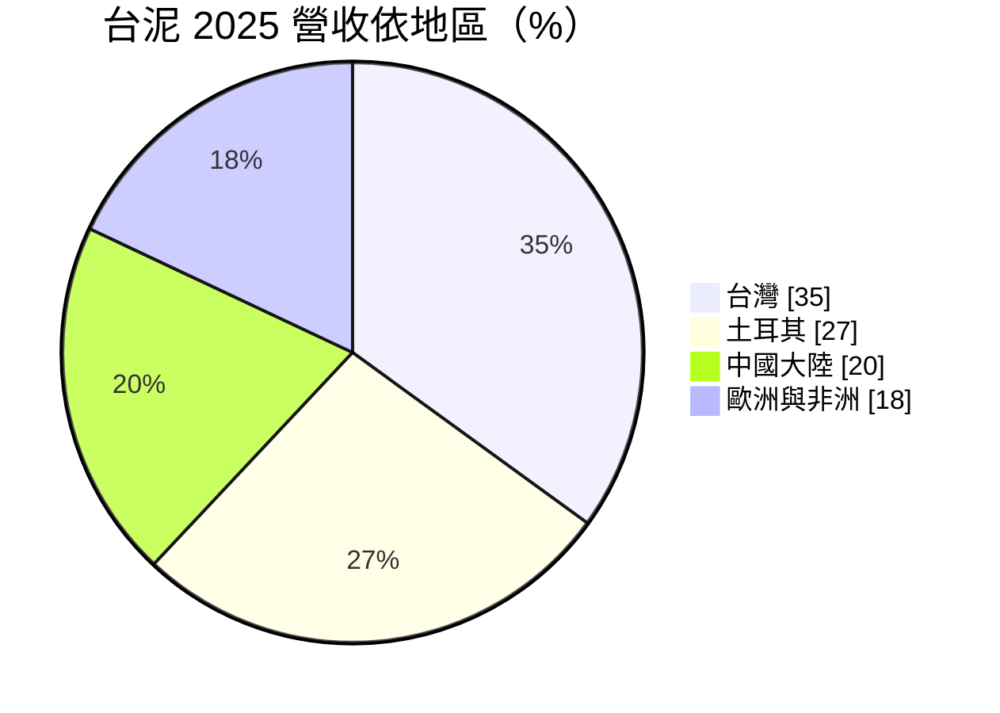
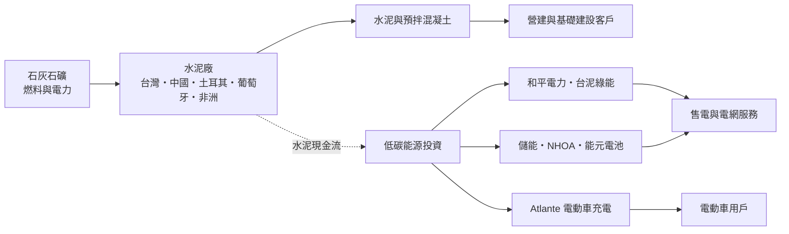
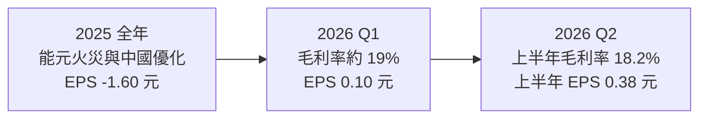
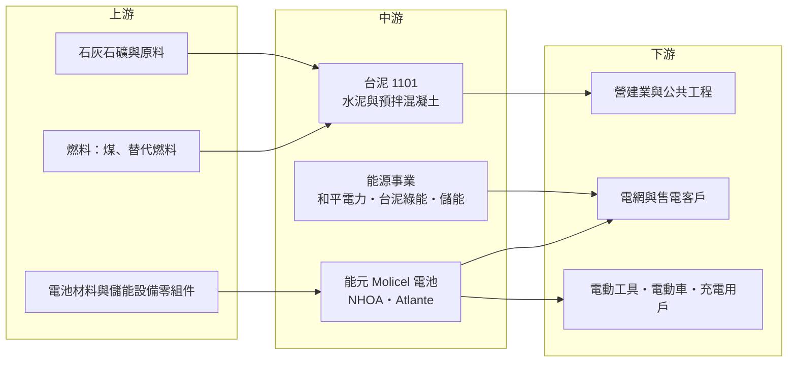

# 1101 台泥

> 上市｜[[產業索引-水泥工業|水泥工業]]｜上市（櫃）日期 1962/02/09

# 第一章：企業模式與商業藍圖

> [!info] 撰寫說明
> 本文由 Claude 依公開資料整理，架構比照 [[2330台積電]] 的四章研究，資料截至 2026-10-07。財務數字來源：台泥 2025 年財報整理（股感）、2025 年第三季法說會報導（優分析）、2026 年第一季與上半年財報新聞（旺得富、科技新報）、豐存股財務摘要；產業描述為整理性內容，尚未逐條比對原始文件。#待校對

在評估單一個股的長期投資價值時，首要步驟是拆解企業的底層獲利邏輯。本章針對台灣水泥（股票代號：1101，以下簡稱台泥）的商業模式進行定性分析，說明這家台灣最大的水泥公司，如何從單一建材事業轉型為「水泥加低碳能源」的雙主軸集團，以及轉型過程中付出的代價。

## 一、核心定位：跨國水泥集團，正在轉型為低碳能源平台

台泥是台灣最大的水泥與[[預拌混凝土]]製造商，生產基地遍及台灣、中國大陸、土耳其、葡萄牙與非洲。2025 年合併營收 1,498.04 億元，其中水泥事業約占 80%，能源相關事業（含電力、[[儲能]]、電池與充電）約占 17%。

台泥的定位可以分成兩層：

* **基本盤是水泥：** 水泥是高度在地化的產品（運輸成本高，通常只能銷往工廠周邊數百公里），因此台泥透過併購取得土耳其與葡萄牙的 OYAK Cimpor 等水泥資產，把版圖延伸到歐洲與非洲。
* **成長引擎是低碳能源：** 包括和平電力、台泥綠能（太陽能、風電、地熱）、台泥儲能、電池廠能元科技（Molicel），以及在南歐經營[[電動車充電]]網路的 Atlante 與儲能整合商 NHOA。

## 二、終端應用板塊：區域與事業結構

* **台灣（35%）：** 水泥、預拌混凝土與和平電力，毛利率約 31%。2026 年上半年受房市轉弱與進口水泥競爭影響。
* **土耳其（27%）：** 市占率約 16%，毛利率約 35%，是目前獲利最好的區域，2026 年上半年量價齊揚。
* **中國大陸（20%）：** 供過於求、價格競爭激烈，毛利率僅約 6%。台泥已縮減產能 14%、精簡人力 20%。
* **歐洲與非洲（18%）：** 葡萄牙市占率約 52%，毛利率約 28%，2026 年上半年葡萄牙水泥因量增價揚貢獻增加。

依事業別，2025 年水泥約 80%、能源約 8%、「社會轉型能源」（儲能、電池、充電等）約 9%、其他 3%。

## 三、資本轉化邏輯：水泥現金流養能源新事業

* **水泥是成熟現金牛：** 石灰石礦場與水泥窯屬於重資產，但建廠完成後可營運數十年，在需求穩定的市場能產生穩定現金流。
* **能源事業是資本密集的成長投資：** 台泥把水泥賺到的現金投入儲能、電池、充電與再生能源，短期拉低獲利率，長期押注能源轉型。2025 年能元高雄電池廠火災造成約 139.6 億元損失，是這條轉型路上最大的一次挫折。
* **碳成本內部化：** 水泥是高碳排產業，台泥透過[[低碳水泥]]（降低[[熟料]]比例）、替代燃料與[[碳捕捉]]技術，把未來的[[碳費]]、碳稅壓力轉為競爭優勢。

## 四、企業長期藍圖：Cimpor 分拆上市與能源平台化

* **Cimpor International Holdings：** 2026 年 8 月董事會通過把土耳其、葡萄牙與非洲的水泥及混凝土事業整合至新子公司，規劃在倫敦或泛歐交易所（Euronext）上市，公開發行比例至少 10%。這可以讓海外水泥資產取得獨立估值與籌資管道。
* **中國瘦身：** 持續關閉或縮減中國效率較差的產能，預期中國毛利率回升到雙位數、營業利益率轉正（2025 年第三季法說會說法）。
* **能源事業損益兩平：** 能元 Molicel 2025 年 10 月單月 [[EBITDA]] 轉正；Atlante 營收年增 129%、毛利率約 58%；台泥綠能毛利率約 38%；台泥儲能毛利率約 29%。能源事業能否全面轉為穩定獲利，是台泥長期價值的關鍵。

# 第二章：護城河深度與競爭優勢

在長期價值投資中，「護城河」指企業抵禦競爭、維持超額利潤的保護機制。本章分析台泥的護城河構成、主要競爭對手，以及這些優勢在房市與能源轉型雙重變化下能守住多少。

## 一、台泥護城河的核心組成要素

* **1. 礦權與在地壟斷性：** 水泥需要石灰石礦與窯爐，新建廠需取得礦權與環評，門檻極高。加上運輸成本限制，各地水泥市場往往由少數廠商把持。台泥在台灣、葡萄牙（市占約 52%）都具有區域領導地位。
* **2. 規模與跨區布局：** 台灣、中國、土耳其、歐非四大區域分散單一市場的景氣風險，2026 年上半年台灣與中國轉弱時，土耳其與葡萄牙仍能撐住獲利。
* **3. 減碳技術與能源資產：** 替代燃料、低碳水泥與再生能源電廠，讓台泥在碳費、碳稅上路後具備成本優勢；和平電力、綠能與儲能資產則提供與水泥不同週期的收入。

## 二、全球主要競爭對手格局

| 對手 | 定位 | 對台泥的威脅 |
|---|---|---|
| [[1102亞泥]] | 台灣第二大水泥廠，也有中國產能 | 台灣與中國市場直接競爭 |
| 海螺水泥、中國建材 | 中國最大水泥集團 | 中國供過於求下的價格戰主導者 |
| 海德堡材料、Holcim | 全球水泥龍頭 | 歐洲與非洲市場競爭，減碳技術領先 |
| 進口水泥（越南、中國等） | 低價進口 | 壓縮台灣水泥價格 |
| 儲能與電池同業 | 寧德時代、比亞迪、LG 新能源等 | 能源事業面對規模大得多的對手 |

## 三、優勢轉化：哪些市場守得住、哪些守不住

* **守得住：** 台灣與葡萄牙的區域領導地位、土耳其的高毛利水泥業務，以及受管制的電力事業。
* **守不住：** 中國水泥市場。在需求萎縮、產能過剩下，台泥中國毛利率僅約 6%，只能以縮減產能止血。電池事業則面對全球大廠的規模競爭，能元的高功率電池利基能否撐起獲利仍待觀察。
* **觀察重點：** Cimpor 上市進度與估值、中國營業利益率是否如期轉正、能元重建後的產能與良率，以及儲能、充電事業的獲利貢獻。

# 第三章：財務體質與盈利規模

資料日期：2026-10-07。數字取自公司財報新聞與財經媒體整理，表格是撰寫當時的快照；最新月營收、毛利率、累計 EPS 由自動排程寫在本筆記的屬性欄位（月營收、毛利率、累計EPS 等）。#待校對

財務報表是檢驗護城河是否真實存在的最終標準。本章用三率、ROE、現金流與資本報酬，檢視台泥在轉型期的獲利品質。

## 一、獲利能力的基石：三率

| 項目 | 2025 全年 | 2026 Q1 | 2026 Q2 | 2026 上半年 |
|---|---|---|---|---|
| 營收（新台幣） | 1,498.04 億 | 約 332 億（推算） | 約 381 億（推算） | 712.9 億 |
| [[毛利率]] | 18.7%（排除一次性項目） | 約 19% | 未查得 | 18.2% |
| [[營業利益率]] | 8.1%（排除一次性項目） | 未查得 | 未查得 | 6.4% |
| 歸屬母公司淨利 | 虧損 | 7.18 億 | 約 25.6 億（推算） | 32.8 億 |
| EPS（元） | -1.60（調整後 0.72） | 0.10 | 約 0.28（推算） | 0.38 |

註：第一季營收依法人報告推估的第二季季增率反推，第二季數字以上半年減第一季推算。2025 年 EPS 另有資料列為 -1.50 元，待校對。

* **[[毛利率]]：** 排除一次性項目後約 18% 至 19%，受中國水泥低毛利拖累。若中國回升到雙位數毛利率，整體毛利率有改善空間。
* **[[營業利益率]]：** 2026 年上半年 6.4%，高於前一年同期的 2.1%，營業利益 51.7 億元、年增 51%。
* **一次性損失：** 2025 年[[非經常性損失]]合計約 174 億元（能元火災 139.6 億元、中國水泥事業優化 49.7 億元、其他 15 億元，部分有稅務或保險抵減），其中約 88% 屬非現金減損。

## 二、[[ROE]]：資本效率

台泥 2024 年 ROE 約 4.7%，2025 年因一次性損失轉為負值。2026 年第一季股東權益約 3,047 億元。以上半年歸屬母公司淨利 32.8 億元年化計算，ROE 約 2%（推算），在大型傳產股中偏低。台泥的資本效率問題在於龐大的權益基數，以及能源新事業仍處於投入期。

## 三、資本支出與自由現金流

* **營業現金流：** 2025 年營業活動現金流 331.92 億元，[[自由現金流]] 89.06 億元，雖然帳面虧損，現金流仍為正。
* **[[CapEx]]：** 能元重建、儲能案場、Atlante 充電站擴建與減碳設備，都需要持續投入。
* **財務結構：** 2026 年上半年總資產約 5,960 億元，負債比 49.8%。
* **股利政策：** 現金股利發放率近年下降，公司優先保留資金投資新事業。2026 年發放的現金股利為每股 0.8 元（豐存股資料，待校對）。

## 四、[[ROIC]] 與 [[WACC]]：價值創造利差

台泥目前的 ROIC 明顯低於一般估計的資金成本（推估）。水泥本業在土耳其、葡萄牙與台灣的 ROIC 應高於 WACC，但中國水泥與部分能源新事業拉低整體報酬。Cimpor 分拆上市若能讓市場以較高估值重新評價海外水泥資產，並回收部分資金投入報酬更高的事業，將是改善資本報酬的關鍵。

# 第四章：總體風險與地緣政治

任何企業都無法脫離宏觀環境獨立存在。本章分析台泥未來必須面對的地緣政治、產業週期與營運風險。

## 一、地緣政治風險

* **中國市場：** 中國營收約占兩成，面臨房地產長期調整與兩岸關係變化；台泥已持續縮減中國產能以降低曝險。
* **土耳其：** 土耳其是台泥獲利最好的地區，但當地通膨高、貨幣波動大，換算成新台幣時可能出現匯兌損失。
* **歐洲能源政策：** Atlante 與 NHOA 的營運受歐洲電動車補貼與電網政策影響。

## 二、產業週期與市場結構風險

* **房地產與公共建設週期：** 水泥需求與營建景氣高度連動。台灣 2026 年上半年房市轉弱，進口水泥又帶來價格壓力。
* **中國產能過剩：** 中國水泥需求萎縮，價格戰短期難以結束。
* **電池與儲能價格下滑：** 鋰電池與儲能系統價格持續下降，能源事業的毛利率可能被壓縮。

## 三、營運環境的隱性風險

* **工安與火災：** 能元電池廠火災是台泥近年最大的單一損失，顯示新事業的營運風險與傳統水泥不同，需要不同的安全管理能力。
* **轉型執行風險：** 能源事業多元且分散在台灣與歐洲，管理複雜度高，若多項新事業同時不如預期，資本將長期被鎖住。
* **燃料與電價：** 水泥窯需要大量燃料與電力，能源價格上漲會直接推升成本。

## 四、法規與技術演進風險

* **碳費與碳稅：** 台灣碳費已上路，歐盟碳邊境調整機制（[[CBAM]]）逐步實施，中國碳價約人民幣 50 至 60 元/噸，台泥估計 2030 年後中國開徵碳稅的機率超過九成。水泥屬高碳排產業，碳成本上升是長期風險，也是台泥減碳投資的主要動機。
* **低碳水泥與替代材料：** 若低碳水泥或替代建材技術加速，傳統水泥需求可能被取代；台泥的低碳水泥與碳捕捉布局若落後於國際大廠，競爭力會下降。
* **電池技術演進：** 鋰電池化學體系變化快，能元的高功率圓柱電池若被新技術取代，投資回收會受影響。

# 專有名詞解析

## 應用

- **[[電動車充電]]**：為電動車提供電力的充電樁與營運服務，台泥透過 Atlante 在南歐經營快充網路。

## 金融

- **[[自由現金流]]**：營業活動現金流減去資本支出，代表企業可自由用於配息、還債或併購的現金。
- **[[非經常性損失]]**：火災、減損、重組等不會每年重複發生的損失，評估本業時常會排除。

## 產業

- **[[低碳水泥]]**：以減少熟料比例、添加爐石或飛灰等替代材料生產的水泥，生產過程碳排放比傳統卜特蘭水泥低。
- **[[熟料]]**：石灰石在水泥窯高溫燒成的中間產品，是水泥碳排放的主要來源。
- **[[碳捕捉]]**：從工廠廢氣中分離並收集二氧化碳，再加以封存或再利用的技術，水泥業是主要應用對象之一。
- **[[CBAM]]**：歐盟碳邊境調整機制，對進口到歐盟的鋼鐵、水泥、鋁等高碳排產品課徵碳成本。
- **[[碳費]]**：台灣依氣候變遷因應法向大型排放源徵收的費用，以每噸二氧化碳當量計價。
- **[[儲能]]**：以電池等設備儲存電力，在電網需要時釋放，用於調頻、削峰填谷與搭配再生能源。
- **[[預拌混凝土]]**：在工廠依比例拌好水泥、砂石與水，再以攪拌車運到工地的混凝土，是水泥最主要的下游產品。
- **[[EBITDA]]**：稅前息前折舊攤銷前利潤，常用來衡量資本密集事業在扣除非現金成本前的營運獲利能力。

# 核心供應鏈

## 1. 上游：原料與燃料
- 石灰石礦場（花蓮和平等自有礦區）、燃煤與替代燃料
- 電池材料與儲能零組件供應商

## 2. 中游：台泥本身與同業
- 水泥同業：[[1102亞泥]]、海螺水泥、海德堡材料
- 能源事業：和平電力、台泥綠能、台泥儲能、NHOA、Atlante、能元科技（Molicel）

## 3. 下游：營建與公共工程
- 營建業者、預拌混凝土客戶與公共工程（台灣、土耳其、葡萄牙、非洲與中國當地市場）

## 4. 下游：能源與電池客戶
- 台電與電網服務、再生能源購電客戶
- 電動工具與電動車電池客戶、歐洲電動車充電用戶

## 最新新聞
<!-- news:start -->
<!-- news:end -->

## 相關連結
- [公開資訊觀測站](https://mopsov.twse.com.tw/mops/web/t05st03?step=1&firstin=1&co_id=1101)
- [Goodinfo](https://goodinfo.tw/tw/StockDetail.asp?STOCK_ID=1101)
- [Yahoo 股市](https://tw.stock.yahoo.com/quote/1101)
- [鉅亨網新聞](https://www.cnyes.com/twstock/1101/news)
