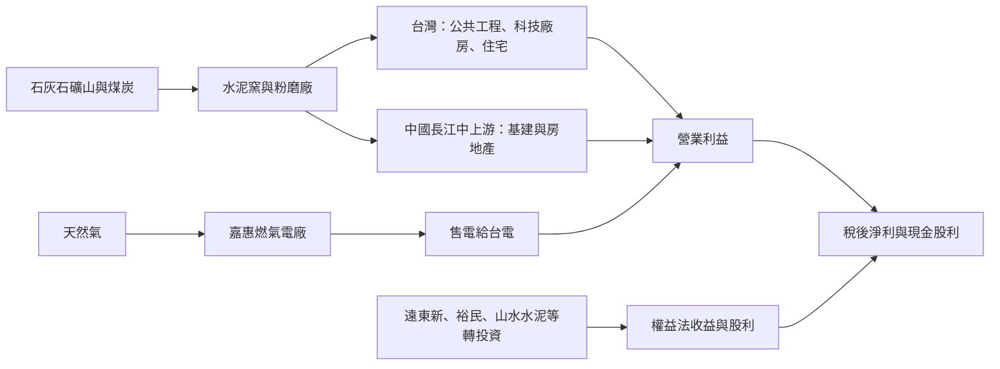
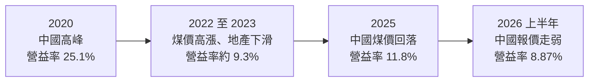
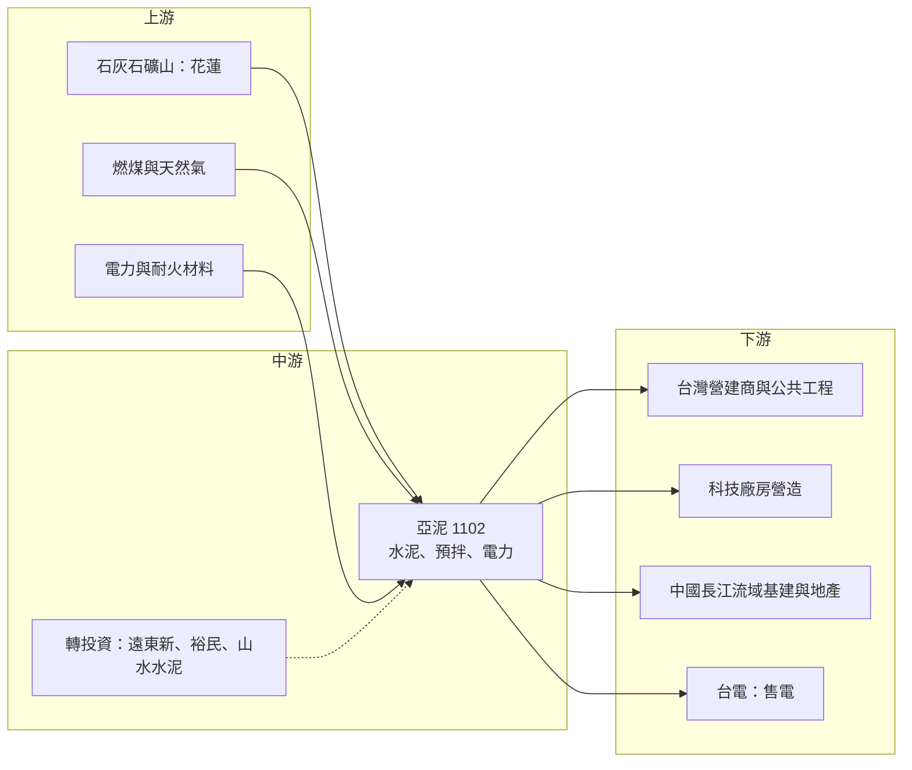

# 1102 亞泥

> 上市｜[[產業索引-水泥工業|水泥工業]]｜上市（櫃）日期 1962/06/08

# 第一章：企業模式與商業藍圖

> [!info] 撰寫說明
> 本文由 Claude 依公開資料整理，架構比照 [[2330台積電]] 的四章研究，資料截至 2026-10-08。財務數字來源：Goodinfo 年度經營績效頁、富果研究 2025 年 8 月與 2026 年 3 月法說會整理、證交所開放資料（基本資料、2026 年第二季資產負債與綜合損益、股利）；產業描述為整理性內容，尚未逐條比對原始文件。#待校對

在評估單一個股的長期投資價值時，首要步驟是拆解企業的底層獲利邏輯。本章針對亞洲水泥（股票代號：1102，以下簡稱亞泥）的商業模式進行定性分析，說明這家遠東集團旗下的水泥廠，如何在台灣與中國兩個性質截然不同的市場中經營，以及電力與轉投資在它的獲利結構中扮演什麼角色。

## 一、核心定位：台灣與中國雙市場的水泥廠，兼具投資控股色彩

亞泥成立於 1957 年，是遠東集團的核心企業之一，董事長為徐旭東，實收資本額約 354.7 億元。公司的本業是水泥與[[預拌混凝土]]，生產據點分布在台灣（花蓮、新竹）與中國長江中上游（江西、湖北、四川等地），中國業務透過在香港上市的子公司經營。

亞泥和 [[1101台泥]] 同為台灣水泥雙雄，但兩家公司的策略方向已經分歧。台泥近年大舉投入綠能、[[儲能]]與海外併購，亞泥則維持水泥本業為主，再搭配三個延伸事業：

* **電力：** 透過嘉惠電力經營燃氣電廠，把電賣給台電，獲利較穩定，成為水泥循環之外的緩衝。
* **不銹鋼：** 透過遠龍不銹鋼經營冷軋不銹鋼，規模較小，獲利隨不銹鋼價格波動。
* **轉投資：** 亞泥持有遠東新、裕民航運、山水水泥等公司股權，[[權益法]]收益與股利收入每年貢獻可觀的業外收益。

這個結構讓亞泥的財報有一個明顯特徵：業外收益占稅前淨利的比重很高。2026 年上半年營業利益約 29.0 億元，營業外收入卻有約 47.7 億元（證交所開放資料），也就是說，投資人買進亞泥，實際上同時買進了一家水泥廠和一個遠東集團的投資組合。

## 二、產品板塊：水泥、預拌、電力與不銹鋼

亞泥未在本文查得的公開資料中揭露完整的營收比重，以下依法說會的部門說明整理：

* **台灣水泥與預拌混凝土：** 主要供應台灣的公共工程、住宅與科技廠房。2025 年法說會指出，科技廠辦對高品質混凝土的需求與產品組合優化，使台灣部門營業淨利年增 16%。台灣市場由少數業者寡占，價格相對穩定，但面臨越南等地進口水泥的競爭，2025 年 7 月起越南水泥被課徵[[反傾銷稅]]，有助於穩定市場。
* **中國水泥：** 位於長江中上游，市場高度競爭，獲利由煤炭成本與水泥報價決定。2025 年中國部門營業淨利年增 487%，主因是惡性競爭趨緩與煤價下跌；但第四季因湖北舊產線減損約 8,000 萬人民幣而大幅下滑。公司預估 2026 年每噸毛利與 2025 年的約 25 元人民幣相當。
* **電力（嘉惠電力）：** 燃氣電廠的獲利取決於售電價格與天然氣成本的價差，2025 年第二季營業利益 5.6 億元、年增 102%，是近年成長最快的部門。
* **不銹鋼（遠龍）：** 2025 年因需求疲弱與跌價損失全年虧損，公司預期 2026 年營運持穩。

## 三、資本轉化邏輯：重資產、地域性與現金收租

水泥是典型的重資產、地域性產業。水泥每噸售價低、重量大，運輸距離一長就不划算，因此市場通常以工廠周邊數百公里為範圍。這帶來兩個結果：一是一旦在某個區域建立產能與礦山，新進者很難切入；二是區域需求一旦萎縮，產能也無法移到別處。

* **礦權與產能是核心資產：** 水泥廠需要長期的石灰石礦權，台灣的礦權取得與展延受到環保與原住民權益的嚴格審查，這既是進入門檻，也是營運風險。
* **燃料成本決定毛利：** 水泥窯需要大量燃煤，煤價每一波上漲都會壓縮毛利，2022 至 2023 年亞泥毛利率從 2020 年的 29.8% 降到 13% 左右，主要就是中國煤價高漲與房地產需求下滑同時發生。
* **資本支出相對溫和：** 2025 年資本支出約 40 億元，與前一年持平，主要用於中國[[產能置換]]（湖北黃岡二號新產線）。水泥廠進入成熟期後，資本支出以維護、環保與產能置換為主，現金流相對穩定。

## 四、企業長期藍圖

亞泥的長期策略可以從四個方向理解。第一是中國產能置換，以新的大型產線取代老舊、高耗能的產線，黃岡二號線預計 2026 年第二季投產，四川與江西仍有舊產線待置換。第二是能源延伸，董事會在 2025 年通過投資 25 億元，於高雄小港建置 100MW 的儲能設備，預計 2028 年第四季完工，用於參與電力交易與集團內部備援。第三是減碳，台灣已開徵[[碳費]]，中國水泥業也在 2025 年納入碳交易，亞泥需要透過替代燃料、降低[[熟料]]比例等方式降低排放強度。第四是維持高配息，2025 年度配發現金股利 2.3 元，配發率約八成。

整體而言，亞泥是一家「成長性有限、但資產與現金流扎實」的公司，長期價值取決於台灣市場的穩定獲利、中國市場能否走出低谷，以及轉投資組合的表現。

# 第二章：護城河深度與競爭優勢

本章針對亞泥的競爭優勢進行分析，說明水泥業的護城河從何而來，以及在中國產能過剩與台灣進口水泥競爭下，哪些優勢守得住。

## 一、護城河的核心組成要素

* **礦權與區域產能：** 水泥業最重要的進入門檻是石灰石礦權與窯爐產能。台灣的新礦權幾乎不可能再取得，既有業者的產能就是稀缺資源。亞泥在花蓮擁有礦山與水泥廠，這種地理優勢讓台灣市場長期維持寡占結構。
* **運輸半徑造成的地域保護：** 水泥運輸成本高，每個工廠只能服務周邊市場。亞泥在中國長江中上游的工廠，靠長江水運降低成本，在當地市場有一定的地位。
* **集團資源與財務實力：** 作為遠東集團的一員，亞泥擁有穩定的轉投資收益與良好的融資條件。2026 年第二季底總負債約 1,289 億元、權益總計約 2,084 億元，負債比約 38%（證交所開放資料），財務結構穩健，能在景氣低迷時維持配息與資本支出。
* **電力事業的現金流：** 嘉惠電力的獲利與水泥景氣無關，讓亞泥的整體獲利波動低於純水泥廠。

## 二、全球主要競爭對手格局

| 競爭對手 | 主要市場 | 與亞泥的比較 |
|---|---|---|
| [[1101台泥]] | 台灣、中國、土耳其、歐洲 | 規模較大，積極轉型綠能與儲能，是台灣最直接的對手 |
| [[1108幸福]]、[[1104環泥]]、[[1110東泥]] | 台灣 | 規模較小，以區域市場為主 |
| 越南與東南亞進口水泥 | 台灣 | 價格較低，2025 年起越南水泥被課徵反傾銷稅 |
| 海螺水泥 | 中國 | 中國最大水泥廠之一，成本與規模優勢明顯 |
| 華新水泥等長江流域業者 | 中國 | 與亞泥在湖北、江西市場直接競爭 |

## 三、優勢轉化：守得住、守不住與觀察重點

* **守得住：** 台灣市場的寡占地位與穩定獲利。礦權稀缺、產能有限，加上反傾銷稅限制低價進口，台灣水泥價格大致穩定，科技廠房的高品質混凝土需求也帶來產品組合改善。
* **守不住：** 中國市場的價格。中國水泥產能嚴重過剩，房地產需求持續下滑，公司本身形容中國市場呈「L 型復甦」。亞泥在中國只是區域性業者，無法左右價格，獲利只能隨煤價與報價波動。
* **觀察重點：** 第一，中國「反內捲」與產能置換政策能否真正減少供給；第二，台灣碳費與台版[[碳邊境調整機制]]能否進一步限制進口水泥；第三，儲能與電力事業能否擴大成為第二個穩定的獲利來源。

# 第三章：財務體質與盈利規模

資料日期：2026-10-08。數字取自 Goodinfo 年度經營績效頁、富果研究法說會整理與證交所開放資料，表格是撰寫當時的快照；最新月營收、毛利率、累計 EPS 由自動排程寫在本筆記的屬性欄位（月營收、毛利率、累計EPS 等）。#待校對

財務報表是檢驗護城河是否真實存在的最終標準。本章用多年度的三率、ROE 與資本報酬，檢視亞泥在水泥循環中的獲利品質，以及業外收益的角色。

## 一、獲利能力的基石：三率

| 年度 | 營收（新台幣） | [[毛利率]] | [[營業利益率]] | EPS（元） | [[ROE]] |
|---|---|---|---|---|---|
| 2019 | 893 億 | 28.6% | 24.7% | 5.56 | 13.5% |
| 2020 | 782 億 | 29.8% | 25.1% | 4.70 | 11.1% |
| 2021 | 903 億 | 23.4% | 19.6% | 4.70 | 10.0% |
| 2022 | 903 億 | 13.0% | 9.49% | 3.63 | 6.91% |
| 2023 | 802 億 | 13.0% | 9.30% | 3.28 | 5.89% |
| 2024 | 763 億 | 14.6% | 10.4% | 3.86 | 6.38% |
| 2025 | 710 億 | 15.8% | 11.8% | 2.83 | 5.0% |
| 2026 上半年 | 326.6 億 | 13.56% | 8.87% | 2.13 | 未查得 |

註：2025 年 EPS 依證交所股利資料的本期淨利 100.3 億元除以約 35.5 億股推算為 2.83 元，Goodinfo 顯示為 3 元，以年報為準。

* **[[毛利率]]：** 2019 至 2020 年中國水泥處於高峰，亞泥毛利率接近三成；2022 年起中國房地產下滑、煤價高漲，毛利率腰斬到 13% 左右，之後隨煤價回落小幅回升。毛利率的波動幾乎完全由中國市場決定。
* **[[營業利益率]]：** 水泥業的營業費用率很低，營業利益率與毛利率的差距只有 4 個百分點左右，代表獲利幾乎全看毛利。
* **業外收益：** 亞泥的稅後淨利長期高於營業利益，原因是轉投資收益與股利收入。2026 年上半年稅後純益率 21.53%，遠高於 8.87% 的營業利益率（證交所營益分析），這是分析亞泥時必須區分本業與業外的原因。
* **營收趨勢：** 2021 至 2025 年營收從 903 億元降到 710 億元，年複合成長率約 -5.8%（推算），反映中國市場的長期萎縮。

## 二、[[ROE]]：資本效率

2021 至 2025 年平均 ROE 約 6.8%（推算），從 2019 年的 13.5% 一路下滑到 2025 年的 5%。亞泥的股東權益中有相當大一部分是轉投資的股權與累積的其他權益（2026 年第二季底其他權益約 151 億元），這些資產帶來的是股利與權益法收益，而不是本業營運報酬，因此 ROE 天生不會太高。股價淨值比長期低於 1 倍（2026 年 10 月初約 0.68 倍，證交所本益比資料），反映市場對中國水泥前景與資產報酬率的保守看法。

## 三、資本支出、自由現金流與股利

2025 年資本支出約 40 億元，主要用於中國產能置換，相對於 700 億元以上的營收並不沉重。水泥業成熟後的資本支出以維護與環保為主，加上轉投資的股利收入，亞泥的自由現金流長期為正（推估，具體金額未查得）。股利方面，2025 年度配發現金股利 2.3 元，以 EPS 2.83 元計算配發率約 81%（推算，法說會資料稱 88%），Goodinfo 統計長期一般平均現金股利約 1.61 元。公司表示未來配息將依現金流、資本支出與市況動態調整，不提供固定比率。

## 四、[[ROIC]] 與 [[WACC]]：價值創造利差

**ROIC 推算：** 2025 年合併營業利益 84.06 億元，扣除 20% 稅率後約 67.2 億元。2026 年第二季底權益總計約 2,084 億元，總負債約 1,289 億元，假設其中約六成為有息負債（推估，約 773 億元），投入資本約 2,857 億元，ROIC 約 2.4%（推算）。需要注意，這個投入資本包含大量轉投資股權，若只計算水泥與電力本業實際使用的資產，ROIC 會較高；若把轉投資收益計入報酬，整體資本報酬約與 ROE 相近，約 5% 至 6%（推估）。以同樣方法回推 2020 年高峰（營業利益約 196 億元），ROIC 約 5% 至 6%（推算，資本基礎以近期數字代替）。

**WACC 推算：** 假設台灣 10 年期公債殖利率 1.75%、市場風險溢酬 6%、β 取水泥業常見值 0.7，股東權益成本約 5.95%。負債成本假設 2.5%，稅後約 2.0%；以帳面價值計，權益約占 73%、負債約占 27%，WACC 約 4.9%（推算）。

**結論：** 以本業營業利益計算，亞泥近年的 ROIC 低於資金成本；把轉投資收益計入後，整體報酬大約與資金成本打平。這代表亞泥在 2022 年以後大致處於「維持價值、但沒有明顯創造價值」的狀態。對長期投資人而言，亞泥比較適合視為穩定配息的資產股，而不是成長股；價值能否提升，取決於中國產能出清與台灣碳政策帶來的價格改善。

# 第四章：總體風險與地緣政治

任何企業都無法脫離宏觀環境獨立存在。本章分析亞泥長期必須面對的地緣政治、產業結構、營運與法規風險。

## 一、地緣政治

* **中國業務的政策風險：** 亞泥有相當比例的產能位於中國，中國的房地產政策、基建投資節奏、環保限產與產能置換規定，都會直接影響獲利。中國經濟若長期低成長，亞泥中國業務的價值可能持續下修。
* **兩岸關係：** 兩岸關係緊張時，台商在中國的資產與經營可能面臨不確定性，也會影響市場對亞泥中國資產的評價。
* **貿易保護與進口水泥：** 台灣市場面臨東南亞進口水泥的價格競爭，反傾銷稅與碳邊境機制能否延續，影響台灣部門的長期獲利。

## 二、產業週期與市場結構

* **中國水泥的結構性萎縮：** 中國房地產從 2021 年起長期下滑，水泥需求持續減少，但產能出清緩慢，造成長期供過於求。公司形容市場呈 L 型復甦，代表即使谷底已過，也難以回到 2019 至 2020 年的高峰。
* **煤價循環：** 水泥窯的燃料以煤為主，煤價波動直接影響每噸毛利。2022 年煤價高漲時，亞泥毛利率腰斬，這種成本衝擊每隔幾年就可能重演。
* **台灣營建景氣：** 台灣的建照面積、央行信用管制與公共工程預算，決定台灣水泥需求的高低。科技廠房需求是近年的支撐，但具有集中性。

## 三、營運環境的隱性風險

* **產能置換減損：** 中國舊產線被新產線取代時，舊資產需要提列減損。2025 年第四季湖北舊產線減損約 8,000 萬人民幣，四川與江西仍有舊產線待置換，未來可能再出現減損，時間與金額未定。
* **轉投資波動：** 業外收益占亞泥獲利的比重很高，遠東新、裕民航運、山水水泥等轉投資的表現會直接影響 EPS。航運與石化都是景氣循環產業，業外收益並不穩定。
* **電力價差：** 嘉惠電力的獲利取決於售電價格與天然氣成本，天然氣價格受國際局勢影響，可能壓縮發電利差。
* **礦權與環保爭議：** 台灣水泥業的礦權展延與花蓮礦區的環境與原住民權益議題，長期受到社會關注，可能影響營運許可。

## 四、科技與法規演進

* **碳費與碳交易：** 水泥是碳排放大戶。台灣碳費依法說會說明約為每噸二氧化碳 20 元台幣，換算每噸水泥成本約 16 元，年度總影響約 5,000 萬元；中國水泥業 2025 年納入碳交易，初期免費配額寬鬆，長期將與排放強度掛鉤。碳價若逐年提高，減碳能力將成為水泥廠之間的成本差距來源。
* **低碳水泥技術：** 替代燃料、降低熟料比例、[[碳捕捉]]等技術是全球水泥業的減碳方向，需要大量投資。能否以合理成本達成減碳目標，將決定亞泥十年後的競爭力。
* **儲能與電力市場：** 台灣電力交易平台的開放讓儲能有新的商業模式，亞泥的 100MW 儲能投資若成功，可能成為新的穩定收入來源；但電力市場規則變動也帶來不確定性。

# 專有名詞解析

## 金融

- **[[權益法]]**：持股約兩成至五成的轉投資，依持股比例認列被投資公司損益的會計方法，收益列在業外。
- **[[毛利率]]**：營業毛利占營收的比例，反映產品定價能力與生產成本控制。
- **[[營業利益率]]**：扣除營業費用後的營業利益占營收的比例，衡量本業整體獲利能力。
- **[[ROE]]**：股東權益報酬率，稅後淨利除以股東權益，衡量公司運用股東資金的效率。
- **[[ROIC]]**：投入資本報酬率，稅後營業利益除以股東權益與有息負債的合計，衡量本業對所有資金提供者的報酬。
- **[[WACC]]**：加權平均資金成本，依股東權益與負債的比重加權計算的資金成本，ROIC 高於它才代表創造價值。

## 產業

- **[[熟料]]**：石灰石與黏土在高溫窯中燒成的中間產品，研磨後加入石膏即成水泥，生產過程是水泥業碳排的主要來源。
- **[[預拌混凝土]]**：在工廠依配比把水泥、砂石與水拌好，再以攪拌車送到工地的混凝土，品質穩定，是營建工程的主流用法。
- **[[產能置換]]**：中國要求新建水泥產線必須淘汰相應數量的舊產能，用以控制總產能並提高能效。
- **[[反傾銷稅]]**：進口國認定外國產品以低於正常價格出口時加徵的關稅，常用於限制特定國家的水泥、鋼鐵等產品。
- **[[碳費]]**：政府對溫室氣體排放大戶依排放量收取的費用，台灣自 2025 年起開徵，水泥、鋼鐵等產業首當其衝。
- **[[碳邊境調整機制]]**：對進口產品依其生產過程碳排放課徵費用的制度，簡稱 CBAM，目的是避免高碳產品以低價進口。
- **[[碳捕捉]]**：把工廠排放的二氧化碳收集起來再利用或封存的技術，是水泥業長期減碳的重要方向，但成本仍高。
- **[[儲能]]**：以電池等設備儲存電力，在用電尖峰或電網需要時釋放，可參與電力交易市場賺取收入。

# 核心供應鏈

## 1. 上游：礦產與能源
- 石灰石：自有礦山（花蓮）
- 燃料：進口燃煤（水泥窯）、液化天然氣（嘉惠燃氣電廠）

## 2. 中游：亞泥本身、集團與同業
- 遠東集團相關轉投資：[[1402遠東新]]、[[2606裕民]]
- 台灣同業：[[1101台泥]]、[[1108幸福]]、[[1104環泥]]、[[1110東泥]]
- 中國同業：海螺水泥、華新水泥、山水水泥

## 3. 下游：營建與電力用戶
- 台灣營建商、公共工程與科技廠房營造
- 中國長江中上游的基礎建設與房地產開發
- 台電：嘉惠電力的售電對象

## 最新新聞
<!-- news:start -->
<!-- news:end -->

## 相關連結
- [公開資訊觀測站](https://mopsov.twse.com.tw/mops/web/t05st03?step=1&firstin=1&co_id=1102)
- [Goodinfo](https://goodinfo.tw/tw/StockDetail.asp?STOCK_ID=1102)
- [Yahoo 股市](https://tw.stock.yahoo.com/quote/1102)
- [鉅亨網新聞](https://www.cnyes.com/twstock/1102/news)
