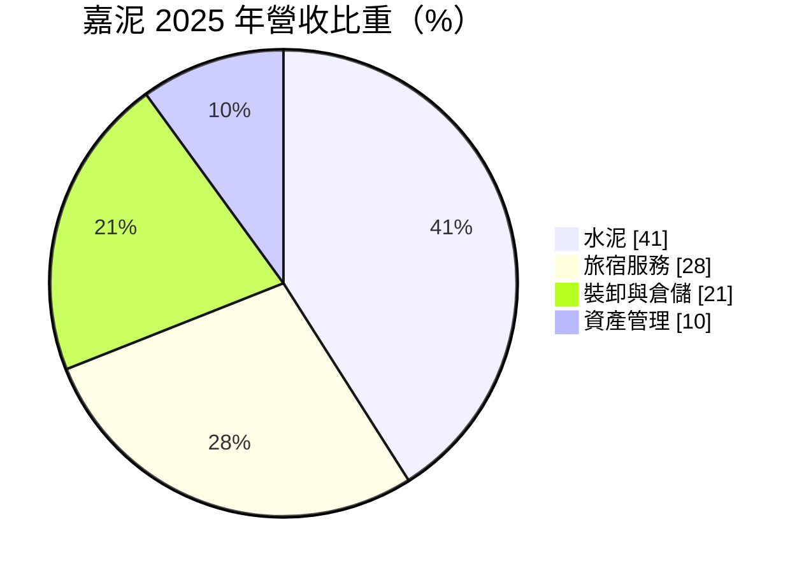
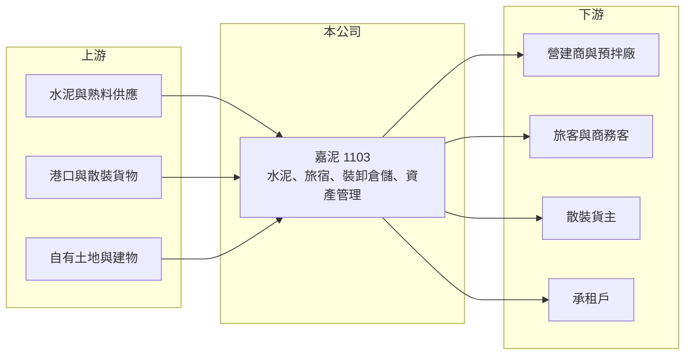

# 1103 嘉泥

> 上市｜[[產業索引-水泥工業|水泥工業]]｜上市（櫃）日期 1969/11/14

# 第一章：企業模式與商業藍圖

> [!info] 撰寫說明
> 精簡版，由 Claude 依公開資料整理，架構比照 [[2330台積電]] 的四章研究，資料截至 2026-10-08。財務數字來源：Goodinfo 年度經營績效頁、MoneyDJ 個股基本資料（2025 年營收比重）、證交所開放資料（基本資料、2026 年第二季資產負債與綜合損益、營益分析、股利、本益比）；業務細節多為整理性描述，部分憑既有知識撰寫，已標「待校對」。公開資料有限。#待校對

在評估單一個股的長期價值時，首要步驟是拆解企業的獲利來源。本章說明嘉新水泥（股票代號：1103，以下簡稱嘉泥）如何從傳統水泥廠，演變成水泥、旅宿、港埠物流與資產管理並存的多角化公司。

- **核心業務：** 嘉泥成立於 1954 年，1969 年上市，是台灣最早的民營水泥公司之一，董事長為張剛綸，實收資本額約 83.3 億元。依 MoneyDJ 的 2025 年營收比重，水泥占 41%、旅宿服務占 28%、裝卸與倉儲占 21%、資產管理占 10%。換句話說，水泥雖然仍是最大單一業務，但已不到營收的一半，嘉泥更接近一家以土地、建物與港埠設施為核心資產的公司。
- **營收結構的意義：** 旅宿與資產管理屬於「收租型」業務，營收穩定但成長有限；裝卸倉儲則和港口散裝貨物的進出量有關。這種組合讓嘉泥的營收不像純水泥廠那樣隨營建景氣大起大落，2021 至 2025 年營收從 22.2 億元穩定增加到 30.2 億元（Goodinfo）。
- **營運據點：** 公司總部位於台北市中山北路。水泥業務在台灣以銷售與調度為主，旅宿與資產管理集中在自有不動產，港埠業務則以散裝貨物的裝卸與倉儲為主，具體港口與旅館品牌本文未查得完整資料。#待校對
- **長期方向：** 嘉泥的長期價值主要取決於兩件事：一是既有土地與建物能否持續創造租金與旅宿收入，二是轉投資與金融資產能否穩定貢獻業外收益。2026 年上半年營業利益只有約 0.18 億元，但營業外收入約 1.88 億元（證交所開放資料），顯示本業之外的收益才是獲利主體。

# 第二章：護城河深度與競爭優勢

本章分析嘉泥的競爭優勢與限制。嘉泥的護城河不在水泥本業，而在長年累積的資產與地點。

- **競爭優勢：** 嘉泥成立超過七十年，名下持有的土地、建物與港埠設施取得成本低，帳面價值遠低於市價的可能性高（推估）。2026 年第二季底每股淨值 26.67 元，股價淨值比僅約 0.49 倍（證交所本益比資料），代表市場對這些資產的報酬率評價保守，但也意味資產本身提供下檔保護。
- **水泥本業的位置：** 嘉泥在台灣水泥市場屬於小型業者，規模遠小於 [[1101台泥]] 與 [[1102亞泥]]。水泥毛利率在 2021 年僅約 1.4%，2025 年回升到約 16%，但營業利益率仍為負，代表水泥與其他業務的獲利尚不足以支應管理費用，本業競爭力有限。
- **主要對手：** 水泥方面為 [[1101台泥]]、[[1102亞泥]]、[[1104環泥]]、[[1108幸福]] 與進口水泥；旅宿方面面對台灣各地的飯店業者；港埠裝卸倉儲則與其他港口物流業者競爭。
- **觀察重點：** 第一，旅宿與資產管理能否讓營業利益轉正；第二，業外收益的組成是否穩定（股利、租金或一次性處分）；第三，公司是否有計畫活化低效率資產，例如都更或改建，以提高資產報酬率。

# 第三章：財務體質與盈利規模

資料日期：2026-10-08，表格是撰寫當時的快照；最新月營收、毛利率、累計 EPS 由自動排程寫在本筆記的屬性欄位（月營收、毛利率、累計EPS 等）。#待校對

本章用多年度的三率、ROE 與資本報酬，檢視嘉泥本業與業外的獲利品質。

| 年度 | 營收（新台幣） | [[毛利率]] | [[營業利益率]] | EPS（元） | [[ROE]] |
|---|---|---|---|---|---|
| 2021 | 22.2 億 | 1.39% | -23.7% | 1.02 | 2.94% |
| 2022 | 22.5 億 | 5.88% | -17.5% | -0.28 | -0.73% |
| 2023 | 29.1 億 | 12.6% | -5.07% | 0.12 | 0.43% |
| 2024 | 29.9 億 | 14.6% | -5.09% | 0.48 | 1.53% |
| 2025 | 30.2 億 | 16.2% | -2.66% | 0.84 | 2.81% |
| 2026 上半年 | 13.56 億 | 20.75% | 1.33% | 0.27 | 未查得 |

註：2021 至 2025 年取自 Goodinfo，2026 上半年取自證交所營益分析。Goodinfo 的 2020 年列毛利率與營益率數字明顯不一致，未列入。證交所股利資料的 2025 年本期淨利為 5.56 億元，以約 8.33 億股換算約 0.67 元，與 Goodinfo 的 0.84 元不同，以年報為準。

- **營收規模：** 2021 至 2025 年營收年複合成長率約 8.0%（推算），主要來自旅宿與港埠業務的成長，水泥本身的量能變化未查得。
- **獲利結構：** 毛利率從 2021 年約 1.4% 逐年改善到 2026 年上半年的 20.75%，營業利益率也在 2026 年上半年首度轉正。不過營業費用占營收比重仍高，本業獲利微薄，EPS 主要來自業外收益。
- **長期指標：** 2021 至 2025 年平均 ROE 約 1.4%（推算），遠低於一般資金成本。2025 年度配發現金股利 0.55 元，以 0.67 元的 EPS 計算配發率約八成（推算）；Goodinfo 統計長期一般平均現金股利約 0.51 元，股利水準低但大致持續發放。
- **財務特色：** 2026 年第二季底總負債約 150.8 億元，其中非流動負債約 110.9 億元，權益總計約 187.9 億元，負債比約 45%（證交所開放資料）。以 30 億元左右的營收規模來看，負債相對沉重，推估與不動產開發或長期借款有關。

**[[ROIC]] 與 [[WACC]]：** 2025 年營業利益約為 30.2 億元 ×（-2.66%）≈ -0.80 億元，稅後營業利益為負，因此本業 ROIC 約 -0.2%（推算；投入資本以權益 187.9 億元加上假設占總負債六成的有息負債約 90.5 億元，合計約 278.4 億元）。WACC 以 CAPM 推估：台灣 10 年期公債 1.75%、市場風險溢酬 6%、β 取水泥與資產股常見值 0.7，股東權益成本約 5.95%；負債成本假設 2.5%、稅率 20%，稅後約 2.0%；權益約占 67%，WACC 約 4.7%（推算）。即使把業外收益計入，整體報酬也只有 ROE 的 1% 至 3% 水準，長期明顯低於資金成本。結論是嘉泥目前沒有為股東創造超額價值，投資價值主要來自資產重估的可能性，而非本業獲利。

# 第四章：總體風險與地緣政治

本章分析嘉泥長期面對的產業、營運與法規風險。

- **產業週期：** 水泥需求取決於台灣營建景氣與公共工程，旅宿業務取決於觀光與商務旅客，裝卸倉儲取決於港口貨量。三者的景氣循環不完全同步，有分散效果，但任何一項轉弱都會讓本就微薄的營業利益轉為虧損。
- **營運風險：** 本業長期虧損或接近損益兩平，獲利高度依賴業外收益。業外收益若來自一次性的資產處分或轉投資股利，可持續性有限，EPS 波動會很大，2020 年 EPS 2.74 元與 2022 年 -0.28 元的落差就是例子。
- **財務風險：** 非流動負債約 110.9 億元，相對營收規模偏高。利率上升時利息支出增加，若旅宿與租金收入無法同步成長，財務負擔會加重。
- **其他風險：** 水泥業面臨台灣[[碳費]]與減碳要求；旅宿業面臨人力短缺與觀光客源波動；資產活化涉及都市計畫與法規審查，時程不確定。

# 專有名詞解析

## 金融

- **[[毛利率]]**：營業毛利占營收的比例，反映產品定價能力與生產成本控制。
- **[[營業利益率]]**：扣除營業費用後的營業利益占營收的比例，衡量本業整體獲利能力。
- **[[ROE]]**：股東權益報酬率，稅後淨利除以股東權益，衡量公司運用股東資金的效率。
- **[[ROIC]]**：投入資本報酬率，稅後營業利益除以股東權益與有息負債的合計，衡量本業對所有資金提供者的報酬。
- **[[WACC]]**：加權平均資金成本，依股東權益與負債的比重加權計算的資金成本，ROIC 高於它才代表創造價值。

## 產業

- **[[碳費]]**：政府對溫室氣體排放大戶依排放量收取的費用，台灣自 2025 年起開徵，水泥、鋼鐵等產業首當其衝。
- **[[資產股]]**：主要價值來自土地、建物或轉投資等資產，而非本業獲利成長的股票，常以股價淨值比評價。

# 核心供應鏈

- 上游：水泥與熟料供應、港口設施、自有土地與建物。
- 下游／客戶：營建商與預拌混凝土廠、旅宿客人、散裝貨主、不動產承租戶。
- 同業：[[1101台泥]]、[[1102亞泥]]、[[1104環泥]]、[[1108幸福]]、[[1109信大]]、[[1110東泥]]。

## 最新新聞
<!-- news:start -->
<!-- news:end -->

## 相關連結
- [公開資訊觀測站](https://mopsov.twse.com.tw/mops/web/t05st03?step=1&firstin=1&co_id=1103)
- [Goodinfo](https://goodinfo.tw/tw/StockDetail.asp?STOCK_ID=1103)
- [Yahoo 股市](https://tw.stock.yahoo.com/quote/1103)
- [鉅亨網新聞](https://www.cnyes.com/twstock/1103/news)
