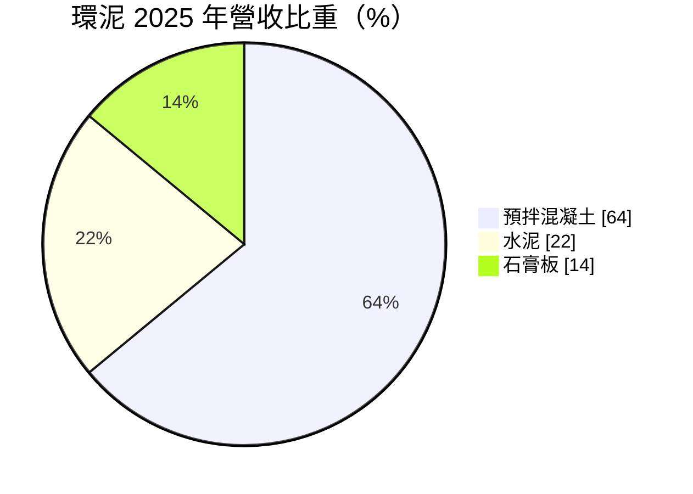
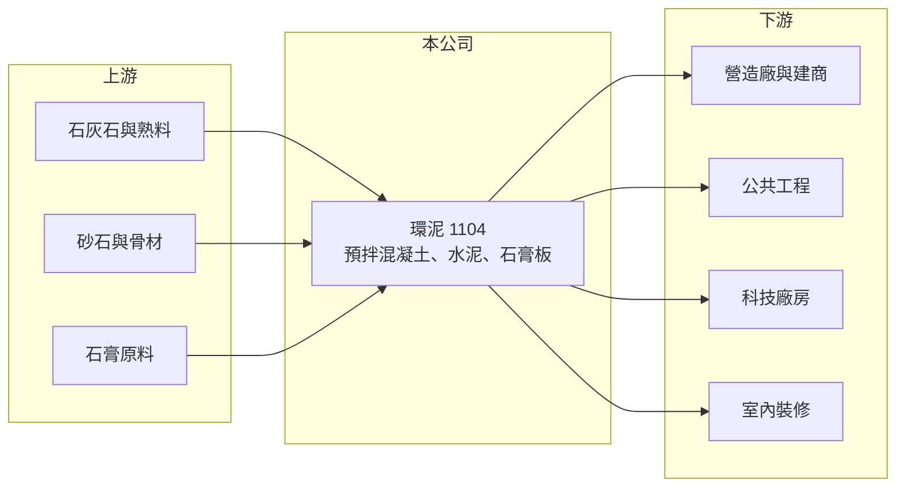

# 1104 環泥

> 上市｜[[產業索引-水泥工業|水泥工業]]｜上市（櫃）日期 1971/02/01

# 第一章：企業模式與商業藍圖

> [!info] 撰寫說明
> 精簡版，由 Claude 依公開資料整理，架構比照 [[2330台積電]] 的四章研究，資料截至 2026-10-08。財務數字來源：Goodinfo 年度經營績效頁、MoneyDJ 個股基本資料（2025 年營收比重）、證交所開放資料（基本資料、2026 年第二季資產負債與綜合損益、營益分析、股利、本益比）；業務細節部分憑既有知識撰寫，已標「待校對」。#待校對

在評估單一個股的長期價值時，首要步驟是拆解企業的獲利來源。本章說明環球水泥（股票代號：1104，以下簡稱環泥）為何以[[預拌混凝土]]而不是水泥本身作為最大營收來源，以及這種下游化策略的商業意義。

- **核心業務：** 環泥成立於 1960 年，1971 年上市，董事長為侯博義、總經理為侯智元，實收資本額約 68.7 億元。依 MoneyDJ 的 2025 年營收比重，預拌混凝土占 64%、水泥占 22%、石膏板占 14%。環泥的主要生產與銷售市場在南台灣，總部位於台北。#待校對
- **下游化的意義：** 水泥是半成品，預拌混凝土則是工地直接使用的成品。環泥把大部分水泥透過自有預拌廠賣出，等於掌握了通路與客戶關係，能把水泥的出貨量穩定下來，也能從配比、運送與品質服務中多賺一層附加價值。這是環泥在沒有大型礦山優勢的情況下，仍能維持獲利的主要原因（推估）。
- **石膏板：** [[石膏板]]是室內隔間與天花板的主要建材，需求來自住宅、辦公室與廠房的室內裝修。這項業務的景氣循環落後於結構工程，能和混凝土互相補位。
- **長期方向：** 環泥近年營收從 2021 年的 60.8 億元增加到 2025 年的 79.2 億元，毛利率從 18.6% 提升到 23.2%（Goodinfo），代表產品組合與定價都在改善。長期策略重點在於鞏固南部預拌市場、提高高強度混凝土等高附加價值產品比重，以及因應台灣[[碳費]]帶來的減碳要求。

# 第二章：護城河深度與競爭優勢

本章分析環泥的競爭優勢。預拌混凝土的護城河來自地點與服務半徑，而不是技術。

- **競爭優勢：** 預拌混凝土從拌合到澆置通常必須在一兩個小時內完成，因此每座預拌廠只能服務周邊有限的範圍。環泥在南台灣布建的預拌廠網路，讓它在區域內具備就近供貨與調度的優勢，新進者要重建同樣的據點網路需要大量土地與時間。
- **垂直整合：** 環泥同時生產水泥與預拌混凝土，在水泥供應緊張時能優先供應自家預拌廠，在水泥價格波動時也能透過混凝土報價轉嫁成本。這種上下游整合讓環泥的毛利率在 2021 至 2025 年逐年提升，營業利益率由 11.7% 升到 15.4%（Goodinfo）。
- **主要對手：** 水泥方面為 [[1101台泥]]、[[1102亞泥]]、[[1108幸福]]、[[1109信大]]、[[1110東泥]] 與進口水泥；預拌混凝土方面除上述集團的預拌廠外，還有大量地方型預拌業者；石膏板方面與國內外石膏板廠競爭。
- **觀察重點：** 第一，南台灣科技廠房與公共工程的需求能否延續；第二，預拌混凝土的報價能否反映原料與人力成本上升；第三，業外轉投資收益是否穩定，因為環泥稅後淨利長期高於營業利益。

# 第三章：財務體質與盈利規模

資料日期：2026-10-08，表格是撰寫當時的快照；最新月營收、毛利率、累計 EPS 由自動排程寫在本筆記的屬性欄位（月營收、毛利率、累計EPS 等）。#待校對

本章用多年度的三率、ROE 與資本報酬，檢視環泥的獲利品質。

| 年度 | 營收（新台幣） | [[毛利率]] | [[營業利益率]] | EPS（元） | [[ROE]] |
|---|---|---|---|---|---|
| 2021 | 60.8 億 | 18.6% | 11.7% | 1.66 | 5.84% |
| 2022 | 70.6 億 | 19.4% | 11.9% | 3.12 | 10.7% |
| 2023 | 78.0 億 | 19.8% | 12.5% | 3.13 | 10.6% |
| 2024 | 79.5 億 | 20.1% | 13.3% | 2.16 | 6.49% |
| 2025 | 79.2 億 | 23.2% | 15.4% | 2.56 | 7.29% |
| 2026 上半年 | 35.6 億 | 27.15% | 15.36% | 1.13 | 未查得 |

註：2021 至 2025 年取自 Goodinfo，2026 上半年取自證交所營益分析；2025 年 EPS 與證交所股利資料的本期淨利 17.56 億元換算結果一致。

- **營收規模：** 2021 至 2025 年營收年複合成長率約 6.8%（推算），2023 年後大致持平在 78 億至 80 億元，成長主要發生在 2021 至 2023 年的營建高峰期。
- **獲利結構：** 毛利率連續五年改善，2026 年上半年達 27.15%。不過環泥的 EPS 有相當部分來自業外，2026 年上半年營業利益約 5.47 億元，營業外收入約 3.44 億元（證交所開放資料），業外占稅前淨利接近四成。
- **長期指標：** 2021 至 2025 年平均 ROE 約 8.2%（推算）。2025 年度配發現金股利 1.85 元，配發率約 72%（推算），股利政策穩定。
- **財務特色：** 2026 年第二季底總負債約 63.4 億元、權益總計約 254 億元，負債比約 20%，財務結構非常保守。其他權益約 31.9 億元，反映轉投資股權的未實現評價利益（證交所開放資料）。

**[[ROIC]] 與 [[WACC]]：** 2025 年營業利益約 79.2 億元 × 15.4% ≈ 12.2 億元，稅後約 9.76 億元。投入資本以權益 254 億元加上假設占總負債四成的有息負債約 25.4 億元，合計約 279 億元，本業 ROIC 約 3.5%（推算）。由於權益中有大量轉投資股權，若只計算預拌與水泥實際使用的資產，ROIC 會明顯較高。WACC 以 CAPM 推估：無風險利率 1.75%、市場風險溢酬 6%、β 取水泥業常見值 0.7，股東權益成本約 5.95%；負債成本 2.5%、稅後約 2.0%；權益約占 91%，WACC 約 5.6%（推算）。結論是，若把轉投資收益計入，環泥整體報酬（ROE 約 7% 至 8%）略高於資金成本，屬於「小幅創造價值」；但單看本業對全部帳面資本的報酬仍偏低，資本效率的改善空間在於活化轉投資或提高配息。

# 第四章：總體風險與地緣政治

本章分析環泥長期面對的風險。

- **產業週期：** 預拌混凝土需求與營建景氣高度相關，央行信用管制、房市交易量與公共工程預算都會影響出貨。科技廠房帶動的需求具有集中性，大型專案結束後出貨可能明顯回落。
- **營運風險：** 預拌業的成本包括水泥、砂石、運輸與人力，砂石供應受河川疏濬與進口來源影響，價格波動大。攪拌車司機與工地人力短缺，也可能限制出貨能力。
- **其他風險：** 台灣碳費與更嚴格的空污標準會提高水泥生產成本；進口水泥若價格低廉，會壓縮國內水泥報價；轉投資收益受被投資公司景氣影響，會讓 EPS 波動。

# 專有名詞解析

## 金融

- **[[毛利率]]**：營業毛利占營收的比例，反映產品定價能力與生產成本控制。
- **[[營業利益率]]**：扣除營業費用後的營業利益占營收的比例，衡量本業整體獲利能力。
- **[[ROE]]**：股東權益報酬率，稅後淨利除以股東權益，衡量公司運用股東資金的效率。
- **[[ROIC]]**：投入資本報酬率，稅後營業利益除以股東權益與有息負債的合計，衡量本業對所有資金提供者的報酬。
- **[[WACC]]**：加權平均資金成本，依股東權益與負債的比重加權計算的資金成本，ROIC 高於它才代表創造價值。

## 產業

- **[[預拌混凝土]]**：在工廠依配比把水泥、砂石與水拌好，再以攪拌車送到工地的混凝土，品質穩定，是營建工程的主流用法。
- **[[石膏板]]**：以石膏為芯材、兩面覆紙的板材，用於室內隔間與天花板，具防火與施工快速的特性。
- **[[碳費]]**：政府對溫室氣體排放大戶依排放量收取的費用，台灣自 2025 年起開徵，水泥、鋼鐵等產業首當其衝。

# 核心供應鏈

- 上游：石灰石與熟料、砂石骨材、石膏原料、燃料與電力。
- 下游／客戶：營造廠與建商、公共工程、科技廠房、室內裝修業者。
- 同業：[[1101台泥]]、[[1102亞泥]]、[[1103嘉泥]]、[[1108幸福]]、[[1109信大]]、[[1110東泥]]。

## 最新新聞
<!-- news:start -->
<!-- news:end -->

## 相關連結
- [公開資訊觀測站](https://mopsov.twse.com.tw/mops/web/t05st03?step=1&firstin=1&co_id=1104)
- [Goodinfo](https://goodinfo.tw/tw/StockDetail.asp?STOCK_ID=1104)
- [Yahoo 股市](https://tw.stock.yahoo.com/quote/1104)
- [鉅亨網新聞](https://www.cnyes.com/twstock/1104/news)
