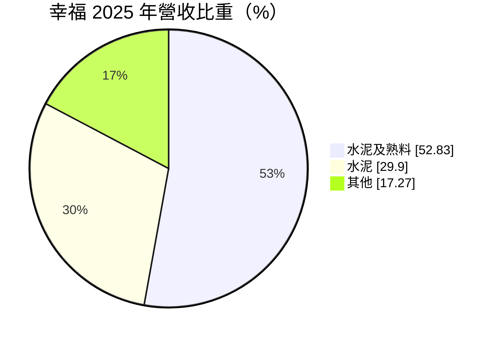
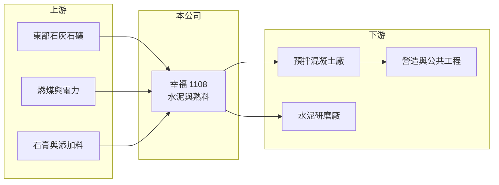

# 1108 幸福

> 上市｜[[產業索引-水泥工業|水泥工業]]｜上市（櫃）日期 1990/06/06

# 第一章：企業模式與商業藍圖

> [!info] 撰寫說明
> 精簡版，由 Claude 依公開資料整理，架構比照 [[2330台積電]] 的四章研究，資料截至 2026-10-08。財務數字來源：Goodinfo 年度經營績效頁、MoneyDJ 個股基本資料（2025 年營收比重）、證交所開放資料（基本資料、2026 年第二季資產負債與綜合損益、營益分析、股利、本益比）；業務細節部分憑既有知識撰寫，已標「待校對」。公開資料有限。#待校對

在評估單一個股的長期價值時，首要步驟是拆解企業的獲利來源。本章說明幸福水泥（股票代號：1108，以下簡稱幸福）作為東部水泥生產者的定位，以及水泥與[[熟料]]業務如何決定它的獲利。

- **核心業務：** 幸福成立於 1974 年，1990 年上市，董事長為陳韻如，實收資本額約 40.5 億元。依 MoneyDJ 的 2025 年營收分類，「水泥及熟料」占 52.83%、「水泥」占 29.90%、其他占 17.27%，兩個水泥類別合計超過八成，可以視為一家以水泥與熟料為主的純水泥公司。
- **生產據點：** 幸福的主要水泥廠位於台灣東部，靠近石灰石礦區，產品再運往西部消費市場（推估工廠位於宜蘭東澳一帶）。#待校對 東部水泥廠的優勢是礦源就近，劣勢是要負擔較長的運輸距離與海運或鐵路調度成本。
- **熟料的角色：** 熟料是水泥的中間產品，可以直接賣給其他水泥研磨廠，也可以自己磨成水泥出售。兼賣熟料讓幸福能在國內水泥需求轉弱時，把多餘產能轉為熟料銷售，提高窯爐的使用率。
- **長期方向：** 水泥產業成熟，幸福的長期課題是維持窯爐效率、因應[[碳費]]與空污標準加嚴，以及在營建景氣循環中穩住價格。2025 年營業利益明顯高於毛利，顯示當年有非本業性質的營業收益（性質未查得），不代表本業獲利能力的結構性提升。

# 第二章：護城河深度與競爭優勢

本章分析幸福的競爭優勢與限制。水泥業的護城河主要來自礦權與產能。

- **競爭優勢：** 台灣新的石灰石礦權幾乎不可能再取得，既有窯爐產能因此具有稀缺性。幸福擁有東部的礦源與窯爐，屬於台灣少數具備從礦石到水泥完整生產能力的業者，這是它和只做研磨或進口銷售的業者最大的差別。
- **規模限制：** 幸福的營收約在 40 億至 50 億元之間，規模遠小於 [[1101台泥]] 與 [[1102亞泥]]，沒有海外市場與多角化事業分散風險，獲利幾乎完全取決於台灣水泥的量與價。2017 至 2018 年營業利益率一度轉負（Goodinfo），顯示景氣低迷時抗壓性有限。
- **主要對手：** [[1101台泥]]、[[1102亞泥]]、[[1104環泥]]、[[1109信大]]、[[1110東泥]]，以及越南等東南亞進口水泥。
- **觀察重點：** 第一，越南水泥[[反傾銷稅]]能否持續限制低價進口；第二，東部礦權展延與環保審查是否順利；第三，2025 年非本業營業收益消失後，本業營業利益率能否維持在 10% 以上。

# 第三章：財務體質與盈利規模

資料日期：2026-10-08，表格是撰寫當時的快照；最新月營收、毛利率、累計 EPS 由自動排程寫在本筆記的屬性欄位（月營收、毛利率、累計EPS 等）。#待校對

本章用多年度的三率、ROE 與資本報酬，檢視幸福在水泥循環中的獲利品質。

| 年度 | 營收（新台幣） | [[毛利率]] | [[營業利益率]] | EPS（元） | [[ROE]] |
|---|---|---|---|---|---|
| 2021 | 37.7 億 | 14.9% | 8.98% | 0.65 | 5.64% |
| 2022 | 41.5 億 | 23.9% | 17.1% | 1.44 | 12.2% |
| 2023 | 50.9 億 | 17.3% | 12.0% | 1.30 | 10.6% |
| 2024 | 48.7 億 | 19.1% | 13.1% | 1.22 | 9.63% |
| 2025 | 44.5 億 | 19.1% | 25.0% | 2.18 | 16.1% |
| 2026 上半年 | 19.0 億 | 13.11% | 6.99% | 0.22 | 未查得 |

註：2021 至 2025 年取自 Goodinfo，2026 上半年取自證交所營益分析。Goodinfo 顯示 2025 年營業利益約 11.1 億元、毛利約 8.51 億元，營業利益高於毛利，代表當年有約 5 億元以上的其他營業收益（推估為資產處分等一次性項目，待校對），2025 年營業利益率與 EPS 不宜視為常態。

- **營收規模：** 2021 至 2025 年營收年複合成長率約 4.2%（推算），2023 年達到 50.9 億元高峰後逐年回落，2026 年上半年約 19.0 億元，顯示台灣水泥需求降溫。
- **獲利結構：** 排除 2025 年的一次性收益，幸福的營業利益率大致在 9% 至 17% 之間，隨煤價與水泥報價波動。2026 年上半年毛利率降到 13.11%，獲利明顯轉弱。
- **長期指標：** 2021 至 2025 年平均 ROE 約 10.8%（推算），若排除 2025 年則約 9.5%。股利方面，證交所資料顯示 2025 年下半年配發現金股利 1.00 元，公司採半年配息；2026 年 10 月初殖利率約 9%（證交所本益比資料），股利發放積極。
- **財務特色：** 2026 年第二季底總負債約 48.1 億元，其中流動負債約 44.0 億元，權益總計約 54.7 億元，負債比約 47%（證交所開放資料）。保留盈餘約 14.2 億元，在高配息政策下累積有限。

**[[ROIC]] 與 [[WACC]]：** 以 2025 年帳面營業利益約 11.1 億元計，稅後約 8.9 億元；投入資本以權益 54.7 億元加上假設占總負債五成的有息負債約 24.0 億元，合計約 78.7 億元，ROIC 約 11.3%（推算）。但這包含一次性收益，若改用 2024 年 13.1% 的營業利益率套用 2025 年營收，常態化稅後營業利益約 4.7 億元，ROIC 約 5.9%（推算）。WACC 以 CAPM 推估：無風險利率 1.75%、市場風險溢酬 6%、β 取水泥業常見值 0.7，股東權益成本約 5.95%；負債成本 2.5%、稅後 2.0%；權益約占 69%，WACC 約 4.7%（推算）。結論是，幸福在一般年度的 ROIC 略高於資金成本，屬於小幅創造價值；但利差很薄，一旦水泥報價或煤價不利，就可能轉為低於資金成本。

# 第四章：總體風險與地緣政治

本章分析幸福長期面對的風險。

- **產業週期：** 台灣水泥需求取決於建照面積、房市交易與公共工程，2023 年後營收逐年下滑，顯示需求已從高峰回落。純水泥公司沒有其他事業分散，景氣下行時獲利衰退幅度大。
- **營運風險：** 水泥窯以燃煤為主要燃料，煤價波動直接影響毛利；東部廠到西部市場的運輸成本也會侵蝕利潤。高配息搭配偏高的流動負債，代表景氣不佳時財務彈性有限。
- **其他風險：** 碳費與空污排放標準加嚴會增加減碳與設備改善支出；東部礦區的礦權展延涉及環保與原住民權益審查；東部地震與颱風等天災可能中斷生產或運輸。

# 專有名詞解析

## 金融

- **[[毛利率]]**：營業毛利占營收的比例，反映產品定價能力與生產成本控制。
- **[[營業利益率]]**：扣除營業費用後的營業利益占營收的比例，衡量本業整體獲利能力。
- **[[ROE]]**：股東權益報酬率，稅後淨利除以股東權益，衡量公司運用股東資金的效率。
- **[[ROIC]]**：投入資本報酬率，稅後營業利益除以股東權益與有息負債的合計，衡量本業對所有資金提供者的報酬。
- **[[WACC]]**：加權平均資金成本，依股東權益與負債的比重加權計算的資金成本，ROIC 高於它才代表創造價值。

## 產業

- **[[熟料]]**：石灰石與黏土在高溫窯中燒成的中間產品，研磨後加入石膏即成水泥，生產過程是水泥業碳排的主要來源。
- **[[反傾銷稅]]**：進口國認定外國產品以低於正常價格出口時加徵的關稅，常用於限制特定國家的水泥、鋼鐵等產品。
- **[[碳費]]**：政府對溫室氣體排放大戶依排放量收取的費用，台灣自 2025 年起開徵，水泥、鋼鐵等產業首當其衝。

# 核心供應鏈

- 上游：東部石灰石礦、燃煤與電力、石膏等添加材料。
- 下游／客戶：預拌混凝土廠、水泥研磨廠與經銷商、營造與公共工程。
- 同業：[[1101台泥]]、[[1102亞泥]]、[[1103嘉泥]]、[[1104環泥]]、[[1109信大]]、[[1110東泥]]。

## 最新新聞
<!-- news:start -->
<!-- news:end -->

## 相關連結
- [公開資訊觀測站](https://mopsov.twse.com.tw/mops/web/t05st03?step=1&firstin=1&co_id=1108)
- [Goodinfo](https://goodinfo.tw/tw/StockDetail.asp?STOCK_ID=1108)
- [Yahoo 股市](https://tw.stock.yahoo.com/quote/1108)
- [鉅亨網新聞](https://www.cnyes.com/twstock/1108/news)
