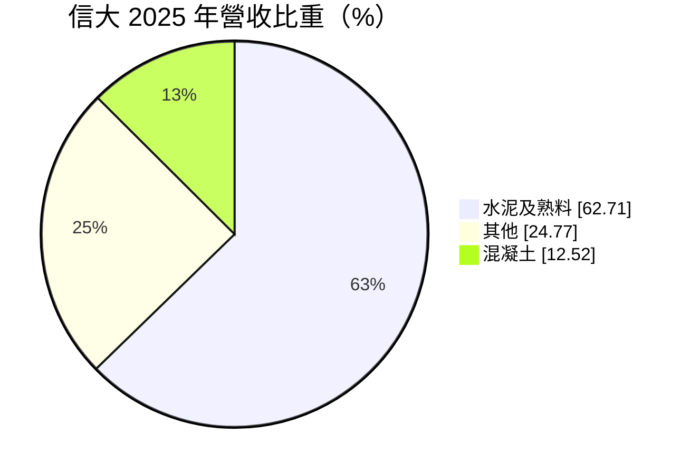
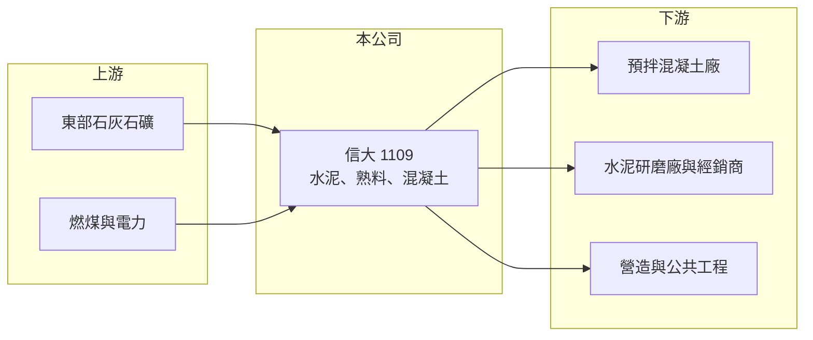

# 1109 信大

> 上市｜[[產業索引-水泥工業|水泥工業]]｜上市（櫃）日期 1991/12/05

# 第一章：企業模式與商業藍圖

> [!info] 撰寫說明
> 精簡版，由 Claude 依公開資料整理，架構比照 [[2330台積電]] 的四章研究，資料截至 2026-10-08。財務數字來源：Goodinfo 年度經營績效頁、MoneyDJ 個股基本資料（2025 年營收比重）、證交所開放資料（基本資料、2026 年第二季資產負債與綜合損益、營益分析、股利、本益比）；業務細節部分憑既有知識撰寫，已標「待校對」。公開資料有限。#待校對

在評估單一個股的長期價值時，首要步驟是拆解企業的獲利來源。本章說明信大水泥（股票代號：1109，以下簡稱信大）以水泥與[[熟料]]為核心的商業模式，以及它的營收為何在 2020 年後大幅縮減。

- **核心業務：** 信大成立於 1964 年，1991 年上市，董事長為楊智雄、總經理為楊大寬，實收資本額約 34.1 億元。依 MoneyDJ 的 2025 年營收比重，水泥及熟料占 62.71%、其他占 24.77%、混凝土占 12.52%。水泥與熟料是主體，混凝土則是往下游延伸的業務，「其他」類別的內容本文未查得。
- **生產據點：** 信大的水泥廠位於台灣東部，靠近石灰石礦源（推估位於花蓮一帶）。#待校對 東部水泥廠的產品除供應國內，也可以透過港口把熟料或水泥運往其他市場，這讓信大過去在海外需求強勁時有能力擴大出貨。
- **營收結構的變化：** 信大營收在 2019 年達到 78.2 億元，2025 年降到 44.3 億元（Goodinfo），六年間縮減超過四成。毛利率同期從約 33% 降到 16%，代表不只是量縮，價格與成本條件也明顯惡化。推估與熟料出口市場萎縮、國內需求降溫及燃料成本上升有關（推估，具體原因未查得）。
- **長期方向：** 信大的長期課題是找到穩定的出貨去化管道，讓窯爐維持合理的使用率，同時因應[[碳費]]與減碳要求。公司財務結構保守、負債很低，有能力度過景氣低谷，但成長動能目前不明確。

# 第二章：護城河深度與競爭優勢

本章分析信大的競爭優勢與限制。

- **競爭優勢：** 與其他台灣水泥廠相同，信大的護城河來自石灰石礦權與窯爐產能。新礦權難以取得，既有產能具稀缺性；加上信大負債比僅約 13%，在景氣低迷時不必被迫降價求現，可以維持較穩定的經營。
- **限制：** 信大規模小、產品同質性高，缺乏海外生產基地與多角化事業，獲利高度依賴水泥與熟料的報價。2019 至 2021 年的高獲利期過後，ROE 從 17.9% 降到 2025 年的 3.73%（Goodinfo），顯示它無法在不利的市場條件下維持定價。
- **主要對手：** [[1101台泥]]、[[1102亞泥]]、[[1104環泥]]、[[1108幸福]]、[[1110東泥]]，以及越南、中國等地的進口水泥與熟料。
- **觀察重點：** 第一，熟料與水泥出貨量能否止跌；第二，混凝土等下游業務能否擴大；第三，[[反傾銷稅]]與碳邊境措施能否改善國內市場的價格秩序。

# 第三章：財務體質與盈利規模

資料日期：2026-10-08，表格是撰寫當時的快照；最新月營收、毛利率、累計 EPS 由自動排程寫在本筆記的屬性欄位（月營收、毛利率、累計EPS 等）。#待校對

本章用多年度的三率、ROE 與資本報酬，檢視信大的獲利品質。

| 年度 | 營收（新台幣） | [[毛利率]] | [[營業利益率]] | EPS（元） | [[ROE]] |
|---|---|---|---|---|---|
| 2021 | 73.8 億 | 29.9% | 23.8% | 2.52 | 12.5% |
| 2022 | 63.9 億 | 19.6% | 14.3% | 1.17 | 5.31% |
| 2023 | 62.6 億 | 21.4% | 15.8% | 2.01 | 8.22% |
| 2024 | 46.6 億 | 21.3% | 14.0% | 1.38 | 5.19% |
| 2025 | 44.3 億 | 16.0% | 9.55% | 1.03 | 3.73% |
| 2026 上半年 | 18.6 億 | 9.12% | 1.66% | 0.15 | 未查得 |

註：2021 至 2025 年取自 Goodinfo，2026 上半年取自證交所營益分析；2025 年 EPS 與證交所股利資料的本期淨利 3.51 億元換算結果一致。

- **營收規模：** 2021 至 2025 年營收年複合成長率約 -12.0%（推算），是台灣水泥業中衰退較明顯的一家。2026 年上半年營收約 18.6 億元，年化後仍低於 2025 年。
- **獲利結構：** 毛利率從 2021 年的 29.9% 一路降到 2026 年上半年的 9.12%，營業利益率只剩 1.66%。水泥業的營業費用相對固定，營收縮小時費用率上升，獲利下滑幅度大於營收。
- **長期指標：** 2021 至 2025 年平均 ROE 約 7.0%（推算），但呈逐年下降趨勢。2025 年度配發現金股利 0.90 元，配發率約 87%（推算），公司把大部分盈餘發還股東。
- **財務特色：** 2026 年第二季底總負債僅約 13.2 億元，權益總計約 101.8 億元，其中歸屬母公司約 82.4 億元，非控制權益約 19.3 億元（證交所開放資料），代表有子公司與其他股東合資經營。流動資產約 55.3 億元，遠高於流動負債 12.1 億元，財務非常保守。

**[[ROIC]] 與 [[WACC]]：** 2025 年營業利益約 44.3 億元 × 9.55% ≈ 4.2 億元，稅後約 3.4 億元。投入資本以權益 101.8 億元加上假設占總負債三成的有息負債約 4.0 億元，合計約 105.7 億元，ROIC 約 3.2%（推算）。WACC 以 CAPM 推估：無風險利率 1.75%、市場風險溢酬 6%、β 取水泥業常見值 0.7，股東權益成本約 5.95%；負債成本 2.5%、稅後 2.0%；權益約占 96%，WACC 約 5.8%（推算）。2021 年 ROIC 約 13% 至 14%（推算，以 73.8 億元 × 23.8% 的營業利益與近期資本基礎概算），明顯高於資金成本；但 2024 年後已低於資金成本。結論是信大過去曾創造可觀的價值，但目前處於價值流失階段，大量現金與低負債雖降低風險，也拉低了資本報酬率。

# 第四章：總體風險與地緣政治

本章分析信大長期面對的風險。

- **產業週期：** 水泥與熟料需求取決於國內營建景氣與海外市場，兩者同時轉弱時，信大的出貨量與報價都會受壓。2026 年上半年營業利益率僅 1.66%，代表已接近損益兩平。
- **營運風險：** 窯爐屬於高固定成本設備，使用率下降時單位成本上升；燃煤價格波動直接影響毛利。東部廠到消費市場的運輸距離較長，運費也是成本壓力。
- **其他風險：** 碳費與空污標準加嚴會增加生產成本；東部礦區的礦權展延與環保審查有不確定性；進口水泥與熟料若持續以低價進入台灣，會壓縮國內報價。

# 專有名詞解析

## 金融

- **[[毛利率]]**：營業毛利占營收的比例，反映產品定價能力與生產成本控制。
- **[[營業利益率]]**：扣除營業費用後的營業利益占營收的比例，衡量本業整體獲利能力。
- **[[ROE]]**：股東權益報酬率，稅後淨利除以股東權益，衡量公司運用股東資金的效率。
- **[[ROIC]]**：投入資本報酬率，稅後營業利益除以股東權益與有息負債的合計，衡量本業對所有資金提供者的報酬。
- **[[WACC]]**：加權平均資金成本，依股東權益與負債的比重加權計算的資金成本，ROIC 高於它才代表創造價值。

## 產業

- **[[熟料]]**：石灰石與黏土在高溫窯中燒成的中間產品，研磨後加入石膏即成水泥，生產過程是水泥業碳排的主要來源。
- **[[反傾銷稅]]**：進口國認定外國產品以低於正常價格出口時加徵的關稅，常用於限制特定國家的水泥、鋼鐵等產品。
- **[[碳費]]**：政府對溫室氣體排放大戶依排放量收取的費用，台灣自 2025 年起開徵，水泥、鋼鐵等產業首當其衝。

# 核心供應鏈

- 上游：東部石灰石礦、燃煤與電力、石膏等添加材料。
- 下游／客戶：預拌混凝土廠、水泥研磨廠與經銷商、營造與公共工程。
- 同業：[[1101台泥]]、[[1102亞泥]]、[[1103嘉泥]]、[[1104環泥]]、[[1108幸福]]、[[1110東泥]]。

## 最新新聞
<!-- news:start -->
<!-- news:end -->

## 相關連結
- [公開資訊觀測站](https://mopsov.twse.com.tw/mops/web/t05st03?step=1&firstin=1&co_id=1109)
- [Goodinfo](https://goodinfo.tw/tw/StockDetail.asp?STOCK_ID=1109)
- [Yahoo 股市](https://tw.stock.yahoo.com/quote/1109)
- [鉅亨網新聞](https://www.cnyes.com/twstock/1109/news)
