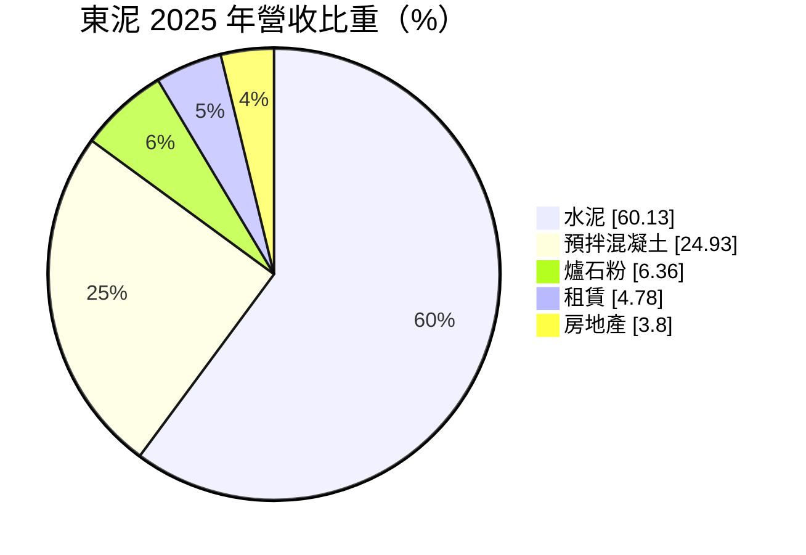
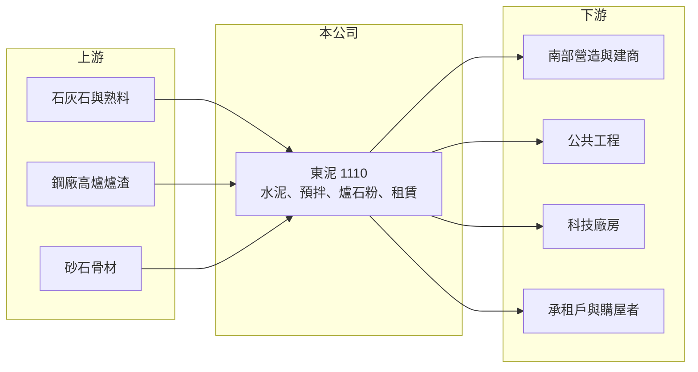

# 1110 東泥

> 上市｜[[產業索引-水泥工業|水泥工業]]｜上市（櫃）日期 1994/10/22

# 第一章：企業模式與商業藍圖

> [!info] 撰寫說明
> 精簡版，由 Claude 依公開資料整理，架構比照 [[2330台積電]] 的四章研究，資料截至 2026-10-08。財務數字來源：Goodinfo 年度經營績效頁、MoneyDJ 個股基本資料（2025 年營收比重）、證交所開放資料（基本資料、2026 年第二季資產負債與綜合損益、營益分析、股利、本益比）；業務細節部分憑既有知識撰寫，已標「待校對」。公開資料有限。#待校對

在評估單一個股的長期價值時，首要步驟是拆解企業的獲利來源。本章說明東南水泥（股票代號：1110，以下簡稱東泥）以南台灣為基地的水泥與建材業務，以及[[爐石粉]]、租賃與房地產在它營運中的角色。

- **核心業務：** 東泥成立於 1956 年，1994 年上市，總部位於高雄，董事長為陳敏斷，實收資本額約 57.2 億元。依 MoneyDJ 的 2025 年營收比重，水泥占 60.13%、[[預拌混凝土]]占 24.93%、爐石粉占 6.36%、租賃占 4.78%、房地產占 3.80%。
- **產品組合的意義：** 水泥與預拌混凝土構成約八成五的營收，屬於典型的區域型建材業者，主要服務南台灣的營建與公共工程。爐石粉是鋼廠高爐的副產品經研磨而成，可以取代部分水泥，降低混凝土的成本與碳排，是水泥業因應減碳的重要材料。
- **租賃與房地產：** 東泥持有土地與建物，透過出租與開發取得收入。這兩項業務占營收不到一成，但收入穩定，讓公司在建材景氣低迷時仍有基本現金流。
- **長期方向：** 東泥營收從 2021 年的 18.5 億元成長到 2024 年的 28.7 億元（Goodinfo），毛利率也從個位數提升到 15% 以上，顯示南部科技廠房與公共工程需求帶來實質改善。長期重點在於擴大爐石粉等低碳材料的應用，以及活化土地資產。

# 第二章：護城河深度與競爭優勢

本章分析東泥的競爭優勢與限制。

- **競爭優勢：** 東泥在高雄經營超過六十年，在南部擁有銷售通路、預拌廠與土地資產。水泥與混凝土的運輸成本高，區域業者在就近供貨上有天然優勢；爐石粉則需要鄰近鋼廠取得原料，南台灣正是台灣鋼鐵業的集中地，這讓東泥在低碳材料上具備地理條件。
- **限制：** 東泥規模小，2020 年以前營業利益率多在零附近甚至為負（Goodinfo），代表本業長期缺乏定價能力。近年獲利改善主要依靠需求回溫，若景氣反轉，獲利可能快速回落。
- **主要對手：** 水泥方面為 [[1101台泥]]、[[1102亞泥]]、[[1104環泥]]、[[1108幸福]]、[[1109信大]] 與進口水泥；南部預拌混凝土市場中，[[1104環泥]] 是最直接的區域競爭者。
- **觀察重點：** 第一，南部半導體廠房與公共工程需求能否延續；第二，爐石粉與低碳水泥能否隨碳費制度擴大需求；第三，土地資產的開發與出租規劃。

# 第三章：財務體質與盈利規模

資料日期：2026-10-08，表格是撰寫當時的快照；最新月營收、毛利率、累計 EPS 由自動排程寫在本筆記的屬性欄位（月營收、毛利率、累計EPS 等）。#待校對

本章用多年度的三率、ROE 與資本報酬，檢視東泥的獲利品質。

| 年度 | 營收（新台幣） | [[毛利率]] | [[營業利益率]] | EPS（元） | [[ROE]] |
|---|---|---|---|---|---|
| 2021 | 18.5 億 | 7.29% | 0.65% | 0.25 | 1.55% |
| 2022 | 17.9 億 | 6.76% | -1.76% | 0.26 | 1.24% |
| 2023 | 22.7 億 | 8.97% | 2.61% | 0.26 | 1.76% |
| 2024 | 28.7 億 | 18.2% | 11.7% | 0.61 | 4.06% |
| 2025 | 28.5 億 | 15.0% | 8.48% | 0.36 | 2.38% |
| 2026 上半年 | 12.7 億 | 15.96% | 8.86% | 0.34 | 未查得 |

註：2021 至 2025 年取自 Goodinfo，2026 上半年取自證交所營益分析；2025 年 EPS 與證交所股利資料的本期淨利 2.06 億元換算結果一致。

- **營收規模：** 2021 至 2025 年營收年複合成長率約 11.4%（推算），2024 至 2025 年維持在 28 億元以上，是近十年的高點。
- **獲利結構：** 毛利率由 2021 年約 7% 提升到 2024 年後的 15% 至 18%，營業利益率也轉為穩定的正數。2026 年上半年營業利益約 1.12 億元、營業外收入約 1.07 億元（證交所開放資料），業外收益與本業貢獻相當。
- **長期指標：** 2021 至 2025 年平均 ROE 約 2.2%（推算），資本效率偏低。2025 年度配發現金股利 0.30 元，配發率約 83%（推算），股利金額小但持續發放。
- **財務特色：** 2026 年第二季底總負債約 36.9 億元、權益總計約 96.8 億元，負債比約 28%。其他權益約 9.7 億元，反映金融資產的未實現評價利益；股價淨值比約 0.86 倍（證交所開放資料）。

**[[ROIC]] 與 [[WACC]]：** 2025 年營業利益約 28.5 億元 × 8.48% ≈ 2.4 億元，稅後約 1.9 億元。投入資本以權益 96.8 億元加上假設占總負債五成的有息負債約 18.4 億元，合計約 115.2 億元，ROIC 約 1.7%（推算）。WACC 以 CAPM 推估：無風險利率 1.75%、市場風險溢酬 6%、β 取水泥業常見值 0.7，股東權益成本約 5.95%；負債成本 2.5%、稅後 2.0%；權益約占 84%，WACC 約 5.3%（推算）。結論是東泥的本業報酬長期低於資金成本，即使近年獲利改善，仍未達到創造價值的門檻。土地與金融資產占用了大量帳面資本，是 ROIC 偏低的主因，未來若能活化這些資產，才有機會改善資本效率。

# 第四章：總體風險與地緣政治

本章分析東泥長期面對的風險。

- **產業週期：** 南部營建與公共工程需求在 2023 至 2025 年處於高檔，若科技廠房投資放緩或房市降溫，水泥與預拌混凝土的出貨將同步下滑，近年改善的毛利率可能回落。
- **營運風險：** 燃煤、電力與砂石成本波動大；爐石粉的原料供應取決於鋼廠的高爐產量，鋼廠若改用電爐等低碳製程，高爐爐石的供給長期可能減少。
- **其他風險：** 碳費與空污標準加嚴會增加水泥生產成本；房地產業務受信用管制與房市景氣影響；進口水泥的低價競爭會壓縮國內報價。

# 專有名詞解析

## 金融

- **[[毛利率]]**：營業毛利占營收的比例，反映產品定價能力與生產成本控制。
- **[[營業利益率]]**：扣除營業費用後的營業利益占營收的比例，衡量本業整體獲利能力。
- **[[ROE]]**：股東權益報酬率，稅後淨利除以股東權益，衡量公司運用股東資金的效率。
- **[[ROIC]]**：投入資本報酬率，稅後營業利益除以股東權益與有息負債的合計，衡量本業對所有資金提供者的報酬。
- **[[WACC]]**：加權平均資金成本，依股東權益與負債的比重加權計算的資金成本，ROIC 高於它才代表創造價值。

## 產業

- **[[爐石粉]]**：鋼廠高爐煉鐵產生的水淬爐渣經研磨而成的粉末，可取代部分水泥用於混凝土，降低成本與碳排。
- **[[預拌混凝土]]**：在工廠依配比把水泥、砂石與水拌好，再以攪拌車送到工地的混凝土，品質穩定，是營建工程的主流用法。
- **[[碳費]]**：政府對溫室氣體排放大戶依排放量收取的費用，台灣自 2025 年起開徵，水泥、鋼鐵等產業首當其衝。

# 核心供應鏈

- 上游：石灰石與熟料、鋼廠高爐爐渣（如 [[2002中鋼]]，推估）、砂石骨材、燃料與電力。
- 下游／客戶：南部營造廠與建商、公共工程、科技廠房、不動產承租戶與購屋者。
- 同業：[[1101台泥]]、[[1102亞泥]]、[[1103嘉泥]]、[[1104環泥]]、[[1108幸福]]、[[1109信大]]。

## 最新新聞
<!-- news:start -->
<!-- news:end -->

## 相關連結
- [公開資訊觀測站](https://mopsov.twse.com.tw/mops/web/t05st03?step=1&firstin=1&co_id=1110)
- [Goodinfo](https://goodinfo.tw/tw/StockDetail.asp?STOCK_ID=1110)
- [Yahoo 股市](https://tw.stock.yahoo.com/quote/1110)
- [鉅亨網新聞](https://www.cnyes.com/twstock/1110/news)
