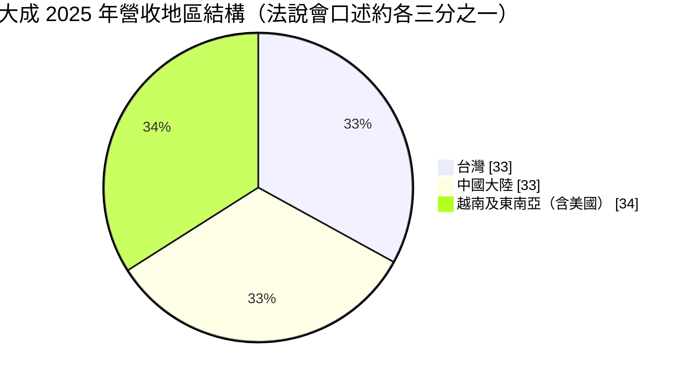
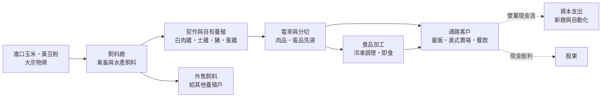
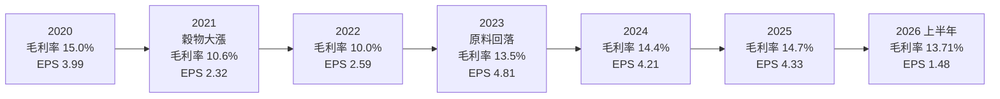
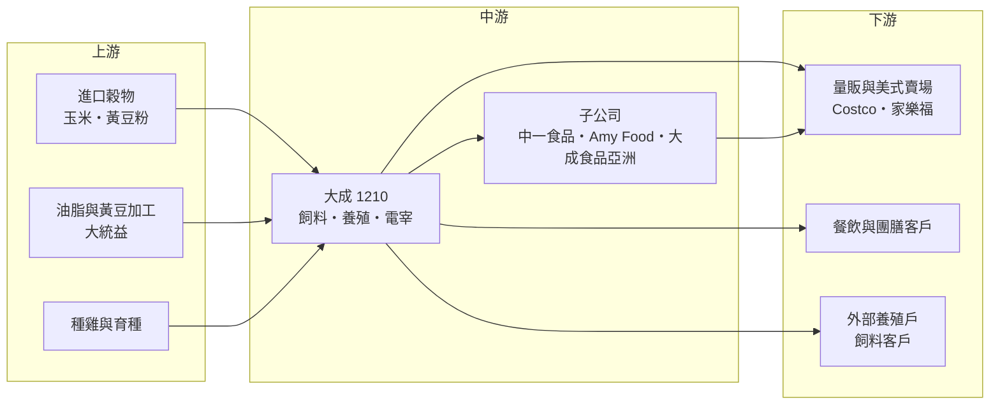

# 1210 大成

> 上市｜[[產業索引-食品工業|食品工業]]｜上市（櫃）日期 1978/05/20

# 第一章：企業模式與商業藍圖

> [!info] 撰寫說明
> 本文由 Claude 依公開資料整理，架構比照 [[2330台積電]] 的四章研究，資料截至 2026-10-08。財務數字來源：證交所開放資料快照（基本資料、2026 年第二季綜合損益與資產負債、股利、本益比）、Goodinfo 經營績效與股利政策頁、MoneyDJ 年度財務比率、富果研究 2026 年 4 月法說會備忘錄、優分析、遠見雜誌 2019 年專訪、CMoney 個股筆記；產業描述為整理性內容，尚未逐條比對原始文件。#待校對

在評估單一個股的長期投資價值時，首要步驟是拆解企業的底層獲利邏輯。本章針對大成長城企業（股票代號：1210，以下簡稱大成）的商業模式進行定性分析，說明一家從油廠起家的農畜企業，如何把飼料、養殖、電宰到加工食品串成一條完整的價值鏈，又為什麼這種模式的利潤率天生偏低、卻能長期穩定賺錢。

## 一、核心定位：以飼料為起點的農畜食品垂直整合集團

大成的源頭是創辦人韓德厚在 1950 年代以壓榨黃豆、生產豆油與豆餅起家（遠見雜誌記載為 1957 年創業，公司登記成立日期為 1960 年 12 月 28 日），1978 年在台灣證券交易所上市，總部位於台南永康。豆餅本身就是動物飼料的主要蛋白質來源，因此大成很自然地從油廠延伸到飼料廠，再從飼料延伸到養雞、養豬與電宰，最後走到冷凍調理食品與餐飲通路。第二代董事長韓家宇在 2001 年接任後，把這套模式稱為「一條龍」，也就是同一個物種從育種、飼料、養殖、[[電宰]]到食品加工都由集團自己掌握。

這種[[垂直整合]]的商業意義，可以用兩點理解：

* **把大宗原料轉成品牌商品：** 飼料的主要成本是進口玉米與黃豆粉，屬於價格隨國際行情波動的[[大宗物資]]，單獨賣飼料的毛利很薄。大成把飼料餵給自己的雞、豬，再把肉加工成調理食品和品牌雞蛋，每往下游走一步，產品就離「大宗」遠一點、離「品牌」近一點，議價能力也跟著提高。
* **用集團內部交易平滑週期：** 當肉價低迷時，飼料與食品加工可以分攤損失；當玉米、黃豆漲價時，下游品牌產品較容易反映成本。不同環節的景氣不同步，讓合併後的獲利比單一環節穩定。

依公司 2026 年 4 月法說會的說法，大成台灣飼料年銷量已突破 140 萬噸，市占居台灣第一；蛋品則在 2019 年前後就已成為台灣市占第一的業者（遠見雜誌，待校對）。董事長韓家宇的長子韓芳豪目前擔任總經理（依證交所基本資料），代表經營權已進入第三代交接階段。

## 二、終端應用與產品板塊：台灣、中國、越南三足鼎立

大成沒有公開穩定揭露各事業別的營收占比，但 2026 年 4 月法說會提到，台灣、中國大陸與越南（東南亞）三個地區大致各占營收三分之一，美國則是 2024 年才透過併購切入，占比仍小。下圖依法說會「約各三分之一」的口述畫成，只代表大致結構，不是精確數字。

依產品別，大成的事業可以分成四大板塊：

* **飼料（農糧）：** 包括禽畜飼料與水產飼料，是集團營收占比最高的事業（CMoney 筆記指出飼料銷售比重最高，具體百分比未查得）。飼料廠是整條價值鏈的入口，量大、毛利低，但它決定了下游養殖的成本與品質。2025 年 7 月啟用的新水產飼料廠年產能 14 萬噸，專攻海水魚飼料，滿產產值約 30 億元，代表大成想在附加價值較高的水產飼料拿到更多份額。
* **肉品（白肉雞、土雞、豬）：** 從契作養殖到電宰、分切，客戶涵蓋量販店、美式賣場與餐飲業者。2026 年 1 月土雞加工廠投產，肉品分切廠也在興建中，目的是把整隻雞、整頭豬拆解成更多可以單獨定價的部位商品。
* **蛋品：** 以生食級雞蛋品牌「上品語」為代表。雞蛋原本是最典型的同質化農產品，大成用洗選、殺菌與品牌把它變成可以溢價的商品。2026 年 9 月子公司中一食品公告新建蛋品加工廠，延續這個方向。
* **加工食品：** 包括冷凍調理食品、即食即煮產品與餐飲。大成過去收購中一排骨與欣光食品，切入[[冷凍調理食品]]，2024 年再併購美國冷凍食品業者 Amy Food，2025 年食品加工銷售額成長 11%，是連續第二年成長。規劃中的寵物食品廠預計 2027 年投產，則是押注台灣寵物數量的成長。

## 三、資本轉化邏輯（營運模式）：薄利多銷的現金流機器

大成的營運模式可以拆成三個重點：

* **規模決定成本：** 飼料業的獲利來自採購量、配方效率與工廠稼動率。大成每年採購大量穀物，能在國際市場分批避險；配方研發則決定了[[飼料換肉率]]，也就是養出一公斤肉要吃掉幾公斤飼料，這個數字每改善一點，整條價值鏈的成本就跟著下降。
* **低毛利、高周轉：** 大成近六年的[[毛利率]]在 10% 至 15% 之間，[[營業利益率]]只有 2% 至 5%。它不是靠單位利潤賺錢，而是靠千億規模的營收與穩定的周轉，把很薄的利潤累積成每年三十多億元的淨利。這也意味著原料價格只要波動幾個百分點，就足以吃掉大部分利潤，管理原料成本是公司最核心的能力。
* **資本支出持續但不暴衝：** 依法說會資料，大成近三年投資近 100 億元，年資本支出約 20 億至 30 億元，用在新廠與自動化。以 2025 年折舊約 32 億元、營業現金流入約 80 億至 90 億元（富果備忘錄估計）來看，現金流足以同時支應擴產與配息。

## 四、企業長期藍圖：從大宗物資走向品牌食品

大成的長期方向很清楚，就是讓營收結構從「大宗物資」往「品牌與加工」移動，以降低對原料價格的敏感度。具體可以歸納為三條主軸：

* **高附加價值產品：** 以「益活雞」「上品語」等品牌肉品與蛋品，搭配美式賣場與量販通路，建立消費者認知。品牌的意義在於，當玉米漲價時，品牌商品比一般生鮮肉品更容易調整售價。
* **台灣新廠群：** 2025 年至 2027 年陸續投產的水產飼料廠、土雞加工廠、全能生技廠、肉品分切廠與寵物食品廠，依公司說法全部滿產後可增加數十億元產值，重點都放在加工深度，而不是單純擴大飼料量。
* **海外雙引擎：** 越南人口與所得成長帶動動物性蛋白質需求，是大成飼料與牧場布局的成長市場；美國則以 Amy Food 為基礎，目標是打進主流通路與冷凍食品市場。中國市場在 2007 年前後透過香港上市的大成食品（亞洲）擴張（遠見雜誌，待校對），近年面對豬價低迷與激烈競爭，策略重心轉向食品加工。

# 第二章：護城河深度與競爭優勢

在長期價值投資中，「護城河」指企業抵禦競爭、維持超額利潤的保護機制。本章分析大成在一個低毛利、高度競爭的農畜產業裡，究竟靠什麼守住市占，以及這些優勢在原料波動與同業競爭下能守住多少。

## 一、大成護城河的核心組成要素

農畜食品業的產品同質性高，很難建立像科技業那樣的深護城河。大成的優勢屬於「窄護城河」，主要由規模、整合與通路三個要素組成：

* **1. 採購與生產規模：** 大成是台灣飼料銷量最大的業者，年銷量超過 140 萬噸。在一個毛利只有一成多的產業，大量採購帶來的穀物議價能力、運輸與倉儲效率、工廠稼動率，就是最實在的成本優勢。新進業者很難在短時間內累積同樣的規模，這讓大成在價格競爭中有較厚的緩衝。
* **2. 垂直整合帶來的品質與食安控管：** 從飼料配方、育種到電宰全程自己掌握，代表大成能追溯每一批肉品的來源，這在食安事件頻傳的台灣是重要的信任基礎。量販店、美式賣場與連鎖餐飲業者選擇供應商時，可追溯性與穩定供貨往往比價格更重要，一旦通過稽核，客戶通常不會輕易更換。
* **3. 品牌與通路：** 「上品語」「益活雞」等品牌讓大成在部分品項擺脫純價格競爭，加上長年經營的量販、美式賣場與餐飲客戶關係，形成新品上架與推廣的通路優勢。2026 年 3 月益活雞在美式賣場促銷期間銷量成長 8 倍，就是通路與品牌同時發揮作用的例子。

## 二、全球主要競爭對手格局

| 對手 | 定位 | 對大成的威脅 |
|---|---|---|
| [[1215卜蜂]] | 泰國正大集團在台子公司，飼料與白肉雞一條龍 | 白肉雞與飼料正面競爭，擁有母集團的國際採購與技術 |
| [[1216統一]] | 台灣最大食品集團，具麵粉、飼料與加工食品 | 在加工食品與通路具壓倒性品牌與零售優勢 |
| [[1219福壽]] | 飼料、油脂與肉品 | 中部飼料市場的主要對手 |
| 大武山牧場 | 台灣蛋品與畜牧業者 | 在品牌雞蛋與蛋品加工擴產上直接競爭 |
| 正大集團（Charoen Pokphand Foods） | 泰國農畜食品巨頭 | 在越南與中國的飼料與肉品市場規模遠大於大成 |
| 中國本土飼料與肉品大廠 | 新希望、海大集團等 | 以規模與政策支持壓低中國市場價格 |

## 三、優勢轉化：哪些市場守得住、哪些守不住

* **守得住：** 台灣的飼料與品牌肉品、蛋品市場。台灣市場規模有限、食安要求高、通路集中，大成的規模與食安追溯在這裡最有價值，也是公司近年獲利最穩的來源。加工食品則因為品牌、配方與通路的累積，屬於轉換成本較高的業務。
* **守不住：** 中國的上游飼料與豬肉市場。中國同業規模龐大，豬價又處於歷史低點，大成在當地沒有明顯的成本優勢，只能靠食品加工部分抵銷。越南雖然需求成長快，但正大、嘉吉（Cargill）等國際大廠也在積極擴張，競爭同樣激烈。
* **觀察重點：** 第一，加工食品與品牌產品的營收比重能否持續提高，這是毛利率能否站穩 15% 以上的關鍵。第二，2026 年至 2027 年投產的新廠能否順利拉高稼動率。第三，美國 Amy Food 能否打進主流通路，讓美國成為第四個成長引擎。

# 第三章：財務體質與盈利規模

資料日期：2026-10-08。數字取自證交所開放資料快照、Goodinfo 經營績效頁、MoneyDJ 年度財務比率與富果法說會備忘錄，表格是撰寫當時的快照；最新月營收、毛利率、累計 EPS 由自動排程寫在本筆記的屬性欄位（月營收、毛利率、累計EPS 等）。#待校對

財務報表是檢驗護城河是否真實存在的最終標準。本章用多年度的三率、[[ROE]]、現金流與資本報酬，檢視大成在原料價格與肉價循環中的獲利品質。

## 一、獲利能力的基石：三率

| 年度 | 營收（新台幣） | [[毛利率]] | [[營業利益率]] | EPS（元） | [[ROE]] |
|---|---|---|---|---|---|
| 2020 | 817 億 | 15.0% | 5.16% | 3.99 | 15.6% |
| 2021 | 1,014 億 | 10.6% | 2.31% | 2.32 | 8.13% |
| 2022 | 1,133 億 | 10.0% | 2.70% | 2.59 | 10.1% |
| 2023 | 1,111 億 | 13.5% | 5.42% | 4.81 | 15.8% |
| 2024 | 1,027 億 | 14.4% | 5.19% | 4.21 | 13.3% |
| 2025 | 1,012 億 | 14.7% | 4.70% | 4.33 | 12.3% |
| 2026 上半年 | 538.7 億 | 13.71% | 3.89% | 1.48 | 未查得 |

資料來源：2020 至 2025 年為 Goodinfo 經營績效頁（合併報表），ROE 與 MoneyDJ 年度財務比率一致；2026 上半年為證交所營益分析與綜合損益快照。

* **毛利率由原料價格主導：** 2021 年至 2022 年國際玉米、黃豆價格大漲，大成的毛利率從 15% 掉到 10% 左右，EPS 也腰斬；2023 年原料回落後，毛利率迅速回到 13% 以上，EPS 創下 4.81 元的高點。這個循環清楚說明，大成的獲利不是由需求決定，而是由「原料成本」與「售價轉嫁速度」之間的時間差決定。
* **營收規模與獲利不同步：** 2022 年營收創下 1,133 億元新高，獲利卻是近年低點，因為營收增加主要來自原料漲價後的售價上調，而不是銷量或附加價值提升。投資人看大成時，毛利額與營業利益比營收數字更有意義。
* **2026 年上半年的壓力：** 上半年營業利益率 3.89%，低於 2025 年全年的 4.70%，可能與新廠投產初期的費用、中國市場競爭與運費能源成本有關（推估）。新廠的稼動率爬坡通常需要一至兩年。

## 二、[[ROE]]：資本效率

大成 2021 年至 2025 年的平均 ROE 約 11.9%（推算，五年簡單平均），若納入 2020 年則六年平均約 12.5%。以一家毛利率只有一成多的農畜食品公司來說，這個水準相當不錯，主要原因是資產周轉快與適度的財務槓桿：MoneyDJ 資料顯示大成的負債比率長期在 46% 至 54% 之間，2025 年為 53.4%，有息負債占股東權益的比率（借款依存度）約 69%。

依 2026 年第二季資產負債快照，歸屬母公司股東權益約 255.3 億元，非控制權益約 92.2 億元，權益合計約 347.5 億元。非控制權益比重不低，反映集團在中國、越南等地的子公司有外部股東（例如香港上市的大成食品），投資人計算 ROE 時應以歸屬母公司的淨利與權益為準。上半年歸屬母公司淨利 12.35 億元，年化後 ROE 約 9.7%（推算），低於近五年平均。

## 三、資本支出與自由現金流

* **[[CapEx]]：** 依 2026 年 4 月法說會，近三年投資近 100 億元，年資本支出約 20 億至 30 億元，主要投入台灣新廠與自動化。
* **[[自由現金流]]：** MoneyDJ 的每股現金流量在 2020 年至 2025 年依序為 8.27、5.32、2.77、11.55、9.43、7.97 元。以約 8.9 億股換算，除了原料大漲的 2022 年外，營業現金流大致在 47 億至 103 億元之間（推算，假設每股現金流量為每股營業現金流），高於每年 20 億至 30 億元的資本支出，自由現金流長期為正（推估）。2022 年營運資金被高價原料庫存占用，是自由現金流最緊的一年。
* **股利政策：** 現金股利依所屬年度為 2020 年 2.7 元（另配股 0.3 元）、2021 年 1.5 元（另配股 0.5 元）、2022 年 1.5 元、2023 年 2.222 元、2024 年 2.828 元、2025 年 3.0 元（Goodinfo；2025 年度為董事會決議，配發總額約 26.8 億元，證交所股利資料）。以當年 EPS 計算，配息率大致在 46% 至 69% 之間，近兩年接近七成，顯示公司在擴產的同時仍維持穩定配息。

## 四、[[ROIC]] 與 [[WACC]]：價值創造利差

**ROIC 推算：** 以 2025 年營業利益 47.61 億元（富果備忘錄）計算，稅後營業利益約為 47.61 ×（1 − 20%）＝ 38.1 億元。投入資本以 2026 年第二季權益合計 347.5 億元，加上有息負債約 239 億元（以 MoneyDJ 2025 年借款依存度 68.73% 乘以權益推算），合計約 586 億元。ROIC 約為 38.1 ÷ 586 ≈ 6.5%（推算）。若以 2026 年上半年營業利益 20.94 億元年化，ROIC 約 5.7%（推算）。

**WACC 推算：** 股東權益成本用 CAPM 估計，台灣 10 年期公債殖利率取 1.75%，市場風險溢酬 6%，β 取食品業常見的 0.6 至 0.9（未查得大成本身的 β），股東權益成本約 5.4% 至 7.2%。負債成本採 MoneyDJ 2025 年有息負債利率 2.19%，稅後約 1.75%。資本結構以市值約 429 億元（股價淨值比 1.68 倍乘每股淨值 30.51 元，再乘扣除庫藏股後約 8.37 億股）與有息負債約 239 億元計算，權益占 64%、負債占 36%。WACC 約為 4.2% 至 5.2%（推算）。

**解讀：** 大成的 ROIC 約 6% 至 6.5%，高於 WACC 約 4% 至 5%，利差大約 1 至 2 個百分點（推算）。這表示公司在正常年度有創造價值，但幅度不大，且在 2021 年至 2022 年這種原料高峰期，營業利益率掉到 2% 多，ROIC 很可能跌到 WACC 以下。換句話說，大成長期能否創造價值，關鍵在於品牌與加工食品能否把營業利益率穩定在 5% 左右，而不是營收規模再創新高。

# 第四章：總體風險與地緣政治

任何企業都無法脫離宏觀環境獨立存在。本章分析大成未來必須面對的地緣政治、產業週期、營運與法規風險。對農畜食品業來說，最大的風險往往不是需求消失，而是原料與疫病這類無法控制的外部衝擊。

## 一、地緣政治風險

* **穀物供應與貿易政策：** 大成的玉米與黃豆幾乎全部仰賴進口，主要來自美國、巴西等產區（待校對）。中美貿易摩擦、產地出口限制或航運中斷，都會直接推高原料成本。2026 年法說會也提到中東衝突可能推升運費與能源價格，公司以庫存管理與避險因應，但避險只能延後衝擊，無法消除。
* **中國市場的政策與競爭：** 中國是大成三大市場之一，但當地飼料與養豬業受政策影響大，豬價週期又長又深。若兩岸關係緊張或中國推動本土企業優先，大成的中國事業可能面臨更大壓力。
* **匯率：** 原料以美元計價，海外營收以人民幣、越南盾計價，新台幣、美元與當地貨幣三方的匯率變動都會影響獲利。公司在法說會表示，2025 年新台幣快速升值時避險空間有限。

## 二、產業週期與市場結構風險

* **穀物價格週期：** 2021 年至 2022 年的經驗顯示，原料大漲時大成毛利率可能從 15% 掉到 10%。穀物價格受天候、生質燃料政策與地緣衝突影響，週期難以預測。
* **[[豬週期]]與肉價：** 豬肉價格常出現數年一輪的漲跌循環，中國尤其明顯。豬價低迷時，養殖端虧損會壓縮飼料需求與售價。
* **市場成熟度：** 台灣人口成長停滯，肉品與飼料總量成長有限，未來成長必須來自產品升級、市占提升或海外市場。

## 三、營運環境的隱性風險

* **[[禽流感]]與動物疫病：** 禽流感、非洲豬瘟等疫病一旦爆發，可能導致撲殺、出口禁令與消費信心下降，對垂直整合業者的衝擊比單純飼料商更大，因為養殖與電宰環節都在自己手上。
* **新廠爬坡：** 2025 年至 2027 年多座新廠陸續投產，初期折舊與人力費用會先上升，若稼動率爬坡不如預期，會壓低營業利益率。
* **環保與人力：** 畜牧業面臨糞尿處理、臭味與碳排的環保壓力，電宰與食品加工則長期缺工，自動化投資是不得不做的成本。

## 四、科技或法規演進

* **食安與標示法規：** 台灣對食品添加物、產地標示與追溯的要求持續提高，合規成本上升，但也提高了小業者的門檻，對大成這種具備完整追溯體系的大廠相對有利。
* **永續與減碳：** 國際通路與品牌客戶逐步要求供應鏈揭露碳排，飼料配方的精準營養、禽畜糞轉有機肥等做法，未來可能從加分項變成必要條件。
* **替代蛋白：** 植物肉與細胞培養肉若技術與成本突破，長期可能侵蝕部分肉品需求。以目前進度來看屬於十年以上的遠期風險，但大成作為蛋白質供應商，需要持續觀察。

# 專有名詞解析

## 金融

- **[[毛利率]]**：營業毛利除以營業收入，反映產品扣除直接成本後的獲利空間。
- **[[營業利益率]]**：營業利益除以營業收入，反映本業扣除營業費用後的獲利能力。
- **[[ROE]]**：股東權益報酬率，稅後淨利除以股東權益，衡量公司運用股東資金賺錢的效率。
- **[[ROIC]]**：投入資本報酬率，稅後營業利益除以股東權益加有息負債，衡量本業運用所有資金的效率。
- **[[WACC]]**：加權平均資金成本，股東與債權人要求報酬率依資本結構加權，是 ROIC 要超越的門檻。
- **[[CapEx]]**：資本支出，用於興建廠房、購買設備等長期資產的支出。
- **[[自由現金流]]**：營業活動現金流減去資本支出，代表企業可自由用於配息、還債或併購的現金。

## 產業

- **[[垂直整合]]**：同一家企業掌握產業鏈中多個上下游環節，例如從飼料、養殖、電宰到食品加工，好處是成本與品質可控，壞處是資本投入大。
- **[[大宗物資]]**：玉米、黃豆、小麥等交易量大、規格標準化、價格由國際市場決定的原物料，業者難以靠產品差異定價。
- **[[飼料換肉率]]**：養出一公斤肉所需的飼料公斤數，數字越低代表飼養效率越高，是飼料配方與養殖管理的核心指標。
- **[[電宰]]**：以機械化屠宰場進行禽畜屠宰與分切，衛生與追溯條件優於傳統屠宰，是肉品進入量販與餐飲通路的前提。
- **[[冷凍調理食品]]**：經過預先烹調或調味後冷凍保存、消費者加熱即可食用的食品，附加價值高於生鮮肉品。
- **[[豬週期]]**：豬隻價格因養殖戶跟風擴產與減產，形成數年一輪的漲跌循環，在中國尤其明顯。
- **[[禽流感]]**：禽鳥間傳染的流感病毒，爆發時常需撲殺禽隻並限制出口，對養雞與蛋品業者衝擊很大。

# 核心供應鏈

## 1. 上游：原料與育種
- 進口玉米、黃豆粉等穀物原料，主要透過國際穀物貿易商採購（產地以美洲為主，待校對）
- 黃豆壓榨與油脂：[[1232大統益]]（大成為投資股東之一，待校對）
- 種雞與育種：部分自行育種、部分向國際育種公司引進（待校對）

## 2. 中游：大成本身與子公司
- 飼料、白肉雞與土雞、豬、蛋品的養殖、電宰與加工：大成本身
- 冷凍調理食品：中一食品（中一排骨）、欣光食品
- 中國事業：香港上市的大成食品（亞洲）
- 美國事業：2024 年併購的 Amy Food

## 3. 下游：通路與客戶
- 量販與美式賣場：Costco、家樂福
- 餐飲、團膳與食品加工客戶
- 購買飼料的外部養殖戶

## 4. 同業
- [[1215卜蜂]]、[[1216統一]]、[[1219福壽]]、大武山牧場
- 國際同業：正大集團（Charoen Pokphand Foods）、嘉吉（Cargill）

## 最新新聞
<!-- news:start -->
<!-- news:end -->

## 相關連結
- [公開資訊觀測站](https://mopsov.twse.com.tw/mops/web/t05st03?step=1&firstin=1&co_id=1210)
- [Goodinfo](https://goodinfo.tw/tw/StockDetail.asp?STOCK_ID=1210)
- [Yahoo 股市](https://tw.stock.yahoo.com/quote/1210)
- [鉅亨網新聞](https://www.cnyes.com/twstock/1210/news)
