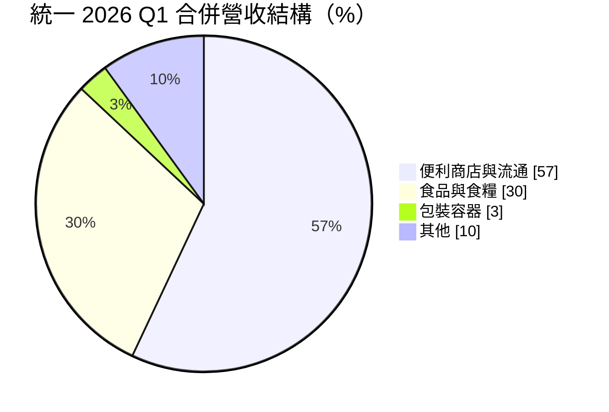
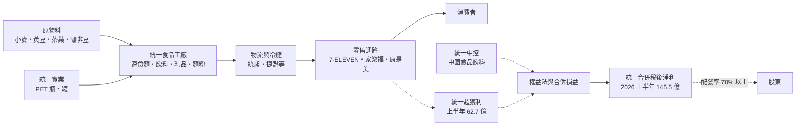
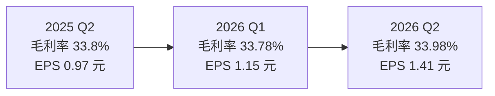
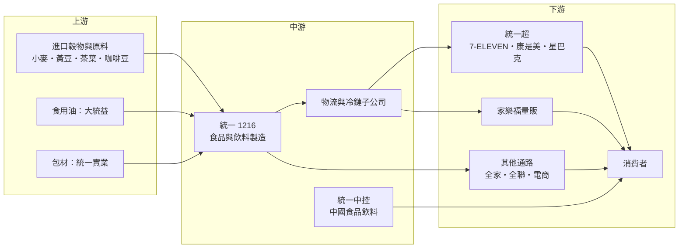

# 1216 統一

> 上市｜[[產業索引-食品工業|食品工業]]｜上市（櫃）日期 1987/12/28

# 第一章：企業模式與商業藍圖

> [!info] 撰寫說明
> 本文由 Claude 依公開資料整理，架構比照 [[2330台積電]] 的四章研究，資料截至 2026-10-07。財務數字來源：優分析（2025 年全年、2026 年上半年財報）、ETtoday 財經雲（2026 年上半年財報）、富果研究（統一 2026 年 6 月法說會、統一超 2026 年 3 月法說會整理）、鉅亨網（2025 年上半年財報）；產業描述為整理性內容，尚未逐條比對原始文件。#待校對

在評估單一個股的長期投資價值時，首要步驟是拆解企業的底層獲利邏輯。本章針對統一企業（股票代號：1216，以下簡稱統一）的商業模式進行定性分析，說明它如何從一家麵粉與飼料廠，發展成橫跨食品製造、便利商店、量販、物流與包材的「生產加通路」集團，以及為什麼它的合併營收雖大，真正決定股東報酬的卻是幾家關鍵轉投資。

## 一、核心定位：從工廠到貨架的垂直整合集團

統一成立於 1967 年，起家於麵粉與飼料，之後擴展到速食麵、飲料、乳品等食品，再透過轉投資建立統一超商（7-ELEVEN）、物流與包材事業，形成從原料、製造、包裝、物流到零售貨架的[[垂直整合]]體系。主要轉投資包括 [[2912統一超]]（台灣與菲律賓 7-ELEVEN、康是美、統一星巴克、家樂福等）、中國的統一企業中國控股（統一中控）、[[9907統一實]]（包裝容器）與 [[2855統一證]]。

2025 年合併營收 6,728.64 億元、年增 2.3%，[[毛利率]] 33.08% 為五年新高，但稅後淨利 196.28 億元、年減 5.1%，EPS 3.45 元，主因是咖啡豆成本飆漲與電商事業整頓。2026 年上半年營收 3,499.38 億元、年增 3.3%，稅後淨利 145.5 億元、年增 36.4%，EPS 2.56 元，創歷史同期新高。

對投資人而言，統一有兩個基本特徵：

* **營收大、利潤率薄：** 合併營收有一半以上來自便利商店與流通，這類業務毛利率不低但費用高，2026 年第一季[[營業利益率]]只有 5.86%。
* **母公司是控股平台：** 統一本身的食品事業規模有限，股東報酬高度取決於統一超、統一中控等轉投資的獲利與股利。

## 二、終端應用板塊：流通占大半、食品是根本

2026 年第一季合併營收結構如下：

* **便利商店與流通：** 以統一超為核心。統一超 2025 年營收 3,507 億元，台灣 7-ELEVEN 7,248 家門市、菲律賓 7-ELEVEN 4,491 家門市，另有康是美藥妝、統一星巴克與家樂福量販等。台灣 7-ELEVEN 的[[鮮食]]平台業績約 500 億元，占統一超營收兩成五以上。
* **食品與食糧：** 台灣的速食麵、茶飲、乳品、麵粉與飼料，以及中國的統一中控。統一中控 2026 年上半年營收人民幣 173.21 億元、淨利人民幣 14.02 億元，雙雙創同期新高，方便麵與茶飲業務成長。
* **包裝容器：** 由統一實業負責，生產 PET 瓶、馬口鐵罐等，2026 年上半年營收年減 26.2%、淨利年減 54.2%，受設備改造影響。
* **其他：** 包括物流、休閒開發與投資等。

## 三、資本轉化邏輯：生產、通路與轉投資的三層結構

* **通路帶動製造：** 7-ELEVEN 與家樂福提供穩定的上架與銷售管道，統一的食品與飲料可以優先進入貨架，自有通路也能收集消費數據，調整產品組合。
* **製造支撐通路：** 鮮食、CITY CAFE 等高毛利商品需要穩定的工廠與冷鏈供應，統一的食品工廠與物流子公司是通路差異化的後盾。
* **轉投資的現金流：** 統一超 2025 年度每股配發現金股利 9 元、配發率 83%，統一中控也定期配息，這些股利是統一母公司現金流的重要來源。

## 四、企業長期藍圖：通路擴張、中國食品穩健、整頓弱勢事業

* **門市擴張：** 統一超 2026 年規劃台灣淨增加 150 至 200 家門市，菲律賓中長期目標 7,000 店，是集團最明確的成長引擎。
* **中國食品：** 統一中控持續聚焦方便麵與茶飲，並透過產能利用率提升與原物料穩定改善獲利。
* **成本控管：** 2025 年受咖啡豆成本與電商整頓拖累，2026 年第一季資本支出 82.37 億元、較前一年減少，顯示投資節奏放緩、優先改善獲利。
* **股利延續：** 統一已連續 43 年發放股利，過去 10 年配發率維持在 70% 以上。

# 第二章：護城河深度與競爭優勢

在長期價值投資中，「護城河」指企業抵禦競爭、維持超額利潤的保護機制。本章分析統一的護城河構成、主要競爭對手，以及這些優勢在通路與食品市場的競爭中能守住多少。

## 一、統一護城河的核心組成要素

統一的護城河屬於「寬護城河」，核心在通路而非單一產品，由四個要素組成：

* **1. 便利商店通路密度：** 台灣 7,248 家 7-ELEVEN 門市形成最密集的實體零售網路，選址與規模經濟讓競爭者很難在短期內追上。
* **2. 生產與通路垂直整合：** 從原料、製造、包材、物流到門市都在集團內，能控制品質、成本與上架速度，也能快速推出新品。
* **3. 品牌組合：** 統一麵、茶裏王、統一布丁、瑞穗等長青品牌，加上 CITY CAFE、統一星巴克，品牌知名度高。
* **4. 鮮食與冷鏈：** 鮮食平台約 500 億元業績需要精密的冷鏈與預測能力，這是新進者最難複製的部分。

## 二、全球主要競爭對手格局

| 對手 | 定位 | 對統一的威脅 |
|---|---|---|
| [[5903全家]] | 台灣第二大便利商店 | 在門市、鮮食與咖啡直接競爭 |
| 全聯 | 台灣最大超市連鎖 | 在日常民生與生鮮搶家庭消費 |
| [[1201味全]]、[[1227佳格]]、[[1210大成]] | 台灣食品與食糧業者 | 在乳品、飲料、食用油與飼料競爭 |
| 康師傅 | 中國方便麵與茶飲龍頭 | 在中國市場與統一中控直接競爭 |
| 電商平台 | 線上零售 | 分食生活用品與量販需求 |

## 三、優勢轉化：哪些守得住、哪些守不住

* **守得住：** 便利商店通路與鮮食。2026 年上半年統一超淨利 62.7 億元、年增 5.5%，門市仍持續淨增加，通路地位穩固。
* **守不住：** 原物料成本轉嫁與部分事業。2025 年咖啡豆成本飆漲直接壓縮獲利，電商事業需要整頓，統一實業 2026 年上半年獲利年減一半以上，顯示並非每個事業都有護城河。
* **觀察重點：** 菲律賓 7-ELEVEN 展店與獲利、統一中控能否持續創新高，以及家樂福整合後的獲利改善。這三點決定統一能否維持 2026 年上半年的獲利成長速度。

# 第三章：財務體質與盈利規模

資料日期：2026-10-07。數字取自公司法說會與財經媒體報導，表格是撰寫當時的快照；最新月營收、毛利率、累計 EPS 由自動排程寫在本筆記的屬性欄位（月營收、毛利率、累計EPS 等）。#待校對

財務報表是檢驗護城河是否真實存在的最終標準。本章用三率、ROE、現金流與資本報酬，檢視統一在通路擴張與原物料波動中的獲利品質。

## 一、獲利能力的基石：三率

| 項目 | 2025 全年 | 2025 Q2 | 2026 Q1 | 2026 Q2 |
|---|---|---|---|---|
| 營收（新台幣） | 6,728.64 億 | 1,695.72 億 | 1,750.17 億 | 1,749.21 億 |
| [[毛利率]] | 33.08% | 33.8% | 33.78% | 33.98% |
| [[營業利益率]] | 未查得 | 未查得 | 5.86% | 未查得 |
| 稅後淨利 | 196.28 億 | 55.13 億 | 65.45 億 | 80.01 億 |
| EPS（元） | 3.45 | 0.97 | 1.15 | 1.41 |

* **毛利率：** 長期穩定在 33% 至 34%，2025 年 33.08% 為五年新高，2026 年上半年 33.88%。通路業務占比高，使毛利率不像純食品廠那樣受原料價格劇烈影響。
* **營業利益率：** 2026 年第一季約 5.86%，反映流通事業的人事、租金與物流費用高，營業利益率偏低是通路型集團的常態。
* **[[淨利率]]與業外：** 稅後淨利包含統一證券等[[權益法]]投資收益，2025 年統一證券獲利減少曾拖累淨利；2026 年上半年台股熱絡，業外貢獻回升（推估）。
* **EPS 口徑：** 2026 年上半年 EPS 有 2.56 元（ETtoday）與 2.65 元（優分析）兩種報導，依第一季 1.15 元加第二季 1.41 元計算應為 2.56 元。

## 二、[[ROE]]：資本效率

統一的 ROE 具體數字本次未查得。結構上，統一合併報表包含大量少數股權（統一超與統一中控都不是 100% 持有），歸屬母公司的淨利只占合併獲利的一部分，因此用合併營收規模評估統一會高估其獲利能力，應以歸屬母公司的 EPS 與股利為準。

## 三、資本支出與自由現金流

* **[[CapEx]]：** 2026 年第一季資本支出 82.37 億元，較前一年同期減少，主要用於門市、物流中心與工廠設備更新。
* **[[自由現金流]]：** 通路事業現金流入穩定（消費者付現、供應商月結），一般而言營業現金流足以支應展店與設備投資（推估）；具體數字本次未查得。
* **股利：** 連續 43 年配發股利，過去 10 年配發率 70% 以上；2025 年度實際配發金額本次未查得。

## 四、[[ROIC]] 與 [[WACC]]：價值創造利差

統一的價值創造主要來自便利商店與鮮食這類高周轉業務，資產周轉率高可以彌補營業利益率偏低。ROIC 具體數值本次未查得；若 2026 年下半年維持上半年的獲利成長，且資本支出持續收斂，ROIC 與 WACC 的利差可望擴大（推估）。

# 第四章：總體風險與地緣政治

任何企業都無法脫離宏觀環境獨立存在。本章分析統一未來必須面對的地緣政治、產業週期與營運風險。

## 一、地緣政治風險

* **中國市場：** 統一中控是集團重要獲利來源，中國消費力道、政策變化與兩岸關係都會影響其營運與股利匯回。
* **菲律賓與東南亞：** 菲律賓 7-ELEVEN 是成長引擎，當地政治、匯率與通膨變化會影響展店速度與獲利。
* **進口原料：** 小麥、黃豆、咖啡豆等原料多仰賴進口，國際貿易摩擦與運輸中斷會推高成本。

## 二、產業週期與市場結構風險

* **原物料價格：** 2025 年咖啡豆成本飆漲就直接讓淨利年減 5.1%；穀物、乳品與包材價格波動，會影響食品事業毛利。
* **消費景氣：** 便利商店屬民生消費，相對抗景氣，但量販與高單價商品對景氣較敏感。
* **通路競爭：** 便利商店門市密度已高，台灣展店空間有限，成長需要靠菲律賓與新業態。

## 三、營運環境的隱性風險

* **勞動成本：** 基本工資調升與缺工，直接推高門市與物流人力成本。
* **事業整頓：** 電商事業整頓、統一實業設備改造期間獲利大減，顯示部分事業需要持續調整。
* **轉投資依賴：** 母公司獲利高度依賴統一超與統一中控，任一出現問題都會明顯影響統一 EPS。

## 四、科技或法規演進風險

* **食品安全法規：** 食品業受嚴格法規監管，任何食安事件都可能重創品牌。
* **減塑與包材法規：** 一次性塑膠限制與包材回收要求，會影響統一實業與飲料包裝成本。
* **零售數位化：** 電商、外送平台與無人商店改變購物習慣，便利商店需持續投入數位與會員經營。

# 專有名詞解析

## 金融

- **[[權益法]]**：持股 20% 至 50% 的轉投資，依持股比例認列被投資公司損益的會計方法。
- **[[毛利率]]**：毛利除以營收，反映產品售價扣除直接成本後的獲利空間。
- **[[營業利益率]]**：營業利益除以營收，反映本業扣除營業費用後的獲利能力。
- **[[淨利率]]**：稅後淨利除以營收，反映所有收支計入後的最終獲利能力。
- **[[ROE]]**：股東權益報酬率，稅後淨利除以股東權益，衡量公司運用股東資金的效率。
- **[[CapEx]]**：資本支出，企業購置或改良廠房、設備、門市等長期資產的支出。
- **[[自由現金流]]**：營業活動現金流減去資本支出，代表企業可自由用於配息、還債或併購的現金。

## 產業

- **[[垂直整合]]**：同一集團同時掌握上游原料、中游製造與下游通路，以控制成本、品質與上架速度。
- **[[鮮食]]**：便利商店販售的便當、飯糰、沙拉等短保存期即食食品，需要精密的冷鏈與需求預測。
- **[[冷鏈物流]]**：全程維持低溫的倉儲與運輸系統，用來配送鮮食、乳品與冷凍食品。
- **[[流通事業]]**：把商品從製造商送到消費者手上的批發、物流與零售業務，便利商店與量販店都屬此類。
- **[[量販店]]**：以大面積賣場、大包裝與低價為主的零售業態，例如家樂福、好市多。
- **[[食糧]]**：麵粉、飼料、食用油等民生大宗食品原料，統一起家的事業。
- **[[包裝容器]]**：PET 瓶、鐵罐、鋁罐等食品飲料包裝材料，由統一實業生產。
- **[[展店]]**：零售業者增加門市數量的擴張策略，是便利商店營收成長的主要來源。

# 核心供應鏈

## 1. 上游：原料與包材
- 進口穀物、黃豆、茶葉與咖啡豆
- 食用油：[[1232大統益]]
- 包裝容器：[[9907統一實]]

## 2. 中游：統一本身與轉投資
- 台灣食品與飲料工廠（速食麵、茶飲、乳品、麵粉、飼料）
- 中國：統一企業中國控股（統一中控）
- 物流與冷鏈子公司
- 金融轉投資：[[2855統一證]]

## 3. 下游：零售通路
- [[2912統一超]]：台灣與菲律賓 7-ELEVEN、康是美、統一星巴克
- 家樂福量販（統一超旗下）
- 其他通路：[[5903全家]]、全聯、電商平台

## 4. 同業比較
- 台灣食品業：[[1201味全]]、[[1227佳格]]、[[1210大成]]
- 中國食品飲料：康師傅

## 最新新聞
<!-- news:start -->
<!-- news:end -->

## 相關連結
- [公開資訊觀測站](https://mopsov.twse.com.tw/mops/web/t05st03?step=1&firstin=1&co_id=1216)
- [Goodinfo](https://goodinfo.tw/tw/StockDetail.asp?STOCK_ID=1216)
- [Yahoo 股市](https://tw.stock.yahoo.com/quote/1216)
- [鉅亨網新聞](https://www.cnyes.com/twstock/1216/news)
