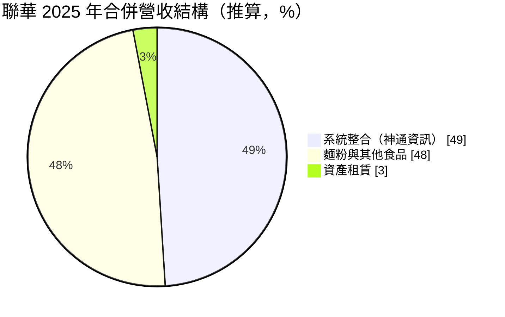
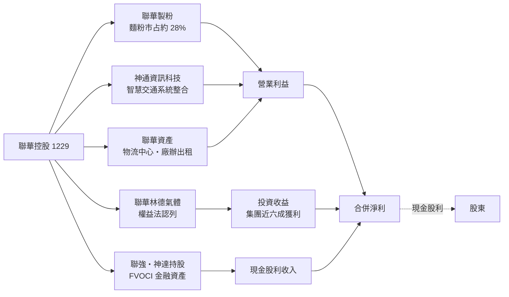
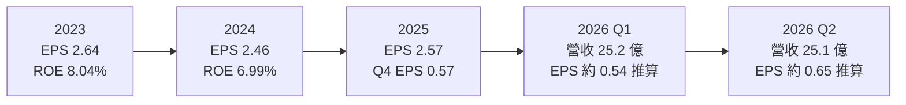
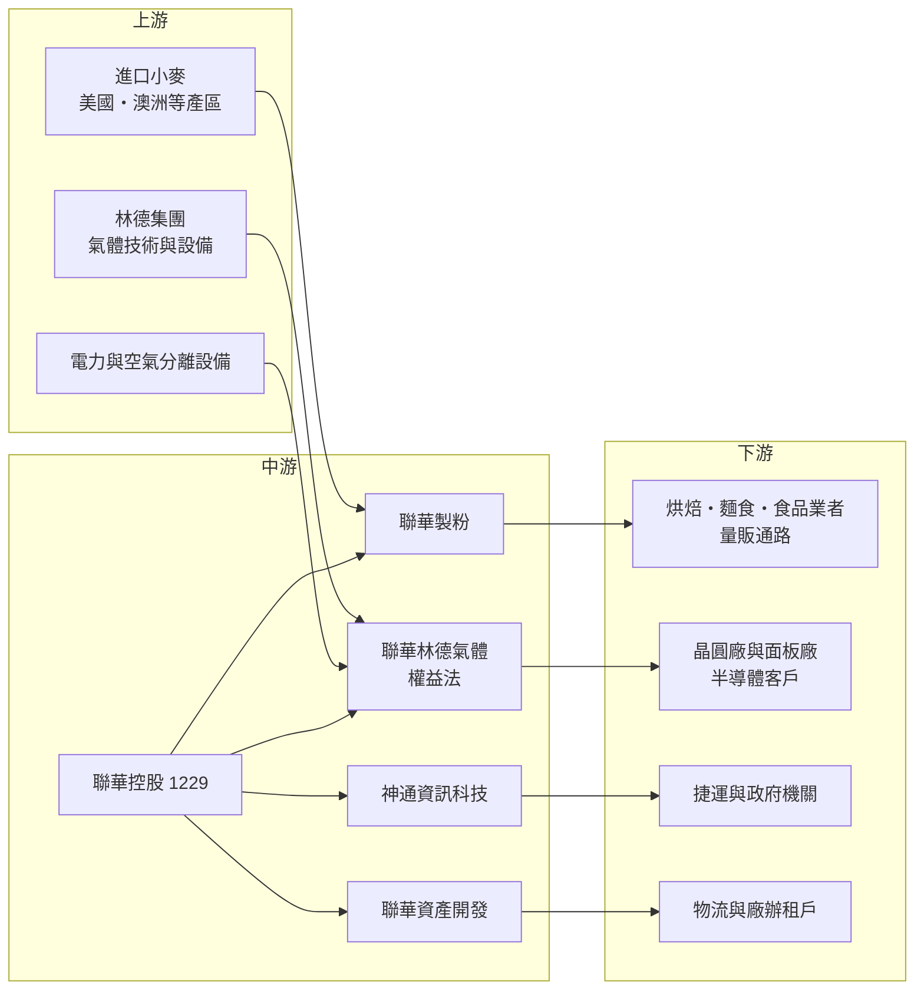

# 1229 聯華

> 上市｜[[產業索引-食品工業|食品工業]]｜上市（櫃）日期 1976/07/19

# 第一章：企業模式與商業藍圖

> [!info] 撰寫說明
> 本文由 Claude 依公開資料整理，架構比照 [[2330台積電]] 的四章研究，資料截至 2026-10-08。財務數字來源：證交所開放資料快照（基本資料、2026 年第二季綜合損益與資產負債、股利、本益比）、Goodinfo 經營績效與股利政策頁、MoneyDJ 年度財務比率、富果研究 2026 年 3 月、6 月、9 月法說會備忘錄、股感（StockFeel）公司介紹、科技新報麵粉產業報導；產業描述為整理性內容，尚未逐條比對原始文件。#待校對

在評估單一個股的長期投資價值時，首要步驟是拆解企業的底層獲利邏輯。本章針對聯華實業投資控股（股票代號：1229，以下簡稱聯華）的商業模式進行定性分析。聯華雖然被歸類在食品工業，營收中也有一大塊來自麵粉，但真正決定它價值的，是它手上那些「不在營收裡」的轉投資，尤其是與德國林德集團合資的工業氣體公司。理解這一點，才能正確解讀它的財報。

## 一、核心定位：以麵粉起家、以轉投資獲利的控股公司

聯華成立於 1955 年，1976 年在台灣證券交易所上市，是聯華神通集團的核心公司，現任董事長為苗豐強（證交所基本資料）。公司從麵粉廠起家，旗下聯華製粉長年是台灣最大的麵粉廠，依 2026 年法說會資料市占約 27% 至 28%。需要注意的是，聯華與同集團的聯華食品（[[1231聯華食]]）是不同的上市公司，名稱相近但業務不同。

2019 年聯華宣布轉型為[[控股公司]]，同年更名為聯華實業投資控股，並把台灣的麵粉與租賃業務分割成百分之百持股的子公司（股感資料）。轉型的原因很直接：早在轉型之前，公司的稅前利益就有大約七成來自轉投資，控股架構只是讓公司形式與實際獲利來源一致。

聯華的獲利結構可以分成三層來理解：

* **第一層：本業營收。** 麵粉、系統整合（神通資訊科技）與資產租賃，構成合併報表上的營業收入。這一層營收規模約一百多億元，但營業利益率不高。
* **第二層：[[權益法]]投資收益。** 最重要的是與林德集團合資的聯華林德氣體，它不併入營收，而是以持股比例認列投資收益，列在營業外收入。依法說會資料，2026 年第一季權益法投資收益約占合併淨利的 68%，聯華林德是集團最主要的獲利來源。
* **第三層：金融資產股息。** 聯華持有聯強（[[2347聯強]]，綜合持股約 19%）與神達（[[3706神達]]，綜合持股約 17%）等股票，帳列[[FVOCI]] 金融資產，約占總資產 52%。這些持股的股價變動只進入其他綜合損益，不影響每股盈餘，但每年收到的現金股利會計入損益，公司預估 2026 年股息收入約 20 億元。

## 二、終端應用與產品板塊

依富果整理的法說會資料，2025 年合併營收約 135.8 億元，其中神通資訊營收約 66.6 億元，約占 49%；資產租賃營收 3.87 億元，約占 3%；其餘約 48% 主要是麵粉與麩皮，加上少量零售餐飲與中國煙台的麵粉廠（推算）。下圖依此推算，只代表大致結構。

* **麵粉：** 聯華製粉以進口小麥製成各式麵粉，供應麵包、麵條、水餃與烘焙業者，也在量販與美式賣場銷售家用包裝麵粉。2025 年銷售約 1,130 萬包。台灣麵粉市場總量微幅萎縮，公司正把產品轉向高蛋白、高纖與與台灣大學合作開發的高直鏈澱粉小麥等健康訴求產品。
* **系統整合（神通資訊科技）：** 以智慧交通為主力，承接捷運與交通號誌系統、政府與企業的資訊系統及數位轉型專案。2025 年營收 66.6 億元創新高，在手訂單約 141 億元，並與夥伴共同承攬新北環狀線（汐東段）統包工程。專案以[[完工百分比法]]認列，營收與獲利會分散在多年。
* **資產租賃：** 聯華資產開發把閒置土地與廠房轉為收租資產，據點包括台北、桃園、雲林、嘉義、上海與煙台。富岡物流中心（約 2.36 萬坪）2026 年第二季起出租，預估年租金約 1.2 億元；七堵廠辦（約 1,930 坪）預計 2026 年下半年出租。
* **工業氣體（聯華林德，權益法認列）：** 生產與供應氧、氮、氬、氫等[[大宗氣體]]與電子級[[特殊氣體]]，大宗氣體占其營收七成以上，半導體是最主要需求來源。依法說會，聯華林德年營收約 400 億元，淨利由 2020 年約 40 億元成長到 2025 年約 75 億元，年複合成長率約 18%。
* **新能源：** 豐耀能源（法說會備忘錄亦記為風耀能源，待校對）整合集團屋頂與地面型太陽能案場對外售[[綠電]]；亞氫動力在台泥八翁的[[沼氣發電]]一期已穩定運轉，二期預計 2026 年第四季完工，並研究氨裂解製氫。這一塊目前規模很小，屬於長期選項。

## 三、資本轉化邏輯（營運模式）：本業養現金、轉投資創造價值

聯華的營運模式有三個特點：

* **本業負責穩定現金流：** 麵粉是民生必需品，需求穩定；租賃收入合約期長、波動小。這兩項業務的成長性不高，但能提供可預期的現金，支撐集團的配息與新事業投資。
* **轉投資負責成長：** 聯華林德的成長跟著台灣半導體擴產走。晶圓廠建廠時通常會與氣體公司簽訂長期的[[現場供氣]]合約，在廠區旁設置製氣設備，供應期長達十年以上，這讓聯華林德的獲利具有類似公用事業的穩定性，又能分享半導體產業的成長。
* **資產活化：** 把老舊廠房與閒置土地改建為物流中心與廠辦出租，是聯華近年的重要策略。這類投資的報酬率不高，但風險低、現金流長，符合控股公司追求穩定收益的性格。

## 四、企業長期藍圖：半導體氣體加上資產活化

聯華的長期藍圖可以概括為「兩個穩定核心，加上三個多角化方向」。兩個穩定核心是麵粉與工業氣體；三個方向是資訊系統、資產租賃與新能源。

* **跟隨半導體擴產：** 聯華林德 2026 年在台資本支出超過 100 億元，並規劃在中部與南部科學園區投資約 113 億元，配合晶圓代工客戶的先進製程與先進封裝擴廠。這是聯華未來五到十年最主要的成長動能，但新投資大多要到 2027 年至 2028 年後才開始貢獻獲利。
* **麵粉升級：** 從精緻白麵粉轉向健康機能麵粉，目的是在總量萎縮的市場中提高單價與品牌價值，目前仍在少量試銷階段。
* **神通轉型 AI 應用：** 神通以智慧交通為基礎，往代理式 AI（Agentic AI）應用、國防科技與數位轉型延伸，並採取挑選高獲利專案的策略。
* **配息傳統：** 依法說會，聯華已連續 43 年配發股利，近五年平均配息率約 77%，公司表示獲利至少五成用於發放股利。

# 第二章：護城河深度與競爭優勢

在長期價值投資中，「護城河」指企業抵禦競爭、維持超額利潤的保護機制。控股公司的護城河要分開看：每一個被投資事業有自己的競爭優勢，而控股公司本身的優勢則在於資產組合與資本配置。本章分別分析聯華各主要事業的護城河與競爭格局。

## 一、聯華護城河的核心組成要素

* **1. 工業氣體的寡占結構與長約：** 工業氣體是全球典型的寡占產業，需要大量資本建置空分廠、管線與運輸車隊，運輸半徑也有限，因此一個地區通常只有少數幾家業者。聯華林德結合林德集團的全球技術與聯華的在地關係，在台灣工業氣體市場的市占超過四成（2026 年法說會）。半導體客戶一旦在廠區旁設置現場供氣設備並簽下長約，更換供應商的成本極高，這是聯華最深的一條護城河。
* **2. 麵粉的規模與通路：** 麵粉業屬於「大者恆大」的產業，小麥採購、碼頭倉儲與製粉產能都需要資本。聯華製粉長年排名台灣第一，規模帶來採購與生產成本優勢，加上長期配合的烘焙、麵食與食品業客戶，以及量販通路的家用包裝品牌，形成穩定的市占。但麵粉本身同質性高，這條護城河主要是成本優勢，而不是定價能力。
* **3. 系統整合的工程實績：** 捷運、交通號誌這類公共工程投標時非常看重過去實績與專案管理能力，神通長期承接台灣智慧交通專案，累積的實績本身就是門檻。但這類業務毛利有限、專案風險高，護城河較窄。
* **4. 資產負債表：** 聯華負債比率長期在 18% 至 24% 之間（MoneyDJ），利息保障倍數超過 20 倍，手上又有大量可變現的上市股票。穩健的財務讓它在景氣低迷時仍能持續投資與配息。

## 二、全球主要競爭對手格局

| 事業 | 主要對手 | 競爭重點 |
|---|---|---|
| 工業氣體 | 亞東工業氣體（與 Air Products 合資）、三福氣體、台灣大陽（日本酸素集團）、液化空氣（Air Liquide）（待校對） | 半導體客戶的長期供氣合約、廠區鄰近性與氣體純度 |
| 麵粉 | 台灣大食品（福懋油脂旗下，排名第二）、豐盟麵粉（排名第三）、統一麵粉 | 小麥採購成本、客製化配方與通路關係 |
| 系統整合 | 中華電信、[[2471資通]]、大同世界科技等（待校對） | 公共工程標案實績、專案利潤率 |
| 資產租賃 | 各地物流地產開發商 | 地段、租約期間與租金水準 |

## 三、優勢轉化：哪些市場守得住、哪些守不住

* **守得住：** 半導體工業氣體。只要台灣仍是全球晶圓製造中心，晶圓廠擴產就需要大量氮氣、氧氣、氫氣與特殊氣體，現場供氣長約讓聯華林德能夠分享這個成長。台灣麵粉的市占地位也相對穩固，主要是因為規模經濟與產業集中。
* **守不住：** 麵粉的單價與總量。台灣麵粉需求隨人口與飲食習慣緩慢萎縮，小麥成本又以美元計價，轉嫁需要時間，聯華難以靠麵粉本業創造高成長。系統整合則是競爭激烈的專案型業務，獲利會隨標案與成本控制波動。
* **觀察重點：** 第一，聯華林德在中南部科學園區的新投資能否如期投產並轉為獲利。第二，神通資訊在手訂單能否在完工百分比法下穩定轉為利潤。第三，聯強、神達等金融資產的股利能否維持，因為這部分直接影響聯華的每股盈餘與配息能力。

# 第三章：財務體質與盈利規模

資料日期：2026-10-08。數字取自證交所開放資料快照、Goodinfo 經營績效頁、MoneyDJ 年度財務比率與富果法說會備忘錄，表格是撰寫當時的快照；最新月營收、毛利率、累計 EPS 由自動排程寫在本筆記的屬性欄位（月營收、毛利率、累計EPS 等）。#待校對

財務報表是檢驗護城河是否真實存在的最終標準。分析聯華時要特別注意，合併營收與營業利益只反映麵粉、系統整合與租賃，真正的大部分獲利來自營業外的權益法投資收益與股利。本章用多年度的三率、[[ROE]]、現金流與資本報酬，檢視這個控股架構的獲利品質。

## 一、獲利能力的基石：三率

| 年度 | 營收（新台幣） | [[毛利率]] | [[營業利益率]] | EPS（元） | [[ROE]] |
|---|---|---|---|---|---|
| 2020 | 95.4 億 | 21.3% | 11.0% | 2.43 | 8.53% |
| 2021 | 113 億 | 22.3% | 12.8% | 2.92 | 9.41% |
| 2022 | 123 億 | 21.8% | 12.6% | 2.63 | 8.81% |
| 2023 | 136 億 | 18.3% | 8.56% | 2.64 | 8.04% |
| 2024 | 129 億 | 20.8% | 10.3% | 2.46 | 6.99% |
| 2025 | 136 億 | 25.1% | 15.1% | 2.57 | 7.32% |
| 2026 上半年 | 50.3 億 | 21.32% | 7.77% | 1.19 | 未查得 |

資料來源：2020 至 2025 年為 Goodinfo 經營績效頁（合併報表），ROE 與 MoneyDJ 年度財務比率一致；2026 上半年為證交所營益分析與綜合損益快照。歷年 EPS 未經股票股利追溯調整。

* **稅後純益率遠高於營業利益率：** 2026 年上半年營業利益只有 3.91 億元，但營業外收入達 21.10 億元，稅前淨利 25.01 億元，稅後純益率高達 44.7%（證交所快照）。這說明聯華的每股盈餘主要由聯華林德的投資收益與金融資產股利決定，本業營業利益只占一小部分。
* **EPS 穩定但成長緩慢：** 2020 年至 2025 年 EPS 大致在 2.4 元至 2.9 元之間，波動很小，反映工業氣體與股利收入的穩定性。但每年發放股票股利使股本持續增加，稀釋了每股盈餘的成長。
* **營收成長來自神通：** 營收從 2020 年的 95.4 億元成長到 2025 年的 136 億元，五年年複合成長率約 7.3%（推算），主要動力是神通資訊的系統整合專案，而不是麵粉。

## 二、[[ROE]]：資本效率

聯華 2021 年至 2025 年的平均 ROE 約 8.1%（推算，五年簡單平均），2024 年後落在 7% 左右，明顯低於一般製造業。原因不是獲利能力差，而是分母很大：聯華持有的聯強、神達等股票以公允價值入帳，股價上漲時股東權益跟著膨脹，但這些股票每年只貢獻股息，不貢獻全部盈餘。依 2026 年第二季快照，聯華的權益合計約 889.9 億元，其中「其他權益」約 271.8 億元，主要就是這類未實現的評價利益。若扣除這部分，以實際投入的資本計算，ROE 會高出不少（推估）。

財務結構方面，MoneyDJ 資料顯示聯華負債比率在 2025 年為 18.5%，借款依存度 14.1%，利息保障倍數 27 倍，屬於非常保守的資本結構。

## 三、資本支出與自由現金流

* **[[CapEx]]：** 聯華本身的資本支出主要在租賃資產開發（富岡物流中心、七堵廠辦）與太陽能案場，年度總額未查得。真正大額的資本支出發生在權益法認列的聯華林德，2026 年在台資本支出超過 100 億元，由聯華林德自行籌資，不出現在聯華的合併現金流量表。
* **[[自由現金流]]：** MoneyDJ 的每股現金流量在 2020 年至 2025 年依序為 1.84、1.37、2.47、2.24、2.40、3.48 元，持續為正；現金流量允當比率在 2025 年為 144%，代表近五年營業現金流足以支應資本支出、存貨增加與現金股利，自由現金流長期為正（推估）。轉投資發放的現金股利是營業現金流的重要來源。
* **股利政策：** 依 Goodinfo，現金股利依所屬年度為 2020 年 1.7 元、2021 年 1.8 元、2022 年至 2024 年各 1.3 元、2025 年 1.801 元；同時每年配發 0.2 元至 1.6 元不等的股票股利。2025 年度現金股利經董事會決議為每股 1.8 元、股票股利 0.2 元，配發現金總額約 32.3 億元（證交所股利資料）。依法說會，近五年平均配息率約 77%，連續 43 年配發股利。

## 四、[[ROIC]] 與 [[WACC]]：價值創造利差

**ROIC 推算：** 控股公司的 ROIC 有兩種算法。第一種只看本業：2025 年營業利益約為 136 億元乘以 15.1%，約 20.5 億元，稅後約 16.4 億元；投入資本以 2026 年第二季權益合計 889.9 億元加上有息負債約 126 億元（以 MoneyDJ 2025 年借款依存度 14.14% 乘以權益推算），合計約 1,016 億元，本業 ROIC 只有約 1.6%（推算）。這個數字偏低，是因為分母包含大量不產生營業利益的轉投資與金融資產。第二種把投資收益也算進來：MoneyDJ 的稅後息前資產報酬率（ROA）2025 年為 6.11%，可以當作廣義 ROIC 的近似值；若以 2025 年稅後淨利約 46 億元，除以扣除其他權益後的投入資本約 744 億元，約為 6.2%（推算）。

**WACC 推算：** 股東權益成本用 CAPM 估計，台灣 10 年期公債殖利率取 1.75%，市場風險溢酬 6%，β 取控股與食品業常見的 0.5 至 0.8（未查得聯華本身的 β），股東權益成本約 4.8% 至 6.6%。負債成本採 MoneyDJ 2025 年有息負債利率 1.74%，稅後約 1.4%。資本結構以市值約 717 億元（股價淨值比 1.12 倍乘每股淨值 35.13 元，再乘扣除庫藏股後約 18.25 億股）與有息負債約 126 億元計算，權益占 85%、負債占 15%。WACC 約為 4.3% 至 5.8%（推算）。

**解讀：** 以廣義 ROIC 約 6% 對比 WACC 約 4.3% 至 5.8%，聯華大致能賺回資金成本，但利差很薄，約 0 至 2 個百分點（推算）。本業 ROIC 則明顯低於 WACC。這說明聯華的價值主要來自轉投資組合（特別是聯華林德）的品質，而不是麵粉或系統整合本業。投資人評估聯華時，比較適合用「各事業價值加總」的方式，並考慮控股公司常見的[[控股折價]]。

# 第四章：總體風險與地緣政治

任何企業都無法脫離宏觀環境獨立存在。本章分析聯華未來必須面對的地緣政治、產業週期、營運與法規風險。由於聯華的獲利高度依賴工業氣體與金融資產，它的風險輪廓其實更接近半導體供應鏈與控股公司，而不是傳統食品股。

## 一、地緣政治風險

* **台灣半導體集中風險：** 聯華林德的成長幾乎完全繫於台灣半導體產業。若兩岸局勢緊張影響晶圓廠營運，或客戶把更多產能移往美國、日本等地，聯華林德在台灣的擴產需求就可能放緩。
* **中國業務：** 聯華林德約三成營收、四成獲利來自中國，聯華本身在上海、煙台也有租賃與麵粉據點。美中科技管制若升級，中國半導體客戶的擴產與氣體需求可能受影響。
* **小麥進口：** 台灣小麥幾乎全部仰賴進口，以美元計價。主要產地的出口政策、天候與航運，都會影響麵粉成本。

## 二、產業週期與市場結構風險

* **半導體資本支出週期：** 工業氣體的長約提供穩定性，但新建專案的時程跟著晶圓廠的資本支出走。半導體景氣下行時，新廠延後會遞延聯華林德的成長。
* **麵粉市場萎縮：** 台灣人口減少與飲食習慣改變，麵粉總量呈微幅萎縮，產業又屬於同質化競爭，單價提升空間有限。
* **金融資產價格：** 聯強、神達的股價與股利政策直接影響聯華的股東權益與股利收入，這兩家公司的景氣週期（通路與伺服器代工）因此會間接傳導到聯華。

## 三、營運環境的隱性風險

* **專案執行風險：** 神通資訊承接的捷運與統包工程規模大、期間長，若成本超支或工期延誤，以完工百分比法認列的利潤可能需要回沖，影響數年的獲利。
* **匯率與原料轉嫁：** 新台幣貶值會推升小麥成本，麵粉售價調整通常落後成本，造成短期毛利壓力。
* **控股結構的透明度：** 主要獲利來源聯華林德並未上市，外部投資人只能透過聯華的法說會與財報附註了解其營運，資訊揭露有限，評價上容易出現折價。

## 四、科技或法規演進

* **半導體製程演進對氣體的需求：** 先進製程與先進封裝需要更高純度、更多種類的特殊氣體，這對聯華林德是機會，但也代表必須持續投資純化與分析技術，否則可能被國際對手取得技術優勢。
* **能源轉型：** 空氣分離是高耗電製程，電價上漲與減碳法規會提高工業氣體的生產成本；另一方面，氫能與綠電是聯華布局的新事業，政策支持力度將決定這些投資能否成為新的獲利來源。
* **食品法規與健康趨勢：** 減醣、高纖等健康飲食趨勢可能降低精緻麵粉需求，也可能為機能性麵粉創造新市場，結果取決於聯華產品升級的速度。

# 專有名詞解析

## 金融

- **[[控股公司]]**：主要業務是持有其他公司股權並管理投資組合的公司，獲利多來自子公司與轉投資的收益與股利。
- **[[權益法]]**：持有被投資公司約 20% 至 50% 股權、具重大影響力時，依持股比例認列其損益的會計方法，收益列在營業外。
- **[[FVOCI]]**：透過其他綜合損益按公允價值衡量的金融資產，股價變動計入其他綜合損益而不影響 EPS，只有股利計入損益。
- **[[控股折價]]**：市場對控股公司的市值常低於其持有資產價值加總，原因包括資訊不透明、稅負與資本配置的不確定性。
- **[[完工百分比法]]**：長期工程依完工進度分期認列營收與利潤的會計方法，獲利會分散在專案期間的多個年度。
- **[[毛利率]]**：營業毛利除以營業收入，反映產品扣除直接成本後的獲利空間。
- **[[ROE]]**：股東權益報酬率，稅後淨利除以股東權益，衡量公司運用股東資金賺錢的效率。
- **[[ROIC]]**：投入資本報酬率，稅後營業利益除以股東權益加有息負債，衡量本業運用所有資金的效率。
- **[[WACC]]**：加權平均資金成本，股東與債權人要求報酬率依資本結構加權，是 ROIC 要超越的門檻。
- **[[自由現金流]]**：營業活動現金流減去資本支出，代表企業可自由用於配息、還債或併購的現金。

## 產業

- **[[大宗物資]]**：玉米、黃豆、小麥等交易量大、規格標準化、價格由國際市場決定的原物料，業者難以靠產品差異定價。
- **[[大宗氣體]]**：氧、氮、氬、氫等用量大的工業氣體，半導體廠以管線大量供應，是工業氣體公司的主要營收來源。
- **[[特殊氣體]]**：半導體蝕刻、沉積、摻雜等製程使用的高純度或特殊化學氣體，純度要求極高，附加價值高於大宗氣體。
- **[[現場供氣]]**：氣體公司在客戶廠區旁設置製氣設備，以管線直接供氣並簽訂十年以上長約，轉換成本極高。
- **[[綠電]]**：以太陽能、風力等再生能源產生的電力，企業可透過購電協議取得以達成減碳目標。
- **[[沼氣發電]]**：利用畜牧糞尿或有機廢棄物厭氧發酵產生的沼氣發電，兼具廢棄物處理與再生能源效益。

# 核心供應鏈

## 1. 上游：原料與技術夥伴
- 小麥：自美國、澳洲等產區進口（待校對）
- 工業氣體技術與合資夥伴：林德集團（Linde）
- 空氣分離設備與電力：台灣電力公司供電，設備多由林德集團提供（待校對）

## 2. 中游：聯華與主要子公司、轉投資
- 麵粉：聯華製粉
- 工業氣體：聯華林德氣體（與林德集團合資，聯華持股約五成，待校對）
- 系統整合：神通資訊科技
- 資產租賃：聯華資產開發
- 新能源：豐耀能源、亞氫動力
- 石化轉投資：[[1313聯成]]
- 金融資產持股：[[2347聯強]]、[[3706神達]]

## 3. 下游：主要客戶
- 麵粉：烘焙、麵條、水餃等食品業者與量販通路
- 工業氣體：晶圓代工與記憶體廠，例如 [[2330台積電]]（待校對）
- 系統整合：台北、新北等地捷運與政府機關

## 4. 同業
- 工業氣體：亞東工業氣體、[[4755三福化]]、台灣大陽、液化空氣（待校對）
- 麵粉：台灣大食品（[[1225福懋油]] 旗下）、豐盟麵粉、統一麵粉
- 同集團但不同公司：[[1231聯華食]]

延伸閱讀：[[台積電供應鏈]]

## 最新新聞
<!-- news:start（自動產生，請勿手動編輯此範圍） -->
- 2026-10-08 🏛️ 重訊 16:08｜代重要子公司聯華置產(股)公司公告董事會決議簽訂 土地租賃契約｜[觀測站](https://mops.twse.com.tw/mops/#/web/t05st01)

完整紀錄：[[1229聯華 新聞]]
<!-- news:end -->

## 相關連結
- [公開資訊觀測站](https://mopsov.twse.com.tw/mops/web/t05st03?step=1&firstin=1&co_id=1229)
- [Goodinfo](https://goodinfo.tw/tw/StockDetail.asp?STOCK_ID=1229)
- [Yahoo 股市](https://tw.stock.yahoo.com/quote/1229)
- [鉅亨網新聞](https://www.cnyes.com/twstock/1229/news)
