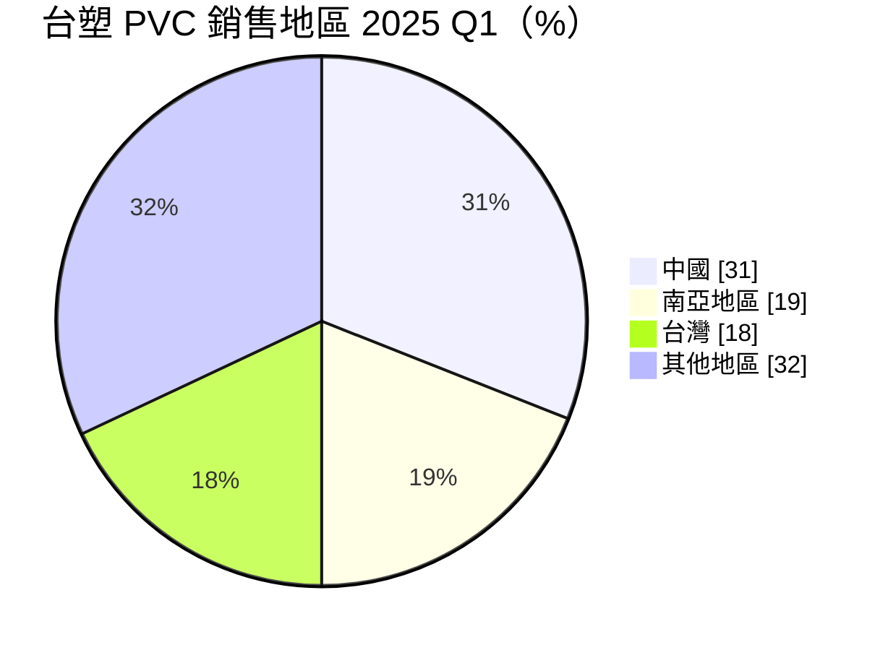
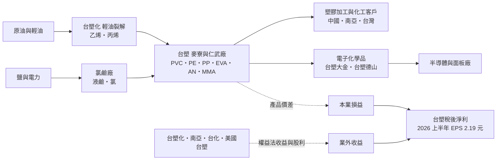
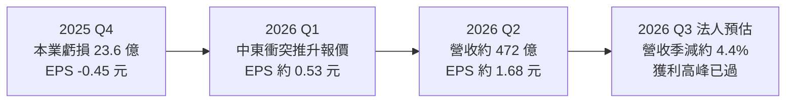
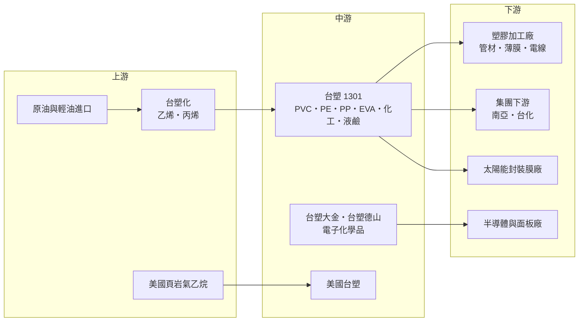

# 1301 台塑

> 上市｜[[產業索引-塑膠工業|塑膠工業]]｜上市（櫃）日期 1964/07/27

# 第一章：企業模式與商業藍圖

> [!info] 撰寫說明
> 本文由 Claude 依公開資料整理，架構比照 [[2330台積電]] 的四章研究，資料截至 2026-10-07。財務數字來源：經濟日報（2025 年度財報與配息、2026 年上半年台塑四寶業績）、工商時報（2025 年第四季業績、2026 年第二季法人報告）、優分析（2025 年全年業績、2026 年第二季業績解析）、科技新報（2026 年股東會、台塑集團轉型報導）、旺得富理財網（2026 年第二季業績）、自由時報（2026 年上半年四寶業績）、富果研究（2025 年 6 月法說會整理）；產業描述為整理性內容，尚未逐條比對原始文件。#待校對

在評估單一個股的長期投資價值時，首要步驟是拆解企業的底層獲利邏輯。本章針對台灣塑膠工業（股票代號：1301，以下簡稱台塑）的商業模式進行定性分析，說明這家台塑集團的創始公司如何以 PVC、烯烴與化工產品為核心，在中國產能過剩的逆風中連續兩年虧損，又在 2026 年中東衝突推升報價時大幅轉盈，以及它為何積極轉向電子化學品。

## 一、核心定位：台塑集團的源頭與石化控股平台

台塑成立於 1954 年，是王永慶創立台塑集團的第一家公司，最早生產 [[PVC]] 塑膠粉。今天的台塑同時具備兩種身分：

* **石化原料製造商：** 在台灣麥寮、仁武等地生產 PVC、聚乙烯（PE）、聚丙烯（PP）、[[EVA]]、丙烯酸酯、丙烯腈（AN）、MMA、[[碳纖維]]與[[液鹼]]等產品，主要原料乙烯、丙烯來自集團內的 [[6505台塑化]]。
* **轉投資控股平台：** 台塑持有台塑化、[[1303南亞]]、[[1326台化]]與美國台塑等公司股權，[[權益法]]投資收益與股利是獲利的重要部分。2025 年美國子公司股份轉換後，台塑對美國事業的持股比重由 22.66% 提升至 24.82%。

2025 年合併營收約 1,754 億元、年減 12%，歸屬母公司淨損 100.48 億元，EPS 負 1.58 元，是台塑四寶中表現最差的一家，也是連續第二年虧損。2026 年上半年則大幅轉盈，EPS 2.19 元，其中第二季 EPS 1.68 元、單季稅後淨利約 106.52 億元。

## 二、終端應用板塊：通用塑膠為主、外銷中國比重高

台塑未公布各事業部營收比重。以 2025 年第一季法說會揭露的 PVC 銷售地區為例，外銷比重明顯：

主要產品與 2025 年第一季營運狀況如下：

* **PVC：** 營建管材、電線被覆、地板等用途。2025 年第一季營收季減 15.5%，仁武廠[[歲修]]，處於虧損。
* **聚烯烴（PE、PP、EVA）：** HDPE 開工率僅 35.5%、LLDPE 50%，供過於求；EVA 受中國太陽能封裝膜需求帶動，開工率超過 100% 並轉為獲利；PP 約七成銷往中國。
* **化工（丙烯酸酯、AN、MMA）：** AN 供應緊縮、開工率超過 100%，MMA 利益率 12.6%，是相對穩定的獲利來源。
* **碳纖維：** 開工率 58.6%，面臨激烈競爭而虧損。
* **液鹼（燒鹼）：** 價量齊揚，利益率 18%，是 2025 年第一季獲利最佳的產品。
* **電子化學品：** 與日商合資的台塑大金生產電子級氫氟酸，國內半導體用市占率超過 55%；台塑德山生產電子級異丙醇（IPA），是轉型重點。

## 三、資本轉化邏輯：原料價差與轉投資的雙重收益

* **[[價差]]決定本業：** 台塑的本業獲利取決於產品售價與乙烯、丙烯等原料成本之間的價差。2026 年第二季布蘭特原油季漲 23.3%、乙烯季漲 36.8%、丙烯季漲 37.8%，台塑利用先前的低價庫存，銷售價差貢獻約 127.5 億元。
* **轉投資放大波動：** 台塑化、南亞、台化與美國台塑都是景氣循環股，景氣好時權益法收益同步放大，景氣差時同步縮小。法人報告指美國廠 2026 年第二季每月獲利約 1.5 億美元，第三季預估降至約 5,000 萬美元。
* **處分持股支撐配息：** 2025 年台塑規劃處分 [[2408南亞科]] 61,972 張，以當時股價估算約 144.39 億元，用以增加未分配盈餘、支撐虧損年度的配息。

## 四、企業長期藍圖：從通用塑膠轉向電子材料

* **轉型專案：** 台塑規劃超過 50 項轉型專案、總投資約 292 億元，目標每年增加產值 300 億元，2030 年新事業獲利貢獻達 20% 至 30%。台塑集團整體則有 113 項轉型專案，目標 2030 年前創造 386 億元年效益。
* **電子化學品：** 以台塑大金的電子級氫氟酸、台塑德山的電子級 IPA 切入半導體供應鏈，受惠於台灣先進製程擴產。
* **擴產與去瓶頸：** 美國德州新建年產 10 萬噸 [[1-Hexene]] 產能（原規劃 2025 年第四季完成）、仁武擴充年產 1,600 噸碳纖維（原規劃 2026 年第一季完成），PVC 去瓶頸工程在 2027 至 2029 年分階段完成。

# 第二章：護城河深度與競爭優勢

在長期價值投資中，「護城河」指企業抵禦競爭、維持超額利潤的保護機制。本章分析台塑的護城河構成、全球主要競爭對手，以及這些優勢在中國產能過剩的環境下能守住多少。

## 一、台塑護城河的核心組成要素

台塑的護城河屬於「窄護城河」，通用塑膠本身同質性高，優勢主要來自集團整合，由三個要素組成：

* **1. 麥寮一貫化園區：** 從台塑化的輕油裂解到台塑、南亞、台化的下游產品，原料以管線直接輸送，降低運輸與倉儲成本，這是單一石化廠難以複製的[[垂直整合]]優勢。
* **2. 台美雙基地：** 美國德州廠以頁岩氣乙烷為原料，成本結構與亞洲以輕油為原料的廠商不同，在油價上漲時具成本優勢。
* **3. 利基與電子化學品：** EVA、AN、MMA 與電子級氫氟酸等產品，技術門檻與客戶認證高於通用塑膠，是台塑在景氣低迷時仍能獲利的部分。

## 二、全球主要競爭對手格局

| 對手 | 定位 | 對台塑的威脅 |
|---|---|---|
| 中國石化與民營煉化廠 | 大規模新建 PE、PP、PVC 產能 | 以低價出口壓低亞洲報價，是台塑虧損主因 |
| [[4063信越化學]] | 全球最大 PVC 廠之一，美國有大型產能 | 在 PVC 國際市場直接競爭 |
| 美國石化廠（如 OxyChem、Westlake） | 以頁岩氣為原料的低成本產能 | 在 PVC、PE 與液鹼出口市場競爭 |
| [[1304台聚]]、[[1308亞聚]]、[[1309台達化]]、[[1305華夏]] | 台灣石化同業 | 在 PE、EVA、PVC 等產品國內外競爭 |
| 日本東麗 | 全球碳纖維龍頭 | 在碳纖維技術與規模上領先 |

## 三、優勢轉化：哪些守得住、哪些守不住

* **守得住：** 液鹼、AN、MMA、EVA 等供需較緊或技術門檻較高的產品，以及電子級化學品。台塑大金在國內半導體用電子級氫氟酸市占率超過 55%。
* **守不住：** PVC、PE、PP 等通用塑膠。中國大規模新增產能使亞洲供過於求，2025 年 HDPE 開工率僅 35.5%，台塑連續兩年虧損就是這個結構問題的結果。
* **觀察重點：** 2026 年第二季的轉盈主要來自中東衝突造成的供給中斷與低價庫存，而非結構改善。法人認為第二季是全年獲利高峰，下半年中國新增產能將再壓抑報價。電子化學品能否在 2030 年前貢獻有意義的獲利，是台塑能否走出景氣循環的關鍵。

# 第三章：財務體質與盈利規模

資料日期：2026-10-07。數字取自公司公告、股東會與財經媒體報導，表格是撰寫當時的快照；最新月營收、毛利率、累計 EPS 由自動排程寫在本筆記的屬性欄位（月營收、毛利率、累計EPS 等）。#待校對

財務報表是檢驗護城河是否真實存在的最終標準。本章用三率、ROE、現金流與資本報酬，檢視台塑在石化景氣循環中的獲利品質。

## 一、獲利能力的基石：三率

| 項目 | 2025 全年 | 2025 Q4 | 2026 Q1 | 2026 Q2 |
|---|---|---|---|---|
| 營收（新台幣） | 約 1,754 億 | 未查得 | 約 420 億（推算） | 約 472 億 |
| [[毛利率]] | 未查得 | 未查得 | 未查得 | 未查得 |
| 營業損益 | 未查得 | 虧損 23.6 億 | 未查得 | 未查得 |
| 稅後淨利 | 虧損 100.48 億 | 虧損 28.7 億 | 約 32.7 億（推算） | 106.52 億 |
| EPS（元） | -1.58 | -0.45 | 0.51 至 0.53 | 1.67 至 1.68 |

* **[[毛利率]]：** 台塑未在本次查得的報導中揭露各季毛利率。法人預估第三季毛利率將降至約 3.12%，顯示通用塑膠的價差在報價回落後會迅速收斂。
* **[[營業利益率]]：** 2025 年第四季本業虧損 23.6 億元，代表在供過於求時，本業連固定成本都難以涵蓋。
* **[[淨利率]]與業外：** 2026 年第二季稅後淨利 106.52 億元遠高於本業規模，主要來自台塑化、美國台塑等轉投資的權益法收益（推估）。評估台塑時，應分開看本業與轉投資。
* **EPS 口徑：** 第一季有 0.53 元（股東會報導）與依上半年 2.19 元減第二季 1.68 元推得的 0.51 元；第二季有 1.67 元與 1.68 元兩種報導口徑。

## 二、[[ROE]]：資本效率

台塑 2024、2025 年連續虧損，ROE 為負值；2026 年上半年 EPS 2.19 元，ROE 轉正（具體數值未查得）。台塑淨值中有大量集團轉投資股權，景氣好時權益法收益使 ROE 快速回升，景氣差時則同步下滑，ROE 的波動遠大於一般製造業。

## 三、資本支出與自由現金流

* **[[CapEx]]：** 主要投入美國德州 1-Hexene 新產能、仁武碳纖維擴產、PVC 去瓶頸，以及約 292 億元的轉型專案。
* **[[自由現金流]]與配息：** 2025 年虧損下仍維持每股現金股利 0.5 元，以收盤價 50.2 元計算殖利率約 1%，配息來源部分仰賴處分南亞科持股。法人報告提到第三季預期收到約 10 億元的現金股利與約 6 億元的股份轉換效益，屬業外現金流入。

## 四、[[ROIC]] 與 [[WACC]]：價值創造利差

2024 至 2025 年本業虧損，ROIC 明顯低於 WACC，屬於價值毀損期。2026 年第二季的獲利改善來自報價急漲與低價庫存的一次性利益，法人已將 2026 年全年 EPS 預估由 4.9 元下修至 3.19 元，目標價 69 元、評等中立。只有當電子化學品與利基產品比重提高、通用塑膠虧損縮小，ROIC 才有機會持續高於 WACC（推估）。

# 第四章：總體風險與地緣政治

任何企業都無法脫離宏觀環境獨立存在。本章分析台塑未來必須面對的地緣政治、產業週期與營運風險。

## 一、地緣政治風險

* **中東衝突與原油供給：** 2026 年美伊衝突與荷莫茲海峽情勢推升油價與烯烴報價，短期對台塑有利；但若供給恢復，報價可能急速回落，庫存利益轉為庫存損失。
* **中國市場依賴：** PVC 約三成、PP 約七成銷往中國，中國需求疲弱或貿易政策改變，會直接影響台塑出貨。
* **美國關稅：** 2025 年美國關稅政策壓抑石化需求，台塑的美國事業也面臨貿易政策不確定性。

## 二、產業週期與市場結構風險

* **中國產能過剩：** 中國持續新增 PE、PP、PVC 產能，法人預期 2026 年下半年將再有大量產能開出，亞洲報價承壓。中國政府推動的[[反內卷]]政策能否抑制擴產，是觀察重點。
* **價差循環：** 石化業典型的「擴產、過剩、虧損、減產」循環，使台塑獲利大起大落。
* **下游需求：** 營建、家電、汽車與太陽能需求變化，會影響 PVC 與 EVA 的訂單。

## 三、營運環境的隱性風險

* **集團連動：** 台塑化、南亞、台化與台塑互相持股、原料互供，任一家出問題都會牽動其他公司。
* **工安與歲修：** 麥寮園區規模龐大，工安事故或延長歲修會造成停產損失。
* **配息能力：** 虧損年度需靠處分持股維持配息，若轉投資股價下跌，配息空間會縮小。

## 四、科技或法規演進風險

* **碳排與[[碳費]]：** 石化業是高碳排產業，台灣碳費與歐盟 [[CBAM]] 將提高營運成本與出口成本。
* **電子化學品認證：** 半導體客戶對電子級化學品的純度與穩定性要求極高，驗證時間長，轉型速度可能不如預期。
* **減塑趨勢：** 全球限塑與循環經濟法規，長期會壓抑一次性塑膠需求。

# 專有名詞解析

## 金融

- **[[權益法]]**：持股 20% 至 50% 的轉投資，依持股比例認列被投資公司損益的會計方法。
- **[[庫存利益]]**：原料價格上漲時，先前以低價買入的庫存以較高售價賣出所產生的額外利益。

## 產業

- **[[PVC]]**：聚氯乙烯，用於水管、電線被覆、地板與建材的通用塑膠，台塑起家的產品。
- **[[EVA]]**：乙烯醋酸乙烯酯共聚物，用於太陽能模組封裝膜、鞋材與發泡材料。
- **[[液鹼]]**：即燒鹼（氫氧化鈉）水溶液，電解鹽水的產物，用於造紙、化工、鋁業與水處理。
- **[[碳纖維]]**：以聚丙烯腈為原料碳化而成的高強度輕量纖維，用於航太、風電葉片與運動器材。
- **[[1-Hexene]]**：1-己烯，生產高性能聚乙烯時加入的共聚單體，可提升塑膠的強度與韌性。
- **[[輕油裂解]]**：以高溫把輕油分解成乙烯、丙烯等基本石化原料的製程，是石化產業鏈的源頭。
- **[[價差]]**：產品售價減去主要原料成本的差額，是石化業獲利的核心指標。
- **[[歲修]]**：工廠定期停機進行年度檢修，期間產量下降、獲利短期受影響。
- **[[垂直整合]]**：同一集團同時掌握上游原料、中游製造與下游產品，以降低成本並確保供應。
- **[[反內卷]]**：中國政府推動遏止企業低價惡性競爭與盲目擴產的政策方向。
- **[[碳費]]**：政府依企業溫室氣體排放量收取的費用，台灣自 2025 年起對大排放源開徵。
- **[[CBAM]]**：歐盟碳邊境調整機制，對進口高碳排產品課徵碳成本。
- **[[電子級氫氟酸]]**：高純度氫氟酸，用於晶圓蝕刻與清洗，需符合半導體廠嚴格的純度標準。

# 核心供應鏈

## 1. 上游：原料供應
- 乙烯、丙烯等基本原料：[[6505台塑化]]
- 美國德州以頁岩氣乙烷為原料的美國台塑

## 2. 中游：台塑本身與合資公司
- 台塑麥寮、仁武廠：PVC、PE、PP、EVA、丙烯酸酯、AN、MMA、碳纖維、液鹼
- 電子化學品合資：台塑大金（電子級氫氟酸）、台塑德山（電子級 IPA）

## 3. 下游：主要客戶
- 集團下游：[[1303南亞]]（塑膠加工與電子材料）、[[1326台化]]
- 塑膠加工、管材、電線電纜與鞋材業者
- 太陽能封裝膜廠（EVA）
- 半導體與面板廠（電子級化學品），例如 [[2330台積電]] 供應鏈（推估）

## 4. 同業比較
- 台灣石化同業：[[1304台聚]]、[[1308亞聚]]、[[1309台達化]]、[[1305華夏]]
- 國際同業：[[4063信越化學]]、中國石化、日本東麗（碳纖維）
- 轉投資關聯：[[2408南亞科]]

## 最新新聞
<!-- news:start（自動產生，請勿手動編輯此範圍） -->
- 2026-10-07 📰 媒體 20:20｜三大法人聯手賣超241億元 外資大買台塑、倒貨00406A及友達各逾7萬張｜[鉅亨網](https://news.cnyes.com/news/id/6623975)
- 2026-10-07 📰 媒體 19:38｜外資連4買！台塑飆漲停創33個月新高 分析師點出後市二大關鍵｜[鉅亨網](https://news.cnyes.com/news/id/6623903)
- 2026-10-06 📰 媒體 18:22｜台塑汽車電動重卡2027交集團先試營運 力拚2029引進銷售｜[鉅亨網](https://news.cnyes.com/news/id/6622834)
- 2026-10-06 📰 媒體 13:52｜台塑汽車發表新世代DAF重車 台灣成歐洲境外首座新世代組裝基地｜[鉅亨網](https://news.cnyes.com/news/id/6622653)
- 2026-10-05 📰 媒體 18:00｜台塑(1301) Q2擺脫連六季虧損！28億獲利能維持多久？電子化學品開啟營收質變｜[鉅亨網](https://news.cnyes.com/news/id/6621852)

完整紀錄：[[1301台塑 新聞]]
<!-- news:end -->

## 相關連結
- [公開資訊觀測站](https://mopsov.twse.com.tw/mops/web/t05st03?step=1&firstin=1&co_id=1301)
- [Goodinfo](https://goodinfo.tw/tw/StockDetail.asp?STOCK_ID=1301)
- [Yahoo 股市](https://tw.stock.yahoo.com/quote/1301)
- [鉅亨網新聞](https://www.cnyes.com/twstock/1301/news)
