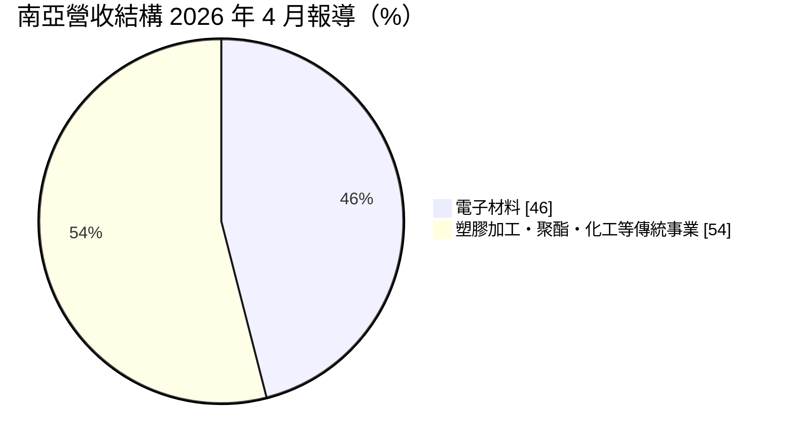
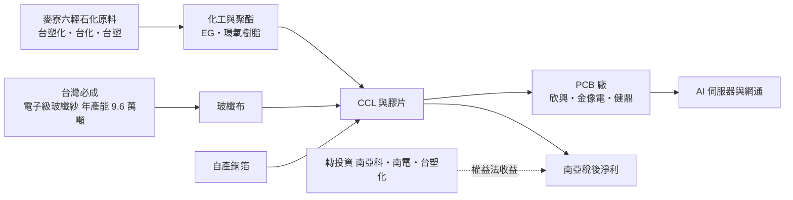
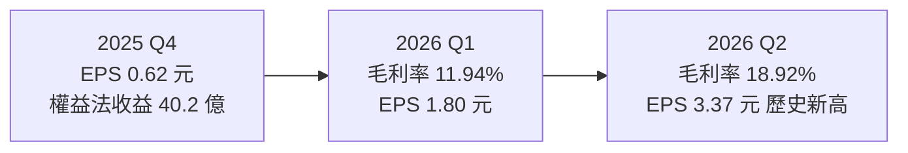
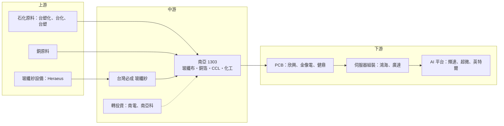

# 1303 南亞

> 上市｜[[產業索引-塑膠工業|塑膠工業]]｜上市（櫃）日期 1967/11/05

# 第一章：企業模式與商業藍圖

> [!info] 撰寫說明
> 本文由 Claude 依公開資料整理，架構比照 [[2330台積電]] 的四章研究，資料截至 2026-10-07。財務數字來源：財報狗、優分析、自由時報、經濟日報、工商時報、旺得富理財網、科技新報、Money錢、永豐金證券 AI 投資網、nstock；產業描述為整理性內容，尚未逐條比對原始文件。#待校對

在評估單一個股的長期投資價值時，首要步驟是拆解企業的底層獲利邏輯。本章針對南亞塑膠工業（股票代號：1303，以下簡稱南亞）的商業模式進行定性分析，說明這家傳統塑化公司如何靠電子材料的[[垂直整合]]搭上 AI 伺服器浪潮，以及轉投資收益在它的獲利結構中扮演多重的角色。

## 一、核心定位：台塑集團裡最「電子化」的一員

南亞創立於 1958 年 8 月 22 日，是台塑集團「台塑四寶」之一。公司早年以塑膠皮布、膠布、塑膠管材等塑膠加工品起家，後來逐步延伸到聚酯纖維、化工原料，以及印刷電路板（PCB）上游的電子材料。依永豐金證券 AI 投資網的公司簡介，南亞自稱是全球最大的塑膠加工廠，也是全球第二大銅箔基板（[[CCL]]）製造商。

過去南亞的獲利主軸是石化與聚酯，景氣好壞跟著油價與中國供需走；近幾年電子材料快速成長，成為公司最大事業體。這個轉變有兩個商業意義：

* **從大宗商品轉向規格品：** 電子材料需要客戶認證、規格隨 AI 伺服器升級，價格不像石化原料完全由國際行情決定。
* **獲利來源多元但波動大：** 南亞同時持有 [[2408南亞科]]、[[8046南電]]、[[6505台塑化]] 等轉投資，記憶體與煉油景氣都會透過[[權益法]]反映在南亞的稅後獲利。

## 二、產品板塊：從玻纖紗一路做到銅箔基板

依優分析 2026 年 4 月的報導，電子材料營收占比已達 46%：

電子材料事業的特色是垂直整合，PCB 上游的關鍵材料幾乎都自己做：

* **電子級玻纖紗與[[玻纖布]]：** 子公司台灣必成在新港設有 3 座工廠，年產能 96,000 公噸，其中電子級產品約 81,000 公噸。玻纖布是 CCL 的補強材料，AI 伺服器對 [[Low Dk]] 與 [[Low CTE]] 玻纖布需求大增。
* **[[銅箔]]：** 生產 PCB 與 CCL 使用的電解銅箔。
* **銅箔基板（CCL）與膠片：** 以自產的玻纖布、銅箔與樹脂壓合成 CCL，供應 PCB 廠。
* **IC 載板（轉投資）：** 南電生產 [[ABF]] 與 BT 載板。
* **DRAM（轉投資）：** 南亞科在記憶體景氣好時貢獻大量投資收益。

傳統事業方面，塑膠加工（膠布、硬質膠布、塑膠管）、聚酯（聚酯棉、聚酯絲、瓶用酯粒）、化工（乙二醇 [[EG]]、雙酚 A、環氧樹脂等）仍占營收一半左右。依科技新報 2026 年 5 月的報導，南亞同時推動晶圓保護膜、光電用電子隔離片、半導體製程用薄膜、電子級雙氧水、電子級二氧化碳與醫療材料等高階產品，共 42 件轉型案，預計投資 124 億元，預估創造年產值 426 億元，其中半導體材料約 50 億元、醫療材料約 27 億元。

## 三、資本轉化邏輯：一條龍材料與轉投資雙引擎

* **生產據點：** 台灣主要生產基地包括新港（電子材料、玻纖）、麥寮（化工原料，與六輕連結）、錦興、樹林、林口等十大廠區；海外在中國大陸設有多個塑膠加工與電子材料廠，在美國德州設有化工廠。旺得富 2026 年 7 月報導，南亞化工產品第二季受惠地緣政治帶來的[[庫存利益]]與美國生產優勢。
* **自有上游的價值：** 在玻纖布、銅箔全面缺貨的時期，自產材料等於確保 CCL 的供料，經濟日報與工商時報 2026 年 7 至 8 月報導，南亞電子材料各產線稼動率近乎滿載。
* **擴產：** 2026 年 4 月，台灣必成公告投資 40.9 億元向德國 Heraeus 採購含貴金屬的生產設備，擴充電子級玻纖紗產能，回應 AI 伺服器與高階網通帶來的玻纖布、銅箔與載板供不應求。

## 四、企業長期藍圖：高值化與垂直整合

* **電子材料高階化：** 公司表示將加速 CCL 研發、推動高階材料，並利用一貫化生產優勢擴大市占。
* **傳統事業轉型：** 透過 42 件轉型案把產能轉向半導體與醫療等利基材料，降低對大宗石化產品的依賴。
* **轉投資收益：** 南亞科、南電、台塑化等轉投資的獲利透過權益法回流南亞，使南亞的稅後獲利波動往往大於本業。

# 第二章：護城河深度與競爭優勢

在長期價值投資中，「護城河」指企業抵禦競爭、維持超額利潤的保護機制。本章分析南亞的護城河構成、電子材料與化工兩條戰線上的主要競爭對手，以及這些優勢在缺貨潮過後能守住多少。

## 一、護城河的核心組成要素

南亞的護城河屬於「規模加垂直整合」型的窄護城河，主要由三個要素組成：

* **1. 上下游一條龍：** 從玻纖紗、玻纖布、銅箔到 CCL 都自己生產，在材料全面缺貨時確保供料，也比只做單一環節的廠商更能控制成本與交期。
* **2. 集團規模與原料取得：** 化工與聚酯的原料多來自麥寮六輕，與 [[6505台塑化]]、[[1301台塑]]、[[1326台化]] 互為上下游，具備大宗採購與物流優勢。
* **3. 長年累積的客戶認證：** CCL 與玻纖布打入伺服器、網通板需經終端品牌與 PCB 廠多層認證，一旦進入供應名單，轉換需重新驗證，客戶黏著度較高。

## 二、全球主要競爭對手格局

| 對手 | 定位 | 對南亞的威脅 |
|---|---|---|
| [[2383台光電]]、[[6274台燿]]、[[6213聯茂]] | 高階 CCL 專業廠 | 在 AI 伺服器超低損耗 CCL 的市占與技術領先 |
| 生益科技、建滔積層板 | 中國與香港 CCL 大廠 | 在中低階 CCL 價格競爭 |
| [[1802台玻]]、[[1815富喬]]、[[5340建榮]]、日東紡 | 玻纖布廠 | 富喬第一季毛利率約 36%；建榮與日東紡合作 T-glass；台玻主攻 Low Dk |
| [[8358金居]]、三井金屬 | 高頻高速銅箔 | 低粗糙度銅箔技術優勢 |
| 中國 EG、[[PTA]]、聚酯新產能 | 大宗化工 | 壓低南亞傳統事業利差 |

## 三、優勢轉化：哪些守得住、哪些守不住

* **守得住：** 在材料缺貨期，垂直整合帶來的供料保障最有價值，南亞能優先滿足自家 CCL 所需，量價齊揚。2026 年第一季南亞營收約 686 億元，遠大於台灣其他玻纖布廠，規模優勢明顯。
* **守不住：** 南亞 CCL 以中高階為主，在最頂級的 AI 加速器板材上，台光電等專業廠商的配方與認證速度較快。Money錢的整理顯示南亞第一季整體毛利率約 11.94%，明顯低於富喬等專業玻纖布廠，反映傳統事業拉低整體獲利結構。
* **觀察重點：** 電子材料占比能否持續超過一半；Low Dk、Low CTE 等高階玻纖布與高階 CCL 的量產進度；缺貨潮退去後價格能否守住。

# 第三章：財務體質與盈利規模

資料日期：2026-10-07。數字取自財報狗、優分析、自由時報、經濟日報、工商時報與永豐金證券 AI 投資網整理，表格是撰寫當時的快照；最新月營收、毛利率、累計 EPS 由自動排程寫在本筆記的屬性欄位（月營收、毛利率、累計EPS 等）。#待校對

財務報表是檢驗護城河是否真實存在的最終標準。本章用三率、ROE、現金流與資本報酬，檢視南亞從傳統塑化轉向電子材料後的獲利品質，並區分本業與轉投資的貢獻。

## 一、獲利能力的基石：三率

| 項目 | 2025 全年 | 2026 Q1 | 2026 Q2 | 2026 上半年 |
|---|---|---|---|---|
| 營收（新台幣） | 2,599.1 億 | 約 686 億 | 836.5 億 | 1,522.4 億 |
| [[毛利率]] | 8.31% | 11.94% | 18.92% | 15.77% |
| [[營業利益率]] | 1.42% | 未查得 | 13.6% | 9.92% |
| 稅後淨利 | 45.1 億 | 約 142.6 億 | 267.5 億 | 410.1 億 |
| EPS（元） | 0.57 | 1.80 | 3.37 | 5.17 |

* **本業與轉投資：** 2025 年第四季 EPS 0.62 元為近 14 季新高，但營業利益僅 12.3 億元、權益法投資收益達 40.2 億元，當時獲利主要靠轉投資。2026 年第二季營業利益率升至 13.6%，本業才真正轉強。
* **單月爆發：** 2026 年 6 月單月稅後純益 228.1 億元、EPS 2.88 元，包含南亞科與台塑化在第二季的高獲利認列。上半年 EPS 5.17 元，已是 2025 全年的九倍。
* **[[淨利率]]與業外：** 上半年稅後淨利率約 27.7%，遠高於營業利益率，評估本業時應以營業利益為準。
* **外部預估：** 工商時報引述法人預估 2026 年 EPS 13.04 元、2027 年 19.93 元，非公司財測。

## 二、ROE：資本效率

南亞資本額大、資產中有大量長期股權投資，本業景氣低迷時 [[ROE]] 很低（2024、2025 年 EPS 分別僅 0.42 元與 0.57 元）。2026 年在電子材料與轉投資同步轉好下，ROE 明顯回升，但波動度高，屬景氣循環型的資本效率。

## 三、資本支出、自由現金流與股利

* **[[CapEx]]：** 轉型案預計投資 124 億元，未來數年另有 148 億元投資計畫，預估年產值 135 億元；台灣必成 40.9 億元的玻纖紗設備投資，是近期電子材料最明確的擴產項目。
* **[[自由現金流]]：** 未查得公司層級的年度資本支出總額與自由現金流數字。
* **股利：** 依永豐金證券 AI 投資網資料，南亞 2026 年配發現金股利 0.80 元（以 2025 年盈餘發放），2025 年為 0.70 元，2022 年景氣高峰時曾配 7.50 元，近五年未配股票股利。股利高度跟隨前一年獲利，2026 年獲利大增後，2027 年配息有機會明顯提高（推估）。

## 四、[[ROIC]] 與 [[WACC]]：價值創造利差

2023 至 2025 年南亞本業營業利益率都在 2% 以下，ROIC 推估低於 WACC，龐大的石化資產並未創造超額報酬。2026 年電子材料滿載、毛利率升到近兩成，本業 ROIC 有機會重新高於資金成本（推估，具體數值未查得）。關鍵在於高階玻纖布與 CCL 的價格能否在缺貨潮後維持。

# 第四章：總體風險與地緣政治

任何企業都無法脫離宏觀環境獨立存在。本章分析南亞未來必須面對的地緣政治、產業週期、營運與技術風險。

## 一、地緣政治風險

* **中東與油價：** 2026 年第二季南亞化工產品受惠地緣政治帶來的庫存利益，但這屬於一次性因素，油價回落時可能反轉為庫存損失。
* **美中貿易與關稅：** 南亞在中國與美國都有生產據點，美國對中國製品的關稅、以及中國對美國化工品的反制，都可能影響各廠區的接單與定價。
* **台灣集中風險：** 電子材料主要產能集中在台灣，面臨兩岸風險與供應鏈分散要求。

## 二、產業週期與市場結構風險

* **電子材料循環：** 目前的玻纖布、銅箔、CCL 全面缺貨主要由 AI 伺服器帶動。若雲端業者資本支出放緩，或同業擴產到位，供需可能在一兩年內反轉，[[長鞭效應]]會讓上游材料的跌幅大於終端。
* **傳統石化供過於求：** 中國大陸持續新增 EG、PTA、聚酯產能，壓抑南亞化工與聚酯產品的利差。
* **轉投資波動：** 南亞科（DRAM）與台塑化（煉油）都是高度循環的產業，貢獻大但不穩定。

## 三、營運環境的隱性風險

* **工安與環保：** 塑化與化工廠區有工安事故與環保法規風險，麥寮廠區也受空污與用水規範約束。
* **擴產執行：** 玻纖紗擴產涉及貴金屬漏板等關鍵設備，若交機或[[良率]]不如預期，可能錯過缺貨期。
* **匯率與原料：** 化工原料與銅價波動、新台幣匯率都會影響毛利率。

## 四、科技演進風險

AI 伺服器板材規格每一兩代就升級一次（更低損耗、更低熱膨脹）。若南亞在新一代材料的認證速度落後於台光電、日東紡等專業廠商，可能只能分到中階市場，享受不到最高的價格溢價。

# 專有名詞解析

## 半導體

- **[[ABF]]**：味之素增層膜，用於高階 IC 載板的絕緣材料，CPU、GPU 與 AI 晶片封裝都需要 ABF 載板。
- **[[良率]]**：合格產品占總產出的比例，新設備與新製程初期良率通常較低。

## 金融

- **[[權益法]]**：持股約兩成以上的轉投資，依持股比例把被投資公司的損益認列為投資收益的會計方法。
- **[[庫存利益]]**：原料價格上漲時，以較低成本購入的庫存按較高售價出售所產生的額外利潤，屬一次性成分。
- **[[自由現金流]]**：營業活動現金流減去資本支出，代表企業可自由用於配息、還債或併購的現金。
- **[[長鞭效應]]**：終端需求的小幅變動，沿供應鏈往上游傳遞時被逐級放大，造成上游庫存與訂單劇烈波動。

## 產業

- **[[CCL]]**：銅箔基板，由玻纖布、樹脂與銅箔壓合而成，是印刷電路板的基礎材料。
- **[[玻纖布]]**：以玻璃纖維紗織成的布，作為 CCL 的補強材料，影響電路板的電氣特性與尺寸穩定度。
- **[[銅箔]]**：貼覆在 CCL 表面形成電路的薄銅層，高頻高速應用需要表面更平滑的低粗糙度銅箔。
- **[[Low Dk]]**：低介電常數材料，可減少高速訊號傳輸時的延遲與損耗，是 AI 伺服器板材的關鍵規格。
- **[[Low CTE]]**：低熱膨脹係數材料，受熱時尺寸變化小，可降低大型載板與晶片封裝的翹曲。
- **[[EG]]**：乙二醇，聚酯纖維與寶特瓶的主要原料之一，中國新增產能多，價格波動大。
- **[[PTA]]**：純對苯二甲酸，與 EG 一起聚合成聚酯，是紡織與包裝用聚酯的基礎原料。
- **[[垂直整合]]**：同一企業掌握上中下游多個生產環節，可確保供料並控制成本與交期。

# 核心供應鏈

## 1. 上游：原料與設備
- 石化原料（乙烯、對二甲苯等）：[[6505台塑化]]、[[1326台化]]、[[1301台塑]]
- 玻纖紗貴金屬漏板設備：德國 Heraeus
- 銅原料：國際銅礦與銅材供應商

## 2. 中游：南亞本身與集團轉投資
- 玻纖紗：子公司台灣必成
- IC 載板：[[8046南電]]
- DRAM：[[2408南亞科]]

## 3. 同業：電子材料競爭者
- CCL：[[2383台光電]]、[[6274台燿]]、[[6213聯茂]]、生益科技、建滔積層板
- 玻纖布：[[1802台玻]]、[[1815富喬]]、[[5340建榮]]、日東紡
- 銅箔：[[8358金居]]、三井金屬

## 4. 下游：PCB 與終端
- PCB 廠：[[3037欣興]]、[[2368金像電]]、[[3044健鼎]]
- 伺服器組裝：[[2317鴻海]]、[[2382廣達]]
- AI 晶片平台：[[NVDA輝達]]、[[AMD超微]]、[[INTC英特爾]]

## 最新新聞
<!-- news:start（自動產生，請勿手動編輯此範圍） -->
- 2026-10-07 📰 媒體 17:55｜南亞攜手韓國重電公司成立「南亞樂星」 布局AI與能源轉型拓展北美市場｜[鉅亨網](https://news.cnyes.com/news/id/6623754)
- 2026-10-07 📰 媒體 14:12｜〈台北紡織展〉吳嘉昭：南亞、南電明年會比今年好 更高級的電子材料以後更缺｜[鉅亨網](https://news.cnyes.com/news/id/6623564)
- 2026-10-06 📰 媒體 22:11｜鉅亨速報 - Factset 最新調查：南亞(1303-TW)EPS預估上修至13.56元，預估目標價為320元｜[鉅亨網](https://news.cnyes.com/news/id/6623177)
- 2026-10-06 📰 媒體 22:10｜鉅亨速報 - Factset 最新調查：南亞(1303-TW)目標價調升至320元，幅度約8.47%｜[鉅亨網](https://news.cnyes.com/news/id/6623176)
- 2026-10-05 📰 媒體 13:20｜〈焦點股〉南亞受惠電子材料持續升級 爆量漲停再寫新天價｜[鉅亨網](https://news.cnyes.com/news/id/6621644)

完整紀錄：[[1303南亞 新聞]]
<!-- news:end -->

## 相關連結
- [公開資訊觀測站](https://mopsov.twse.com.tw/mops/web/t05st03?step=1&firstin=1&co_id=1303)
- [Goodinfo](https://goodinfo.tw/tw/StockDetail.asp?STOCK_ID=1303)
- [Yahoo 股市](https://tw.stock.yahoo.com/quote/1303)
- [鉅亨網新聞](https://www.cnyes.com/twstock/1303/news)
