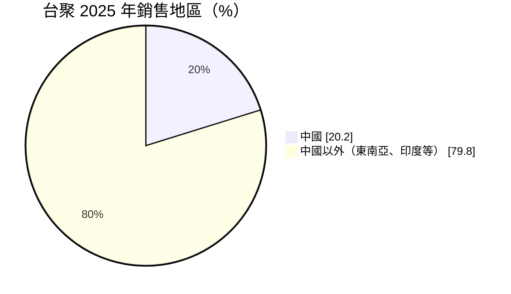
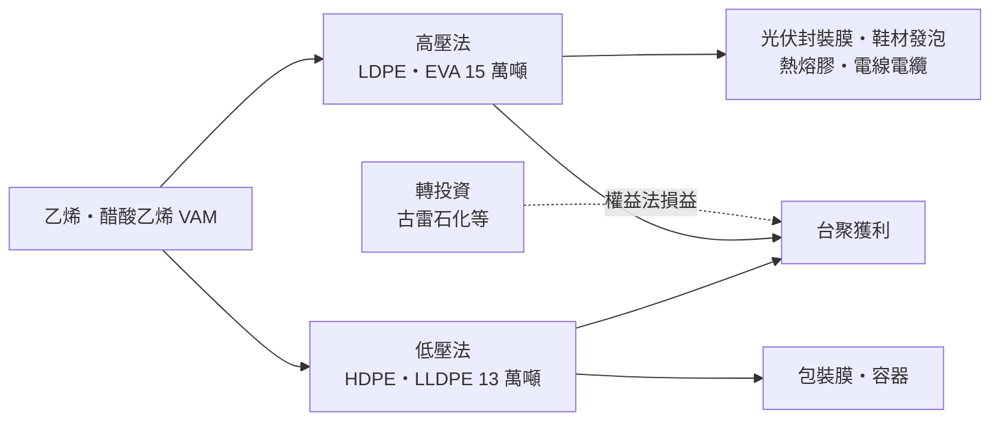
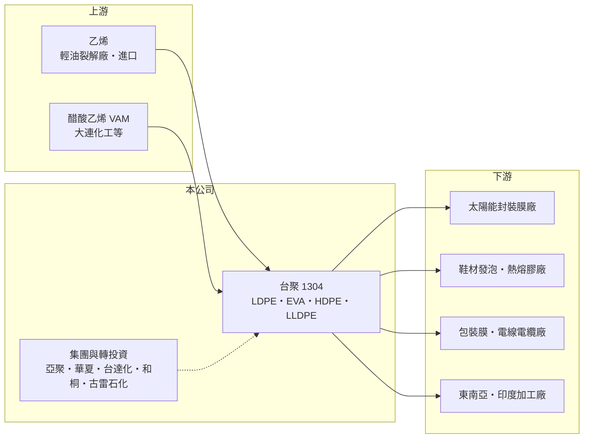

# 1304 台聚

> 上市｜[[產業索引-塑膠工業|塑膠工業]]｜上市（櫃）日期 1972/05/20

# 第一章：企業模式與商業藍圖

> [!info] 撰寫說明
> 本文由 Claude 依公開資料整理，架構比照 [[2330台積電]] 的四章研究，資料截至 2026-10-08。財務數字來源：Goodinfo 年度經營績效頁、富果研究 2026 年 3 月法說會整理、優分析與 Yahoo 股市報導標題；集團關係與合併範圍為整理性內容，尚未逐條比對原始文件。#待校對

在評估單一個股的長期投資價值時，首要步驟是拆解企業的底層獲利邏輯。本章說明台灣聚合化學品（股票代號：1304，以下簡稱台聚）這家台灣第一家聚乙烯廠的商業模式，以及它為什麼在 2023 至 2025 年連續虧損。

## 一、核心定位：台灣聚乙烯與 EVA 的老牌生產者

台聚是台灣最早的聚乙烯（PE）生產者，也是台聚集團的母公司。集團成員包括 [[1308亞聚]]、[[1305華夏]]、[[1309台達化]]、[[1714和桐]] 等上市公司，台聚的合併營收包含部分子公司（合併範圍以年報為準）。本業產品分成兩類製程：高壓法生產[[LDPE]]（低密度聚乙烯）與 [[EVA]]（乙烯醋酸乙烯酯共聚物），年產能約 15 萬噸；低壓法生產 HDPE 與 LLDPE，年產能約 13 萬噸。

這些產品都是以[[乙烯]]為主要原料的塑膠粒。LDPE 用於包裝膜、電線包覆與塗布；EVA 依醋酸乙烯含量不同，可用於太陽能模組封裝膜、鞋材發泡、熱熔膠與電線電纜。台聚的商業模式是「買進乙烯，賣出塑膠粒」，獲利取決於產品價格與乙烯成本之間的[[價差]]，這決定了它是一家高度景氣循環的公司。

## 二、產品與市場板塊

公司未揭露產品別營收比重，但法說會提供了兩個重要的結構數字。第一，光伏級 EVA 占 EVA 銷售的比重由 2024 年的 31% 提高到 2025 年的 41%，太陽能封裝膜是 EVA 最大的單一用途。第二，中國占銷售比重由 2021 年的 68.2% 大幅降到 2025 年的 20.2%，重心轉向東南亞與印度。

中國比重下降，一方面是中國自行大量擴建 PE 與 EVA 產能、進口需求減少，另一方面也是公司主動分散市場。這個轉變對長期很重要：過去台聚的產品主要賣給中國加工廠，中國產能自給之後，台聚必須在新市場重新建立客戶。

## 三、資本轉化邏輯：開工率與價差決定一切

石化廠的固定成本高，開工率與價差同時決定獲利。2025 年高壓法產量 12.2 萬噸、開工率 93.8%，低壓法產量約 7.9 萬噸、開工率約六成；即使高壓法接近滿載，整體毛利率也只有約 3%，代表問題不在產量，而在價差被壓縮。

台聚的另一個獲利來源是轉投資。它透過集團參與中國福建的古雷石化[[輕油裂解]]與下游投資，以權益法認列損益。2025 年個體財報的營業外損失 23.37 億元中，約 23 億元來自轉投資的權益法損失，古雷石化又因遞延所得稅資產轉回而擴大認列損失。這說明台聚的獲利不只看本業，也受中國石化投資的景氣影響。

## 四、企業長期藍圖：高值化與市場分散

台聚的長期策略有三個方向：一是發展高附加價值的差異化產品，例如與客戶合作開發更高階的 EVA 等級；二是降低對中國市場的依賴，拓展東南亞與印度；三是依光伏級、發泡級等不同產品的利差動態調整生產組合。這些策略的共同目標，是讓台聚從賣大宗塑膠粒的價格接受者，轉為在利基等級上有議價空間的特用樹脂供應商。

# 第二章：護城河深度與競爭優勢

「護城河」指企業抵禦競爭、維持超額利潤的保護機制。本章分析台聚在全球石化供過於求下還保有哪些優勢。

## 一、台聚護城河的核心組成要素

大宗石化產品的護城河普遍很淺，台聚的優勢主要有三點。第一是 EVA 的技術與等級認證。高醋酸乙烯含量的光伏級 EVA 製程難度較高，需要通過封裝膜廠的品質驗證，台聚是台灣少數能量產光伏級 EVA 的廠商，2025 年光伏級占 EVA 銷售比重升到 41%。

第二是集團規模與上下游整合。台聚集團涵蓋 PE、PVC、苯乙烯系列與特用化學品，集團內可以共享原料採購、物流與管理資源。

第三是非中國的供應來源。在國際買家分散供應鏈的趨勢下，台灣產的 EVA 與 PE 對東南亞與印度客戶仍有吸引力，這也是台聚能把中國比重降到兩成的基礎。

## 二、全球主要競爭對手格局

| 對手 | 定位 | 對台聚的威脅 |
|---|---|---|
| 中國石化廠（如中石化體系、民營煉化一體化廠） | 大規模新建 PE 與 EVA 產能 | 中國產能自給後轉為出口，壓低全球價格 |
| [[1301台塑]] | 台灣最大塑化集團，PE 與 EVA 產能大 | 在台灣與東南亞市場直接競爭 |
| 韓國與中東石化廠（如韓華、SABIC 等） | 原料成本低或規模大 | 中東廠有廉價乙烷原料，成本優勢明顯 |

## 三、優勢轉化：守得住／守不住／觀察重點

守得住的是高階、有認證門檻的 EVA 等級，以及東南亞、印度等新市場中重視供應穩定的客戶。

守不住的是一般 PE 與 EVA 的價格。中國煉化一體化產能大量開出，加上中東低成本產能，使得全球 PE 長期供過於求，台聚的毛利率從 2021 年的 24.7% 一路降到 2025 年的 3.05%，這不只是景氣循環，也反映產業結構的改變。

長期觀察重點是高值化產品占比能否持續提高、古雷石化的虧損能否收斂，以及全球石化新產能的開出節奏。

# 第三章：財務體質與盈利規模

資料日期：2026-10-08。數字取自 Goodinfo 年度經營績效與富果研究法說會整理，表格是撰寫當時的快照；最新月營收、毛利率、累計 EPS 由自動排程寫在本筆記的屬性欄位（月營收、毛利率、累計EPS 等）。#待校對

財務報表是檢驗護城河是否真實存在的最終標準。本章用五年的三率、ROE 與資本報酬，檢視台聚在石化循環中的獲利表現。

## 一、獲利能力的基石：三率

| 年度 | 營收（新台幣） | [[毛利率]] | [[營業利益率]] | EPS（元） | [[ROE]] |
|---|---|---|---|---|---|
| 2021 | 718 億 | 24.7% | 18.0% | 4.84 | 19.3% |
| 2022 | 664 億 | 16.5% | 8.63% | 1.45 | 未查得（來源數字不一致） |
| 2023 | 523 億 | 10.7% | 3.10% | -0.19 | -3.87% |
| 2024 | 510 億 | 4.50% | -3.94% | -2.00 | -10.9% |
| 2025 | 442 億 | 3.05% | -6.0% | -2.60 | -16.4% |

台聚的五年數字是一個完整的下行循環。2021 年疫後需求反彈、石化價差擴大，營業利益率達 18%；之後中國新產能陸續開出、需求轉弱，毛利率逐年下滑，2024 年起本業轉為營業虧損。2021 至 2025 年營收年複合成長率約 -11.4%（推算）。拉長到十年看，2016 至 2019 年 ROE 約 5% 至 8%、毛利率約 10% 至 13%，2020 至 2021 年是少見的高峰，代表台聚在一般年度的獲利能力本來就不高，高峰期無法視為常態。

2025 年的虧損有兩個來源：本業營業淨損 26.52 億元，以及轉投資的權益法損失約 23 億元（以個體財報計）。法說會表示本業虧損比前一年減少約 0.96 億元，惡化主要來自業外。

## 二、[[ROE]]：資本效率

扣除來源數字不一致的 2022 年，2021 至 2025 年其餘四年平均 ROE 約 -3.0%（推算）。每股淨值從 2021 年的 23.75 元降到 2025 年的 16.33 元，四年減少約三成，連續虧損正在侵蝕股東權益。Goodinfo 的 ROE 數字可能包含非控制權益的損益口徑，與 EPS 推算的報酬率不完全一致，使用時應對照年報。

## 三、股利

依 Goodinfo 統計，台聚長期現金股利一般平均約 0.8 元；2025 年度在虧損下仍發放每股 0.15 元。石化循環產業的股利高度隨景氣變動，高峰年度配發較多，虧損年度則大幅縮減，無法視為穩定的收益來源。

## 四、[[ROIC]] 與 [[WACC]]：價值創造利差

**ROIC 推算：** 2025 年合併營業淨損約 26.52 億元，虧損不計稅。歸屬母公司股東權益約 194 億元（每股淨值 16.33 元 × 約 11.9 億股），依 ROE -16.4% 與 ROA -9.48% 推算總負債約 142 億元，假設其中一半為有息負債約 71 億元（推估），投入資本約 265 億元，ROIC 約 -10%（推算）。合併報表還包含非控制權益，實際投入資本更大，ROIC 的絕對值會略小。以同樣方法回推 2021 年，營業利益約 129 億元，稅後約 103 億元，股東權益約 283 億元，ROIC 約 28%（推算）。

**WACC 推算：** 假設台灣 10 年期公債殖利率 1.75%、市場風險溢酬 6%、β 取石化同業常見值 0.9，股東權益成本約 7.2%。負債成本假設 2.5%，稅後 2.0%，權益占資本約 73%（推估），WACC 約 5.8%（推算）。

**結論：** 台聚只有在 2020 至 2021 年的景氣高峰，ROIC 明顯高於 WACC；2016 至 2019 年的一般年度約與資金成本相當，2023 年以後則遠低於資金成本，持續毀損經濟價值。對長期投資人而言，台聚的價值取決於石化循環何時反轉，以及高值化轉型能否提高谷底時的獲利，而不是單一高峰年度的 EPS。

# 第四章：總體風險與地緣政治

任何企業都無法脫離宏觀環境獨立存在。本章分析台聚長期必須面對的產業結構、地緣政治、營運與法規風險。

## 一、產業週期與市場結構

石化是典型的景氣循環產業，價差由全球新產能開出與需求成長共同決定。2020 年代中國大舉興建煉化一體化產能，PE 與 EVA 從進口轉為自給甚至出口，中東也持續以低成本乙烷擴產，全球供過於求可能持續多年。這是結構性壓力，不是一兩年就能消化的短期景氣問題。

## 二、地緣政治與轉投資

台聚透過集團投資中國福建的古雷石化，權益法損益受中國石化景氣、當地政策與稅務處理影響，2025 年就因遞延所得稅資產轉回而擴大損失。兩岸關係變化也可能影響這項投資的價值與營運。原料方面，2025 年台塑石化停產曾影響大連化工的 VAM 供應，顯示原料供應鏈集中帶來的風險。

## 三、營運環境的隱性風險

低壓法開工率僅約六成，固定成本難以攤提。石化廠需要定期停車大修，台電電力供應也會影響生產（例如亞聚配合台電停電檢修）。連續虧損若持續，股東權益下降可能影響未來的融資條件與投資能力。

## 四、法規與能源轉型

台灣與歐盟的碳費、碳邊境調整機制，會提高高耗能石化廠的成本。另一方面，太陽能裝機成長帶動光伏級 EVA 需求，是能源轉型中對台聚有利的一面；但太陽能模組產業也在快速改變封裝材料，若主流封裝膜轉向 POE 等其他材料，EVA 的需求成長可能放緩。匯率與油價則持續影響原料成本與出口報價。

# 專有名詞解析

## 金融

- **[[ROIC]]**：投入資本報酬率，稅後營業利益除以股東權益加有息負債，衡量本業運用資本的效率。
- **[[WACC]]**：加權平均資金成本，股東與債權人要求報酬的加權平均，ROIC 高於它才代表創造價值。

## 產業

- **[[LDPE]]**：低密度聚乙烯，以高壓法生產、柔軟透明，主要用於包裝膜、塗布與電線包覆。
- **[[EVA]]**：乙烯醋酸乙烯酯共聚物，用於太陽能模組封裝膜、鞋材與發泡材料。
- **[[乙烯]]**：最重要的基本石化原料，用來生產聚乙烯、PVC 等塑膠，乙烯價格常被視為石化景氣指標。
- **[[輕油裂解]]**：把輕油在高溫下裂解成乙烯、丙烯等基本石化原料的製程，台灣俗稱的「輕裂」。
- **[[價差]]**：產品售價與主要原料成本之間的差距，是石化業者獲利的核心指標。

# 核心供應鏈

## 1. 上游：原料
- 乙烯：國內輕油裂解廠與進口（實際供應比例未查得）；[[6505台塑化]] 為國內主要輕裂業者
- 醋酸乙烯（VAM）：大連化工等

## 2. 中游：台聚與集團
- 集團公司：[[1308亞聚]]、[[1305華夏]]、[[1309台達化]]、[[1714和桐]]
- 轉投資：古雷石化（中國福建）
- 同業：[[1301台塑]]、中國與中東石化廠

## 3. 下游：應用產業
- 太陽能封裝膜、鞋材發泡、熱熔膠（如 [[4767誠泰科技]]，產業參考）、包裝膜與電線電纜

## 最新新聞
<!-- news:start -->
<!-- news:end -->

## 相關連結
- [公開資訊觀測站](https://mopsov.twse.com.tw/mops/web/t05st03?step=1&firstin=1&co_id=1304)
- [Goodinfo](https://goodinfo.tw/tw/StockDetail.asp?STOCK_ID=1304)
- [Yahoo 股市](https://tw.stock.yahoo.com/quote/1304)
- [鉅亨網新聞](https://www.cnyes.com/twstock/1304/news)
