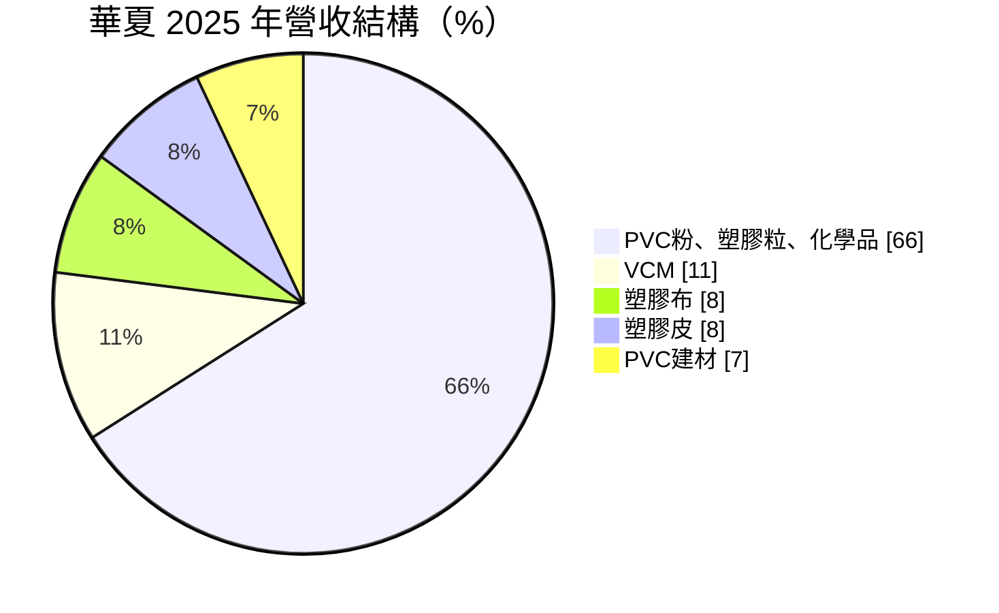
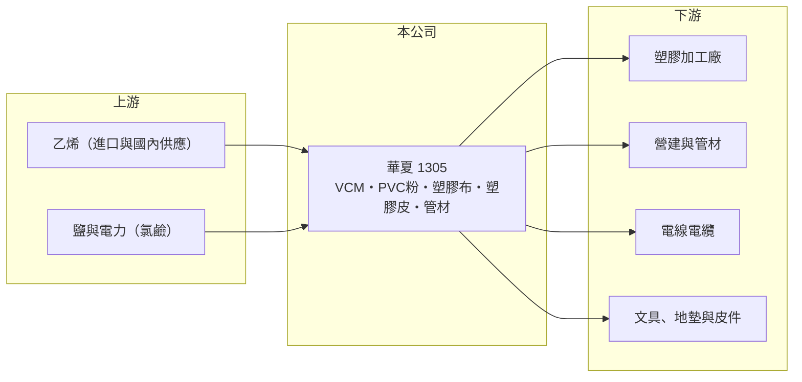

# 1305 華夏

> 上市｜[[產業索引-塑膠工業|塑膠工業]]｜上市（櫃）日期 1973/03/05

# 第一章：企業模式與商業藍圖

> [!info] 撰寫說明
> 精簡版，由 Claude 依公開資料整理，架構比照 [[2330台積電]]，資料截至 2026-10-08。來源：MoneyDJ 理財網財務比率年表（2021 至 2025 年）與個股基本資料（2025 年營收比重、歷年股利）、富果 2026 年 5 月華夏法說會備忘錄。#待校對

華夏是台聚集團旗下的 [[PVC]] 廠，從氯乙烯單體（[[VCM]]）、PVC 粉一路做到塑膠布、塑膠皮與管材，是台灣少數具備「原料加上加工品」一條龍的 PVC 業者。

- **核心業務：** 華夏生產 PVC 粉與塑膠粒、VCM、鹼氯產品，以及軟質與硬質塑膠布、塑膠皮、塑膠管與管件等 PVC 建材。PVC 是營建管材、電線被覆、地板與膠布最常用的通用塑膠，需求跟著營建與基礎建設走，因此華夏的營運本質上是營建景氣的延伸。
- **營收結構：** 依 2025 年資料，PVC 粉、塑膠粒與化學品占 66%，VCM 占 11%，塑膠布、塑膠皮各占 8%，PVC 建材占 7%。上游原料合計接近八成，代表華夏的獲利主要由 PVC 與原料乙烯之間的[[價差]]決定，加工品則提供較穩定但規模較小的利潤。

- **營運據點：** 主要產能在苗栗頭份廠，PVC 年產能約 23 萬噸，另在高雄設有儲槽。頭份廠儲槽汰舊換新工程預計 2026 年下半年完工，完工後年產能可微幅增至 27 至 28 萬噸，重點是生產特殊規格的 PVC 粉，而不是大規模擴產。
- **長期方向：** 公司的策略是以乙烯法 PVC 的品質優勢對抗中國[[電石法]] PVC 的低價競爭，並把產品往特殊規格移動。銷售上優先供應價差較好的內銷與自用市場，外銷則避開競爭最激烈的印度，轉向中南美與非洲分散市場。

# 第二章：護城河深度與競爭優勢

華夏的優勢來自乙烯法製程的品質、上下游整合與台聚集團的資源，但通用 PVC 本身同質性高，護城河偏窄。

- **競爭優勢：** 華夏同時擁有 VCM、PVC 粉與加工品，景氣差時可以把原料轉供自家加工線，降低外售的價格壓力。高雄與頭份的儲槽讓公司能在原料價格低時策略性進貨，這是沒有港口儲槽的小型加工廠做不到的事。
- **主要對手：** 國內對手是規模大得多的 [[1301台塑]]，國際上則是日本 [[4063信越化學]]、美國以頁岩氣為原料的 PVC 廠，以及大量以煤炭為原料的中國電石法 PVC 廠。中國產能龐大且成本低，是亞洲 PVC 報價長期偏弱的主因。
- **觀察重點：** 華夏 2022 至 2025 年有三年虧損，說明它的成本結構在中國供過於求時缺乏優勢。長期要看特殊規格 PVC 的比重能否拉高，以及印度等主要進口國的[[反傾銷]]與關稅政策是否改變全球 PVC 的流向。

# 第三章：財務體質與盈利規模

資料日期：2026-10-08，表格是撰寫當時的快照；最新月營收、毛利率、累計 EPS 由自動排程寫在本筆記的屬性欄位（月營收、毛利率、累計EPS 等）。#待校對

華夏 2021 年在 PVC 大好景氣下 EPS 達 4.25 元，之後營收連四年下滑，2024、2025 年毛利率接近零甚至轉負。

| 年度 | 營收（億元） | [[毛利率]] | [[營業利益率]] | EPS（元） | [[ROE]] |
|---|---|---|---|---|---|
| 2021 | 約 202（推算） | 24.93% | 16.40% | 4.25 | 23.77% |
| 2022 | 約 176（推算） | 3.84% | -5.58% | -0.64 | -3.09% |
| 2023 | 約 137（推算） | 12.23% | 3.35% | 0.59 | 3.88% |
| 2024 | 約 111（推算） | 1.90% | -7.60% | -1.22 | -7.69% |
| 2025 | 約 92（推算） | -3.79% | -13.66% | -1.58 | -11.19% |

註：2025 年營收以每股營業額 15.87 元乘以股本 58.11 億元換算的約 5.81 億股推算，其他年度依 MoneyDJ 營收成長率回推。

- **長期指標：** 2021 至 2025 年營收年複合成長率約 -18%（推算），近 5 年平均 ROE 約 1.1%（推算）。現金股利由 2021 年度的 2.5 元降到 2025 年度的 0.1 元，配息隨景氣大幅波動，不適合當作穩定收息股。
- **[[ROIC]] 與 [[WACC]]：** 2025 年稅後營業利益約 -10.1 億元（營業利益率 -13.66% × 營收約 92.2 億元 × 0.8），投入資本約 120 億元（股東權益約 77.3 億元，加上以總負債約 86 億元的一半推估的有息負債約 43 億元），ROIC 約 -8.4%（推算）；2021 至 2025 年平均約 0.5%（推算）。WACC 約 5.7%（推算：無風險利率 1.75%、市場風險溢酬 6%、β 取石化同業常見值 1.0，股東權益成本 7.75%；稅前負債成本 2.5%、稅率 20%；權益比重約 64%）。五年平均 ROIC 遠低於 WACC，代表除了 2021 年的景氣高峰外，華夏的本業並未替股東創造超額報酬。
- **財務特色：** 負債比率從 2021 年的 30% 升到 2025 年的 53%，每股淨值由 19.21 元降到 13.30 元，虧損正在侵蝕資本。2026 年第一季毛利率回到 2%、虧損收斂，但負債比率約 56%，財務彈性比過去小。

# 第四章：總體風險與地緣政治

華夏的風險集中在 PVC 景氣循環、中國產能與原料價格的劇烈波動。

- **產業週期：** PVC 需求跟著全球營建與基礎建設，報價則受中國供給主導，典型的週期是報價大漲、各國擴產、供過於求、虧損減產。華夏規模不大，很難在低谷期靠成本撐過，因此獲利呈現少數好年、多數平年或虧損年的型態。
- **營運風險：** 原料乙烯與 VCM 價格可能在短時間內翻倍，2026 年 3 月乙烯一個月內從每噸約 700 美元漲到約 1,500 美元，產品售價若跟不上就會壓縮價差。高價進料後若報價回落，也會產生存貨跌價損失。
- **其他風險：** 印度等主要進口國的關稅與[[反傾銷]]政策會改變出口流向；PVC 生產屬高耗能、高碳排製程，台灣[[碳費]]與減碳要求會逐步墊高成本；中東情勢則會影響原料供應與海運。

# 專有名詞解析

## 金融

- **[[ROIC]]**：投入資本報酬率，稅後營業利益除以股東權益加有息負債，衡量本業運用資本的效率。
- **[[WACC]]**：加權平均資金成本，股東與債權人要求報酬率的加權平均，是 ROIC 要超越的門檻。

## 產業

- **[[PVC]]**：聚氯乙烯，用於水管、電線被覆、地板與建材的通用塑膠。
- **[[VCM]]**：氯乙烯單體，由乙烯與氯製成，是聚合成 PVC 的直接原料。
- **[[電石法]]**：以煤炭製成電石，再生產乙炔與 PVC 的製程，中國產能以此為主，成本低但碳排高。
- **[[價差]]**：產品售價減去主要原料成本的差額，是石化業獲利的核心指標。
- **[[反傾銷]]**：進口國對低於正常價格傾銷的進口商品加徵關稅的貿易救濟措施。

# 核心供應鏈

- 上游：乙烯、EDC 等原料供應商，以及氯鹼製程所需的鹽與電力（供應商名稱未查得）；集團母公司為 [[1304台聚]]。
- 下游／客戶：PVC 管材、電線被覆、膠布與皮件等塑膠加工廠，以及營建業者（客戶名稱未查得）。
- 同業：[[1301台塑]]、[[4063信越化學]]、[[1321大洋]]、中國電石法 PVC 廠；集團內同業 [[1308亞聚]]、[[1309台達化]]。

## 最新新聞
<!-- news:start -->
<!-- news:end -->

## 相關連結
- [公開資訊觀測站](https://mopsov.twse.com.tw/mops/web/t05st03?step=1&firstin=1&co_id=1305)
- [Goodinfo](https://goodinfo.tw/tw/StockDetail.asp?STOCK_ID=1305)
- [Yahoo 股市](https://tw.stock.yahoo.com/quote/1305)
- [鉅亨網新聞](https://www.cnyes.com/twstock/1305/news)
