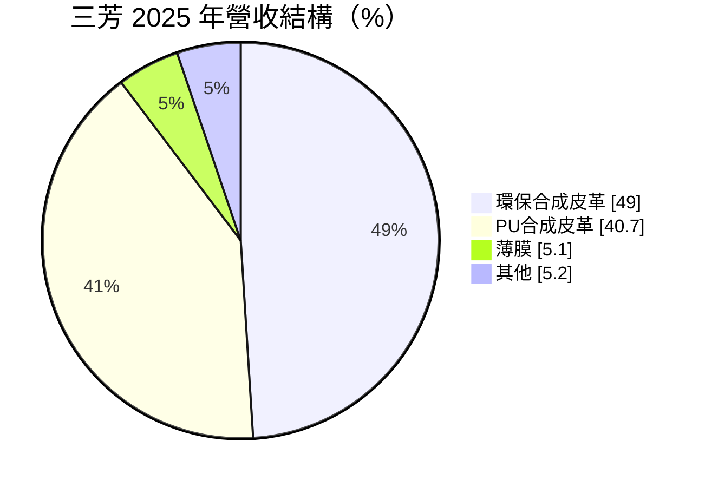
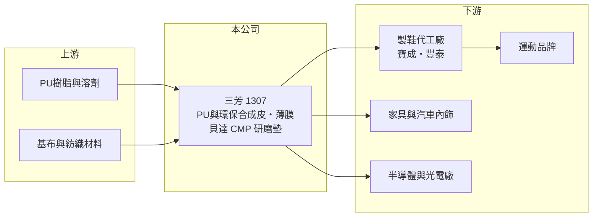

# 1307 三芳

> 上市｜[[產業索引-塑膠工業|塑膠工業]]｜上市（櫃）日期 1985/11/23

# 第一章：企業模式與商業藍圖

> [!info] 撰寫說明
> 精簡版，由 Claude 依公開資料整理，架構比照 [[2330台積電]]，資料截至 2026-10-08。來源：MoneyDJ 理財網財務比率年表（2021 至 2025 年）與個股基本資料（2025 年營收比重、歷年股利）、優分析 2024 年 10 月三芳產業分析。#待校對

三芳化學是全球最大的 [[PU合成皮]] 製造商，產品主要做成運動鞋的鞋面與鞋材，客戶是全球運動品牌與它們的製鞋代工廠。

- **核心業務：** 三芳生產 PU 合成皮革、環保合成皮革與薄膜，依優分析 2024 年的報導，全球市占率超過四成，約九成用於鞋材，其餘用於家具與汽車內飾。合成皮是運動鞋鞋面的關鍵材料，品牌設計新鞋款時會指定材料規格，因此三芳的訂單跟著運動品牌的新品週期與銷售走。
- **營收結構：** 2025 年環保合成皮革占 49%、傳統 PU 合成皮革占 40.7%、薄膜占 5.1%、其他占 5.2%。環保合成皮比重已超過傳統產品，反映運動品牌對低溶劑、可回收材料的要求，也讓三芳的產品單價與毛利率往上移。

- **營運據點：** 生產基地分布在台灣、中國、越南與印尼，其中越南產能最大，依 2024 年報導約貢獻五成以上營收。生產基地跟著製鞋代工廠移到東南亞，可以就近供貨、縮短交期。
- **長期方向：** 一是擴充印尼產能，配合製鞋業從中國、越南再分散到印尼；二是發展成衣用薄膜（熱熔膠條、防水透濕膜、熱轉印）；三是子公司貝達先進材料生產半導體與光電用的 [[CMP]] 研磨墊，嘗試把高分子材料技術延伸到電子材料。

# 第二章：護城河深度與競爭優勢

三芳的護城河來自規模、品牌認證與貼近製鞋聚落的產能布局。

- **競爭優勢：** 運動品牌對鞋材有嚴格的物性與環保認證，新供應商要通過開發、試產與量產驗證才能進入，三芳長期配合品牌開發新材料，轉換成本高。全球四成以上的市占率也讓它在原料採購與產線排程上具有規模經濟。
- **主要對手：** 主要對手是中國的 PU 合成皮廠，以及日本可樂麗（Kuraray）等生產超細纖維合成皮的業者；國內 [[1303南亞]] 也有塑膠皮與合成皮產品（推估為部分重疊）。下游客戶則是 [[9904寶成]]、[[9910豐泰]] 等製鞋代工大廠。
- **觀察重點：** 單一品牌集中度高，依 2024 年報導 NIKE 約占營收四成，品牌的庫存調整會直接反映在三芳的出貨。長期要看環保合成皮比重能否持續提高，以及 CMP 研磨墊等新事業能否形成第二支柱。

# 第三章：財務體質與盈利規模

資料日期：2026-10-08，表格是撰寫當時的快照；最新月營收、毛利率、累計 EPS 由自動排程寫在本筆記的屬性欄位（月營收、毛利率、累計EPS 等）。#待校對

三芳近五年營收維持在百億元上下，但毛利率從 2021 年的 17.6% 提升到 2025 年的 31.6%，獲利能力明顯升級。

| 年度 | 營收（億元） | [[毛利率]] | [[營業利益率]] | EPS（元） | [[ROE]] |
|---|---|---|---|---|---|
| 2021 | 約 84（推算） | 17.58% | 2.87% | 0.29 | 1.49% |
| 2022 | 約 108（推算） | 16.11% | 2.73% | 1.18 | 5.83% |
| 2023 | 約 101（推算） | 25.04% | 9.79% | 1.91 | 8.73% |
| 2024 | 約 108（推算） | 30.60% | 14.48% | 3.72 | 15.38% |
| 2025 | 約 108（推算） | 31.64% | 14.26% | 2.85 | 11.12% |

註：2025 年營收以每股營業額 27.19 元乘以股本 39.78 億元換算的約 3.98 億股推算，其他年度依 MoneyDJ 營收成長率回推。

- **長期指標：** 2021 至 2025 年營收年複合成長率約 6.6%（推算），近 5 年平均 ROE 約 8.5%（推算）。現金股利由 2021 年度的 0.5 元提高到 2024 年度的 2.7 元、2025 年度的 2.2 元，配息跟著獲利成長。
- **[[ROIC]] 與 [[WACC]]：** 2025 年稅後營業利益約 12.3 億元（營業利益率 14.26% × 營收約 108.2 億元 × 0.8），投入資本約 137 億元（股東權益約 100.7 億元，加上以總負債約 73 億元的一半推估的有息負債約 37 億元），ROIC 約 9.0%（推算）；2021 至 2025 年平均約 5.6%（推算）。WACC 約 5.3%（推算：無風險利率 1.75%、市場風險溢酬 6%、β 取鞋材同業常見值 0.8，股東權益成本 6.55%；稅前負債成本 2.5%、稅率 20%；權益比重約 73%）。2023 年以後 ROIC 穩定高於 WACC，代表產品升級後的三芳開始替股東創造價值；但 2021 至 2022 年 ROIC 只有約 2%（推算），說明這個利差仍需要更多年驗證。
- **財務特色：** 負債比率從 48% 降到約 42%，每股淨值由 19.23 元升到約 25 元。毛利率提升的原因包括環保產品比重增加與原料價格下跌，原料回漲時毛利率可能回落。

# 第四章：總體風險與地緣政治

三芳的風險在於品牌集中、運動鞋庫存週期與東南亞的營運環境。

- **產業週期：** 運動鞋產業有明顯的庫存週期，品牌在需求轉弱時會大幅減少下單，2023 年營收年減就是這種調整的結果。三芳位在品牌與代工廠之後，訂單波動會被[[長鞭效應]]放大。
- **營運風險：** 單一品牌占比約四成，品牌策略或供應商政策改變對三芳影響很大；印尼新廠的良率與產能爬坡也會影響擴產效益。
- **其他風險：** PU 樹脂、溶劑與基布等原料價格跟著油價波動；越南與印尼的工資、電力與美國對東南亞的關稅政策，會改變製鞋產業的布局；外銷為主，新台幣升值會壓縮獲利。

# 專有名詞解析

## 半導體

- **[[CMP]]**：化學機械研磨，以研磨液與研磨墊把晶圓表面磨平的製程，研磨墊是主要耗材。

## 金融

- **[[長鞭效應]]**：終端需求的小幅變動，沿供應鏈往上游傳遞時被逐級放大，造成上游訂單劇烈波動。
- **[[ROIC]]**：投入資本報酬率，稅後營業利益除以股東權益加有息負債，衡量本業運用資本的效率。
- **[[WACC]]**：加權平均資金成本，股東與債權人要求報酬率的加權平均，是 ROIC 要超越的門檻。

## 產業

- **[[PU合成皮]]**：以聚氨酯樹脂塗佈在基布上製成的人造皮革，質輕耐磨，是運動鞋鞋面的主要材料。

# 核心供應鏈

- 上游：PU 樹脂、溶劑、基布與紡織材料供應商（名稱未查得）。
- 下游／客戶：製鞋代工廠 [[9904寶成]]、[[9910豐泰]]，終端為 NIKE 等運動品牌；另有家具、汽車內飾與半導體研磨墊客戶。
- 同業：中國 PU 合成皮廠、日本可樂麗（Kuraray）、[[1303南亞]]（塑膠皮部分）。

## 最新新聞
<!-- news:start -->
<!-- news:end -->

## 相關連結
- [公開資訊觀測站](https://mopsov.twse.com.tw/mops/web/t05st03?step=1&firstin=1&co_id=1307)
- [Goodinfo](https://goodinfo.tw/tw/StockDetail.asp?STOCK_ID=1307)
- [Yahoo 股市](https://tw.stock.yahoo.com/quote/1307)
- [鉅亨網新聞](https://www.cnyes.com/twstock/1307/news)
