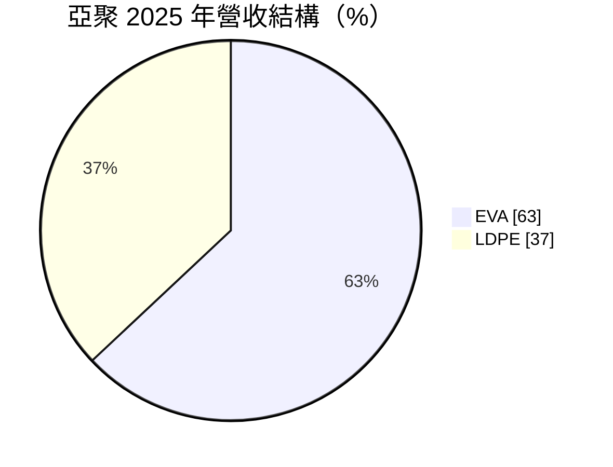
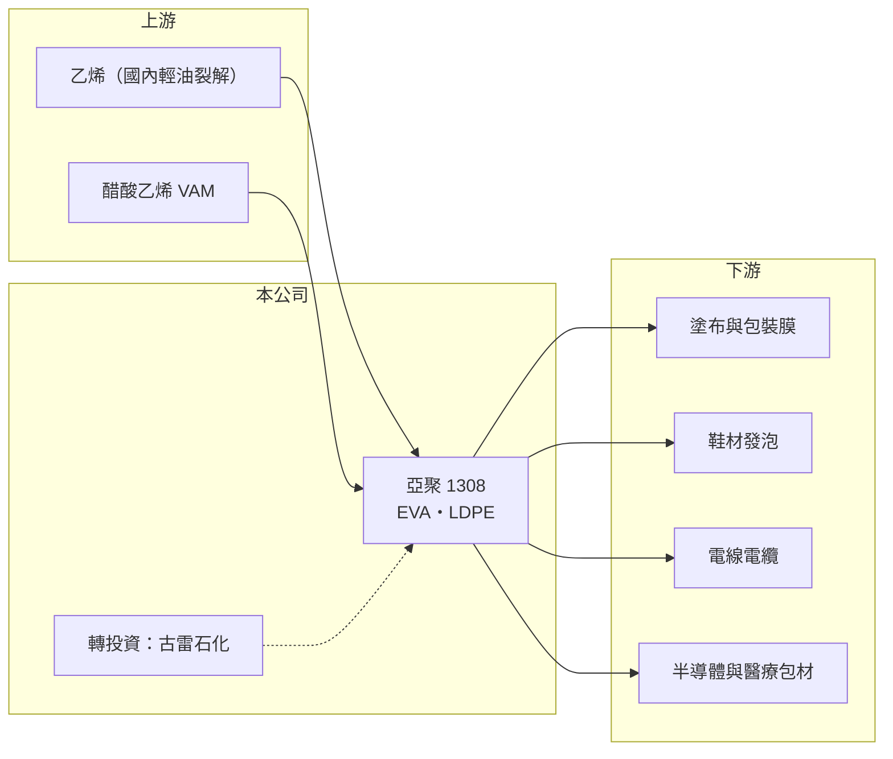

# 1308 亞聚

> 上市｜[[產業索引-塑膠工業|塑膠工業]]｜上市（櫃）日期 1986/06/20

# 第一章：企業模式與商業藍圖

> [!info] 撰寫說明
> 精簡版，由 Claude 依公開資料整理，架構比照 [[2330台積電]]，資料截至 2026-10-08。來源：MoneyDJ 理財網財務比率年表（2021 至 2025 年）與個股基本資料（2025 年營收比重、歷年股利）、富果 2026 年 5 月亞聚法說會備忘錄。#待校對

亞洲聚合（亞聚）是台聚集團旗下的聚乙烯廠，專門生產 [[EVA]] 與 [[LDPE]] 兩種樹脂，產品用途從太陽能封裝膜、鞋材到食品與半導體包裝。

- **核心業務：** 亞聚在台灣有四條高壓釜式生產線，LDPE 與 EVA 合計年產能約 15 萬噸。兩種產品都以乙烯為主要原料，EVA 另外加入醋酸乙烯（VAM），同一套高壓設備可以依市況調整兩者的產量，這是亞聚調整產品組合的基礎。
- **營收結構：** 2025 年 EVA 占 63%、LDPE 占 37%。EVA 過去最大的成長動能是太陽能封裝膜，但中國大舉擴產後光伏級 EVA 價格崩落，2026 年第一季亞聚光伏級 EVA 銷售占比已降到 0%，塗布級 EVA 則占 EVA 銷量一半以上。

- **營運據點：** 生產基地在台灣，乙烯原料主要來自國內供應（2026 年報導提到中油三輕停車影響供料）。亞聚另以[[權益法]]認列中國古雷石化等轉投資損益，這些轉投資近年是虧損的主要來源。
- **長期方向：** 公司的策略是降低競爭最激烈的光伏級 EVA，把產能轉向客製化的高端 LDPE（半導體包裝、低膠點保護膜、醫療器材），以及塗布級 EVA、超纖等附加價值較高的應用，用差異化避開標準品的價格戰。

# 第二章：護城河深度與競爭優勢

亞聚的優勢在高壓製程的彈性與利基規格，但核心產品屬於全球化的大宗商品，規模遠小於國際大廠。

- **競爭優勢：** 高壓釜式製程適合少量多樣的特殊規格，例如低膠點、高透明的 LDPE，這類產品要通過客戶的長期試用，替換供應商的成本較高。財務上負債比率長期在 11% 至 19% 之間，景氣低迷時仍有能力撐過虧損期。
- **主要對手：** 國內同業有同集團的 [[1304台聚]] 與 [[1301台塑]]，國際上則是韓國、日本與中東的聚乙烯大廠，以及近年大量擴充 EVA 產能的中國石化業者。中國新產能是 EVA 價格長期承壓的主因。
- **觀察重點：** 光伏級 EVA 退出後，亞聚能否在高端 LDPE 與塗布級 EVA 建立足夠規模，決定它能否回到 2021 至 2022 年 30% 以上的營業利益率；古雷石化等轉投資何時轉盈，則決定淨利能否跟上本業。

# 第三章：財務體質與盈利規模

資料日期：2026-10-08，表格是撰寫當時的快照；最新月營收、毛利率、累計 EPS 由自動排程寫在本筆記的屬性欄位（月營收、毛利率、累計EPS 等）。#待校對

亞聚 2021 至 2022 年受太陽能需求帶動，營業利益率超過 30%；2023 年後 EVA 價格崩落，毛利率跌到個位數，轉投資虧損更讓淨利率遠低於營業利益率。

| 年度 | 營收（億元） | [[毛利率]] | [[營業利益率]] | EPS（元） | [[ROE]] |
|---|---|---|---|---|---|
| 2021 | 約 96（推算） | 37.61% | 34.70% | 5.22 | 22.50% |
| 2022 | 約 98（推算） | 32.94% | 30.02% | 2.44 | 9.75% |
| 2023 | 約 67（推算） | 17.06% | 13.75% | 0.20 | 0.84% |
| 2024 | 約 60（推算） | 2.24% | -1.81% | -1.26 | -6.05% |
| 2025 | 約 57（推算） | 4.34% | 0.05% | -1.76 | -9.62% |

註：2025 年營收以每股營業額 9.67 元乘以股本 59.37 億元換算的約 5.94 億股推算，其他年度依 MoneyDJ 營收成長率回推。

- **長期指標：** 2021 至 2025 年營收年複合成長率約 -12%（推算），近 5 年平均 ROE 約 3.5%（推算）。現金股利由 2021 年度的 3.0 元逐年降到 2025 年度的 0.2 元，配息高度跟隨 EVA 景氣。
- **[[ROIC]] 與 [[WACC]]：** 2025 年營業利益率僅 0.05%，稅後營業利益接近零，ROIC 約 0%（推算：投入資本約 110 億元，為股東權益約 102.4 億元加上以總負債約 14.7 億元的一半推估的有息負債約 7.4 億元）；2021 與 2022 年 ROIC 約 15%（推算），五年平均約 7.1%（推算）。WACC 約 7.4%（推算：無風險利率 1.75%、市場風險溢酬 6%、β 取石化同業常見值 1.0，股東權益成本 7.75%；稅前負債成本 2.5%、稅率 20%；權益比重約 93%）。五年平均 ROIC 略低於 WACC，說明亞聚在景氣高峰賺取的超額報酬，大致被之後的低谷期抵銷。
- **財務特色：** 2024、2025 年營業利益接近損益兩平，但稅後虧損明顯擴大，差距主要來自權益法投資損失，2026 年第一季權益法損失約 1.4 億元。評估亞聚時要把本業與轉投資分開看。

# 第四章：總體風險與地緣政治

亞聚的風險集中在 EVA 供需、原料價格與轉投資。

- **產業週期：** EVA 與 LDPE 都是全球定價的大宗商品，價格由新增產能與終端需求決定。依 2026 年法說，下半年仍有超過 100 萬噸的 EVA 新產能投產，供過於求的壓力短期難以解除。
- **營運風險：** 乙烯與 VAM 價格可在數週內翻倍，2026 年東北亞乙烯一度從每噸約 700 美元漲到近 1,500 美元，原料若高價進貨後反轉，會產生存貨跌價損失；國內乙烯供應中斷時，開工率也會被迫下降。
- **其他風險：** 古雷石化等中國轉投資的獲利受中國景氣與政策影響；太陽能產業政策變化會改變 EVA 需求；石化業面臨[[碳費]]與減碳的長期成本壓力。

# 專有名詞解析

## 金融

- **[[權益法]]**：持股 20% 至 50% 的轉投資，依持股比例認列被投資公司損益的會計方法。
- **[[ROIC]]**：投入資本報酬率，稅後營業利益除以股東權益加有息負債，衡量本業運用資本的效率。
- **[[WACC]]**：加權平均資金成本，股東與債權人要求報酬率的加權平均，是 ROIC 要超越的門檻。

## 產業

- **[[EVA]]**：乙烯醋酸乙烯酯共聚物，用於太陽能模組封裝膜、鞋材與發泡材料。
- **[[LDPE]]**：低密度聚乙烯，以高壓製程生產，柔軟透明，用於包裝膜、塗布與電線被覆。
- **[[碳費]]**：政府依企業溫室氣體排放量收取的費用，台灣自 2025 年起對大排放源開徵。

# 核心供應鏈

- 上游：乙烯（國內輕油裂解廠）與醋酸乙烯（VAM）供應商；集團母公司為 [[1304台聚]]。
- 下游／客戶：塗布、包裝膜、鞋材發泡、電線電纜、太陽能封裝膜與半導體、醫療包材加工廠（客戶名稱未查得）。
- 同業：[[1304台聚]]、[[1301台塑]]、中國 EVA 新產能業者、韓國與中東聚乙烯大廠；集團內同業 [[1305華夏]]、[[1309台達化]]。

## 最新新聞
<!-- news:start -->
<!-- news:end -->

## 相關連結
- [公開資訊觀測站](https://mopsov.twse.com.tw/mops/web/t05st03?step=1&firstin=1&co_id=1308)
- [Goodinfo](https://goodinfo.tw/tw/StockDetail.asp?STOCK_ID=1308)
- [Yahoo 股市](https://tw.stock.yahoo.com/quote/1308)
- [鉅亨網新聞](https://www.cnyes.com/twstock/1308/news)
