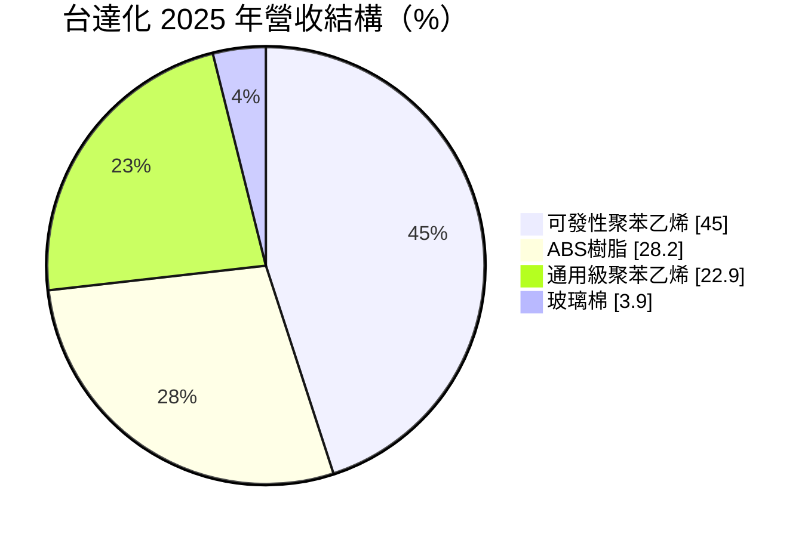
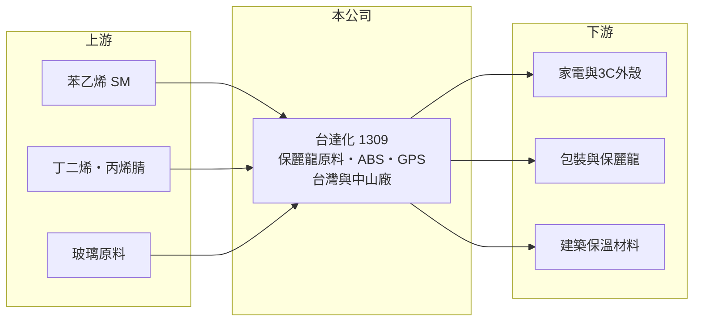

# 1309 台達化

> 上市｜[[產業索引-塑膠工業|塑膠工業]]｜上市（櫃）日期 1986/06/27

# 第一章：企業模式與商業藍圖

> [!info] 撰寫說明
> 精簡版，由 Claude 依公開資料整理，架構比照 [[2330台積電]]，資料截至 2026-10-08。來源：MoneyDJ 理財網財務比率年表（2021 至 2025 年）與個股基本資料（2025 年營收比重、歷年股利）、富果 2026 年 5 月台達化法說會備忘錄。#待校對

台達化是台聚集團旗下的苯乙烯系樹脂廠，以 [[SM]] 為原料生產保麗龍原料、[[ABS]] 與聚苯乙烯，是家電、3C 外殼與包裝材料的上游。

- **核心業務：** 台達化生產可發性聚苯乙烯（發泡成保麗龍，用於包裝與建築保溫）、ABS 樹脂（家電與 3C 外殼）、通用級與耐衝擊聚苯乙烯（GPS、HIPS），以及玻璃棉。這些產品共同的原料是苯乙烯，因此台達化的獲利主要取決於產品售價與 SM 等原料之間的[[價差]]。
- **營收結構：** 2025 年可發性聚苯乙烯約占 45%、ABS 約 28%、通用級聚苯乙烯約 23%、玻璃棉約 4%。2026 年第一季的資料顯示，可發性聚苯乙烯約三分之二來自中國中山廠，代表台達化有相當比重的營收在中國市場。

- **營運據點：** 台灣有高雄林園、前鎮與苗栗頭份廠，中國有廣東中山廠。兩岸布局讓公司可以就近供應華南家電與包裝客戶，但也讓台達化直接面對中國本土業者的價格競爭。
- **長期方向：** 公司積極開拓中國以外的市場，ABS 主攻印度與東南亞、GPS 轉向中南美；產品上開發消費後回收（[[PCR]]）等級 ABS，並受惠綠建築與公共工程對玻璃棉保溫材料的需求。

# 第二章：護城河深度與競爭優勢

台達化的優勢在兩岸產能與多元的苯乙烯產品線，但產品同質性高，護城河偏窄。

- **競爭優勢：** 同時擁有 ABS、PS 與發泡級產品，可以依各產品利差調整產量；中山廠位於華南家電與電子聚落，運輸與交期具優勢。玻璃棉屬於建材，需求跟公共工程與綠建築法規走，與石化景氣的關聯較低，可以稍微分散風險。
- **主要對手：** ABS 方面，對手是全球最大的奇美實業、韓國 LG 化學，以及國內的 [[1312國喬]]；聚苯乙烯與發泡級產品則面對中國大量本土產能。依 2026 年法說，中國原料取得成本比台灣低每噸約 100 至 200 美元，是台達化的結構性劣勢。
- **觀察重點：** 2023 至 2025 年營業利益率連續為負，代表通用級產品在中國擴產後已難以獲利。長期要看 PCR 等綠色產品與非中國市場的比重能否提高，以及台灣上游原料供應是否穩定。

# 第三章：財務體質與盈利規模

資料日期：2026-10-08，表格是撰寫當時的快照；最新月營收、毛利率、累計 EPS 由自動排程寫在本筆記的屬性欄位（月營收、毛利率、累計EPS 等）。#待校對

台達化 2021 年 EPS 4.89 元是近年高峰，之後毛利率降到 3% 至 5%，2023 至 2025 年連續三年本業虧損。

| 年度 | 營收（億元） | [[毛利率]] | [[營業利益率]] | EPS（元） | [[ROE]] |
|---|---|---|---|---|---|
| 2021 | 約 208（推算） | 16.30% | 10.82% | 4.89 | 26.39% |
| 2022 | 約 181（推算） | 9.73% | 1.25% | 1.04 | 5.54% |
| 2023 | 約 152（推算） | 2.86% | -3.05% | -0.69 | -3.95% |
| 2024 | 約 186（推算） | 4.72% | -1.94% | -0.56 | -3.45% |
| 2025 | 約 145（推算） | 4.09% | -2.92% | -1.07 | -7.09% |

註：2025 年營收以每股營業額 36.43 元乘以股本 39.76 億元換算的約 3.98 億股推算，其他年度依 MoneyDJ 營收成長率回推。

- **長期指標：** 2021 至 2025 年營收年複合成長率約 -8.6%（推算），近 5 年平均 ROE 約 3.5%（推算）。現金股利由 2021 年度的 2.0 元降到 2025 年度的 0.15 元，虧損年度仍維持小額配息。
- **[[ROIC]] 與 [[WACC]]：** 2025 年稅後營業利益約 -3.4 億元（營業利益率 -2.92% × 營收約 144.8 億元 × 0.8），投入資本約 72 億元（股東權益約 57.5 億元，加上以總負債約 28 億元的一半推估的有息負債約 14 億元），ROIC 約 -4.7%（推算）；2021 年約 18.6%，五年平均約 1.5%（推算）。WACC 約 6.6%（推算：無風險利率 1.75%、市場風險溢酬 6%、β 取石化同業常見值 1.0，股東權益成本 7.75%；稅前負債成本 2.5%、稅率 20%；權益比重約 80%）。五年平均 ROIC 明顯低於 WACC，代表台達化只在少數景氣高峰年創造價值，整個週期下來並未賺回資金成本。
- **財務特色：** 每股淨值由 20.23 元降到 14.47 元，負債比率從 22% 升到 2025 年底約 33%，2026 年第一季再升到約 37%。營收規模大但毛利薄，屬於典型的低毛利、高周轉石化加工模式。

# 第四章：總體風險與地緣政治

台達化的風險在於苯乙烯鏈的供過於求、原料供應穩定度與中國市場。

- **產業週期：** SM、ABS 與 PS 都是全球化大宗商品，中國近年大幅擴產，使亞洲報價長期偏弱。只有在油價急漲或供給中斷時，利差才會短暫擴大，例如 2021 年的景氣高峰與 2026 年初的中東衝突期間。
- **營運風險：** 台灣上游原料集中在少數供應商，2026 年第一季中油新三輕設備異常造成丁二烯短缺，台達化被迫減產；上游供應一旦中斷，開工率與固定成本吸收都會受影響。
- **其他風險：** 中國家電補貼、房市景氣影響終端需求；紅海等航運瓶頸會改變出口路線與運費；石化業面臨[[碳費]]與減塑法規的長期壓力。

# 專有名詞解析

## 金融

- **[[ROIC]]**：投入資本報酬率，稅後營業利益除以股東權益加有息負債，衡量本業運用資本的效率。
- **[[WACC]]**：加權平均資金成本，股東與債權人要求報酬率的加權平均，是 ROIC 要超越的門檻。

## 產業

- **[[SM]]**：苯乙烯單體，由苯與乙烯製成，是 PS、ABS 與合成橡膠的主要原料。
- **[[ABS]]**：丙烯腈、丁二烯與苯乙烯的共聚物，耐衝擊、易加工，用於家電、3C 外殼與汽車零件。
- **[[價差]]**：產品售價減去主要原料成本的差額，是石化業獲利的核心指標。
- **[[PCR]]**：消費後回收材料，把使用過的塑膠回收再製成原料，品牌商用來降低碳足跡。
- **[[碳費]]**：政府依企業溫室氣體排放量收取的費用，台灣自 2025 年起對大排放源開徵。

# 核心供應鏈

- 上游：苯乙烯供應商（例如 [[1310台苯]]、[[1312國喬]]，實際供應比重未查得）、丁二烯（中油新三輕）、丙烯腈（例如 [[1314中石化]]，推估）；集團母公司為 [[1304台聚]]。
- 下游／客戶：家電、3C 外殼、包裝材料與建築保溫業者（客戶名稱未查得）。
- 同業：奇美實業、LG 化學、[[1312國喬]]、中國苯乙烯系樹脂廠；集團內同業 [[1305華夏]]、[[1308亞聚]]。

## 最新新聞
<!-- news:start -->
<!-- news:end -->

## 相關連結
- [公開資訊觀測站](https://mopsov.twse.com.tw/mops/web/t05st03?step=1&firstin=1&co_id=1309)
- [Goodinfo](https://goodinfo.tw/tw/StockDetail.asp?STOCK_ID=1309)
- [Yahoo 股市](https://tw.stock.yahoo.com/quote/1309)
- [鉅亨網新聞](https://www.cnyes.com/twstock/1309/news)
