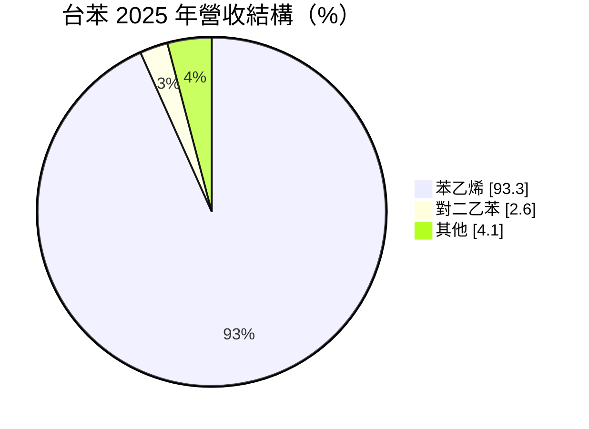
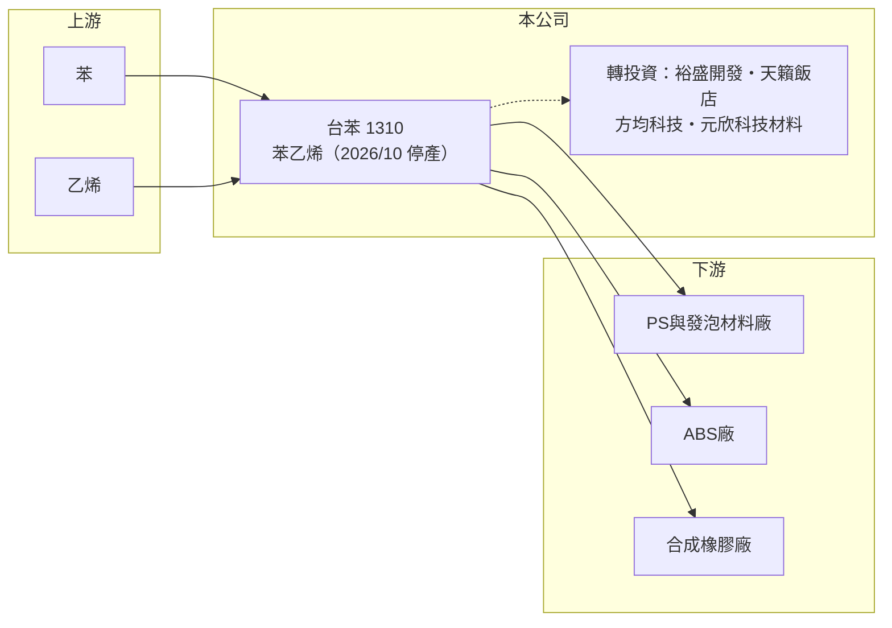

# 1310 台苯

> 上市｜[[產業索引-塑膠工業|塑膠工業]]｜上市（櫃）日期 1987/08/06

# 第一章：企業模式與商業藍圖

> [!info] 撰寫說明
> 精簡版，由 Claude 依公開資料整理，架構比照 [[2330台積電]]，資料截至 2026-10-08。來源：MoneyDJ 理財網財務比率年表（2021 至 2025 年）與個股基本資料（2025 年營收比重、歷年股利）、優分析 2026 年 7 月停產報導、聯合新聞網 2026 年 7 月轉型報導。停產後的新事業內容尚未公告，公開資料有限。#待校對

台灣苯乙烯（台苯）原本是單一產品的 [[SM]] 製造商，2026 年 7 月宣布自 10 月 1 日起停產苯乙烯廠，公司正從石化製造轉向轉投資與資產經營，是石化產業結構調整的代表案例。

- **核心業務：** 台苯過去以苯與乙烯為原料生產苯乙烯，供應下游 PS、ABS 與合成橡膠廠。停產的產線年產能約 35 萬噸，依 2025 年數據約占全台苯乙烯產能 22%。單一大宗化學品的商業模式，獲利完全取決於 SM 與原料之間的[[價差]]，沒有其他產品可以分散風險。
- **營收結構：** 2025 年苯乙烯占營收 93.3%、對二乙苯 2.6%、其他 4.1%；公司表示停產將影響約 97% 的營收。換句話說，停產後的台苯在營收上幾乎是一家新公司，未來的價值主要來自轉投資與資產，而非原本的製造本業。

- **營運據點：** 苯乙烯廠位於高雄，停產原因除了產業供過於求，也包括高雄市的脫煤政策與 2026 年[[碳費]]上路墊高生產成本。廠房、土地與設備的後續處理，公司表示將與會計師討論。
- **長期方向：** 公司表示轉型方向是轉投資事業、子公司發展與新材料。公開資料顯示主要轉投資包括裕盛開發（持股 99.99%，土地開發）、陽明山天籟大飯店（65.07%）、方均科技（36.05%）與元欣科技材料（全資），另有報導提到能源貿易、資產管理與再生能源的規畫。

# 第二章：護城河深度與競爭優勢

台苯的苯乙烯本業沒有護城河，這也是它選擇停產的原因；未來的競爭力取決於資產與轉投資的經營能力。

- **競爭優勢：** 停產前台苯的優勢只在規模與港口區位，產品與全球業者完全同質。停產後較有價值的是土地、廠房與現金部位，公司在 2026 年 7 月表示資金充足、現金流健康，這讓它有能力重新配置資本。
- **主要對手：** 原本的苯乙烯對手是國內的 [[1312國喬]]、台塑集團，以及中國大量新產能。依報導，中國 2025 年新增約 200 萬噸 SM 產能、2026 年預估再增 333 萬噸，台苯 35 萬噸的單線規模無法與之競爭。
- **觀察重點：** 停產後的觀察重點完全改變：一是土地與設備如何處理、是否產生處分利益或減損；二是轉投資與新材料投資案的規模與報酬；三是公司是否把多餘資金以減資或配息方式還給股東。

# 第三章：財務體質與盈利規模

資料日期：2026-10-08，表格是撰寫當時的快照；最新月營收、毛利率、累計 EPS 由自動排程寫在本筆記的屬性欄位（月營收、毛利率、累計EPS 等）。#待校對

台苯在 2021 至 2025 年的毛利率幾乎都是負值，2022 至 2025 年連續四年虧損，數字清楚說明停產決策的背景。

| 年度 | 營收（億元） | [[毛利率]] | [[營業利益率]] | EPS（元） | [[ROE]] |
|---|---|---|---|---|---|
| 2021 | 約 117（推算） | 1.13% | -0.73% | 0.20 | 1.42% |
| 2022 | 約 129（推算） | -2.54% | -4.18% | -0.71 | -4.71% |
| 2023 | 約 95（推算） | -4.31% | -6.40% | -0.88 | -6.63% |
| 2024 | 約 114（推算） | -3.05% | -4.84% | -0.72 | -5.22% |
| 2025 | 約 87（推算） | -6.25% | -8.33% | -1.37 | -9.62% |

註：2025 年營收以每股營業額 16.43 元乘以股本 52.79 億元換算的約 5.28 億股推算，其他年度依 MoneyDJ 營收成長率回推。2026 年 10 月停產後，營收規模將大幅縮小，上表不能代表未來。

- **長期指標：** 2021 至 2025 年營收年複合成長率約 -7%（推算），近 5 年平均 ROE 約 -5%（推算）。現金股利由 2019 年度的 1.0 元降到 2022 年度的 0.2 元，2023 至 2025 年度未配息。
- **[[ROIC]] 與 [[WACC]]：** 2025 年稅後營業利益約 -5.8 億元（營業利益率 -8.33% × 營收約 86.7 億元 × 0.8），投入資本約 86 億元（股東權益約 74 億元，加上以總負債約 24 億元的一半推估的有息負債約 12 億元），ROIC 約 -6.7%（推算）；2021 至 2025 年每年都是負值，平均約 -4.9%（推算）。WACC 約 6.9%（推算：無風險利率 1.75%、市場風險溢酬 6%、β 取石化同業常見值 1.0，股東權益成本 7.75%；稅前負債成本 2.5%、稅率 20%；權益比重約 86%）。ROIC 連續五年低於 WACC，代表苯乙烯本業長期在消耗股東資本，停產在財務上是止血的決定。
- **財務特色：** 負債比率維持在 21% 至 27%，財務不算吃緊；每股淨值在 12 至 14 元之間，虧損沒有大幅侵蝕淨值，部分原因是轉投資與業外收益的支撐（推估）。

# 第四章：總體風險與地緣政治

停產之後，台苯的風險從石化景氣轉為轉型執行與資產處置。

- **產業週期：** 苯乙烯產業在中國持續擴產下，預期要到產能整併後才會復甦；台苯已表示停產後短期內沒有復工規畫，因此不再受益於石化景氣反彈。
- **營運風險：** 新事業方向尚未具體公告，轉型可能需要多年才能產生穩定營收；轉投資涵蓋土地開發、飯店與新材料，彼此關聯低，經營難度與資本配置品質是最大的不確定因素。
- **其他風險：** 停產涉及員工安置、設備處分與可能的資產減損；廠區土地若要轉作他用，需符合工業區與環保法規；在新事業成形前，公司可能長期處於低營收、靠業外收益的狀態。

# 專有名詞解析

## 金融

- **[[ROIC]]**：投入資本報酬率，稅後營業利益除以股東權益加有息負債，衡量本業運用資本的效率。
- **[[WACC]]**：加權平均資金成本，股東與債權人要求報酬率的加權平均，是 ROIC 要超越的門檻。

## 產業

- **[[SM]]**：苯乙烯單體，由苯與乙烯製成，是 PS、ABS 與合成橡膠的主要原料。
- **[[價差]]**：產品售價減去主要原料成本的差額，是石化業獲利的核心指標。
- **[[碳費]]**：政府依企業溫室氣體排放量收取的費用，台灣自 2025 年起對大排放源開徵。

# 核心供應鏈

- 上游：苯與乙烯供應商，例如國內輕油裂解廠 [[6505台塑化]]（實際供應來源未查得）。
- 下游／客戶：停產前供應 PS、可發性聚苯乙烯、ABS 與合成橡膠廠，例如 [[1309台達化]]（推估，客戶名單未揭露）。
- 同業：[[1312國喬]]、台塑集團、中國苯乙烯新產能業者。

## 最新新聞
<!-- news:start -->
<!-- news:end -->

## 相關連結
- [公開資訊觀測站](https://mopsov.twse.com.tw/mops/web/t05st03?step=1&firstin=1&co_id=1310)
- [Goodinfo](https://goodinfo.tw/tw/StockDetail.asp?STOCK_ID=1310)
- [Yahoo 股市](https://tw.stock.yahoo.com/quote/1310)
- [鉅亨網新聞](https://www.cnyes.com/twstock/1310/news)
