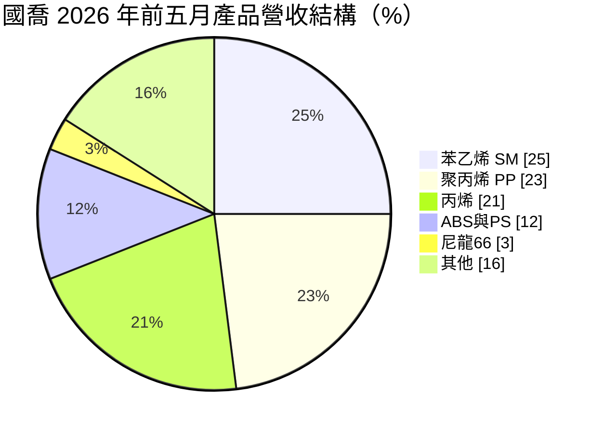
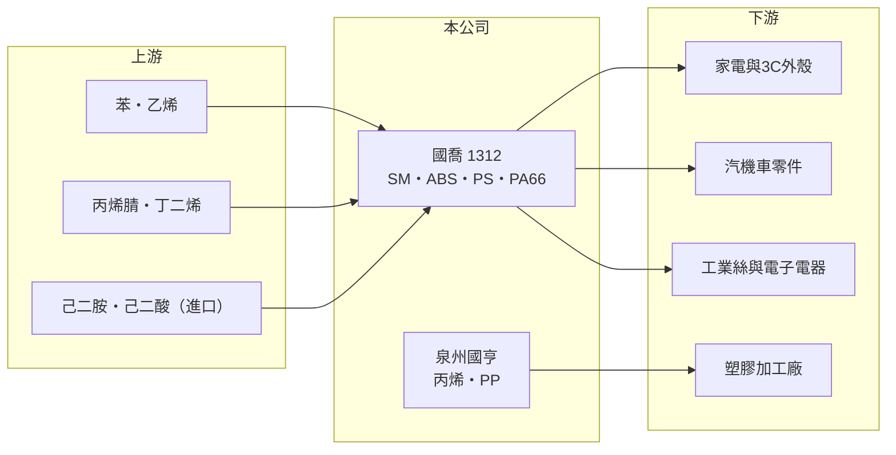

# 1312 國喬

> 上市｜[[產業索引-塑膠工業|塑膠工業]]｜上市（櫃）日期 1988/12/21

# 第一章：企業模式與商業藍圖

> [!info] 撰寫說明
> 精簡版，由 Claude 依公開資料整理，架構比照 [[2330台積電]]，資料截至 2026-10-08。來源：MoneyDJ 理財網財務比率年表（2021 至 2025 年）與個股基本資料（2025 年營收比重、歷年股利）、富果 2026 年 6 月國喬法說會備忘錄。#待校對

國喬石油化學以 [[SM]] 與 [[ABS]] 起家，是台灣唯一的 [[PA66]] 生產商，2025 年透過中國子公司泉州國亨跨入丙烯與 PP，營收結構因此大幅改變。

- **核心業務：** 國喬在台灣以苯與乙烯生產苯乙烯，再把約六成自產 SM 用來生產 ABS 與聚苯乙烯；尼龍 66 則以進口的己二胺與己二酸聚合而成，用於汽車零件、電子電器與工業絲。2025 年 3 月泉州國亨商轉並併入營收，新增丙烯與聚丙烯產品。
- **營收結構：** 2025 年依 MoneyDJ 分類，塑膠製品占 39.56%、石化產品占 39.51%、其他占 14.29%，另有 6.63% 來自廣告視訊頻道。依 2026 年前五月的產品別資料，SM 占 25%、PP 占 23%、丙烯占 21%、ABS 與 PS 占 12%、PA66 占 3%，其他（含媒體收入、包材）占 16%。

- **營運據點：** 生產基地在台灣與中國福建泉州，另透過轉投資參與漳州奇美的 ABS 事業。銷售地區已大幅分散，中國占比由 2021 年的 65% 以上降到 2026 年前五月的 25% 以下，東南亞與南亞則升到約六成。
- **長期方向：** 公司的策略是分散原料來源、優化產能配置，並規畫在一到兩年內投入電子級低碳高純氫，結合綠電供應半導體產業。這代表國喬試圖把石化本業累積的氫氣與氣體處理能力，延伸到需求較穩定的電子材料市場。

# 第二章：護城河深度與競爭優勢

國喬的優勢在產品線的垂直整合與台灣獨家的尼龍 66，但大宗石化產品仍面對中國產能的強大壓力。

- **競爭優勢：** SM 自產自用、再做成 ABS，可以在 SM 價格波動時保有一定的調節空間；尼龍 66 是台灣唯一產能，客戶在地採購可以縮短交期。泉州國亨讓國喬取得丙烯與 PP 的產能，但也把中國市場的競爭與財務槓桿一起帶進來。
- **主要對手：** 苯乙烯方面是 [[1310台苯]]（2026 年 10 月停產）、台塑集團與中國新產能；ABS 方面是奇美實業、LG 化學與 [[1309台達化]]；PP 與丙烯則是中國大量的丙烷脫氫業者。依 2026 年法說，中國 SM 產能已達 2,200 至 2,300 萬噸，開工率約 65%，並由淨進口國轉為淨出口國。
- **觀察重點：** 公司引述亞洲石化會議預測，產業將由擴張轉為整併，2029 年可能是復甦轉折點。長期要看泉州國亨能否轉盈、利息負擔是否下降，以及高純氫等新事業能否落地。

# 第三章：財務體質與盈利規模

資料日期：2026-10-08，表格是撰寫當時的快照；最新月營收、毛利率、累計 EPS 由自動排程寫在本筆記的屬性欄位（月營收、毛利率、累計EPS 等）。#待校對

國喬 2021 年 EPS 6.47 元是近年高峰，2022 年起連續四年虧損；2025 年營收因泉州國亨併入而大增，但毛利率轉負，虧損反而擴大。

| 年度 | 營收（億元） | [[毛利率]] | [[營業利益率]] | EPS（元） | [[ROE]] |
|---|---|---|---|---|---|
| 2021 | 約 302（推算） | 20.59% | 12.92% | 6.47 | 17.28% |
| 2022 | 約 243（推算） | 4.79% | -4.33% | -0.56 | -1.21% |
| 2023 | 約 211（推算） | 2.85% | -6.95% | -1.59 | -4.01% |
| 2024 | 約 220（推算） | 3.11% | -10.19% | -1.42 | -4.66% |
| 2025 | 約 303（推算） | -6.92% | -17.88% | -3.97 | -13.26% |

註：2025 年營收以每股營業額 20.10 元乘以股本 150.66 億元換算的約 15.07 億股推算，其他年度依 MoneyDJ 營收成長率回推。若以各年每股營業額直接換算，2021 年會高於上表，可能與股本變動有關，數字以公司財報為準。

- **長期指標：** 2021 至 2025 年營收年複合成長率約 0%（推算），近 5 年平均 ROE 約 -1.2%（推算）。現金股利 2021 年度 2.0 元、2022 年度 0.5 元，2023 至 2025 年度未配息。
- **[[ROIC]] 與 [[WACC]]：** 2025 年稅後營業利益約 -43.3 億元（營業利益率 -17.88% × 營收約 302.8 億元 × 0.8），投入資本約 593 億元（股東權益約 386.6 億元，加上以總負債約 412 億元的一半推估的有息負債約 206 億元），ROIC 約 -7.3%（推算）；2021 年約 4.8%，五年平均約 -1.7%（推算）。WACC 約 5.7%（推算：無風險利率 1.75%、市場風險溢酬 6%、β 取石化同業常見值 1.0，股東權益成本 7.75%；稅前負債成本 2.5%、稅率 20%；權益比重約 65%）。ROIC 長期低於 WACC，且泉州國亨的大型投資尚未產生正報酬，國喬目前處於價值毀損期。
- **財務特色：** 負債比率由 2021 年的 19.8% 升到 2025 年的 51.6%，主要是泉州國亨的建廠資金；2026 年第一季業外淨損 4.68 億元，包含泉州國亨的利息支出與漳州奇美的虧損。每股淨值由 38.35 元降到 25.66 元。

# 第四章：總體風險與地緣政治

國喬的風險在於中國石化產能過剩、海外子公司的財務負擔與原料供應。

- **產業週期：** SM、ABS、PP 都處於中國大規模擴產後的供過於求期，業界預估要到 2029 年前後才可能因產能整併而復甦。在這之前，利差主要靠油價或供給中斷等突發事件短暫改善。
- **營運風險：** 泉州國亨商轉初期的開工率、成本與利息支出，是國喬虧損擴大的主要來源；SM 廠歲修或上游原料中斷時，出貨量會明顯下滑。尼龍 66 的原料全數進口，供應與價格受國際大廠影響。
- **其他風險：** 中東情勢與荷莫茲海峽航運會影響原料成本；中國子公司暴露在兩岸政策與匯率風險下；台灣[[碳費]]與減碳要求則會墊高石化本業成本。

# 專有名詞解析

## 金融

- **[[ROIC]]**：投入資本報酬率，稅後營業利益除以股東權益加有息負債，衡量本業運用資本的效率。
- **[[WACC]]**：加權平均資金成本，股東與債權人要求報酬率的加權平均，是 ROIC 要超越的門檻。

## 產業

- **[[SM]]**：苯乙烯單體，由苯與乙烯製成，是 PS、ABS 與合成橡膠的主要原料。
- **[[ABS]]**：丙烯腈、丁二烯與苯乙烯的共聚物，耐衝擊、易加工，用於家電、3C 外殼與汽車零件。
- **[[PA66]]**：尼龍 66，由己二胺與己二酸聚合的工程塑膠與纖維，耐熱、強度高，用於汽車零件與工業絲。
- **[[碳費]]**：政府依企業溫室氣體排放量收取的費用，台灣自 2025 年起對大排放源開徵。

# 核心供應鏈

- 上游：苯與乙烯多購自中油、部分苯自行進口；丙烯腈（例如 [[1314中石化]]，推估）與丁二烯外購；尼龍 66 原料己二胺、己二酸全數進口。
- 下游／客戶：家電、3C、汽機車零件、電子電器與工業絲業者，以及 PP 加工廠（客戶名稱未查得）。
- 同業：[[1310台苯]]、[[1309台達化]]、奇美實業、LG 化學、中國苯乙烯與丙烷脫氫業者。

## 最新新聞
<!-- news:start -->
<!-- news:end -->

## 相關連結
- [公開資訊觀測站](https://mopsov.twse.com.tw/mops/web/t05st03?step=1&firstin=1&co_id=1312)
- [Goodinfo](https://goodinfo.tw/tw/StockDetail.asp?STOCK_ID=1312)
- [Yahoo 股市](https://tw.stock.yahoo.com/quote/1312)
- [鉅亨網新聞](https://www.cnyes.com/twstock/1312/news)
