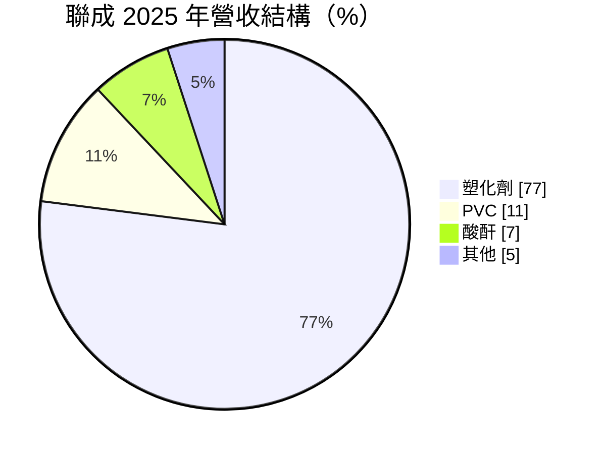
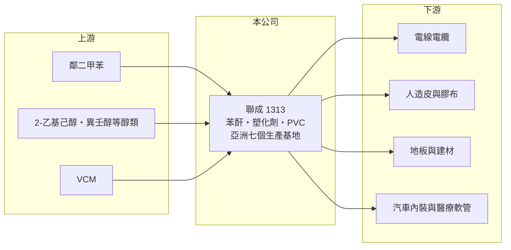

# 1313 聯成

> 上市｜[[產業索引-塑膠工業|塑膠工業]]｜上市（櫃）日期 1989/03/27

# 第一章：企業模式與商業藍圖

> [!info] 撰寫說明
> 精簡版，由 Claude 依公開資料整理，架構比照 [[2330台積電]]，資料截至 2026-10-08。來源：MoneyDJ 理財網財務比率年表（2021 至 2025 年）與個股基本資料（2025 年營收比重、歷年股利）、富果 2026 年 8 月聯成上半年法說會備忘錄。#待校對

聯成化學是聯華神通集團旗下的石化公司，自稱全球最大的[[苯酐]]與[[塑化劑]]製造商，產品是讓 PVC 變軟的關鍵添加劑。

- **核心業務：** 聯成以鄰二甲苯生產苯酐（PA），再與醇類反應製成 DOP、DINP 等通用塑化劑，以及非鄰苯類的特殊塑化劑 DINCH；另外生產 [[PVC]] 與不飽和聚酯樹脂。塑化劑加入 PVC 後可以做成電線被覆、人造皮、地板、膠布與醫療軟管，因此聯成的需求跟著軟質 PVC 製品的景氣走。
- **營收結構：** 2025 年塑化劑占 77%、PVC 占 11%、酸酐占 7%、其他占 5%。塑化劑占比最高，代表聯成的獲利主要取決於塑化劑售價與苯酐、醇類原料之間的[[價差]]。

- **營運據點：** 公司在亞洲有七個生產基地，包括台灣、中國與馬來西亞等地（推估，各廠完整清單本次未查得）。多國生產讓聯成可以依各國關稅選擇出貨地，例如 2026 年美國對中國產 DINP 的稅率約 44%，台灣與馬來西亞分別約 10% 與 16.5%，台灣廠對美訂單因此大增。
- **長期方向：** 產品組合往苯酐與 DINP 集中，縮減 DOP 與 PVC；DINCH 等不含鄰苯的環保塑化劑，受惠歐美法規對傳統塑化劑的限制，是附加價值較高的方向。

# 第二章：護城河深度與競爭優勢

聯成的優勢在規模、苯酐與塑化劑的垂直整合，以及跨國產能的關稅彈性。

- **競爭優勢：** 從苯酐一路做到塑化劑，比只做下游的業者更能掌握成本；全球最大的規模讓它在原料採購與出口物流上具優勢。七個生產基地分散在不同國家，面對貿易壁壘時可以調整出貨國，這在關稅頻繁變動的年代是重要的護城河。
- **主要對手：** 主要對手是中國的塑化劑與苯酐廠、韓國的塑化劑業者，以及在 DINCH 領域領先的歐洲化工大廠；國內則有 [[1303南亞]] 等同時生產塑化劑的石化公司。中國低價出口是壓低亞洲報價的主因。
- **觀察重點：** 2021 至 2025 年營業利益率只有一年為正，說明規模優勢不足以抵銷產業供過於求。長期要看環保塑化劑與關稅帶來的美國訂單能否成為穩定利潤來源，而不只是一次性的轉單效應。

# 第三章：財務體質與盈利規模

資料日期：2026-10-08，表格是撰寫當時的快照；最新月營收、毛利率、累計 EPS 由自動排程寫在本筆記的屬性欄位（月營收、毛利率、累計EPS 等）。#待校對

聯成營收規模達數百億元，但毛利率長期只有 0% 至 6%，屬於高營收、低毛利的大宗化學品模式；2022 至 2025 年連續四年虧損。

| 年度 | 營收（億元） | [[毛利率]] | [[營業利益率]] | EPS（元） | [[ROE]] |
|---|---|---|---|---|---|
| 2021 | 約 819（推算） | 6.27% | 2.99% | 1.66 | 7.83% |
| 2022 | 約 728（推算） | 0.47% | -3.26% | -0.94 | -4.41% |
| 2023 | 約 732（推算） | 3.02% | -0.27% | -0.21 | -1.01% |
| 2024 | 約 733（推算） | -0.24% | -3.65% | -1.79 | -8.01% |
| 2025 | 約 588（推算） | 2.02% | -2.47% | -1.17 | -5.28% |

註：2025 年營收以每股營業額 44.16 元乘以股本 133.08 億元換算的約 13.31 億股推算，其他年度依 MoneyDJ 營收成長率回推。2026 年上半年營收約 310.7 億元、毛利率 6.5%、稅後淨利約 4 億元，已轉為獲利。

- **長期指標：** 2021 至 2025 年營收年複合成長率約 -8%（推算），近 5 年平均 ROE 約 -2.2%（推算）。現金股利由 2021 年度的 1.0 元降到 2025 年度的 0.1 元，虧損年度仍維持小額配息。
- **[[ROIC]] 與 [[WACC]]：** 2025 年稅後營業利益約 -11.6 億元（營業利益率 -2.47% × 營收約 587.7 億元 × 0.8），投入資本約 415 億元（股東權益約 294 億元，加上以總負債約 241 億元的一半推估的有息負債約 120 億元），ROIC 約 -2.8%（推算）；2021 年約 4.6%，五年平均約 -1.7%（推算）。WACC 約 6.1%（推算：無風險利率 1.75%、市場風險溢酬 6%、β 取石化同業常見值 1.0，股東權益成本 7.75%；稅前負債成本 2.5%、稅率 20%；權益比重約 71%）。即使在 2021 年的好景氣，ROIC 也低於 WACC，代表塑化劑這門生意在現有產業結構下很難賺回資金成本。
- **財務特色：** 負債比率維持在 44% 至 48%，2026 年第二季流動比率 236.8%，短期償債能力穩健。每股淨值約 22 元，五年間變化不大，虧損主要由營收規模與淨值吸收。

# 第四章：總體風險與地緣政治

聯成的風險在於中國塑化劑產能、原料價格與貿易政策的變化。

- **產業週期：** 塑化劑與苯酐都是全球化商品，中國產能擴充與出口決定亞洲報價；需求則跟著電線、人造皮、地板與汽車內裝等軟質 PVC 製品，與營建和消費景氣連動。
- **營運風險：** 鄰二甲苯與醇類原料跟著油價波動，原料急漲而報價跟不上時，薄利的塑化劑很快轉為虧損；高油價、高醇價與高利率是公司在 2026 年點名的主要風險。
- **其他風險：** 美國 301 關稅與印度 PVC 進口價格管制帶來的轉單，可能隨政策改變而消失；歐美對鄰苯類塑化劑的法規限制持續擴大，若環保產品轉型速度不夠快，傳統 DOP 需求會逐步萎縮。

# 專有名詞解析

## 金融

- **[[ROIC]]**：投入資本報酬率，稅後營業利益除以股東權益加有息負債，衡量本業運用資本的效率。
- **[[WACC]]**：加權平均資金成本，股東與債權人要求報酬率的加權平均，是 ROIC 要超越的門檻。

## 產業

- **[[苯酐]]**：鄰苯二甲酸酐，以鄰二甲苯氧化製成，是生產塑化劑與不飽和聚酯樹脂的原料。
- **[[塑化劑]]**：加入 PVC 等塑膠中使其柔軟、有彈性的添加劑，常見的有 DOP、DINP 與 DINCH。
- **[[PVC]]**：聚氯乙烯，用於水管、電線被覆、地板與建材的通用塑膠。
- **[[價差]]**：產品售價減去主要原料成本的差額，是石化業獲利的核心指標。

# 核心供應鏈

- 上游：鄰二甲苯、醇類與 VCM 供應商（名稱未查得，國內芳香烴來源例如 [[6505台塑化]]，推估）。
- 下游／客戶：電線電纜、人造皮、膠布、地板、汽車內裝與醫療軟管等軟質 PVC 加工廠，以及美國塑化劑進口商（客戶名稱未查得）。
- 同業：[[1303南亞]]、中國塑化劑與苯酐廠、韓國塑化劑業者、歐洲 DINCH 供應商。

## 最新新聞
<!-- news:start -->
<!-- news:end -->

## 相關連結
- [公開資訊觀測站](https://mopsov.twse.com.tw/mops/web/t05st03?step=1&firstin=1&co_id=1313)
- [Goodinfo](https://goodinfo.tw/tw/StockDetail.asp?STOCK_ID=1313)
- [Yahoo 股市](https://tw.stock.yahoo.com/quote/1313)
- [鉅亨網新聞](https://www.cnyes.com/twstock/1313/news)
