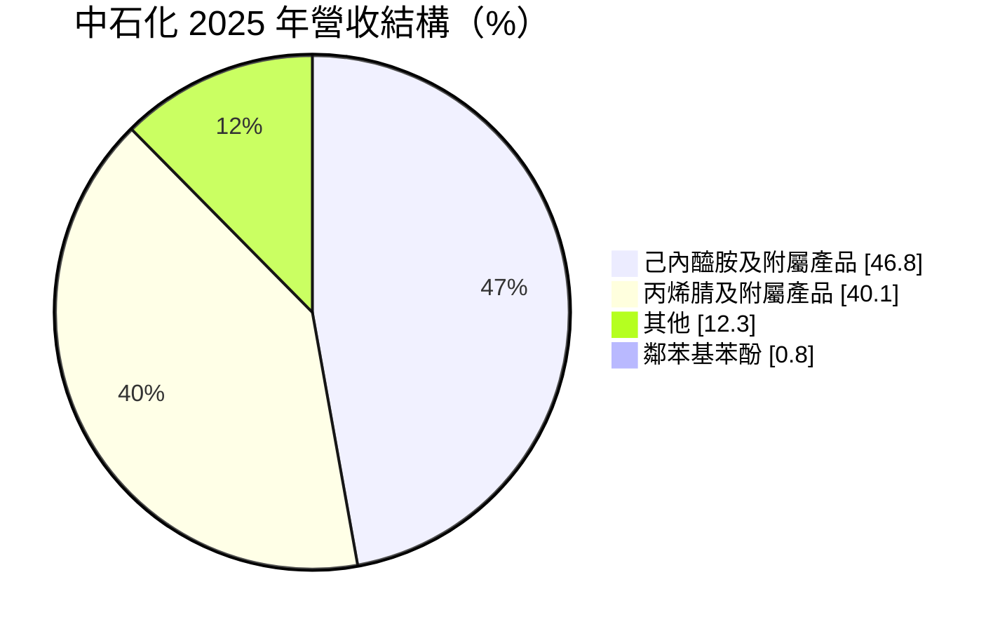
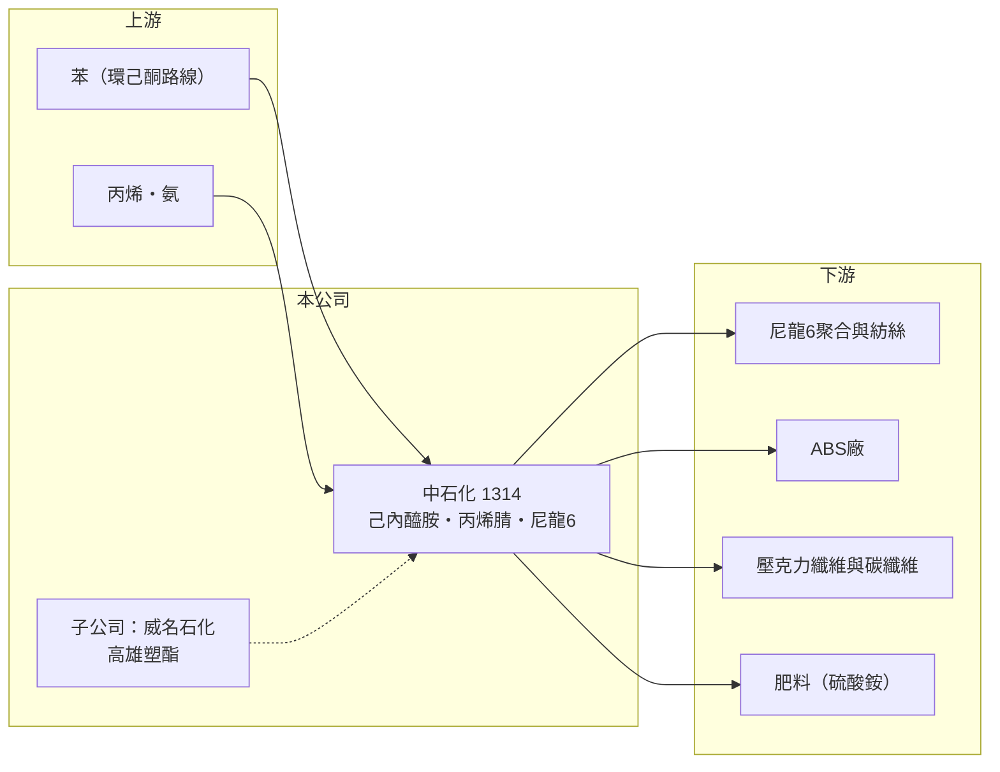

# 1314 中石化

> 上市｜[[產業索引-塑膠工業|塑膠工業]]｜上市（櫃）日期 1991/07/12

# 第一章：企業模式與商業藍圖

> [!info] 撰寫說明
> 精簡版，由 Claude 依公開資料整理，架構比照 [[2330台積電]]，資料截至 2026-10-08。來源：MoneyDJ 理財網財務比率年表（2021 至 2025 年）與個股基本資料（2025 年營收比重、歷年股利）、富果 2026 年 4 月中石化法說會備忘錄。廠區位置與部分上下游關係為推估。#待校對

中國石油化學工業開發（中石化）是台灣主要的[[己內醯胺]]（CPL）與[[丙烯腈]]（AN）製造商，前者是尼龍 6 的原料，後者是 ABS 與碳纖維的原料；公司同時擁有大量土地與轉投資，是一家「石化本業加資產」的公司。

- **核心業務：** 中石化生產己內醯胺與副產品硫酸銨、丙烯腈及其附屬產品，另有尼龍 6 粒與少量鄰苯基苯酚。CPL 經聚合成尼龍 6 後做成紡織纖維、輪胎簾布與工程塑膠，AN 則供應 [[ABS]]、壓克力纖維與碳纖維廠，因此中石化位在合成纖維與工程塑膠的上游。
- **營收結構：** 2025 年己內醯胺及附屬產品占 46.81%、丙烯腈及附屬產品占 40.14%、其他占 12.28%、鄰苯基苯酚占 0.77%。兩大產品合計近九成，獲利高度取決於 CPL 與 AN 的[[價差]]。

- **營運據點：** 生產基地在台灣（主要在高雄，另有頭份等廠區，推估），並有子公司威名石化。公司在高雄洲際碼頭擁有儲槽，第三期預計 2026 年投入營運；另興建燃氣機組，降低對燃煤蒸汽的依賴。
- **長期方向：** 一是[[資產活化]]，推動高雄前鎮特貿五區、橋頭土地標售與京華廣場土地處分；二是發展新事業，包括新能源電池用的無鹵阻燃劑、5G 毫米波銅箔基板用的低介電樹脂，以及電子級化學品；三是收購高雄塑酯 100% 股權，強化 AN 產業鏈整合。

# 第二章：護城河深度與競爭優勢

中石化在 CPL 與 AN 具有國內規模，但兩項產品都面對中國大規模擴產，本業護城河薄；真正的價值支撐來自土地與轉投資。

- **競爭優勢：** CPL 與 AN 的製程複雜、投資金額大，台灣能生產的業者很少，中石化與國內尼龍、ABS 廠地理相近，物流成本較低。公司持有的高雄土地位置佳，在都市發展下具開發價值，是石化同業少見的資產優勢。
- **主要對手：** CPL 方面，中國在過去十年大幅擴產，已從進口國轉為自給甚至出口，是壓低亞洲報價的主因；AN 方面，對手包括 [[1301台塑]] 與中國、日韓的丙烯腈廠。
- **觀察重點：** 2025 年 CPL 與尼龍 6 產銷量年減約四成、工廠稼動率約 50%，代表本業處於結構性低谷。長期要看土地處分能否轉為實際現金、新事業能否取得量產訂單，以及威名石化的重組進度。

# 第三章：財務體質與盈利規模

資料日期：2026-10-08，表格是撰寫當時的快照；最新月營收、毛利率、累計 EPS 由自動排程寫在本筆記的屬性欄位（月營收、毛利率、累計EPS 等）。#待校對

中石化近五年本業只有 2021 年獲利，2022 至 2025 年毛利率在 -10% 至 1% 之間；EPS 能維持在零附近，主要靠業外收益。

| 年度 | 營收（億元） | [[毛利率]] | [[營業利益率]] | EPS（元） | [[ROE]] |
|---|---|---|---|---|---|
| 2021 | 約 352（推算） | 14.18% | 6.83% | 1.06 | 4.61% |
| 2022 | 約 250（推算） | -4.93% | -15.37% | 0.06 | 0.26% |
| 2023 | 約 264（推算） | -4.12% | -11.55% | -0.28 | -1.37% |
| 2024 | 293.7 | 0.93% | -6.22% | 0.07 | 0.94% |
| 2025 | 192.1 | -9.57% | -18.56% | -0.78 | -3.52% |

註：2024 與 2025 年營收取自 2026 年法說會，其他年度依 MoneyDJ 營收成長率回推。

- **長期指標：** 2021 至 2025 年營收年複合成長率約 -14%（推算），近 5 年平均 ROE 約 0.2%（推算）。現金股利只有 2019 年度 0.3 元與 2021 年度 0.4 元，2022 至 2025 年度未配息。
- **[[ROIC]] 與 [[WACC]]：** 2025 年稅後營業利益約 -28.5 億元（營業利益率 -18.56% × 營收 192.1 億元 × 0.8），投入資本約 1,028 億元（股東權益約 763 億元，加上以總負債約 530 億元的一半推估的有息負債約 265 億元），ROIC 約 -2.8%（推算）；五年平均約 -1.5%（推算）。WACC 約 6.3%（推算：無風險利率 1.75%、市場風險溢酬 6%、β 取石化同業常見值 1.0，股東權益成本 7.75%；稅前負債成本 2.5%、稅率 20%；權益比重約 74%）。本業 ROIC 長期低於 WACC，龐大的淨值主要由土地與轉投資構成，這些資產若不能轉為現金流，股東報酬會持續偏低。
- **財務特色：** 2025 年營業淨損 35.7 億元，但業外淨收益 10.9 億元，稅後淨損收斂為 29.9 億元；2024 年則靠業外收益轉為小幅獲利。負債總額由 625 億元降到 530 億元，負債比率約 41%。股本約 378 億元，規模大但每股獲利能力低。

# 第四章：總體風險與地緣政治

中石化的風險在於 CPL 與 AN 的中國產能、本業虧損的持續性與資產處分的不確定性。

- **產業週期：** CPL 與 AN 都是資本密集的大宗化學品，中國擴產使供過於求成為常態，只有在油價急漲或供給中斷時，報價才會短暫走高。尼龍需求又與紡織成衣、汽車景氣連動，波動來源多。
- **營運風險：** 稼動率長期只有五成上下，固定成本難以攤提；子公司威名石化營收大幅下滑，公司已規劃縮編並可能引進策略投資人或重組。新事業目前仍在送樣與小量訂單階段，距離成為獲利支柱還有距離。
- **其他風險：** 土地處分受法規、都市計畫與房地產市場影響，時程難以掌握；台南安順廠的歷史污染整治已接近完成，但環保責任是石化老廠的長期包袱；台灣[[碳費]]也會墊高高耗能製程的成本。

# 專有名詞解析

## 金融

- **[[ROIC]]**：投入資本報酬率，稅後營業利益除以股東權益加有息負債，衡量本業運用資本的效率。
- **[[WACC]]**：加權平均資金成本，股東與債權人要求報酬率的加權平均，是 ROIC 要超越的門檻。

## 產業

- **[[己內醯胺]]**：生產尼龍 6 的單體原料，簡稱 CPL，製程副產品為硫酸銨肥料。
- **[[丙烯腈]]**：以丙烯與氨製成的化學品，簡稱 AN，是 ABS、壓克力纖維與碳纖維的原料。
- **[[ABS]]**：丙烯腈、丁二烯與苯乙烯的共聚物，耐衝擊、易加工，用於家電、3C 外殼與汽車零件。
- **[[價差]]**：產品售價減去主要原料成本的差額，是石化業獲利的核心指標。
- **[[資產活化]]**：把閒置或低效益的土地、廠房透過出售、出租或開發轉為收益的做法。
- **[[碳費]]**：政府依企業溫室氣體排放量收取的費用，台灣自 2025 年起對大排放源開徵。

# 核心供應鏈

- 上游：苯、丙烯與氨等基本原料供應商，例如 [[6505台塑化]] 與中油（推估，實際供應比重未查得）。
- 下游／客戶：尼龍 6 紡絲與工程塑膠廠、ABS 廠（例如 [[1309台達化]]、[[1312國喬]]，推估）、壓克力纖維與碳纖維廠、肥料通路。
- 同業：[[1301台塑]]（丙烯腈）、中國己內醯胺與丙烯腈廠、日韓化工廠。

## 最新新聞
<!-- news:start -->
<!-- news:end -->

## 相關連結
- [公開資訊觀測站](https://mopsov.twse.com.tw/mops/web/t05st03?step=1&firstin=1&co_id=1314)
- [Goodinfo](https://goodinfo.tw/tw/StockDetail.asp?STOCK_ID=1314)
- [Yahoo 股市](https://tw.stock.yahoo.com/quote/1314)
- [鉅亨網新聞](https://www.cnyes.com/twstock/1314/news)
