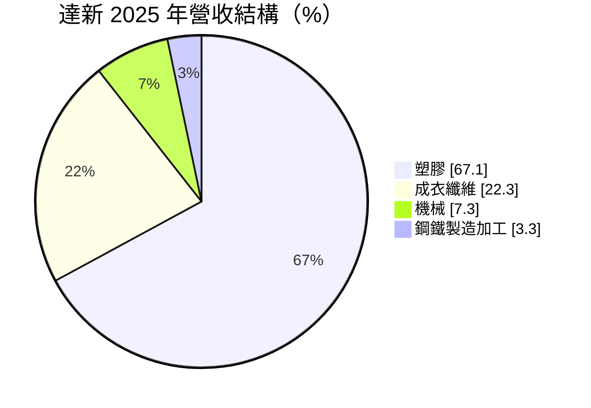
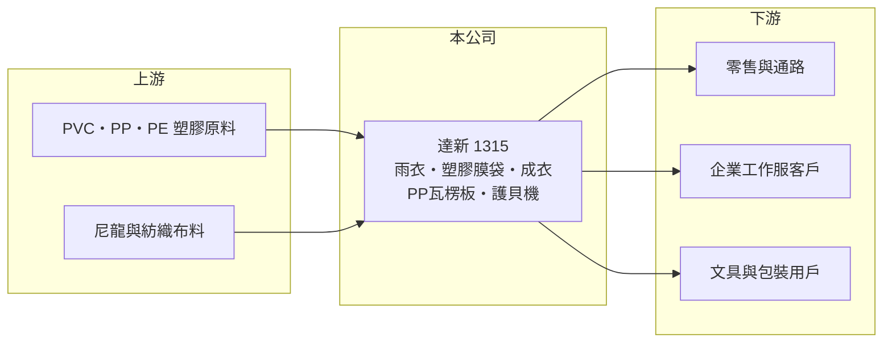

# 1315 達新

> 上市｜[[產業索引-塑膠工業|塑膠工業]]｜上市（櫃）日期 1992/05/09

# 第一章：企業模式與商業藍圖

> [!info] 撰寫說明
> 精簡版，由 Claude 依公開資料整理，架構比照 [[2330台積電]]，資料截至 2026-10-08。來源：MoneyDJ 理財網財務比率年表（2021 至 2025 年）與個股基本資料（2025 年營收比重、歷年股利）、nStock 達新公司概況。公開資料有限，業外收益的具體來源與工廠據點未查得；成立年份兩個來源不一致（MoneyDJ 為 1966 年，nStock 寫民國 47 年），以公司年報為準。#待校對

達新工業是老牌的塑膠製品與成衣公司，以塑膠雨衣、尼龍雨衣、工作服與塑膠膜袋起家；財務上的特色是本業獲利微薄，但淨值龐大、負債極低，配息主要來自[[業外收益]]。

- **核心業務：** 依 nStock 的公司概況，達新的產品包括塑膠雨衣、尼龍雨衣、工作服、尼龍夾克、TC 成衣、衣櫥、PP 瓦楞板、皮件、手提袋、卷宗夾、塑膠膜與袋，以及護貝機。這是一家以塑膠加工與成衣縫製為主、產品多樣的傳統製造業，單一產品規模都不大。
- **營收結構：** 2025 年塑膠產品占 67.06%、成衣纖維占 22.32%、機械占 7.34%、鋼鐵製造加工占 3.28%。塑膠製品是主力，機械應與護貝機等產品相關（推估）。

- **營運據點：** 生產與銷售據點本次未查得。2025 年營收約 22.86 億元，規模多年維持在 21 億至 27 億元之間。
- **長期方向：** 公司未在本次查得的資料中說明長期策略。從財務結構看，達新的價值主要建立在累積的淨值與業外收益上，本業則維持穩定但低利潤的經營。

# 第二章：護城河深度與競爭優勢

達新的本業屬於競爭激烈的傳統加工業，護城河有限；真正的競爭力來自極低的負債與穩定的業外收入。

- **競爭優勢：** 長期經營累積的品項與通路，讓達新能在雨衣、工作服等利基產品維持穩定訂單（推估）。負債比率長期在 6% 至 9% 之間，每股淨值超過 100 元，財務體質在台股傳產中非常保守。
- **主要對手：** 雨衣、塑膠膜袋與成衣的對手主要是中國與東南亞的低成本加工廠，具體公司本次未查得。這類產品以價格競爭為主，品牌溢價低。
- **觀察重點：** 營業利益率在 2024、2025 年轉負，本業已無法自給；觀察重點是業外收益能否持續支撐配息，以及公司是否運用龐大的淨值發展新事業或提升本業效率。

# 第三章：財務體質與盈利規模

資料日期：2026-10-08，表格是撰寫當時的快照；最新月營收、毛利率、累計 EPS 由自動排程寫在本筆記的屬性欄位（月營收、毛利率、累計EPS 等）。#待校對

達新的毛利率穩定在 13% 至 19%，但營業利益率在 -3.5% 至 6.4% 之間，淨利率卻常常遠高於營業利益率，代表獲利主要來自業外。

| 年度 | 營收（億元） | [[毛利率]] | [[營業利益率]] | EPS（元） | [[ROE]] |
|---|---|---|---|---|---|
| 2021 | 約 24（推算） | 15.40% | 0.30% | 0.04 | 0.05% |
| 2022 | 約 27（推算） | 18.93% | 6.38% | 7.41 | 6.40% |
| 2023 | 約 22（推算） | 16.33% | 0.66% | 3.66 | 3.30% |
| 2024 | 約 22（推算） | 13.46% | -3.49% | 2.15 | 2.09% |
| 2025 | 22.86 | 14.52% | -1.14% | 1.55 | 1.54% |

註：2025 年營收取自 nStock；其他年度依 MoneyDJ 營收成長率回推。

- **長期指標：** 2021 至 2025 年營收年複合成長率約 -1%（推算），近 5 年平均 ROE 約 2.7%（推算）。現金股利長年在每股 3.65 至 8 元之間，2025 年度 4.5 元、[[現金配發率]]約 290%，代表配息遠超過當年獲利，動用了過去累積的盈餘。
- **[[ROIC]] 與 [[WACC]]：** 2025 年稅後營業利益約 -0.21 億元（營業利益率 -1.14% × 營收 22.86 億元 × 0.8），投入資本約 108 億元（股東權益約 105 億元，加上以總負債約 6.8 億元的一半推估的有息負債約 3.4 億元），本業 ROIC 約 -0.2%（推算），五年平均約 0%（推算）。WACC 約 5.2%（推算：無風險利率 1.75%、市場風險溢酬 6%、β 取低負債傳產常見值 0.6，股東權益成本 5.35%；稅前負債成本 2.5%、稅率 20%；權益比重約 97%）。本業 ROIC 遠低於 WACC；把業外收益算進去的 ROE 也只有 0% 至 6.4%，除 2022 年外都低於約 5.35% 的股東權益成本，代表大量資本長期停留在低報酬狀態。
- **財務特色：** 每股淨值約 98 至 121 元、負債比率約 6%，是典型的「資產股」結構。淨利率高於營業利益率的差距，應來自投資收益、股利或資產處分（推估，來源未查得）。

# 第四章：總體風險與地緣政治

達新的風險在於本業的競爭力與業外收益的可持續性。

- **產業週期：** 雨衣、工作服與塑膠膜袋的需求相對穩定，但價格受中國與東南亞加工廠壓制；塑膠原料價格跟著油價波動，會直接影響毛利率。
- **營運風險：** 本業已連續兩年營業虧損，若無法改善，獲利將完全依賴業外；高配發率若持續，淨值會逐步下降。
- **其他風險：** 業外收益若來自金融資產，會受股市與利率影響而波動（推估）；勞力密集的成衣加工也面臨工資上升與人力短缺的長期壓力。

# 專有名詞解析

## 金融

- **[[業外收益]]**：非本業營運產生的收益，例如投資收益、股利收入、利息收入與資產處分利益。
- **[[現金配發率]]**：現金股利占每股盈餘的比率，超過 100% 代表配息超過當年獲利。
- **[[ROIC]]**：投入資本報酬率，稅後營業利益除以股東權益加有息負債，衡量本業運用資本的效率。
- **[[WACC]]**：加權平均資金成本，股東與債權人要求報酬率的加權平均，是 ROIC 要超越的門檻。

# 核心供應鏈

- 上游：PVC、PP、PE 等塑膠原料與尼龍、紡織布料供應商（名稱未查得），國內來源例如 [[1301台塑]]、[[1305華夏]]（推估）。
- 下游／客戶：零售通路、企業工作服與文具、包裝用戶（客戶名稱未查得）。
- 同業：中國與東南亞的雨衣、塑膠膜袋與成衣加工廠（名稱未查得）。

## 最新新聞
<!-- news:start -->
<!-- news:end -->

## 相關連結
- [公開資訊觀測站](https://mopsov.twse.com.tw/mops/web/t05st03?step=1&firstin=1&co_id=1315)
- [Goodinfo](https://goodinfo.tw/tw/StockDetail.asp?STOCK_ID=1315)
- [Yahoo 股市](https://tw.stock.yahoo.com/quote/1315)
- [鉅亨網新聞](https://www.cnyes.com/twstock/1315/news)
