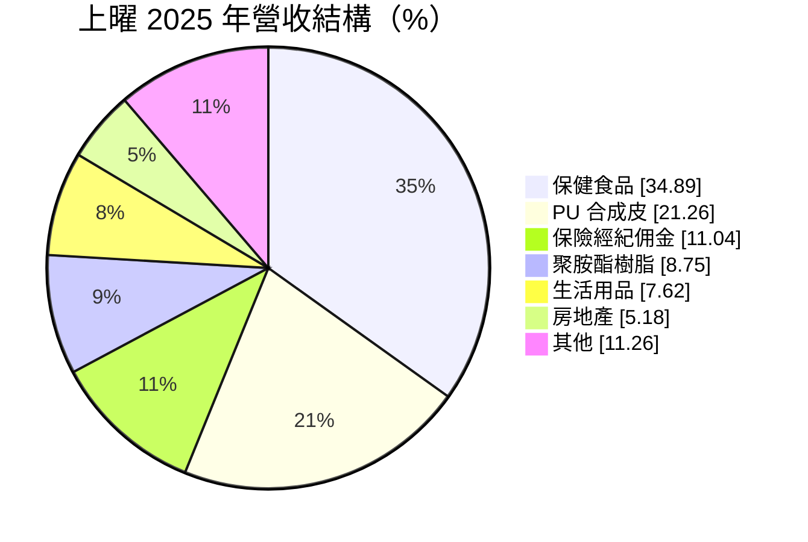
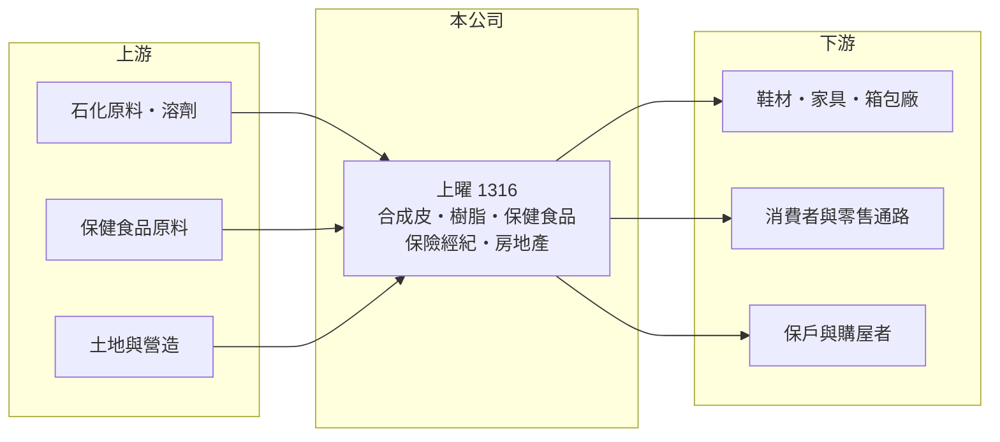

# 1316 上曜

> 上市｜[[產業索引-建材營造業|建材營造業]]｜上市（櫃）日期 1992/10/15

# 第一章：企業模式與商業藍圖

> [!info] 撰寫說明
> 精簡版，由 Claude 依公開資料整理，架構比照 [[2330台積電]]，資料截至 2026-10-08。來源：MoneyDJ 理財網財務比率年表（2021 至 2025 年）與個股基本資料（2025 年營收比重、歷年股利）、科技新報公司資料與蕃新聞報導標題（集團多角化布局）。公開資料有限，各子公司名稱、持股比例與營收金額未查得；2024、2025 年營收大幅成長應與合併新子公司有關，屬推估。#待校對

上曜建設開發成立於 1979 年，從 PU 合成皮與聚胺酯樹脂起家，近年在董事長張祐銘主導下多角化，事業涵蓋保健食品、保險經紀、生活用品與房地產，媒體形容為「食衣住全都包」的集團。

- **核心業務：** 依 MoneyDJ 的分類，2025 年保健食品占 34.89%、PU 合成皮占 21.26%、保險經紀佣金占 11.04%、聚胺酯樹脂占 8.75%、生活用品占 7.62%、房地產占 5.18%、其他占 11.26%。這是一個以控股方式經營多個不相關事業的組合，而不是單一產業的公司。
- **營收結構：** 傳統的合成皮與樹脂合計約 3 成，保健食品已成為最大的業務，保險經紀與房地產則提供不同性質的收入來源。

- **營運據點：** 公司登記於台南市安平區；各事業的工廠與營業據點本次未查得。
- **長期方向：** 2024 年與 2025 年營收分別成長 76% 與 195%，同時[[毛利率]]由 17% 至 25% 提高到 39%，顯示集團正透過併購或新增子公司，把重心從低毛利的化工材料移向保健食品等消費性事業（推估）。

# 第二章：護城河深度與競爭優勢

上曜的競爭力不在單一產品，而在集團的資本調度與併購能力；但多角化的公司往往難以在每個領域都建立護城河。

- **競爭優勢：** 合成皮與聚胺酯樹脂是上曜經營數十年的本業，在鞋材、家具與箱包材料有一定的客戶基礎。保健食品屬於品牌與通路驅動的生意，若能建立消費者信任，毛利率通常明顯高於化工材料，這也是集團毛利率上升的原因。
- **主要對手：** 合成皮的對手包括 [[1307三芳]] 與中國的人造皮工廠（推估）；保健食品與保險經紀則各自面對眾多品牌與經紀公司，具體對手本次未查得。
- **觀察重點：** 最關鍵的是「合併報表賺錢、母公司股東卻虧損」的情況能否改善：2024 與 2025 年稅後淨利率為正，但歸屬母公司的 EPS 為負，代表獲利主要歸給子公司的其他股東（[[非控制權益]]）。

# 第三章：財務體質與盈利規模

資料日期：2026-10-08，表格是撰寫當時的快照；最新月營收、毛利率、累計 EPS 由自動排程寫在本筆記的屬性欄位（月營收、毛利率、累計EPS 等）。#待校對

上曜的財務數字因為事業組合大幅變動而跳動很大，近五年歸屬母公司的獲利多數為負或接近零。

| 年度 | 營收（年增率） | [[毛利率]] | [[營業利益率]] | EPS（元） | [[ROE]] |
|---|---|---|---|---|---|
| 2021 | 未查得（-16.2%） | 19.29% | -9.58% | -0.50 | -0.71% |
| 2022 | 未查得（+125.1%） | 25.19% | 7.29% | 0.70 | 1.05% |
| 2023 | 未查得（-63.7%） | 17.24% | -21.18% | -0.68 | -2.68% |
| 2024 | 未查得（+76.3%） | 32.25% | -6.83% | -0.75 | 5.43% |
| 2025 | 未查得（+195.3%） | 38.97% | 7.33% | -0.52 | 6.81% |

註：ROE 採 MoneyDJ 的稅後 ROE，含非控制權益，因此與歸屬母公司的 EPS 正負不一致。

- **長期指標：** 近 5 年平均 ROE 約 2.0%（推算）。2021 年度配發現金股利 0.55 元，2022 至 2025 年度均未配發現金股利，配息不穩定。營收規模因合併範圍變動，年複合成長率不具參考性。
- **[[ROIC]] 與 [[WACC]]：** 營收金額未查得，且集團內有大量非控制權益，本次無法可靠推算 ROIC。WACC 約 6.2%（推算：無風險利率 1.75%、市場風險溢酬 6%、β 取多角化中小型股常見值 1.0，股東權益成本約 7.75%；稅前負債成本 3%、稅率 20%；權益比重約 70%，以負債比率 45.72% 換算總負債、取一半為有息負債）。以歸屬母公司 EPS 多年為負來看，母公司股東得到的報酬長期低於約 7.75% 的股東權益成本，目前尚未替股東創造價值。
- **財務特色：** 負債比率約 46% 至 55%，每股淨值在 11 至 13 元之間。2025 年營業利益率轉正為 7.33%，是近五年少數本業獲利的年度。

# 第四章：總體風險與地緣政治

上曜的風險在於多角化的執行與集團結構的複雜度。

- **產業週期：** 合成皮與樹脂跟著鞋材、家具與油價循環；房地產跟著房市與信用管制；保健食品與保險經紀則較偏消費性。多個週期疊加，讓合併數字難以預測。
- **營運風險：** 併購或新增事業若整合不順，商譽與投資可能需要減損；歸屬母公司與非控制權益的獲利分配，使小股東實際分到的利潤低於合併報表的印象。
- **其他風險：** 保健食品受食品安全法規與廣告規範約束；保險經紀受金管會監理；化工材料受石化原料價格與環保法規影響。

# 專有名詞解析

## 金融

- **[[非控制權益]]**：子公司中不屬於母公司的股東權益，合併報表的獲利有一部分要歸給這些股東。
- **[[ROIC]]**：投入資本報酬率，稅後營業利益除以股東權益加有息負債，衡量本業運用資本的效率。
- **[[WACC]]**：加權平均資金成本，股東與債權人要求報酬率的加權平均，是 ROIC 要超越的門檻。

## 產業

- **[[PU合成皮]]**：以聚胺酯塗佈在布料上製成的人造皮革，用於鞋材、箱包與家具。

# 核心供應鏈

- 上游：石化原料與溶劑、保健食品原料、土地與營造廠商（名稱未查得）。
- 下游／客戶：鞋材、家具與箱包製造商；保健食品零售通路與消費者；保戶與購屋者（客戶名稱未查得）。
- 同業：合成皮同業 [[1307三芳]]（推估，待校對）。

## 最新新聞
<!-- news:start -->
<!-- news:end -->

## 相關連結
- [公開資訊觀測站](https://mopsov.twse.com.tw/mops/web/t05st03?step=1&firstin=1&co_id=1316)
- [Goodinfo](https://goodinfo.tw/tw/StockDetail.asp?STOCK_ID=1316)
- [Yahoo 股市](https://tw.stock.yahoo.com/quote/1316)
- [鉅亨網新聞](https://www.cnyes.com/twstock/1316/news)
