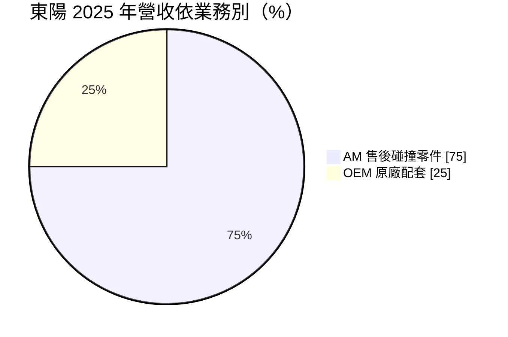
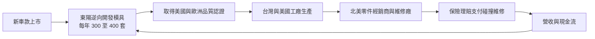
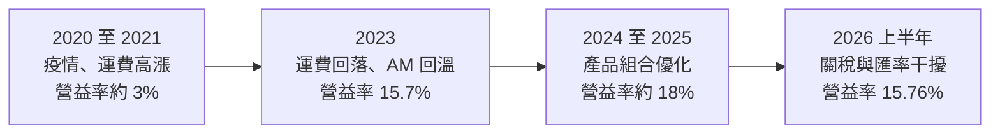
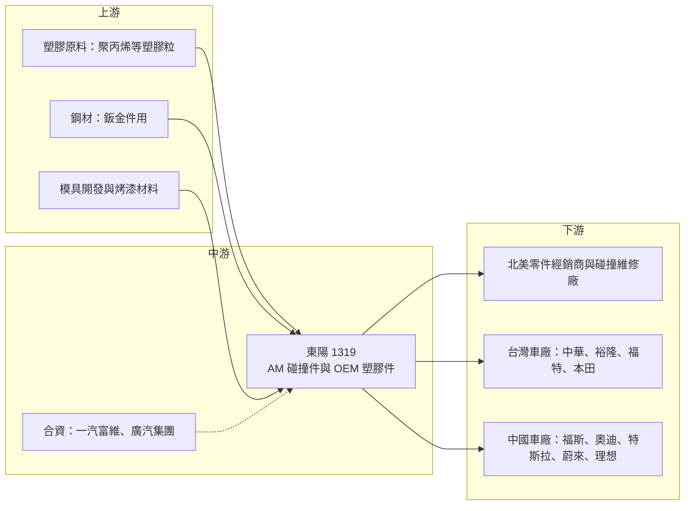

# 1319 東陽

> 上市｜[[產業索引-汽車工業|汽車工業]]｜上市（櫃）日期 1994/12/12

# 第一章：企業模式與商業藍圖

> [!info] 撰寫說明
> 本文由 Claude 依公開資料整理，架構比照 [[2330台積電]] 的四章研究，資料截至 2026-10-08。財務數字來源：Goodinfo 年度經營績效頁、富果研究 2026 年 3 月法說會整理、優分析 2026 年 1 月報導、證交所開放資料（基本資料、2026 年第二季資產負債與綜合損益、股利）；產業描述為整理性內容，尚未逐條比對原始文件。#待校對

在評估單一個股的長期投資價值時，首要步驟是拆解企業的底層獲利邏輯。本章針對東陽實業廠（股票代號：1319，以下簡稱東陽）的商業模式進行定性分析，說明這家台南起家的汽車零件廠，如何成為全球售後碰撞零件的龍頭，以及為什麼這門生意的毛利率比一般汽車零件廠高出許多。

## 一、核心定位：全球最大的汽車售後碰撞零件製造商

東陽成立於 1967 年，總部在台南，由吳氏家族經營，董事長吳永茂、總經理吳永祥，實收資本額約 59.1 億元。公司業務分成兩大塊：[[AM 售後市場]]與 [[OEM]] 原廠配套。

AM 是東陽的核心。汽車發生碰撞後，保險桿、水箱護罩、引擎蓋、葉子板這些外觀件最常需要更換。車主與保險公司可以選擇原廠零件，也可以選擇價格較低、品質經過認證的副廠零件。東陽就是全球最大的副廠碰撞零件供應商，依法說會與財經報導資料，東陽在全球 AM 塑膠件的市占約七成，鈑金件約三成五到三成八。

這個定位有三個重要的商業意義：

* **需求與新車景氣脫鉤：** AM 零件的需求來自路上既有車輛的碰撞維修，而不是新車銷售。只要車子還在路上跑、還會發生事故，需求就存在，而且車齡越老、越常選擇價格較低的副廠零件。
* **保險公司是隱形的推手：** 在北美，碰撞維修多由保險理賠支付，保險公司為了控制理賠成本，傾向鼓勵使用認證過的副廠零件，這讓 AM 零件的滲透率有長期提升的動力。
* **品項規模就是門檻：** 每一款車型的每一個外觀件都要開一套模具，東陽累積超過 25,000 個模具與品項，可涵蓋路上約八成的車款，這種規模是新進者很難追上的。

## 二、產品板塊：AM 占七成五，北美是最大市場

依法說會資料，2025 年合併營收結構如下：

* **AM 售後碰撞零件：** 包括塑膠件（保險桿、水箱護罩）與鈑金件（引擎蓋、葉子板），北美約占 AM 營收的七成。AM 的毛利率明顯高於 OEM，法說會揭露 2026 年 1 月自結 AM 毛利率約 40.5%，是東陽獲利的主要來源。
* **OEM 原廠配套：** 以塑膠件為主，包括儀表板、保險桿與前端模組等。2025 年 OEM 營收約三成二來自台灣、六成八來自中國。台灣客戶包括中華、福特、本田、裕隆等車廠；中國客戶包括福斯、奧迪、特斯拉、蔚來、理想，並與一汽富維、廣汽集團設有合資公司。OEM 的毛利率約一成，屬於規模型業務。

## 三、資本轉化邏輯：模具資產、庫存與長尾需求

東陽的 AM 生意本質上是一門「模具與庫存」的生意。每年投入大量資金開發新車款的模具，等這些車款上路幾年、開始進入碰撞維修高峰時，再以多年時間回收模具投資。

* **模具是長期資產：** 法說會表示東陽每年開發 300 至 400 套模具，年投入約 18 億元。一套模具一旦開發完成，可以在該車款的整個生命週期（往往超過十年）持續生產，越到後期，模具成本越低、毛利越高。
* **車齡是需求引擎：** 美國平均車齡約 13 年，6 至 14 年車齡是碰撞維修的高峰期。新車價格越高，消費者越傾向維修舊車而不是換新車，對 AM 零件有利。
* **產能布局：** 東陽在台灣、中國與美國都設有生產基地。台南科工廠於 2026 年開始放量，七股新廠預計 2026 年底完工、2027 年投產；美國廠在地生產，可以避開對進口零件課徵的關稅。

## 四、企業長期藍圖

東陽的長期策略可以分成三條線。第一條是持續擴大 AM 的產品線與地理範圍，在北美提高副廠零件的滲透率，同時強化歐洲認證、拓展歐洲市場。第二條是讓 OEM 從單純的零件代工，升級為能供應智能儀表板、觸控飾板、前端模組總成的一階供應商。第三條是調整中國業務，2025 年中國業務轉虧為盈，公司策略是優先與付款條件較佳的國際品牌與合資車廠合作，對帳期過長的本土品牌訂單保持審慎。

整體而言，東陽是一家「在利基市場掌握規模優勢」的公司，長期價值主要來自 AM 業務的護城河，OEM 與中國業務則是附加的規模與選擇權。

# 第二章：護城河深度與競爭優勢

本章針對東陽的競爭優勢進行分析，說明它在 AM 碰撞零件市場的護城河從何而來，以及在關稅與中國同業競爭下，這些優勢能否守得住。

## 一、護城河的核心組成要素

* **模具庫的規模優勢：** 超過 25,000 個模具與品項，涵蓋約八成路上車款。零件經銷商偏好向能一次供應大部分品項的廠商採購，以降低庫存管理與採購成本。新進者若要追上，需要投入大量資金與十年以上的時間。
* **品質認證：** 北美保險公司與維修廠只接受通過認證的副廠零件，認證要求零件的尺寸、材質與安全性接近原廠。東陽持續強化美國與歐洲的認證，這是低價對手不容易跨越的門檻。
* **市占帶來的成本優勢：** 塑膠件全球市占約七成，代表東陽在原料採購、模具攤提與生產效率上都有規模經濟，同一套模具的產量越大，每件零件的成本越低。
* **客戶與通路關係：** 長期與北美主要零件經銷商合作，供貨穩定性與交期是經銷商選擇供應商的重要考量，這種信任需要長時間累積。

## 二、全球主要競爭對手格局

| 競爭對手 | 國家 | 主要重疊領域 | 與東陽的比較 |
|---|---|---|---|
| [[1522堤維西]] | 台灣 | AM 車燈 | 產品不同（車燈），同屬北美 AM 供應鏈 |
| [[6605帝寶]] | 台灣 | AM 車燈 | 產品不同，同屬 AM 外觀件 |
| [[1524耿鼎]] | 台灣 | AM 鈑金件 | 在鈑金件領域與東陽重疊，規模較小 |
| [[2228劍麟]] | 台灣 | OEM 汽車零件 | OEM 領域的國內同業 |
| 中國副廠零件廠 | 中國 | AM 塑膠件與鈑金件 | 價格低，但受美國關稅與認證限制 |
| 原廠零件（車廠自有） | 各國 | 碰撞零件 | 品質與品牌最受認可，但價格明顯較高 |

東陽在 AM 碰撞零件的最大競爭對手，其實是車廠自家的原廠零件。副廠零件的滲透率能否持續提升，比和其他副廠零件廠競爭更重要。

## 三、優勢轉化：守得住、守不住與觀察重點

* **守得住：** 北美 AM 塑膠件的龍頭地位。模具庫、認證與通路關係三者結合，形成很難複製的門檻；美國車齡老化與新車高價也長期有利於副廠零件。
* **守不住：** OEM 業務的價格。中國汽車市場價格戰激烈，本土電動車品牌快速崛起，國際品牌市占下滑會連帶影響東陽的 OEM 訂單，OEM 毛利率約一成，難以成為主要的獲利來源。
* **觀察重點：** 第一，美國對台灣汽車零件的關稅是否穩定在可接受水準，2026 年法說會時提到的 232 條款零件稅率為 27.5%，之後財經報導指出台美關稅定為 15%，實際適用稅率需以官方公告為準；第二，七股新廠與美國廠擴產的進度；第三，電動車與先進駕駛輔助系統普及後，碰撞零件的單價與維修模式是否改變。

# 第三章：財務體質與盈利規模

資料日期：2026-10-08。數字取自 Goodinfo 年度經營績效頁、富果研究法說會整理與證交所開放資料，表格是撰寫當時的快照；最新月營收、毛利率、累計 EPS 由自動排程寫在本筆記的屬性欄位（月營收、毛利率、累計EPS 等）。#待校對

財務報表是檢驗護城河是否真實存在的最終標準。本章用多年度的三率、ROE 與資本報酬，檢視東陽 AM 護城河在財報上的呈現。

## 一、獲利能力的基石：三率

| 年度 | 營收（新台幣） | [[毛利率]] | [[營業利益率]] | EPS（元） | [[ROE]] |
|---|---|---|---|---|---|
| 2019 | 216 億 | 25.0% | 10.0% | 3.36 | 8.32% |
| 2020 | 173 億 | 19.9% | 3.12% | 1.39 | 3.29% |
| 2021 | 184 億 | 19.0% | 2.95% | 1.16 | 2.86% |
| 2022 | 213 億 | 23.6% | 9.09% | 3.64 | 8.75% |
| 2023 | 239 億 | 29.9% | 15.7% | 5.10 | 12.1% |
| 2024 | 256 億 | 33.3% | 18.8% | 7.40 | 16.5% |
| 2025 | 251 億 | 33.6% | 18.3% | 6.43 | 13.7% |
| 2026 上半年 | 112.9 億 | 32.52% | 15.76% | 2.98 | 未查得 |

* **[[毛利率]]：** 2020 至 2021 年東陽的毛利率只有兩成左右，主因是疫情期間北美行車里程下降、碰撞事故減少，加上海運費暴漲侵蝕出口利潤；2023 年起運費回落、AM 需求回溫，毛利率回升到三成以上。這個轉折說明，東陽的 AM 毛利率在正常環境下可以維持三成以上，疫情期間是例外。
* **[[營業利益率]]：** 營業利益率從 2021 年的 2.95% 提升到 2024 年的 18.8%，擴張幅度遠大於毛利率，顯示營運槓桿明顯：營收增加時，固定的模具攤提與管理費用被分攤，利潤率快速提高。
* **營收趨勢：** 2016 年營收 242 億元，2025 年為 251 億元，十年間營收變化不大，但結構從 OEM 較高轉為 AM 主導。2021 至 2025 年營收年複合成長率約 8.1%（推算）。

## 二、[[ROE]]：資本效率

2021 至 2025 年平均 ROE 約 10.8%（推算），2023 年以後穩定在 12% 以上。2016 至 2017 年 ROE 也在 11% 至 13% 之間，代表 2020 至 2021 年的低點是疫情造成的例外，東陽的正常 ROE 水準約在一成以上。2026 年第二季底總負債約 117.3 億元、權益總計約 276.3 億元，負債比約 30%（證交所開放資料），ROE 主要來自本業獲利而不是財務槓桿。

## 三、資本支出、自由現金流與股利

東陽每年約投入 18 億元開發模具，並持續擴建台南科工廠、七股新廠與美國廠，資本支出不低；歷年自由現金流的具體數字本文未查得。股利方面，2025 年度配發現金股利 5 元（證交所股利資料），以 EPS 6.43 元計算配發率約 78%（推算）。在大舉擴產的同時仍維持高配息，代表 AM 業務產生的營業現金流相當充沛（推估）。

## 四、[[ROIC]] 與 [[WACC]]：價值創造利差

**ROIC 推算：** 2025 年營收 251 億元、營業利益率 18.3%，營業利益約 45.9 億元，扣除 20% 稅率後約 36.7 億元。2026 年第二季底權益總計約 276.3 億元，總負債約 117.3 億元，假設其中約一半為有息負債（推估，約 58.6 億元），投入資本約 335 億元，ROIC 約 11.0%（推算）。以同樣的資本基礎估算 2024 年（營業利益約 48.1 億元、稅後約 38.5 億元），ROIC 約 11.5%（推算）；2021 年營業利益只有約 5.4 億元，ROIC 約 1% 至 2%（推算）。

**WACC 推算：** 假設台灣 10 年期公債殖利率 1.75%、市場風險溢酬 6%、β 取汽車零件業常見值 0.8，股東權益成本約 6.55%。負債成本假設 2.5%，稅後約 2.0%；以帳面價值計，權益約占 82.5%、負債約占 17.5%，WACC 約 5.8%（推算）。

**結論：** 東陽 2023 年以後的 ROIC 約 11%，明顯高於約 5.8% 的資金成本，利差約 5 個百分點，代表 AM 業務確實創造了經濟價值。疫情期間的低谷說明這個利差會受運費與行車里程等外部因素影響，但只要北美碰撞維修需求正常，東陽的資本報酬可以長期高於資金成本。

# 第四章：總體風險與地緣政治

任何企業都無法脫離宏觀環境獨立存在。本章分析東陽長期必須面對的貿易政策、產業結構、營運與技術風險。

## 一、地緣政治與貿易政策

* **美國關稅：** 北美占 AM 營收約七成，美國的進口關稅政策直接影響東陽的成本與客戶下單節奏。法說會時提到美國依 232 條款對台灣汽車零件課徵 27.5%，高於日本、韓國與歐盟的 15%；之後的報導指出台美關稅定為 15%，適用範圍與稅率仍需以官方公告為準。美國廠在地生產可以部分避開關稅，這也是公司評估擴建美國產能的原因。
* **中國業務：** OEM 營收有六成八來自中國，中國汽車市場的價格戰、本土品牌崛起與政策變化，都會影響東陽在中國的訂單與獲利。

## 二、產業週期與市場結構

* **AM 需求的韌性：** AM 碰撞零件與新車景氣相關性低，需求主要取決於行車里程、事故率與車齡。疫情期間行車里程驟降是極端情況，正常年份需求相對穩定。北美冬季風暴會增加碰撞事故，使第一季需求偏強，這是一種季節性而非週期性的波動。
* **客戶庫存調整：** 零件經銷商會依關稅與景氣前景調整庫存水位，關稅不確定時傾向保守進貨，造成東陽出貨短期波動。
* **OEM 的週期性：** OEM 業務隨新車銷售波動，台灣新車市場受貨物稅等政策影響，中國市場則受價格戰影響。

## 三、營運環境的隱性風險

* **匯率：** AM 以美元計價，新台幣升值會壓縮營收與毛利。
* **原料價格：** 塑膠件的主要原料是聚丙烯等塑膠粒，鈑金件則是鋼材，原料價格上漲若無法即時轉嫁，會影響毛利率。
* **中國應收帳款：** 公司提到部分中國本土品牌的付款帳期長達 9 個月至 1 年，承接這類訂單的資金壓力與呆帳風險較高。
* **擴產執行：** 七股新廠與美國廠的建設進度與產能爬坡，會影響未來幾年的折舊負擔與獲利。

## 四、科技與法規演進

* **電動車與 [[ADAS]] 的影響：** 先進駕駛輔助系統若能有效減少碰撞事故，長期會降低碰撞零件的需求；另一方面，現代保險桿內嵌雷達與感測器，零件單價與維修複雜度都在提高，對有能力開發整合件的業者反而有利。
* **車身材料與設計：** 電動車的車身設計與材料不同於傳統燃油車，東陽需要持續開發新的模具與工法。
* **原廠零件的反制：** 部分車廠透過設計專利、零件權利與維修資料限制副廠零件。美國各州的維修權相關立法，會影響副廠零件的長期發展空間。

# 專有名詞解析

## 應用

- **[[ADAS]]**：先進駕駛輔助系統，例如自動緊急煞車、車道維持，以雷達與攝影機感測車輛周邊。
- **[[EV]]**：電動車，以電池與馬達取代內燃機的汽車，車身設計與零件需求不同於傳統燃油車。

## 金融

- **[[營運槓桿]]**：固定成本占比高的企業，營收增加時利潤增幅大於營收增幅，營收減少時則利潤下滑更快。
- **[[毛利率]]**：營業毛利占營收的比例，反映產品定價能力與生產成本控制。
- **[[營業利益率]]**：扣除營業費用後的營業利益占營收的比例，衡量本業整體獲利能力。
- **[[ROE]]**：股東權益報酬率，稅後淨利除以股東權益，衡量公司運用股東資金的效率。
- **[[ROIC]]**：投入資本報酬率，稅後營業利益除以股東權益與有息負債的合計，衡量本業對所有資金提供者的報酬。
- **[[WACC]]**：加權平均資金成本，依股東權益與負債的比重加權計算的資金成本，ROIC 高於它才代表創造價值。

## 產業

- **[[AM 售後市場]]**：汽車出廠後的維修與零件更換市場，需求來自既有車輛，與新車銷售的相關性較低。
- **[[OEM]]**：原廠委託製造或原廠配套，零件直接供應車廠裝在新車上，量大但價格壓力較大。
- **[[碰撞零件]]**：車輛碰撞後最常更換的外觀件，例如保險桿、水箱護罩、引擎蓋、葉子板。
- **[[副廠零件]]**：非車廠原廠生產、但規格相容的零件，價格較低，品質經認證後可被保險理賠接受。
- **[[Tier 1]]**：一階供應商，直接把模組或系統供應給車廠的零件廠，技術與整合能力要求較高。
- **[[232 條款]]**：美國以國家安全為由對進口產品加徵關稅的法律依據，曾用於鋼鋁與汽車零件。

# 核心供應鏈

## 1. 上游：原料與材料
- 塑膠原料：[[1301台塑]]、[[1304台聚]]等石化業者（個別供貨關係本文未查證）
- 鋼材：[[2002中鋼]]等鋼品業者（個別供貨關係本文未查證）

## 2. 中游：東陽本身與同業
- 中國合資夥伴：一汽富維、廣汽集團
- 台灣 AM 同業：[[1522堤維西]]、[[6605帝寶]]、[[1524耿鼎]]
- 台灣 OEM 同業：[[2228劍麟]]

## 3. 下游：AM 通路
- 北美汽車零件經銷商、碰撞維修廠與保險公司

## 4. 下游：OEM 車廠
- 台灣：[[2204中華]]、[[2201裕隆]]、福特六和、台灣本田
- 中國：福斯、奧迪、特斯拉、蔚來、理想

## 最新新聞
<!-- news:start -->
<!-- news:end -->

## 相關連結
- [公開資訊觀測站](https://mopsov.twse.com.tw/mops/web/t05st03?step=1&firstin=1&co_id=1319)
- [Goodinfo](https://goodinfo.tw/tw/StockDetail.asp?STOCK_ID=1319)
- [Yahoo 股市](https://tw.stock.yahoo.com/quote/1319)
- [鉅亨網新聞](https://www.cnyes.com/twstock/1319/news)
