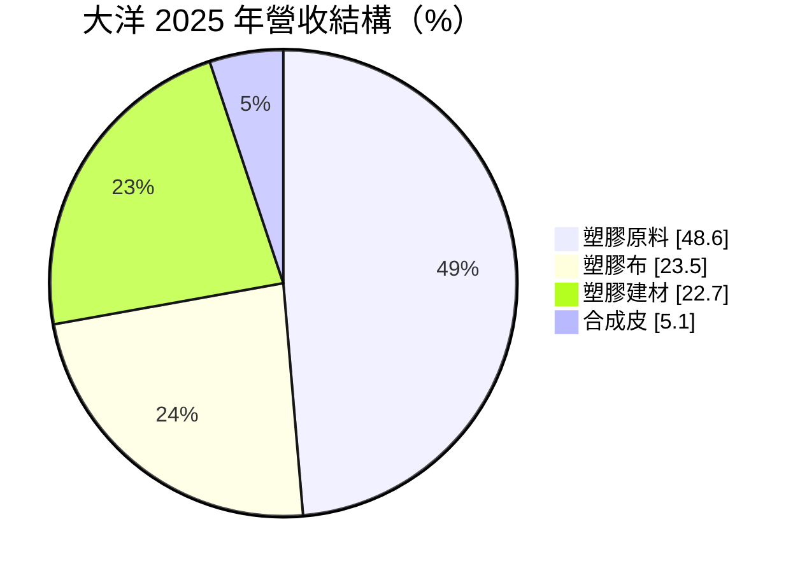
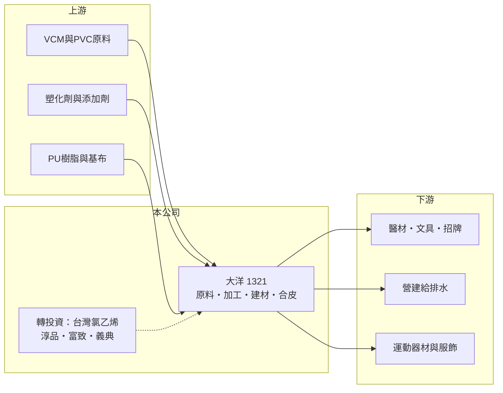

# 1321 大洋

> 上市｜[[產業索引-塑膠工業|塑膠工業]]｜上市（櫃）日期 1999/01/26

# 第一章：企業模式與商業藍圖

> [!info] 撰寫說明
> 精簡版，由 Claude 依公開資料整理，架構比照 [[2330台積電]]，資料截至 2026-10-08。來源：MoneyDJ 理財網財務比率年表（2021 至 2025 年）與個股基本資料（2025 年營收比重、歷年股利）、nStock 大洋公司概況、富果 2025 年 8 月大洋法說會備忘錄。工廠據點本次未查得。#待校對

大洋塑膠成立於 1965 年，是同時經營 [[PVC]] 原料與加工品的塑膠公司，旗下有加工、建材、合皮與原料四大事業部，近年並以都更與合建活化土地資產。

- **核心業務：** 原料事業部生產塑膠粉、塑膠粒、環保膠粒與醫療膠粒，多數供集團內部使用；加工事業部生產透明與一般膠布、仿木材料，用於地墊、文具、招牌、醫材與戶外建材；建材事業部生產 PVC 塑膠管與塑木複合材料；合皮事業部生產水性 PU、無溶劑 PU 與生質材料合成皮。這種「自產原料、再自己加工」的模式，可以讓原料在景氣差時轉為內用。
- **營收結構：** 2025 年塑膠原料占 48.64%、塑膠布占 23.52%、塑膠建材占 22.71%、合成皮占 5.13%。原料比重近半，代表大洋的獲利仍受 PVC 報價影響，而加工品與建材提供較穩定的需求。

- **營運據點：** 總公司在台北，工廠位置本次未查得。公司 1976 年合併義芳塑膠，1999 年上市。
- **長期方向：** 公司把[[資產活化]]列為長期重點：台北興隆段[[都更]]案與甘霖建設合作（基地約 1,125.6 坪，大洋持分二分之一），預計 2028 年公開銷售；新北中和合建案與馥羽建設合作，開發面積約 9,912 坪，預計 2027 年第一季公開銷售。產品面則推動環保膠粒、生質合成皮與碳足跡盤查。

# 第二章：護城河深度與競爭優勢

大洋的本業是規模不大的 PVC 原料與加工，護城河有限；較有價值的是加工品的多元應用與土地資產。

- **競爭優勢：** 膠布、管材與合成皮的應用分散在醫材、建材、文具與運動器材，單一市場衰退的衝擊較小；原料自產讓加工事業的供料較穩定。轉投資淳品實業、台灣氯乙烯、富致科技與義典科技每年提供股利收入，部分平衡本業的波動。
- **主要對手：** PVC 原料面對 [[1301台塑]]、[[1305華夏]] 與中國大量的 PVC 產能；膠布、管材與合成皮則面對國內中小型加工廠與中國進口品。2025 年上半年 PVC 粉銷量年減 34.5%，主因就是中國產能過剩。
- **觀察重點：** 2021 至 2025 年營業利益率只有一年為正，本業獲利能力偏弱。長期要看兩個建案能否如期銷售並貢獻現金，以及環保材料與合成皮能否提高附加價值。

# 第三章：財務體質與盈利規模

資料日期：2026-10-08，表格是撰寫當時的快照；最新月營收、毛利率、累計 EPS 由自動排程寫在本筆記的屬性欄位（月營收、毛利率、累計EPS 等）。#待校對

大洋的毛利率穩定在 6% 至 9%，但營業利益率多為負值；EPS 主要由業外收益決定，營收則從 2021 年的約 64 億元降到 2025 年的約 36 億元。

| 年度 | 營收（億元） | [[毛利率]] | [[營業利益率]] | EPS（元） | [[ROE]] |
|---|---|---|---|---|---|
| 2021 | 約 64（推算） | 7.47% | -0.50% | 1.45 | 4.83% |
| 2022 | 約 64（推算） | 5.69% | -2.94% | -0.19 | -0.68% |
| 2023 | 約 49（推算） | 8.42% | 0.71% | 0.88 | 3.19% |
| 2024 | 約 46（推算） | 7.66% | -1.99% | 0.76 | 2.72% |
| 2025 | 35.59 | 7.21% | -3.70% | -1.25 | -4.69% |

註：2025 年營收取自 nStock；其他年度依 MoneyDJ 營收成長率回推。

- **長期指標：** 2021 至 2025 年營收年複合成長率約 -14%（推算），近 5 年平均 ROE 約 1.1%（推算）。現金股利不穩定，2020 年度 1.0 元、2021 年度 0.7 元、2022 年度未配、2023 與 2024 年度約 0.4 元、2025 年度未配。
- **[[ROIC]] 與 [[WACC]]：** 2025 年稅後營業利益約 -1.05 億元（營業利益率 -3.70% × 營收 35.59 億元 × 0.8），投入資本約 88 億元（股東權益約 58.6 億元，加上以總負債約 58.6 億元的一半推估的有息負債約 29 億元），ROIC 約 -1.2%（推算），五年平均約 -0.7%（推算）。WACC 約 5.4%（推算：無風險利率 1.75%、市場風險溢酬 6%、β 取塑膠加工同業常見值 0.9，股東權益成本 7.15%；稅前負債成本 2.5%、稅率 20%；權益比重約 67%）。本業 ROIC 長期低於 WACC，股東報酬要靠轉投資股利與土地開發收益補足。
- **財務特色：** 負債比率長期約 48% 至 50%，在塑膠加工業中偏高（推估與建案及營運資金需求有關）。2025 年上半年業外淨支出 5,679 萬元，包括匯兌損失約 5,400 萬元與富致科技評價損失 6,600 萬元，顯示業外收益也有波動。

# 第四章：總體風險與地緣政治

大洋的風險在於 PVC 原料的供過於求、本業規模縮小與資產開發的時程。

- **產業週期：** PVC 粉粒報價受中國產能主導，需求跟著營建與基礎建設；建材事業則直接受台灣房市與工地進度影響，房市降溫時管材需求會跟著放緩。
- **營運風險：** 營收連續多年下滑，固定成本攤提壓力增加；環保膠粒面臨客戶換料風險，合成皮仍在開拓歐美客戶階段，規模尚小。
- **其他風險：** 建案時程受主管機關審查與房市影響，可能延後；美國對台灣產品加徵關稅、印度[[反傾銷]]政策會影響出口；匯率波動與轉投資評價也會造成業外損益起伏。

# 專有名詞解析

## 金融

- **[[ROIC]]**：投入資本報酬率，稅後營業利益除以股東權益加有息負債，衡量本業運用資本的效率。
- **[[WACC]]**：加權平均資金成本，股東與債權人要求報酬率的加權平均，是 ROIC 要超越的門檻。

## 產業

- **[[PVC]]**：聚氯乙烯，用於水管、電線被覆、地板與建材的通用塑膠。
- **[[資產活化]]**：把閒置或低效益的土地、廠房透過出售、出租或開發轉為收益的做法。
- **[[都更]]**：都市更新，由地主與建商合作把老舊建物改建，地主依權利價值分回房地或收益。
- **[[反傾銷]]**：進口國對低於正常價格傾銷的進口商品加徵關稅的貿易救濟措施。

# 核心供應鏈

- 上游：VCM 與 PVC 原料（轉投資台灣氯乙烯為國內 VCM 業者，實際供應關係未查得）、塑化劑（例如 [[1313聯成]]，推估）、PU 樹脂與基布。
- 下游／客戶：醫材、文具、招牌、地墊業者，營建給排水工程，以及運動器材、服飾、家具與 3C 配件品牌（客戶名稱未查得）。
- 同業：[[1301台塑]]、[[1305華夏]]、[[1303南亞]]、中國 PVC 與塑膠加工廠。

## 最新新聞
<!-- news:start -->
<!-- news:end -->

## 相關連結
- [公開資訊觀測站](https://mopsov.twse.com.tw/mops/web/t05st03?step=1&firstin=1&co_id=1321)
- [Goodinfo](https://goodinfo.tw/tw/StockDetail.asp?STOCK_ID=1321)
- [Yahoo 股市](https://tw.stock.yahoo.com/quote/1321)
- [鉅亨網新聞](https://www.cnyes.com/twstock/1321/news)
