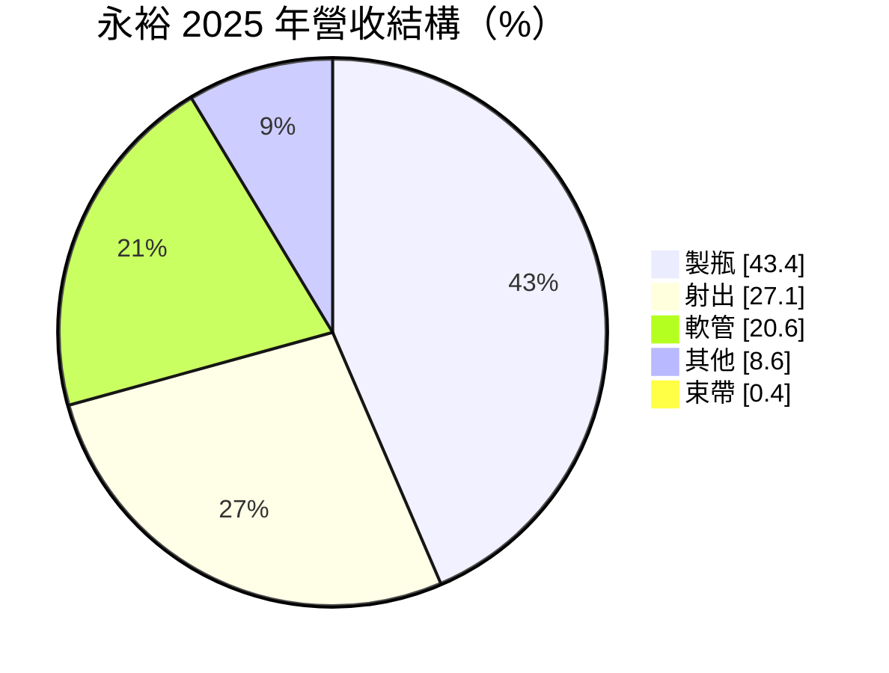
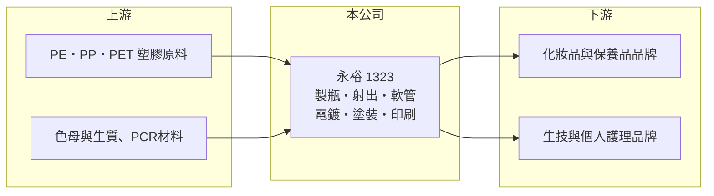

# 1323 永裕

> 上市｜[[產業索引-塑膠工業|塑膠工業]]｜上市（櫃）日期 2000/09/11

# 第一章：企業模式與商業藍圖

> [!info] 撰寫說明
> 精簡版，由 Claude 依公開資料整理，架構比照 [[2330台積電]]，資料截至 2026-10-08。來源：MoneyDJ 理財網財務比率年表（2021 至 2025 年）與個股基本資料（2025 年營收比重、歷年股利）、nStock 永裕公司概況、聯合新聞網 2026 年 6 月營收報導。主要客戶名稱與工廠確切地點未查得。#待校對

永裕塑膠成立於 1973 年，專門生產化妝品、保養品與生技產品用的塑膠瓶、軟管與射出容器，是品牌商外包裝的供應商。

- **核心業務：** 永裕依客戶設計生產塑膠瓶、軟管與[[塑膠射出]]件，並提供電鍍、塗裝與印刷等表面加工，部分產線在 GMP 等級車間生產。核心技術是把色母、塑膠原料與成型設備結合的客製化生產，讓品牌商的包裝在顏色、手感與質感上做出差異。
- **營收結構：** 2025 年製瓶廠製品占 43.36%、射出廠製品占 27.06%、軟管廠製品占 20.59%、其他產品占 8.59%、束帶廠製品占 0.40%。三大產線都服務美妝與個人護理市場，因此營收跟著化妝品與保養品的消費景氣走。

- **營運據點：** 公司在兩岸都有生產（報導提到「提升兩岸生產效率」），確切廠區本次未查得。客戶包括國外品牌商，報導也提到日圓貶值帶來的競爭壓力，推估有日系客戶或日系競爭者。
- **長期方向：** 公司深耕生技包材與環保材料，生質塑料、[[PCR]] 改質複合材料與減碳複合材料已陸續出貨；製程上推動射出自動化、軟管連線印刷設備與 JIT 生產管理，目標是降低成本並提高庫存周轉。

# 第二章：護城河深度與競爭優勢

永裕的優勢在客製化能力與長期合作的品牌客戶，但包材產業進入門檻不高，價格競爭激烈。

- **競爭優勢：** 化妝品包裝講究外觀一致性與質感，從打樣、色彩調配到表面加工都需要經驗，品牌商換供應商要重新驗證，具一定轉換成本。永裕能在同一集團內完成成型、電鍍、塗裝與印刷，對需要一站式服務的品牌較有吸引力。
- **主要對手：** 對手是中國大陸的大型化妝品包材廠，以及日本、韓國的包材供應商（具體公司名稱本次未查得）。中國競爭者規模大、成本低，是永裕營收縮小的重要原因（推估）。
- **觀察重點：** 營收從 2021 年的約 38 億元降到 2025 年的約 20 億元，毛利率也從 24% 降到 13%，顯示競爭力在下滑。2026 年前八月營收年增約 9.8%，長期要看環保材料與生技包材能否扭轉趨勢。

# 第三章：財務體質與盈利規模

資料日期：2026-10-08，表格是撰寫當時的快照；最新月營收、毛利率、累計 EPS 由自動排程寫在本筆記的屬性欄位（月營收、毛利率、累計EPS 等）。#待校對

永裕在 2021 年仍有 11.6% 的營業利益率與 12.9% 的 ROE，之後營收連續下滑、利潤率逐年收斂，2025 年本業接近損益兩平。

| 年度 | 營收（億元） | [[毛利率]] | [[營業利益率]] | EPS（元） | [[ROE]] |
|---|---|---|---|---|---|
| 2021 | 約 38（推算） | 24.07% | 11.60% | 3.04 | 12.92% |
| 2022 | 約 38（推算） | 21.43% | 8.34% | 2.05 | 10.33% |
| 2023 | 約 33（推算） | 19.33% | 6.42% | 0.92 | 6.17% |
| 2024 | 約 27（推算） | 16.19% | 2.54% | 2.58 | 9.91% |
| 2025 | 20.2 | 13.32% | -0.15% | 0.26 | 0.90% |

註：2025 年營收取自 nStock；其他年度依 MoneyDJ 營收成長率回推。2024 年淨利率 10.44% 遠高於營業利益率，EPS 主要來自業外收益，來源未查得。

- **長期指標：** 2021 至 2025 年營收年複合成長率約 -15%（推算），近 5 年平均 ROE 約 8.0%（推算）。現金股利由 2019 至 2021 年度的 1.6 元，逐步降到 2024、2025 年度的 0.9 元，雖然下滑但每年都有配息。
- **[[ROIC]] 與 [[WACC]]：** 2025 年營業利益率 -0.15%，稅後營業利益約 -0.02 億元，ROIC 約 0%（推算：投入資本約 36 億元，為股東權益約 25.6 億元加上以總負債約 21 億元的一半推估的有息負債約 11 億元）；2021 年約 9.7%，五年平均約 4.6%（推算）。WACC 約 4.8%（推算：無風險利率 1.75%、市場風險溢酬 6%、β 取包材同業常見值 0.7，股東權益成本 5.95%；稅前負債成本 2.5%、稅率 20%；權益比重約 71%）。ROIC 從明顯高於 WACC 一路降到低於 WACC，代表永裕過去曾創造價值，但近兩年本業已無法賺回資金成本。
- **財務特色：** 負債比率由 52% 降到約 45%，每股淨值維持在 26 至 29 元。2026 年第二季毛利率回升到 21.08%、營業利益率 7.23%，若能維持，ROIC 可望重新回到 WACC 之上（推估）。

# 第四章：總體風險與地緣政治

永裕的風險在於美妝消費景氣、中國市場與包材產業的價格競爭。

- **產業週期：** 化妝品與保養品需求跟著消費景氣與品牌庫存調整，景氣轉弱時客戶下單轉趨保守，包材廠是最先被砍單的環節之一；報導也點名中國景氣下滑、消費轉弱是當前逆風。
- **營運風險：** 營收規模縮小後，固定成本攤提壓力增加；少數國外品牌客戶占比若高，客戶轉單會造成明顯衝擊（推估）。
- **其他風險：** 塑膠原料價格受油價與中東情勢影響，2026 年曾出現漲價與供料不穩；日圓貶值讓日系競爭者更具價格優勢；全球減塑法規與品牌的減碳目標，會要求包材持續換成 PCR 與生質材料。

# 專有名詞解析

## 金融

- **[[ROIC]]**：投入資本報酬率，稅後營業利益除以股東權益加有息負債，衡量本業運用資本的效率。
- **[[WACC]]**：加權平均資金成本，股東與債權人要求報酬率的加權平均，是 ROIC 要超越的門檻。

## 產業

- **[[塑膠射出]]**：把熔融塑膠以高壓注入模具、冷卻後成型的加工方式，用於瓶蓋、外殼等精密零件。
- **[[PCR]]**：消費後回收材料，把使用過的塑膠回收再製成原料，品牌商用來降低碳足跡。

# 核心供應鏈

- 上游：PE、PP、PET 等塑膠原料與色母供應商，國內來源例如 [[1301台塑]]、[[1303南亞]]、[[1304台聚]]（推估，實際供應商未查得）。
- 下游／客戶：國內外化妝品、保養品、生技與個人護理品牌（客戶名稱未查得）。
- 同業：中國大陸、日本與韓國的化妝品包材廠（名稱未查得）。

## 最新新聞
<!-- news:start -->
<!-- news:end -->

## 相關連結
- [公開資訊觀測站](https://mopsov.twse.com.tw/mops/web/t05st03?step=1&firstin=1&co_id=1323)
- [Goodinfo](https://goodinfo.tw/tw/StockDetail.asp?STOCK_ID=1323)
- [Yahoo 股市](https://tw.stock.yahoo.com/quote/1323)
- [鉅亨網新聞](https://www.cnyes.com/twstock/1323/news)
