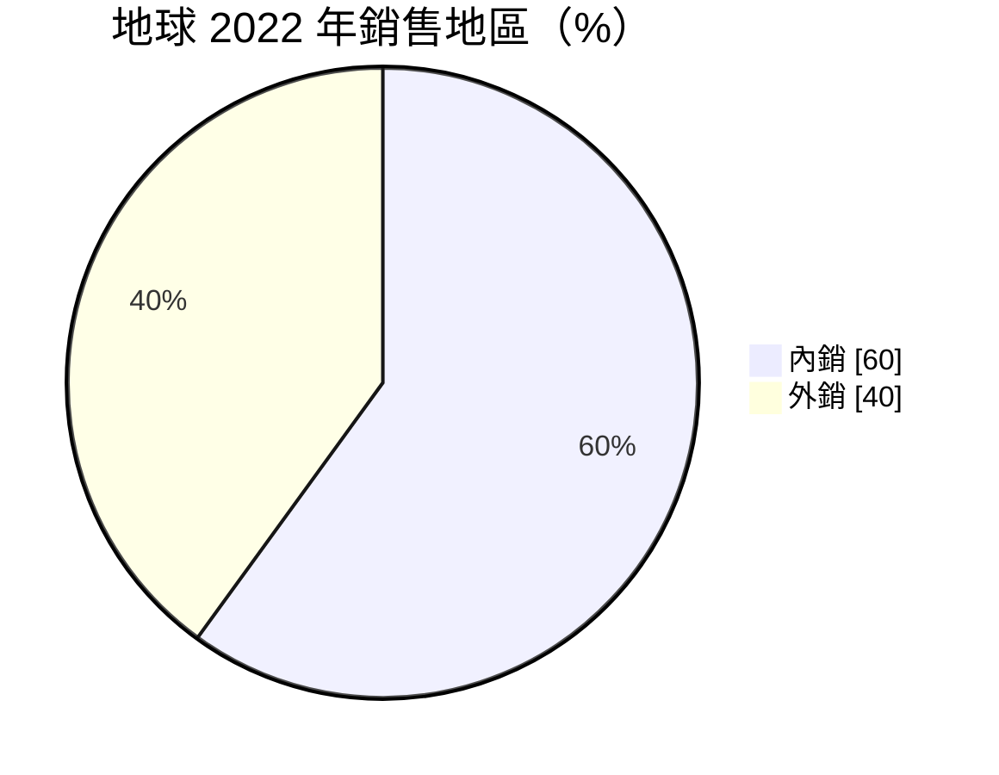
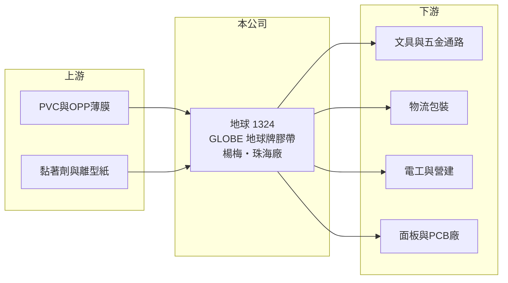

# 1324 地球

> 上市｜[[產業索引-塑膠工業|塑膠工業]]｜上市（櫃）日期 2000/09/11

# 第一章：企業模式與商業藍圖

> [!info] 撰寫說明
> 精簡版，由 Claude 依公開資料整理，架構比照 [[2330台積電]]，資料截至 2026-10-08。來源：MoneyDJ 理財網財務比率年表（2021 至 2025 年）與個股基本資料（2025 年營收比重、歷年股利）、理財周刊 2023 年 10 月地球公司報導（產品、據點、2022 年內外銷比重與市占率）。公開資料有限，部分描述停留在 2022 至 2023 年。#待校對

地球綜合工業成立於 1964 年，以自有品牌「GLOBE 地球牌」生產各式膠帶，是台灣老牌的膠帶製造商，營收 100% 來自膠帶。

- **核心業務：** 地球生產包裝膠帶、文具膠帶、雙面膠帶、遮蔽膠帶、管路膠帶、保護膠帶、絕緣膠帶與電子膠帶。膠帶是把基材（PVC、OPP 薄膜或紙）塗上黏著劑後分條而成，技術門檻在黏著劑配方與塗佈均勻度，一般用途產品同質性高，電子用途則需要通過客戶認證。
- **營收結構：** 2025 年膠帶占營收 100%。依 2022 年資料，內銷約占 60%、外銷約 40%；[[OPP膠帶]]在台灣市占率約 4%，[[PVC膠帶]]約 12%，顯示地球在 PVC 絕緣與管路膠帶的地位較強。

- **營運據點：** 主要工廠位於桃園楊梅與中國廣東珠海。台灣廠服務內銷與高規格產品，珠海廠則接近華南的電子與製造聚落。
- **長期方向：** 面對中國與新興市場廠商的價格競爭，公司把方向放在電子類膠帶，應用於 TFT-LCD 面板貼合、PCB 加工與軟性電路板貼合，並曾與工研院合作開發透明導電膜與抗反射膜專利。公司也取得 ISO 50001 能源管理與碳標籤等認證，回應客戶的減碳要求。

# 第二章：護城河深度與競爭優勢

地球的優勢在品牌通路與 PVC 膠帶的國內市占，但一般膠帶的護城河很淺，電子膠帶的規模仍小。

- **競爭優勢：** 「地球牌」在台灣文具與五金通路經營數十年，品牌辨識度高，通路關係是新進者不易複製的資產。PVC 絕緣與管路膠帶需要符合電工安全規範，國內市占約 12%，在這個區隔具一定地位。
- **主要對手：** 國際上有 3M、日東電工（Nitto）等膠帶大廠，國內有 [[4306炎洲]] 等膠帶業者，另有大量中國低價膠帶。一般包裝膠帶以價格競爭為主，品牌溢價有限。
- **觀察重點：** 2021 至 2025 年營業利益率只有 2023 年達到 4.4%，其他年度接近零或為負；長期要看電子膠帶能否提高比重、拉升毛利率，而不只是在一般膠帶市場與低價品競爭。

# 第三章：財務體質與盈利規模

資料日期：2026-10-08，表格是撰寫當時的快照；最新月營收、毛利率、累計 EPS 由自動排程寫在本筆記的屬性欄位（月營收、毛利率、累計EPS 等）。#待校對

地球的營收從 2021 年約 11 億元逐年降到 2025 年約 7 億元，獲利長期在損益兩平附近，2025 年出現明顯虧損。

| 年度 | 營收（億元） | [[毛利率]] | [[營業利益率]] | EPS（元） | [[ROE]] |
|---|---|---|---|---|---|
| 2021 | 約 10.8（推算） | 15.33% | 0.94% | 0.01 | 0.07% |
| 2022 | 約 9.8（推算） | 15.64% | 0.09% | 0.06 | 0.50% |
| 2023 | 約 9.2（推算） | 21.39% | 4.42% | 0.53 | 4.10% |
| 2024 | 約 7.9（推算） | 18.10% | -0.68% | 0.09 | 0.70% |
| 2025 | 約 7.3（推算） | 13.70% | -8.81% | -0.82 | -6.59% |

註：2025 年營收以每股營業額 9.77 元乘以股本 7.51 億元換算的約 0.75 億股推算，其他年度依 MoneyDJ 營收成長率回推。

- **長期指標：** 2021 至 2025 年營收年複合成長率約 -9%（推算），近 5 年平均 ROE 約 -0.2%（推算）。現金股利長期維持每股 0.2 至 0.3 元，2025 年度未配息；在幾乎沒有獲利的年度仍配息，代表配息部分來自過去累積的盈餘。
- **[[ROIC]] 與 [[WACC]]：** 2025 年稅後營業利益約 -0.52 億元（營業利益率 -8.81% × 營收約 7.3 億元 × 0.8），投入資本約 9.8 億元（股東權益約 8.9 億元，加上以總負債約 1.9 億元的一半推估的有息負債約 0.9 億元），ROIC 約 -5.2%（推算）；2023 年最好時約 3%，五年平均約 -0.4%（推算）。WACC 約 5.6%（推算：無風險利率 1.75%、市場風險溢酬 6%、β 取傳產同業常見值 0.7，股東權益成本 5.95%；稅前負債成本 2.5%、稅率 20%；權益比重約 90%）。ROIC 長期低於 WACC，代表膠帶本業在目前的規模與產品組合下沒有替股東創造價值。
- **財務特色：** 負債比率約 17% 至 24%，財務保守；每股淨值約 12 至 13 元，長年變化不大，顯示公司處於低成長、低報酬的穩定狀態，2025 年虧損才使淨值下降到 11.88 元。

# 第四章：總體風險與地緣政治

地球的風險在於一般膠帶的價格競爭、規模持續縮小與原料成本。

- **產業週期：** 包裝與文具膠帶需求跟著物流、零售與營建景氣，波動不大但成長有限；電子膠帶則跟著面板與 PCB 產業的景氣循環。
- **營運風險：** 營收連續多年下滑，固定成本攤提壓力增加，2025 年營業利益率降到 -8.8%；若電子膠帶無法放量，公司可能長期在虧損邊緣。
- **其他風險：** PVC、OPP 薄膜與黏著劑原料價格隨油價波動，成本轉嫁能力有限；中國與東南亞低價膠帶的進口壓力持續；珠海廠暴露在兩岸政策與人民幣匯率風險下。

# 專有名詞解析

## 金融

- **[[ROIC]]**：投入資本報酬率，稅後營業利益除以股東權益加有息負債，衡量本業運用資本的效率。
- **[[WACC]]**：加權平均資金成本，股東與債權人要求報酬率的加權平均，是 ROIC 要超越的門檻。

## 產業

- **[[OPP膠帶]]**：以雙軸延伸聚丙烯薄膜為基材的膠帶，最常見的透明封箱膠帶。
- **[[PVC膠帶]]**：以軟質 PVC 薄膜為基材的膠帶，具絕緣與延展性，常用於電工絕緣與管路包覆。

# 核心供應鏈

- 上游：PVC 與 OPP 薄膜、黏著劑與離型紙供應商，國內來源例如 [[1303南亞]]（推估，實際供應商未查得）。
- 下游／客戶：文具與五金通路、物流包裝、電工與營建業者，以及面板、PCB 與軟板廠（客戶名稱未查得）。
- 同業：3M、日東電工、[[4306炎洲]]、中國與東南亞膠帶廠。

## 最新新聞
<!-- news:start -->
<!-- news:end -->

## 相關連結
- [公開資訊觀測站](https://mopsov.twse.com.tw/mops/web/t05st03?step=1&firstin=1&co_id=1324)
- [Goodinfo](https://goodinfo.tw/tw/StockDetail.asp?STOCK_ID=1324)
- [Yahoo 股市](https://tw.stock.yahoo.com/quote/1324)
- [鉅亨網新聞](https://www.cnyes.com/twstock/1324/news)
