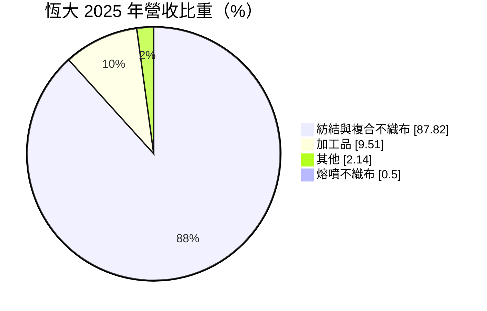
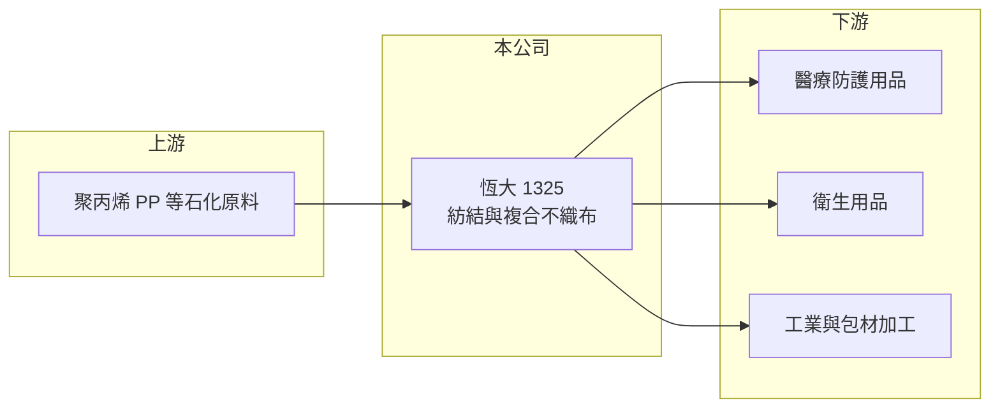

# 1325 恆大

> 上市｜[[產業索引-塑膠工業|塑膠工業]]｜上市（櫃）日期 2000/09/11

# 第一章：企業模式與商業藍圖

> [!info] 撰寫說明
> 精簡版，由 Claude 依公開資料整理，架構比照 [[2330台積電]]，資料截至 2026-10-08。來源：Goodinfo 年度經營績效、富邦 e 點通（MoneyDJ）公司基本資料、Yahoo 股市公司資料、nstock、CMoney 投資快訊。公開資料有限，工廠據點與客戶名單未查得。#待校對

本章說明恆大（1325）靠什麼賺錢，以及它在台灣不織布產業中的位置。

- **核心業務：** 恆大成立於 1962 年，2000 年在證交所掛牌，主要業務是各類[[不織布]]的生產與銷售，英文名稱 UNIVERSAL。不織布不經紡紗織布，直接把塑膠纖維黏合成布，用途包括醫療防護、衛生用品與工業包材。這類產品技術門檻中等，長期競爭力取決於產線效率與原料成本控制。
- **營收結構：** 依 MoneyDJ 揭露的 2025 年營收比重，[[紡結不織布]]與複合不織布占 87.8%，加工品占 9.5%，[[熔噴不織布]]僅占 0.5%。這代表公司高度集中在單一產品線，紡結不織布的價格與需求幾乎就決定了全公司的營收。
- **營運模式與據點：** 公司總部在台北中山區，董事長與總經理由黃美慧兼任，資本額約 8.53 億元。工廠所在地與產能在這次查到的公開資料中未揭露，需查閱年報確認。
- **長期方向：** 2020 至 2021 年防疫需求帶動醫療與防護用不織布熱銷，2021 年營收 11.9 億元、營業利益率 31.1%；需求退潮後營收連年下滑，2025 年只剩 2.91 億元，毛利率轉為負值。公司能否找到防疫以外、附加價值較高的應用，是決定它長期存續的關鍵。

# 第二章：護城河深度與競爭優勢

本章分析恆大的競爭條件，以及在需求退潮後還能守住什麼。

- **競爭優勢：** 恆大是老牌不織布廠，負債比例只有約 3%，幾乎沒有借款，帳面淨值每股約 30 元。這種保守的財務結構讓公司在本業虧損期間仍不至於出現資金壓力，是它目前最主要的防禦力。
- **主要對手：** 台灣同業包括水針不織布的 [[6504南六]]，以及中國大量擴產的紡粘與熔噴廠。中國廠在 2020 年後擴充大批產線，疫情後產能過剩，使一般規格的紡結不織布長期處於價格競爭，恆大這類中小型廠很難靠規模取勝。
- **觀察重點：** 毛利率能否回到正值，是判斷本業是否還有競爭力的第一個指標。其次是公司是否處分閒置產能或資產、轉往高附加價值的複合材料，因為在價格戰中，只有產品差異化或資產活化才可能扭轉連年虧損。

# 第三章：財務體質與盈利規模

資料日期：2026-10-08，表格是撰寫當時的快照；最新月營收、毛利率、累計 EPS 由自動排程寫在本筆記的屬性欄位（月營收、毛利率、累計EPS 等）。#待校對

本章用五年數字檢視恆大從防疫高峰回落後的獲利品質。

| 年度 | 營收（新台幣） | [[毛利率]] | [[營業利益率]] | EPS（元） | [[ROE]] |
|---|---|---|---|---|---|
| 2021 | 11.9 億 | 36.9% | 31.1% | 3.26 | 8.07% |
| 2022 | 5.54 億 | 7.88% | -0.91% | 0.19 | 0.46% |
| 2023 | 4.06 億 | -0.09% | -11.9% | 0.21 | 0.44% |
| 2024 | 3.17 億 | -11.6% | -25.2% | -0.60 | -2.38% |
| 2025 | 2.91 億 | -17.8% | -32.5% | -0.70 | -2.32% |

- **營收規模：** 營收從 2021 年的 11.9 億元降到 2025 年的 2.91 億元，四年年複合成長率約 -29.7%（推算）。2021 年是防疫需求的特殊高峰，不能當作常態；但 2022 年以後仍逐年下滑，顯示問題不只是高峰回落，而是本業需求與價格持續走弱。
- **獲利：** 毛利率從 36.9% 一路降到 -17.8%，代表產品售價已經低於生產成本，產線愈開工愈虧。2022 與 2023 年本業虧損但 EPS 仍小幅為正，推估來自利息或投資等[[業外收益]]；近五年平均 ROE 約 0.9%（推算），遠低於資金成本。
- **財務特色：** 負債比例約 3%，股本 8.53 億元長年沒有變動，每股淨值從 34.57 元緩降到 30.36 元。Goodinfo 統計的歷年平均現金股利約 0.72 元，2024 年度配 0.3 元，但本業轉虧後配息能力已明顯下降。
- **[[ROIC]] 與 [[WACC]]：** 2025 年營業利益約 -0.95 億元（2.91 億 × -32.5%），虧損不計稅；股東權益約 25.9 億元（每股淨值 30.36 元 × 0.853 億股），總負債約 0.84 億元、假設一半為有息負債約 0.42 億元，ROIC 約 -3.6%（推算）。回推 2021 年，稅後營業利益約 2.96 億元，ROIC 約 10%（推算）。WACC 以 CAPM 推估：無風險利率 1.75%、市場風險溢酬 6%，MoneyDJ 揭露的 β 僅 0.26、流動性低不具代表性，改用傳產同業常見值 0.8，股東權益成本約 6.55%；負債成本稅後約 2%、權重約 2%，WACC 約 6.5%（推算）。只有防疫高峰的 2021 年 ROIC 高於 WACC，2022 年以後本業持續低於資金成本，代表公司目前是在消耗而非創造股東價值。

# 第四章：總體風險與地緣政治

本章整理恆大長期必須面對的風險。

- **產業週期：** 不織布需求在疫情期間被一次性推高，之後全球產能過剩，價格長期受壓。恆大的營收高度集中在紡結不織布，缺乏其他產品分散風險，景氣循環對它的影響會比多角化同業更直接。
- **營運風險：** 毛利率已連續三年為負，若無法調整產線或產品組合，帳上淨值會隨虧損持續減少。小型工廠的固定成本占比高，營收縮小時單位成本上升，形成惡性循環。
- **其他風險：** 主要原料是聚丙烯（PP）等石化[[原物料]]，價格隨油價波動，成本上升時難以轉嫁。中國同業的低價出口則是長期壓力，屬於產業結構問題，不是短期景氣能解決的。

# 專有名詞解析

## 金融

- **[[業外收益]]**：本業以外的收入，例如利息、匯兌利益、投資收益，不代表本業競爭力。
- **[[ROIC]]**：投入資本報酬率，稅後營業利益除以投入資本，衡量本業運用資金創造報酬的能力。
- **[[WACC]]**：加權平均資金成本，股東與債權人要求報酬率的加權平均，ROIC 高於 WACC 才代表創造價值。

## 產業

- **[[不織布]]**：不經紡紗織布，直接把纖維以熱、化學或機械方式黏合成布，用於鞋材、口罩、衛材與隔熱材料。
- **[[紡結不織布]]**：又稱紡粘不織布，把熔融塑膠直接抽絲鋪網後熱壓成布，強度高、成本低，是衛材與防護衣的主要材料。
- **[[熔噴不織布]]**：以高速熱風把熔融塑膠吹成極細纖維，過濾效果好，是口罩的核心過濾層。
- **[[原物料]]**：生產所需的基本原料，價格波動會直接影響下游廠商的成本與毛利。

# 核心供應鏈

- 上游：聚丙烯等石化原料，台灣主要供應商如 [[6505台塑化]]（產業參考，恆大實際供應商未查得）。
- 下游／客戶：醫療防護、衛生用品與工業加工業者，具體客戶名單未查得。
- 同業：[[6504南六]]，以及中國大型紡粘、熔噴不織布廠。

## 最新新聞
<!-- news:start -->
<!-- news:end -->

## 相關連結
- [公開資訊觀測站](https://mopsov.twse.com.tw/mops/web/t05st03?step=1&firstin=1&co_id=1325)
- [Goodinfo](https://goodinfo.tw/tw/StockDetail.asp?STOCK_ID=1325)
- [Yahoo 股市](https://tw.stock.yahoo.com/quote/1325)
- [鉅亨網新聞](https://www.cnyes.com/twstock/1325/news)
