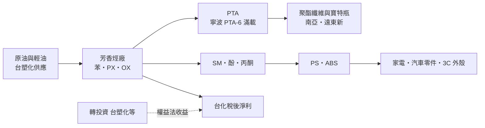
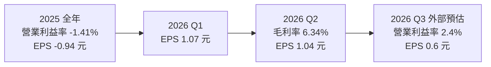
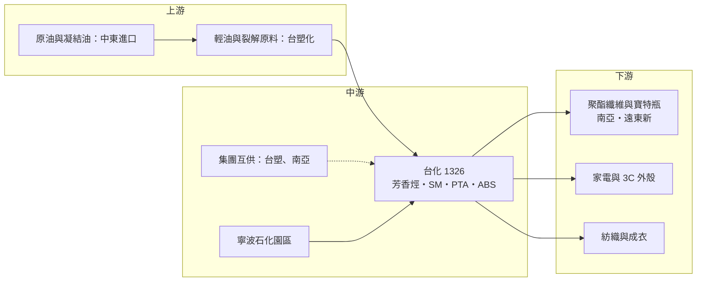

# 1326 台化

> 上市｜[[產業索引-塑膠工業|塑膠工業]]｜上市（櫃）日期 1984/12/20

# 第一章：企業模式與商業藍圖

> [!info] 撰寫說明
> 本文由 Claude 依公開資料整理，架構比照 [[2330台積電]] 的四章研究，資料截至 2026-10-07。財務數字來源：優分析、工商時報、自由時報、經濟日報、鉅亨網 FactSet 整理（經轉載）、永豐金證券 AI 投資網、nstock；產業描述為整理性內容，尚未逐條比對原始文件。#待校對

在評估單一個股的長期投資價值時，首要步驟是拆解企業的底層獲利邏輯。本章針對台灣化學纖維（股票代號：1326，以下簡稱台化）的商業模式進行定性分析，說明它在台塑集團石化鏈中的位置、獲利為何取決於產品與原料之間的[[價差]]，以及在中國產能大舉開出後它面臨的轉型壓力。

## 一、核心定位：台塑集團的芳香烴與苯乙烯系主力

台化成立於 1965 年 3 月 5 日，是台塑集團「台塑四寶」之一。公司名稱保留了「化學纖維」，因為早年以嫘縈棉、耐隆纖維與紡織起家；1987 年起進入塑膠產業，之後參與六輕投資，逐步轉型為以石化原料為主的公司。依永豐金證券 AI 投資網的公司簡介，台化是全球第二大苯乙烯（[[SM]]）製造商、第三大 [[ABS]] 與合成酚製造商。

台化的產品鏈從[[芳香烴]]開始：麥寮廠區的芳香烴廠把輕油裂解副產品與重組油轉成苯、對二甲苯（[[PX]]）、鄰二甲苯（OX），再往下做成純對苯二甲酸（[[PTA]]）、苯乙烯、酚與丙酮，以及聚苯乙烯（PS）、ABS、聚丙烯（PP）等塑膠。這個定位有兩個商業意義：

* **價差決定獲利：** 台化的獲利高度取決於產品與原料之間的價差，而不是單純的銷量。PX 與原油、苯與輕油、PTA 與 PX 之間的價差，是判斷台化獲利的關鍵指標。
* **集團中段：** 上游向 [[6505台塑化]] 取得原料，下游供應 [[1303南亞]] 等聚酯與塑膠加工廠，在集團內扮演承上啟下的角色。

## 二、產品板塊：芳香烴、苯乙烯系、PTA 與纖維

本次未查得台化依產品別的營收比重，因此不繪製營收結構圖。依 nstock 整理的營業項目，主要產品可以分成四大類：

* **芳香烴：** 苯、PX、OX。PX 是 PTA 的原料，也可作為汽油調和組分。
* **苯乙烯系：** SM、合成酚、丙酮，以及下游的 PS、ABS。這一系列和家電、汽車零件、3C 外殼等消費性需求高度相關。
* **PTA 與塑膠：** PTA 是聚酯纖維與寶特瓶的原料；塑膠包括 PP、ABS、PS 等。
* **纖維與紡織：** 嫘縈棉、耐隆纖維、紡紗、織布、染整加工，是台化的起家事業，目前比重較低。

## 三、資本轉化邏輯：一體化產能賺取價差

* **營運據點：** 主要產能集中在雲林麥寮（六輕）與彰化，另在中國浙江寧波設有大型石化園區。經濟日報 2026 年 7 月報導，台化第三季三座芳香烴廠全量生產，寧波 PTA-6 廠產能滿載。寧波廠讓台化能直接服務中國的聚酯與塑膠加工客戶，但也讓公司暴露在中國產能過剩與價格競爭之下。
* **共用設施：** 與台塑化、[[1301台塑]]、南亞在麥寮共用港口、電廠、蒸汽、儲槽與原料管線，降低物流與能源成本。
* **轉投資：** 台化持有台塑化等集團公司股權，[[權益法]]收益是獲利的重要來源，2026 年上半年稅後淨利率（7.73%）高於營業利益率（2.99%），即反映轉投資的貢獻。

## 四、企業長期藍圖：降低大宗化與集團整合

* **降低大宗化：** 中國大陸大量新增 PX、PTA、SM 產能，台化傳統大宗產品利差長期受壓。2022 至 2025 年台化營業利益率都是負值或接近零，調整產品組合、提高特用化學品比重是不得不走的路。
* **集團整合：** 透過集團內互供降低成本，在原料供應中斷時確保穩定開工。
* **減碳與循環經濟：** 面對碳費與國際減碳要求，推動節能、低碳與再生材料（未查得具體投資金額）。

# 第二章：護城河深度與競爭優勢

在長期價值投資中，「護城河」指企業抵禦競爭、維持超額利潤的保護機制。石化大宗產品同質性高，護城河通常表現在成本，而不是定價權。本章分析台化的護城河構成、全球主要競爭對手，以及這些優勢在產能過剩週期中能守住多少。

## 一、護城河的核心組成要素

台化的護城河相對有限，屬於「規模與一體化」型的窄護城河：

* **1. 一貫化生產：** 從麥寮的輕油裂解原料一路做到苯、PX、SM、PTA、ABS，中間產品不需外購，物流與能源成本較低。
* **2. 規模優勢：** SM、ABS、合成酚的產能位居全球前段班，在亞洲市場有一定的定價參與度。
* **3. 集團綜效：** 台塑集團共用港口、電廠、蒸汽與儲槽，使單位成本低於單獨建廠的同業。

但石化大宗產品客戶轉換成本低，這些優勢主要表現在成本，而不是定價權。

## 二、全球主要競爭對手格局

| 對手 | 定位 | 對台化的威脅 |
|---|---|---|
| 恆力石化、榮盛石化、浙江石化 | 中國民營煉化一體化企業 | 大量新增 PX、PTA、SM 產能，是台化利差受壓的主因 |
| 中石化、中石油體系 | 中國國營石化 | 在中國內需市場具規模與政策優勢 |
| [[1301台塑]]、[[1314中石化]]、[[1304台聚]]、[[1308亞聚]] | 台灣石化同業 | 在部分產品與台化重疊 |
| 奇美實業、LG 化學、樂天化學 | ABS 與苯乙烯系主要業者 | 在 ABS 市場直接競爭 |
| 中東與東南亞新廠 | 以低成本原料建置的大型石化廠 | 搶奪亞洲市場 |

## 三、優勢轉化：哪些守得住、哪些守不住

* **守得住：** 在原料供應中斷或油價劇烈波動時，台化的一體化產能能穩定供貨。2026 年第二季受中東地緣衝突影響，石化原料供應緊張，台化 EPS 1.04 元，較前一年同期由虧轉盈。
* **守不住：** 當中國新產能持續開出、需求疲弱時，台化的大宗產品價差會被壓縮。2025 年全年稅後淨損 54.88 億元、每股虧損 0.94 元就是例證。
* **觀察重點：** PX 與苯的價差、SM 與 ABS 的下游需求、寧波 PTA 廠的利潤，以及中國[[反內卷]]政策是否真的減少石化產能。

# 第三章：財務體質與盈利規模

資料日期：2026-10-07。數字取自優分析、工商時報、經濟日報、永豐金證券 AI 投資網與 nstock 整理，表格是撰寫當時的快照；最新月營收、毛利率、累計 EPS 由自動排程寫在本筆記的屬性欄位（月營收、毛利率、累計EPS 等）。#待校對

財務報表是檢驗護城河是否真實存在的最終標準。本章用三率、ROE、現金流與資本報酬，檢視台化在石化產能過剩週期中的獲利品質，以及 2026 年回升的可持續性。

## 一、獲利能力的基石：三率

| 項目 | 2024 全年 | 2025 全年 | 2026 Q1 | 2026 Q2 | 2026 上半年 |
|---|---|---|---|---|---|
| 營收（新台幣） | 3,486 億 | 未查得 | 未查得 | 季增 6.6%、年增 18.5% | 未查得 |
| [[毛利率]] | 4.03% | 3.25% | 未查得 | 6.34% | 7.02% |
| [[營業利益率]] | -0.45% | -1.41% | 未查得 | 2.22% | 2.99% |
| 稅後淨利 | 11.2 億 | -54.88 億 | 未查得 | 未查得 | 123.38 億 |
| EPS（元） | 0.06 | -0.94 | 1.07 | 1.04 | 2.11 |

* **EPS 口徑：** 2025 年 EPS 採優分析與工商時報報導的 -0.94 元；永豐金證券 AI 投資網列為 -0.99 元，兩者口徑可能不同，以公司公告為準。
* **營收動能：** 2026 年 1 至 8 月累計營收 2,307.29 億元，8 月營收 305.58 億元、年增 31.7%。
* **[[庫存利益]]退場：** 自由時報 2026 年 7 月報導，台化表示高價庫存預計 7 月出清，客戶需求回歸正常。經濟日報引述法人預估第三季營收 939.4 億元、營業利益率 2.4%、EPS 0.6 元，屬外部預估。
* **[[淨利率]]與業外：** 上半年稅後淨利率 7.73% 高於營業利益率 2.99%，獲利有相當比重來自轉投資。

## 二、ROE：資本效率

台化資產規模大、產品利差薄，2022 至 2024 年 EPS 分別為 1.26、1.46、0.06 元，2025 年轉為虧損，[[ROE]] 長期偏低。2026 年上半年雖然回到正數，但第二季的獲利有部分來自地緣政治造成的價差與庫存利益，持續性需要觀察。

## 三、資本支出、自由現金流與股利

* **[[CapEx]]：** 未查得台化 2026 年資本支出金額。由於大宗石化產品處在供過於求週期，推估公司資本支出以維修、節能減碳與既有產線去瓶頸為主，不會大規模擴充大宗產能。
* **[[自由現金流]]：** 未查得具體數字；本業獲利回升後，營業現金流應同步改善（推估）。
* **股利：** 依永豐金證券 AI 投資網資料，台化 2026 年配發現金股利 0.60 元（7 月 28 日發放），近四季現金殖利率約 1.13%。在 2025 年虧損的情況下仍配息，推估動用了以前年度保留盈餘或資本公積。

## 四、[[ROIC]] 與 [[WACC]]：價值創造利差

2022 至 2025 年台化營業利益率接近零或為負，ROIC 推估明顯低於 WACC，代表龐大的石化資產在這段期間沒有創造價值（具體數值未查得）。2026 年的回升若主要來自一次性的庫存利益與地緣價差，利差仍難以結構性轉正；真正的關鍵是中國產能是否退場，以及台化高值化產品的比重能否提升。

# 第四章：總體風險與地緣政治

任何企業都無法脫離宏觀環境獨立存在，石化業與油價、地緣政治的連動尤其緊密。本章分析台化未來必須面對的地緣政治、產業週期、營運與轉型風險。

## 一、地緣政治風險

* **中東衝突與油價：** 2026 年中東情勢緊張推升原油與石化原料價格，第二季對台化有利（庫存利益、價差擴大），但若局勢緩和、油價下跌，可能轉為庫存損失。
* **中國市場：** 寧波廠與大量出口都依賴中國需求，兩岸關係、中國反傾銷調查與關稅政策，都會影響台化在中國的銷售。
* **美國關稅：** 終端消費品（家電、3C、紡織）若受美國關稅影響而減產，會間接壓抑 ABS、PS、PTA 需求。

## 二、產業週期與市場結構風險

* **石化產能過剩：** 中國與中東新產能持續開出，是台化 2022 至 2025 年本業虧損的主因，短期內結構性問題難以根除。
* **需求季節性：** 經濟日報報導指出，第三季苯乙烯系的苯酚、丙酮、SM 價格受下游市況拖累，塑膠類進入需求淡季。
* **原料成本：** 原油、輕油價格波動直接影響芳香烴利差。

## 三、營運環境的隱性風險

* **工安與環保：** 麥寮六輕歷年發生過多起工安事故，也受到空污排放、用水與用地等環保法規約束。
* **[[歲修]]與停車：** 大型裂解與芳香烴廠的定期歲修會造成單季產量與獲利波動。
* **轉投資依賴：** 稅後獲利有相當比重來自轉投資，台塑化等公司的景氣反轉會直接影響台化。

## 四、科技與法規演進風險

* **[[碳費]]與 [[CBAM]]：** 台灣碳費開徵與歐盟碳邊境調整機制，將提高高耗能石化業的成本。
* **減碳與循環經濟：** 如果台化無法把產品組合轉向高值化、低碳或再生材料，未來可能長期處於低利差、高碳成本的不利位置。

# 專有名詞解析

## 金融

- **[[權益法]]**：持股約兩成以上的轉投資，依持股比例把被投資公司的損益認列為投資收益的會計方法。
- **[[庫存利益]]**：原料價格上漲時，以較低成本購入的庫存按較高售價出售所產生的額外利潤，屬一次性成分。
- **[[自由現金流]]**：營業活動現金流減去資本支出，代表企業可自由用於配息、還債或併購的現金。

## 產業

- **[[芳香烴]]**：含苯環結構的石化基本原料，包括苯、甲苯、二甲苯，是塑膠與纖維的上游原料。
- **[[PX]]**：對二甲苯，芳香烴的一種，主要用來生產 PTA，再做成聚酯纖維與寶特瓶。
- **[[PTA]]**：純對苯二甲酸，與乙二醇聚合成聚酯，是紡織與包裝用聚酯的基礎原料。
- **[[SM]]**：苯乙烯單體，用來生產 PS、ABS 等塑膠，台化是全球主要製造商之一。
- **[[ABS]]**：由丙烯腈、丁二烯與苯乙烯聚合的工程塑膠，耐衝擊，常用於家電、3C 外殼與汽車零件。
- **[[價差]]**：產品售價與原料成本之間的差額，是石化業判斷獲利的核心指標，又稱利差。
- **[[反內卷]]**：中國政府抑制產業過度競爭、低價傾銷與重複投資的政策方向，可能促使過剩產能退場。
- **[[歲修]]**：大型石化廠每隔一段期間停機進行的年度檢修，期間產量減少、費用增加。
- **[[碳費]]**：政府依企業碳排放量收取的費用，台灣已開徵，高耗能產業成本將上升。
- **[[CBAM]]**：歐盟碳邊境調整機制，對進口的高碳排產品依碳含量收費。

# 核心供應鏈

## 1. 上游：原料
- 輕油、裂解原料與公用流體：[[6505台塑化]]
- 原油與凝結油：中東產油國進口

## 2. 中游：台化本身與集團夥伴
- 芳香烴、SM、PTA、ABS、PP、纖維：台化
- 集團互供：[[1301台塑]]、[[1303南亞]]

## 3. 同業競爭者
- 台灣：[[1314中石化]]、[[1304台聚]]、[[1308亞聚]]、奇美實業
- 中國：恆力石化、榮盛石化、浙江石化
- 韓國：LG 化學、樂天化學

## 4. 下游：客戶產業
- 聚酯纖維與寶特瓶：[[1303南亞]]、[[1402遠東新]]
- 家電與 3C 外殼（ABS、PS）：各家電與電子組裝廠
- 紡織與成衣：國內外紡織廠

## 最新新聞
<!-- news:start -->
<!-- news:end -->

## 相關連結
- [公開資訊觀測站](https://mopsov.twse.com.tw/mops/web/t05st03?step=1&firstin=1&co_id=1326)
- [Goodinfo](https://goodinfo.tw/tw/StockDetail.asp?STOCK_ID=1326)
- [Yahoo 股市](https://tw.stock.yahoo.com/quote/1326)
- [鉅亨網新聞](https://www.cnyes.com/twstock/1326/news)
