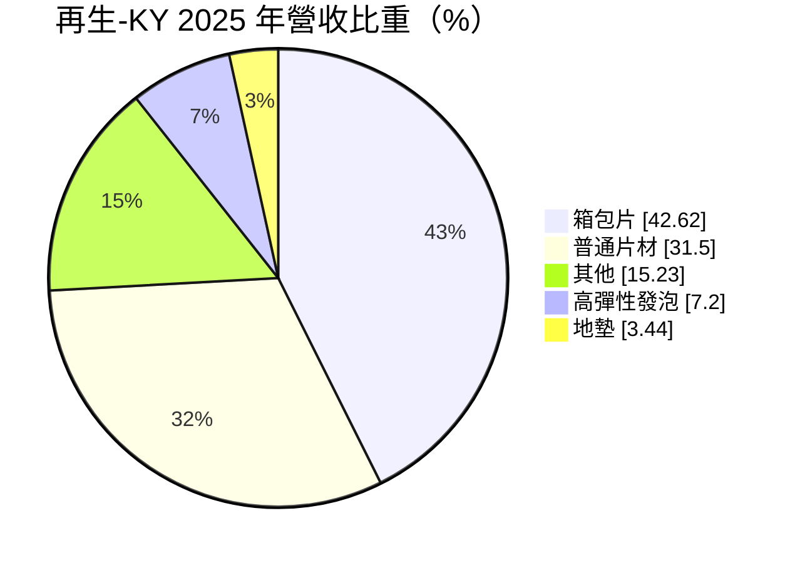
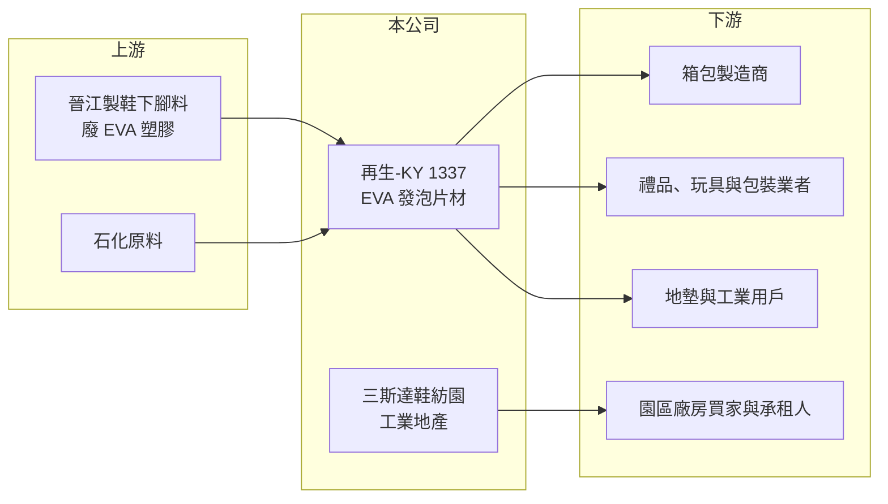

# 1337 再生-KY

> 上市｜[[產業索引-塑膠工業|塑膠工業]]｜上市（櫃）日期 2011/07/01

# 第一章：企業模式與商業藍圖

> [!info] 撰寫說明
> 精簡版，由 Claude 依公開資料整理，架構比照 [[2330台積電]]，資料截至 2026-10-08。來源：Goodinfo 年度經營績效、富邦 e 點通（MoneyDJ）公司基本資料、富果研究 2025 年 12 月法說會整理、nstock。#待校對

本章說明再生-KY（1337）如何從「廢塑膠再生」起家，以及為何逐步轉向工業地產。

- **核心業務：** 亞洲塑膠再生控股 2010 年在開曼群島設立，2011 年在證交所上市，是[[KY股]]，營運主體為福建晉江的三斯達（福建）塑膠。公司把製鞋產業的廢塑膠下腳料回收，再製成 [[EVA]] 共混發泡片材。晉江是中國鞋都，當地每年約產生 16 萬噸製鞋下腳料，原料可以就近取得，這是它當初選址的核心理由。
- **營收結構：** 依 2025 年營收比重，箱包片材占 42.6%，用於行李箱與電腦包內襯；普通片材占 31.5%，用於隔音隔熱、禮品玩具與工業包裝；高彈性發泡占 7.2%，地墊占 3.4%。產品都是中低單價的工業材料，需求跟著中國內需與出口景氣走。
- **營運據點：** 依 2025 年 12 月法說會，晉江廠有 38 台機組、年產能約 36 萬立方米，是中國最大的發泡生產基地之一；但 2025 年前三季出貨量只有約 6.6 萬立方米，產能利用率很低。員工人數從高峰 1,100 多人降到 507 人。
- **長期方向：** 2018 年中國禁止廢塑料進口後，公司過去靠進口廢料取得的超額毛利消失，本業轉為長期虧損。公司因此開發「三斯達鞋紡園」工業園區，整體規劃 19 棟廠房、總建築面積 71 萬平方米，目標 2026 年下半年至 2028 年完成，以廠房出售、租金與管理服務作為未來主要現金流來源。

# 第二章：護城河深度與競爭優勢

本章分析再生-KY 的競爭條件，以及轉型工業地產能否建立新的護城河。

- **競爭優勢：** 公司的優勢在於產能規模與地點。大型發泡產能加上鄰近鞋都的回收料源，理論上能壓低原料成本；但在原料政策改變、需求疲弱後，規模反而變成折舊與固定成本的負擔。真正可能持續的資產，是晉江的工業用地與已建成的廠房。
- **主要對手：** 發泡片材市場以中國本地大量中小型廠為主，產品同質性高、價格競爭激烈。同在晉江、以 EVA 鞋材起家的 [[1340勝悅-KY]] 已在 2025 年關閉生產車間轉做租賃，顯示當地傳統塑膠產業的整體處境。
- **觀察重點：** 第一是園區第一期廠房能否如期交屋並認列營收，法說會揭露已預售 7.5 萬平方米、預收款近 2.2 億人民幣。第二是本業能否達成公司設定的「現金流持平」目標。第三是 13.4 億人民幣園區資金需求中，8.3 億借款額度動用後的利息負擔。

# 第三章：財務體質與盈利規模

資料日期：2026-10-08，表格是撰寫當時的快照；最新月營收、毛利率、累計 EPS 由自動排程寫在本筆記的屬性欄位（月營收、毛利率、累計EPS 等）。#待校對

本章用五年數字檢視再生-KY 本業虧損的程度與資產結構。

| 年度 | 營收（新台幣） | [[毛利率]] | [[營業利益率]] | EPS（元） | [[ROE]] |
|---|---|---|---|---|---|
| 2021 | 11.1 億 | -17.6% | -47.8% | -1.71 | -8.31% |
| 2022 | 6.44 億 | -35.2% | -72.6% | -1.77 | -9.36% |
| 2023 | 7.72 億 | -19.9% | -50.7% | -1.53 | -8.86% |
| 2024 | 8.17 億 | -12.1% | -41.2% | -1.54 | -9.71% |
| 2025 | 6.64 億 | -18.6% | -60.5% | -1.74 | -12.0% |

- **營收規模：** 營收在 6 至 11 億元之間起伏，2021 至 2025 年年複合成長率約 -12.1%（推算）。2025 年前三季總資產約 60 億元，其中投資性不動產 19 億元，營收規模相對資產明顯偏小，說明資產多數沒有轉化成營收。
- **獲利：** 五年毛利率全部為負，代表產品售價連直接生產成本都無法涵蓋；每年稅後虧損約 4 至 5 億元，近五年平均 ROE 約 -9.6%（推算）。每股淨值從 19.71 元降到 13.64 元，虧損正在持續侵蝕股東權益。
- **財務特色：** 負債比例約 44%，流動比率約 97%，公司說明偏低是因為帳上有約 2.2 億人民幣預收售房款。股本 26.9 億元，近五年沒有配發現金股利。
- **[[ROIC]] 與 [[WACC]]：** 2025 年營業利益約 -4.02 億元（6.64 億 × -60.5%），虧損不計稅；股東權益約 36.7 億元（每股淨值 13.64 元 × 2.69 億股），總負債約 28.4 億元、假設一半為有息負債約 14.2 億元，ROIC 約 -7.9%（推算）。WACC 以 CAPM 推估：無風險利率 1.75%、市場風險溢酬 6%，MoneyDJ 的 β 僅 0.08 不具代表性，改用傳產同業常見值 0.8，股東權益成本約 6.55%；稅後負債成本約 2%，股權權重約 72%，WACC 約 5.3%（推算）。ROIC 連續多年遠低於 WACC，代表本業長期在毀損價值，公司能否創造價值完全取決於園區開發的回收。

# 第四章：總體風險與地緣政治

本章整理再生-KY 長期必須面對的風險。

- **產業週期：** 箱包與片材需求跟著中國內需、房地產與出口走，法說會把虧損歸因於內需通縮、房地產不振與中美貿易摩擦。這些是結構性問題，不會因單一年度景氣好轉而消失。
- **營運風險：** 工業園區屬於資本密集的地產開發，銷售速度、售價與交屋時程都有不確定性。若銷售不如預期，公司要同時承擔本業虧損與園區借款利息，資金壓力會明顯升高。
- **其他風險：** 中國的廢塑料、環保與土地政策會直接影響本業與園區開發。營收以人民幣計價，換算新台幣時有匯率影響；KY 公司的資訊揭露與跨境監理也比一般台灣公司更需要投資人留意。

# 專有名詞解析

## 金融

- **[[KY股]]**：在海外註冊、來台上市櫃的公司，代號名稱後加註 KY。
- **[[ROIC]]**：投入資本報酬率，稅後營業利益除以投入資本，衡量本業運用資金創造報酬的能力。
- **[[WACC]]**：加權平均資金成本，股東與債權人要求報酬率的加權平均，ROIC 高於 WACC 才代表創造價值。

## 產業

- **[[EVA]]**：乙烯醋酸乙烯酯共聚物，用於太陽能模組封裝膜、鞋材與發泡材料。
- **[[發泡片材]]**：在塑膠中加入發泡劑形成大量微小氣孔的片狀材料，質輕、緩衝、隔熱，用於箱包內襯與地墊。
- **[[工業地產]]**：開發廠房、倉儲等工業用不動產，以出售或出租取得收入。

# 核心供應鏈

- 上游：晉江製鞋業的廢塑膠下腳料與石化原料。
- 下游／客戶：箱包、禮品玩具、工業包裝與地墊業者；園區廠房買家與承租企業。具體客戶名單未查得。
- 同業：[[1340勝悅-KY]]（同在晉江的 EVA 鞋材業者），以及中國本地發泡材料廠。

## 最新新聞
<!-- news:start -->
<!-- news:end -->

## 相關連結
- [公開資訊觀測站](https://mopsov.twse.com.tw/mops/web/t05st03?step=1&firstin=1&co_id=1337)
- [Goodinfo](https://goodinfo.tw/tw/StockDetail.asp?STOCK_ID=1337)
- [Yahoo 股市](https://tw.stock.yahoo.com/quote/1337)
- [鉅亨網新聞](https://www.cnyes.com/twstock/1337/news)
