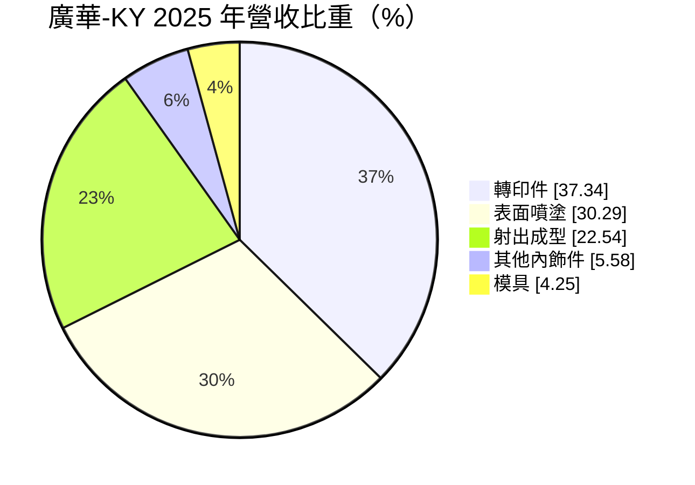
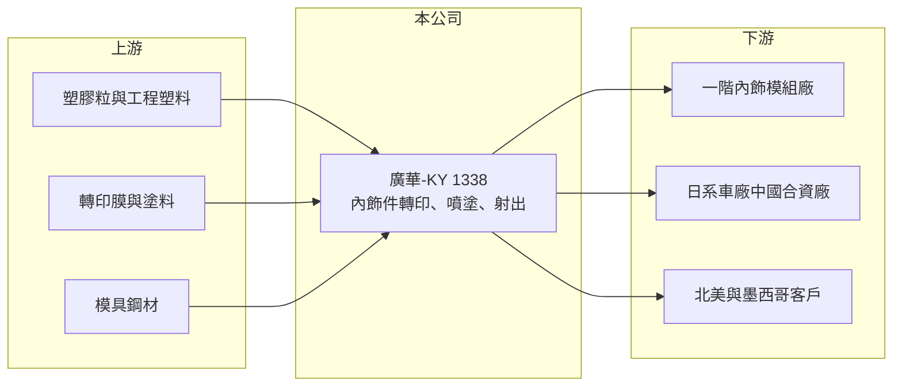

# 1338 廣華-KY

> 上市｜[[產業索引-汽車工業|汽車工業]]｜上市（櫃）日期 2012/12/19

# 第一章：企業模式與商業藍圖

> [!info] 撰寫說明
> 精簡版，由 Claude 依公開資料整理，架構比照 [[2330台積電]] 的四章研究，資料截至 2026-10-08。財務數字來源：Goodinfo 年度經營績效頁、MoneyDJ 個股基本資料（2025 年營收比重）、證交所開放資料（基本資料、2026 年第二季資產負債與綜合損益、營益分析、股利、本益比）；客戶與據點描述部分憑既有知識撰寫，已標「待校對」。#待校對

在評估單一個股的長期價值時，首要步驟是拆解企業的獲利來源。本章說明廣華控股（股票代號：1338，以下簡稱廣華-KY）如何以汽車內飾件的表面裝飾技術切入整車供應鏈，以及它的成長為何與日系車在中國的興衰綁在一起。

- **核心業務：** 廣華-KY 註冊於開曼群島，2012 年在台灣上市，主要營運據點位於廣東東莞，董事長為余澤民，實收資本額約 8.38 億元。公司生產汽車內飾件與模具，依 MoneyDJ 的 2025 年營收比重，轉印件占 37.34%、表面噴塗占 30.29%、射出成型占 22.54%、其他內飾件占 5.58%、模具占 4.25%。
- **技術內容：** 轉印是把木紋、碳纖維紋或金屬紋等圖案，以[[水轉印]]或熱轉印方式貼附在塑膠件表面；表面噴塗則是在儀表板飾條、中控面板、門飾板上做烤漆與塗裝。這些零件決定車內的質感，屬於外觀件，品質要求高、良率管理難度大，但單價與技術門檻低於動力或電子零件。
- **客戶與市場：** 廣華-KY 的客戶以日系車廠在中國的合資廠及其一階供應商為主，另有出貨至美國與墨西哥市場。#待校對 公司是整車廠的[[二階供應商]]或一階供應商，接單以車型專案為單位，[[車型生命週期]]通常為 4 至 6 年。
- **長期方向：** 中國電動車品牌崛起後，日系車在中國的市占率自 2021 年起明顯下滑，直接衝擊廣華-KY 的訂單。公司長期需要做的是把客戶結構從日系擴展到中國本土品牌與北美市場，並把表面處理技術應用到新能源車的內飾設計。

# 第二章：護城河深度與競爭優勢

本章分析廣華-KY 的競爭優勢與限制。

- **競爭優勢：** 汽車內飾件必須通過車廠的外觀、耐候與耐磨測試，並且在整個車型生命週期內穩定供貨，一旦導入，中途更換供應商的成本高。廣華-KY 同時具備模具、射出、轉印與噴塗能力，能提供從模具到完成品的一站式服務，這是它在單一工序的小廠之間的差異化。
- **限制：** 毛利率長期維持在 20% 至 27% 之間（Goodinfo），代表技術與品質有一定價值；但營業利益率從 2016 年的 11.9% 降到 2023 年後接近零或為負，顯示營收縮小後，管理與研發等固定費用無法被攤平，議價能力也不足以把成本轉嫁給車廠。
- **主要對手：** 中國本土的內飾件與塗裝廠商、日系車廠體系內的內飾供應商，以及台灣同業如 [[1339昭輝]]、[[1522堤維西]] 等其他汽車外觀零件廠（業務部分重疊）。
- **觀察重點：** 第一，中國本土電動車品牌的接單比重能否提升；第二，北美與墨西哥的出貨能否成為穩定的第二成長來源；第三，營業費用能否隨營收規模調整，讓營業利益率回到正數。

# 第三章：財務體質與盈利規模

資料日期：2026-10-08，表格是撰寫當時的快照；最新月營收、毛利率、累計 EPS 由自動排程寫在本筆記的屬性欄位（月營收、毛利率、累計EPS 等）。#待校對

本章用多年度的三率、ROE 與資本報酬，檢視廣華-KY 的獲利品質。

| 年度 | 營收（新台幣） | [[毛利率]] | [[營業利益率]] | EPS（元） | [[ROE]] |
|---|---|---|---|---|---|
| 2021 | 73.1 億 | 21.1% | 3.47% | 4.04 | 5.33% |
| 2022 | 73.4 億 | 20.4% | 2.86% | 1.63 | 1.96% |
| 2023 | 57.6 億 | 22.1% | 0.77% | -1.96 | -2.59% |
| 2024 | 50.9 億 | 22.2% | -1.77% | -1.14 | -0.72% |
| 2025 | 52.3 億 | 23.5% | -0.83% | -2.24 | -2.63% |
| 2026 上半年 | 25.1 億 | 23.45% | -4.62% | -2.08 | 未查得 |

註：2021 至 2025 年取自 Goodinfo，2026 上半年取自證交所營益分析。Goodinfo 原表欄位對齊較亂，2016、2017 與 2025 年已用 EPS 驗算吻合，其他年度建議以年報核對。

- **營收規模：** 2016 至 2018 年營收約 76 億至 81 億元，2021 至 2025 年營收年複合成長率約 -8.0%（推算），2025 年約 52.3 億元，規模已比高峰縮小三成以上。
- **獲利結構：** 毛利率穩定，但營業利益率持續下滑，2026 年上半年營業費用約 7.04 億元，高於營業毛利約 5.88 億元（證交所開放資料），本業虧損擴大。
- **長期指標：** 2021 至 2025 年平均 ROE 約 0.3%（推算），對照 2016 至 2017 年約 10% 的水準大幅退步。即使 2025 年虧損，公司仍配發現金股利 0.30 元，顯示動用保留盈餘維持配息。
- **財務特色：** 2026 年第二季底總負債約 74.9 億元、權益總計約 62.4 億元，負債比約 55%，其中非流動負債約 34.0 億元。每股淨值約 72.26 元，股價淨值比僅約 0.21 倍（證交所開放資料），反映市場對虧損持續的高度疑慮。

**[[ROIC]] 與 [[WACC]]：** 2025 年營業利益約 52.3 億元 ×（-0.83%）≈ -0.43 億元，稅後營業利益為負，ROIC 約 -0.3%（推算；投入資本以權益 62.4 億元加上假設占總負債六成的有息負債約 44.9 億元，合計約 107.4 億元）。WACC 以 CAPM 推估：無風險利率 1.75%、市場風險溢酬 6%、β 取汽車零件業常見值 1.0，股東權益成本約 7.75%；負債成本 2.5%、稅後 2.0%；權益約占 58%，WACC 約 5.3%（推算）。對照 2016 年營業利益約 9 億元的水準，當時 ROIC 推估約 6% 至 7%（推算，資本基礎以近期數字代替），略高於資金成本。結論是廣華-KY 自 2023 年起持續侵蝕股東價值，能否回到創造價值的狀態，取決於客戶結構轉型的成果。

# 第四章：總體風險與地緣政治

本章分析廣華-KY 長期面對的風險。

- **產業週期與結構：** 中國汽車市場正從燃油車轉向電動車，本土品牌快速取代合資品牌。日系車在中國的銷量若持續下滑，以日系為主要客戶的供應商將面臨訂單長期萎縮，這是結構性而非週期性的風險。
- **營運風險：** 營收縮小後固定費用率上升，若營業費用無法同步調整，虧損可能延續。內飾件屬於車型專案訂單，新車型的接單、開模與量產之間有一到兩年的落差，轉型成效需要時間顯現。
- **其他風險：** 中美貿易摩擦與美國關稅政策會影響中國製零件出口北美；人民幣與新台幣匯率波動影響帳面獲利；開曼註冊、營運在中國的 KY 公司，資訊揭露與資金匯回也受到兩岸法規影響。

# 專有名詞解析

## 應用

- **[[水轉印]]**：把印有圖案的薄膜放在水面，利用水壓把圖案包覆到立體塑膠件表面的裝飾技術，常見於汽車內飾的木紋與碳纖紋飾條。
- **[[二階供應商]]**：不直接供貨給整車廠，而是供貨給一階模組廠的零件供應商，議價能力通常較弱。
- **[[車型生命週期]]**：一款車從上市到改款或停產的期間，通常為 4 至 6 年，零件供應商的訂單多以此為單位。

## 金融

- **[[毛利率]]**：營業毛利占營收的比例，反映產品定價能力與生產成本控制。
- **[[營業利益率]]**：扣除營業費用後的營業利益占營收的比例，衡量本業整體獲利能力。
- **[[ROE]]**：股東權益報酬率，稅後淨利除以股東權益，衡量公司運用股東資金的效率。
- **[[ROIC]]**：投入資本報酬率，稅後營業利益除以股東權益與有息負債的合計，衡量本業對所有資金提供者的報酬。
- **[[WACC]]**：加權平均資金成本，依股東權益與負債的比重加權計算的資金成本，ROIC 高於它才代表創造價值。

# 核心供應鏈

- 上游：塑膠粒與工程塑料、轉印膜與塗料、模具鋼材。
- 下游／客戶：一階內飾模組廠、日系車廠在中國的合資廠、北美與墨西哥市場客戶（待校對）。
- 同業：中國本土內飾件廠，台灣汽車零件同業 [[1339昭輝]]、[[1522堤維西]]、[[1521大億]]。

## 最新新聞
<!-- news:start -->
<!-- news:end -->

## 相關連結
- [公開資訊觀測站](https://mopsov.twse.com.tw/mops/web/t05st03?step=1&firstin=1&co_id=1338)
- [Goodinfo](https://goodinfo.tw/tw/StockDetail.asp?STOCK_ID=1338)
- [Yahoo 股市](https://tw.stock.yahoo.com/quote/1338)
- [鉅亨網新聞](https://www.cnyes.com/twstock/1338/news)
