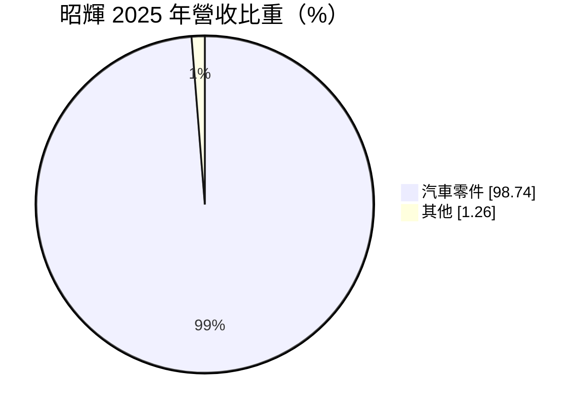
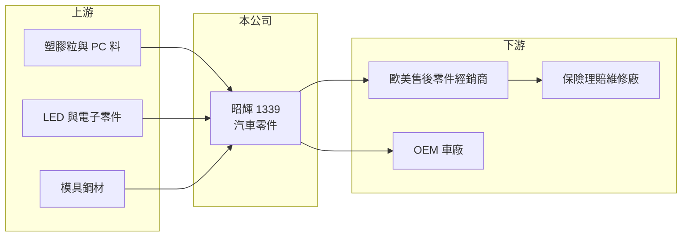

# 1339 昭輝

> 上市｜[[產業索引-汽車工業|汽車工業]]｜上市（櫃）日期 2012/04/24

# 第一章：企業模式與商業藍圖

> [!info] 撰寫說明
> 精簡版，由 Claude 依公開資料整理，架構比照 [[2330台積電]] 的四章研究，資料截至 2026-10-08。財務數字來源：Goodinfo 年度經營績效頁、MoneyDJ 個股基本資料（2025 年營收比重）、證交所開放資料（基本資料、2026 年第二季資產負債與綜合損益、營益分析、股利、本益比）；產品與市場描述部分憑既有知識撰寫，已標「待校對」。公開資料有限。#待校對

在評估單一個股的長期價值時，首要步驟是拆解企業的獲利來源。本章說明昭輝實業（股票代號：1339，以下簡稱昭輝）作為彰化鹿港汽車零件聚落一員的定位，以及它高毛利、低負債的經營特色。

- **核心業務：** 昭輝成立於 1986 年，2012 年上市，總部與工廠位於彰化縣鹿港鎮，董事長由法人禾翰投資擔任，實收資本額約 7.41 億元。依 MoneyDJ 的 2025 年營收比重，汽車零件占 98.74%、其他占 1.26%，是一家專業的汽車零件製造商。
- **市場定位：** 鹿港彰濱一帶是台灣[[AM售後市場]]汽車零件的重要聚落，業者以生產維修替換用的外觀件為主，主要外銷歐美。昭輝的產品屬於這類維修替換市場（推估以車燈等外觀零件為主），市場資料也提到公司曾透過併購切入[[OEM]]市場。#待校對
- **商業模式的意義：** 售後市場零件的需求來自車禍維修與老車保養，和新車銷量的關聯較弱，主要取決於路上車輛的數量與平均車齡。這讓昭輝的營收不像新車零件那樣大起大落，但每一款零件都要自行開模，品項多、單量小，經營重點在於開發速度與庫存管理。
- **長期方向：** 昭輝的毛利率在 2023 至 2025 年維持 33% 至 36%（Goodinfo），顯示產品具備一定的定價能力。不過營收從 2019 年的 26.5 億元降到 2025 年的 16.6 億元，規模持續縮小，長期課題是找回成長動能，例如擴大 OEM 業務或新產品線。

# 第二章：護城河深度與競爭優勢

本章分析昭輝的競爭優勢與限制。

- **競爭優勢：** 售後市場零件的競爭關鍵在於「品項齊全」與「上市速度」。新車上市後，誰能最快推出對應的替換零件並取得認證，誰就能搶下維修市場。昭輝累積了數十年的模具與車型資料庫，加上低負債的財務結構，可以持續投入開模，這是新進者短期內難以複製的。
- **限制：** 售後市場的通路掌握在歐美的大型經銷商與保險體系手中，零件廠的議價能力有限。昭輝營收規模約 16 億至 20 億元，遠小於同業龍頭，在通路談判與成本分攤上處於劣勢。
- **主要對手：** 台灣售後市場同業如 [[6605帝寶]]、[[1522堤維西]]、[[1524耿鼎]]，以及中國的售後零件廠。
- **觀察重點：** 第一，營收能否止跌回升；第二，OEM 業務的比重變化；第三，業外收益的性質，因為 2022 年與 2026 年上半年的 EPS 都明顯高於本業獲利所能支持的水準。

# 第三章：財務體質與盈利規模

資料日期：2026-10-08，表格是撰寫當時的快照；最新月營收、毛利率、累計 EPS 由自動排程寫在本筆記的屬性欄位（月營收、毛利率、累計EPS 等）。#待校對

本章用多年度的三率、ROE 與資本報酬，檢視昭輝的獲利品質。

| 年度 | 營收（新台幣） | [[毛利率]] | [[營業利益率]] | EPS（元） | [[ROE]] |
|---|---|---|---|---|---|
| 2021 | 19.2 億 | 23.2% | 9.10% | 1.83 | 3.58% |
| 2022 | 20.2 億 | 26.3% | 8.91% | 5.51 | 10.9% |
| 2023 | 20.5 億 | 33.6% | 19.6% | 5.88 | 11.0% |
| 2024 | 19.3 億 | 35.7% | 18.8% | 5.01 | 8.62% |
| 2025 | 16.6 億 | 34.6% | 16.4% | 2.41 | 4.11% |
| 2026 上半年 | 8.06 億 | 25.19% | 4.37% | 3.61 | 未查得 |

註：2021 至 2025 年取自 Goodinfo（原表欄位錯位，2022 年 EPS 與 ROE 依欄位順序推斷，建議以年報核對），2026 上半年取自證交所營益分析；2025 年 EPS 與證交所股利資料的本期淨利 1.79 億元換算結果一致。

- **營收規模：** 2016 至 2019 年營收約 25 億至 28 億元，2021 至 2025 年營收年複合成長率約 -3.6%（推算），2025 年降到 16.6 億元。
- **獲利結構：** 2023 至 2025 年毛利率提升到 35% 左右、營業利益率 16% 至 20%，本業獲利能力改善；但 2026 年上半年毛利率降到 25.19%、營業利益率只有 4.37%，明顯轉弱。同期營業外收入約 2.73 億元，遠大於營業利益約 0.35 億元（證交所開放資料），EPS 3.61 元主要來自業外，性質未查得（推估為資產處分或投資收益）。
- **長期指標：** 2021 至 2025 年平均 ROE 約 7.6%（推算）。2025 年度配發現金股利 2.50 元，略高於當年 EPS 2.41 元，配發率約 104%（推算），公司以高配息回饋股東。
- **財務特色：** 2026 年第二季底總負債約 9.6 億元、權益總計約 42.2 億元，負債比約 19%；流動資產約 18.0 億元，遠高於流動負債約 7.6 億元（證交所開放資料）。財務結構保守，但大量資產沒有投入本業，也拉低了報酬率。

**[[ROIC]] 與 [[WACC]]：** 2025 年營業利益約 16.6 億元 × 16.4% ≈ 2.7 億元，稅後約 2.2 億元。投入資本以權益 42.2 億元加上假設占總負債三成的有息負債約 2.9 億元，合計約 45.1 億元，ROIC 約 4.8%（推算）；2023 年營業利益約 4.0 億元，同樣算法 ROIC 約 7%（推算）。WACC 以 CAPM 推估：無風險利率 1.75%、市場風險溢酬 6%、β 取汽車零件業常見值 0.9，股東權益成本約 7.15%；負債成本 2.5%、稅後 2.0%；權益約占 94%，WACC 約 6.8%（推算）。結論是昭輝在 2023 至 2024 年本業表現好的時候，ROIC 大致與資金成本打平；2025 年以後低於資金成本。由於帳上資產遠多於本業所需，如果只計算營運資產，報酬率會較高，但對股東而言，資本效率的改善仍需要本業成長或更積極的資本配置。

# 第四章：總體風險與地緣政治

本章分析昭輝長期面對的風險。

- **產業週期：** 售後市場零件需求與車禍維修、保險理賠及車輛老化相關，景氣循環較溫和；但歐美經銷商的庫存調整會讓訂單短期大幅波動，2025 年營收下滑可能與此有關（推估）。
- **營運風險：** 售後零件品項多、單量小，開模與庫存成本高；新車設計改變（例如車燈改用整合式 LED 模組）會提高開發難度。營收規模縮小後，固定費用率上升，2026 年上半年營業利益率大幅下滑即是警訊。
- **其他風險：** 美國關稅政策與貿易保護措施直接影響出口；新台幣升值會壓縮以美元計價的毛利；原廠對維修零件的智慧財產權主張，也是售後市場長期存在的法律風險。

# 專有名詞解析

## 應用

- **[[AM售後市場]]**：After Market，汽車出廠後的維修、替換與改裝零件市場，需求取決於車輛數與車齡，而非新車銷量。
- **[[OEM]]**：原廠委託製造，零件直接供應車廠裝在新車上，需通過車廠認證，訂單隨車型生命週期而定。

## 金融

- **[[毛利率]]**：營業毛利占營收的比例，反映產品定價能力與生產成本控制。
- **[[營業利益率]]**：扣除營業費用後的營業利益占營收的比例，衡量本業整體獲利能力。
- **[[ROE]]**：股東權益報酬率，稅後淨利除以股東權益，衡量公司運用股東資金的效率。
- **[[ROIC]]**：投入資本報酬率，稅後營業利益除以股東權益與有息負債的合計，衡量本業對所有資金提供者的報酬。
- **[[WACC]]**：加權平均資金成本，依股東權益與負債的比重加權計算的資金成本，ROIC 高於它才代表創造價值。

# 核心供應鏈

- 上游：塑膠粒與光學 PC 料、LED 與電子零件、模具鋼材（依產品推估，待校對）。
- 下游／客戶：歐美售後零件經銷商、維修廠與保險理賠體系、部分 OEM 客戶（待校對）。
- 同業：[[6605帝寶]]、[[1522堤維西]]、[[1524耿鼎]]、[[1521大億]]。

## 最新新聞
<!-- news:start -->
<!-- news:end -->

## 相關連結
- [公開資訊觀測站](https://mopsov.twse.com.tw/mops/web/t05st03?step=1&firstin=1&co_id=1339)
- [Goodinfo](https://goodinfo.tw/tw/StockDetail.asp?STOCK_ID=1339)
- [Yahoo 股市](https://tw.stock.yahoo.com/quote/1339)
- [鉅亨網新聞](https://www.cnyes.com/twstock/1339/news)
