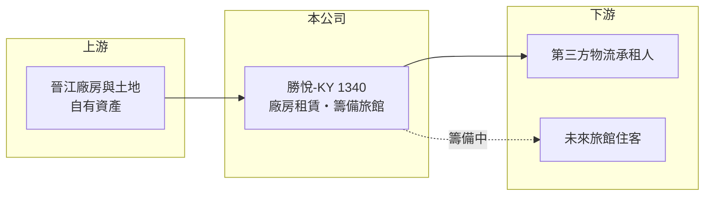

# 1340 勝悅-KY

> 上市｜[[產業索引-塑膠工業|塑膠工業]]｜上市（櫃）日期 2013/12/06

# 第一章：企業模式與商業藍圖

> [!info] 撰寫說明
> 精簡版，由 Claude 依公開資料整理，架構比照 [[2330台積電]]，資料截至 2026-10-08。來源：Goodinfo 年度經營績效、富邦 e 點通（MoneyDJ）公司基本資料、聯合報 2025 年 9 月關廠報導、nstock。公開資料有限。#待校對

本章說明勝悅-KY（1340）從鞋底材料大廠轉為租賃業者的過程，以及它現在靠什麼收入。

- **核心業務：** 勝悅 2012 年在開曼群島設立、2014 年在證交所上市，是[[KY股]]，總部與生產基地在福建晉江。公司原本從事高分子複合材料研發，產品是各式鞋底與 EVO 膠粒，2024 年鞋底產能 380 萬雙。依聯合報報導，掛牌初期股價一度衝上 210 元，被市場稱為「鞋王」。
- **營收結構：** 依 MoneyDJ 揭露，2025 年營收 100% 來自租賃。公司自 2024 年起陸續停產鞋底車間，2025 年 7 月最後的 EVO 生產車間也停止運作，已不再生產鞋底與膠粒，閒置廠房改租給第三方物流業者。
- **營運據點：** 福建晉江原有 1 座廠房、1 個生產車間及 2 條 EVO 膠粒產線，現在主要作為出租資產。員工依中國當地規定辦理遣散。
- **長期方向：** 公司表示將發展旅館事業，2025 年仍在設計與樣品房裝修的籌備階段，規模、投資金額與開幕時程都未公開。換句話說，勝悅已從製造業轉為以不動產收租為主的資產型公司，未來價值主要取決於晉江廠房與土地如何運用。

# 第二章：護城河深度與競爭優勢

本章分析勝悅-KY 在停產後還剩下什麼競爭條件。

- **競爭優勢：** 停產後，公司在鞋材市場已經沒有競爭地位。目前最主要的資產是晉江的廠房與土地，以及負債比例約 13.6% 的低負債結構；這讓它在轉型期間不至於立即面臨債務壓力。
- **主要對手：** 原本的鞋底材料市場由中國大量本地廠商與大型鞋業集團的垂直整合供應鏈主導，報導指出台資鞋廠採用勝悅鞋底的情況並不多，這也是它在需求下滑時缺乏穩定客戶的原因。租賃與旅館業務則要面對晉江當地的工業地產與飯店業者。
- **觀察重點：** 租金收入能否穩定涵蓋管理費用與折舊、旅館事業是否真的投資與開業，以及公司是否處分資產或減資退還股東。這三件事決定剩餘淨值能否保存下來。

# 第三章：財務體質與盈利規模

資料日期：2026-10-08，表格是撰寫當時的快照；最新月營收、毛利率、累計 EPS 由自動排程寫在本筆記的屬性欄位（月營收、毛利率、累計EPS 等）。#待校對

本章用五年數字檢視勝悅-KY 本業萎縮與淨值流失的速度。

| 年度 | 營收（新台幣） | [[毛利率]] | [[營業利益率]] | EPS（元） | [[ROE]] |
|---|---|---|---|---|---|
| 2021 | 6.51 億 | -58.2% | -80.5% | -3.35 | -9.84% |
| 2022 | 4.99 億 | -50.7% | -86.0% | -2.81 | -8.92% |
| 2023 | 5.62 億 | -37.4% | -71.8% | -5.64 | -20.6% |
| 2024 | 0.48 億 | 100%（原始資料如此） | -162% | -5.28 | -24.0% |
| 2025 | 0.42 億 | -86.1% | -334% | -2.61 | -14.2% |

- **營收規模：** Goodinfo 顯示 2024 年營收只有 0.48 億元，但聯合報報導 2024 年合併營收為 3.76 億元，差異推估來自停業部門重分類，需以年報確認。依報導，3.76 億元約為高峰期的十分之一，公司自 2019 年起連續虧損。
- **獲利：** 五年毛利率幾乎都是負值，代表產品售價無法涵蓋生產成本；2023 與 2024 年每年稅後虧損約 8 億元，近五年平均 ROE 約 -15.5%（推算）。每股淨值從 32.63 元降到 17.05 元，五年間少了將近一半。
- **財務特色：** 股本約 15.3 億元，負債比例約 13.6%，近五年沒有配息。轉為收租後營收規模很小，虧損主要來自費用與資產減損，能否收斂要看停產相關的一次性損失是否已認列完畢（推估）。
- **[[ROIC]] 與 [[WACC]]：** 2025 年營業利益約 -1.40 億元（0.42 億 × -334%），虧損不計稅；股東權益約 26.1 億元（每股淨值 17.05 元 × 1.53 億股），總負債約 4.1 億元、假設一半為有息負債約 2.05 億元，ROIC 約 -5.0%（推算）。WACC 以 CAPM 推估：無風險利率 1.75%、市場風險溢酬 6%，MoneyDJ 的 β 為 0.28 不具代表性，改用傳產同業常見值 0.8，股東權益成本約 6.55%；稅後負債成本約 2%，WACC 約 6.2%（推算）。ROIC 長期遠低於 WACC，代表過去的製造事業一直在毀損價值；轉為收租後，ROIC 能否轉正取決於租金收益率與費用控管。

# 第四章：總體風險與地緣政治

本章整理勝悅-KY 長期必須面對的風險。

- **產業週期：** 公司已退出鞋材製造，不再直接受鞋業景氣影響；但晉江工業廠房的租賃需求會隨當地製造業景氣起伏，若當地工廠持續外移，租金與出租率都可能承壓。
- **營運風險：** 旅館事業是全新領域，公司沒有經營經驗，投資規模與回收期都未公開。若大舉投入但經營不善，可能再次消耗剩餘淨值。
- **其他風險：** 資產全部在中國，受當地土地、稅務與外匯匯出規定影響；營收以人民幣計價，有匯率風險。KY 公司的資訊揭露較少、跨境監理較難，股東對資產處分與資金運用的監督力有限。

# 專有名詞解析

## 金融

- **[[KY股]]**：在海外註冊、來台上市櫃的公司，代號名稱後加註 KY。
- **[[停業部門]]**：公司已處分或決定結束的事業，財報上會與繼續營業部門分開表達，造成營收前後不可比。
- **[[ROIC]]**：投入資本報酬率，稅後營業利益除以投入資本，衡量本業運用資金創造報酬的能力。
- **[[WACC]]**：加權平均資金成本，股東與債權人要求報酬率的加權平均，ROIC 高於 WACC 才代表創造價值。

## 產業

- **[[EVA]]**：乙烯醋酸乙烯酯共聚物，用於太陽能模組封裝膜、鞋材與發泡材料。
- **[[鞋底材料]]**：製作鞋底的橡膠、EVA 發泡等高分子材料，決定鞋子的緩衝、耐磨與重量。

# 核心供應鏈

- 上游：公司自有的晉江廠房與土地（原鞋底與 EVO 膠粒產線已停產）。
- 下游／客戶：第三方物流業者承租廠房；旅館事業仍在籌備。
- 同業：同在晉江的 [[1337再生-KY]]；過去鞋材本業的同業為中國本地鞋底材料廠。

## 最新新聞
<!-- news:start -->
<!-- news:end -->

## 相關連結
- [公開資訊觀測站](https://mopsov.twse.com.tw/mops/web/t05st03?step=1&firstin=1&co_id=1340)
- [Goodinfo](https://goodinfo.tw/tw/StockDetail.asp?STOCK_ID=1340)
- [Yahoo 股市](https://tw.stock.yahoo.com/quote/1340)
- [鉅亨網新聞](https://www.cnyes.com/twstock/1340/news)
