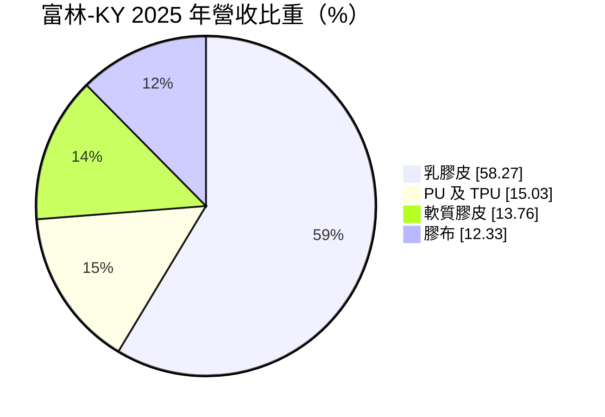
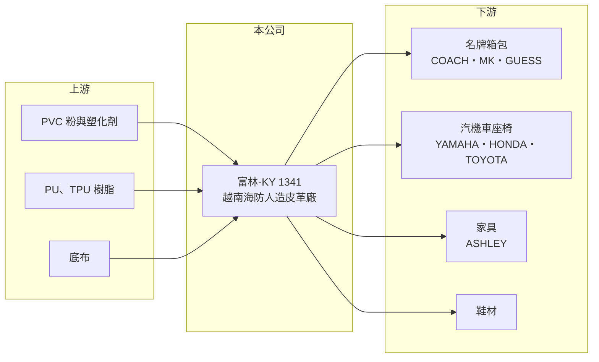

# 1341 富林-KY

> 上市｜[[產業索引-塑膠工業|塑膠工業]]｜上市（櫃）日期 2018/12/24

# 第一章：企業模式與商業藍圖

> [!info] 撰寫說明
> 精簡版，由 Claude 依公開資料整理，架構比照 [[2330台積電]]，資料截至 2026-10-08。來源：Goodinfo 年度經營績效、富邦 e 點通（MoneyDJ）公司基本資料、ETtoday 2018 年上市前報導、nstock。客戶與市占資料來自 2018 年報導，可能已變動。#待校對

本章說明富林-KY（1341）如何在越南建立人造皮革事業，以及它的獲利來源。

- **核心業務：** 富林塑膠工業（開曼）控股 2016 年設立、2018 年 12 月在證交所上市，是[[KY股]]，營運主體是位於越南海防的富林塑膠公司。董事長王源林在台灣第一波南向政策時赴越投資，2018 年上市時自稱越南第一大 [[PVC]] 人造皮革業者。公司產品是做包包、鞋子、汽機車座椅與家具表面的[[合成皮]]。
- **營收結構：** 依 2025 年營收比重，[[乳膠皮]]占 58.3%，PU 及 [[TPU]] 皮占 15.0%，軟質膠皮占 13.8%，膠布占 12.3%。乳膠皮是主力，PU 環保皮則是 2018 年後新增的成長產品，採水性乾式塗佈，避免溶劑汙染。
- **營運據點與客戶：** 生產集中在越南海防。依 2018 年報導，客戶包括 COACH、MK、GUESS 等名牌包，YAMAHA、HONDA、TOYOTA 等車用客戶，以及家具商 ASHLEY；當時主要產品在越南市占率約 86%。越南是全球箱包與鞋類的重要代工基地，富林等於在客戶的工廠旁邊供應材料。
- **長期方向：** 公司的成長路徑是從 PVC 乳膠皮延伸到環保 PU 皮，並把應用從箱包擴大到車用與鞋材。品牌商對環保材料的要求愈來愈高，能否持續擴大 PU 與 TPU 的比重，會影響它未來十年的產品組合與毛利率。

# 第二章：護城河深度與競爭優勢

本章分析富林-KY 的護城河與競爭位置。

- **競爭優勢：** 富林的優勢是「在地供應加上品牌認證」。名牌包與車廠對材料的色澤、手感與耐用度要求嚴格，供應商要通過認證才能進入名單；一旦被指定，客戶通常不會輕易更換。富林在越南就近供貨，交期短、溝通快，對當地箱包代工廠很有吸引力。
- **主要對手：** 競爭者包括台灣的 [[1303南亞]]、[[1307三芳]]、[[4303信立]] 等合成皮廠，以及中國與越南本地的人造皮革業者。中國廠產能大、價格低，但越南製造在美國關稅與品牌分散供應鏈的需求下有相對優勢。
- **觀察重點：** 第一是毛利率能否維持在 20% 以上，五年來介於 19.8% 至 22.7%，相當穩定。第二是 PU 與 TPU 環保皮的比重能否提高。第三是名牌箱包客戶的訂單集中度，因為少數大客戶的庫存調整就會影響全年營收。

# 第三章：財務體質與盈利規模

資料日期：2026-10-08，表格是撰寫當時的快照；最新月營收、毛利率、累計 EPS 由自動排程寫在本筆記的屬性欄位（月營收、毛利率、累計EPS 等）。#待校對

本章用五年數字檢視富林-KY 的獲利穩定度與股東回報。

| 年度 | 營收（新台幣） | [[毛利率]] | [[營業利益率]] | EPS（元） | [[ROE]] |
|---|---|---|---|---|---|
| 2021 | 27.7 億 | 21.1% | 12.8% | 5.99 | 23.9% |
| 2022 | 30.5 億 | 19.8% | 11.7% | 5.95 | 24.2% |
| 2023 | 25.2 億 | 21.3% | 11.6% | 4.48 | 18.3% |
| 2024 | 27.9 億 | 21.1% | 11.9% | 5.38 | 20.5% |
| 2025 | 25.7 億 | 22.7% | 11.0% | 3.71 | 14.3% |

- **營收規模：** 營收長期在 25 至 31 億元之間，與 2017 年的 27.6 億元相比幾乎沒有成長，2021 至 2025 年年複合成長率約 -1.9%（推算）。這說明富林是成熟穩定的材料廠，營收隨品牌客戶的庫存循環起伏，而不是高成長公司。
- **獲利：** 毛利率維持在 20% 上下、營業利益率在 11% 至 13% 之間，五年都沒有虧損，顯示定價能力與成本控管穩定。近五年平均 ROE 約 20.2%（推算），以傳統塑膠業來說屬於高水準；2025 年 EPS 降到 3.71 元，主要是營業外與稅負等因素，營業利益率變化不大（推估）。
- **財務特色：** 股本只有約 5.3 億元，配息大方，Goodinfo 統計的歷年平均現金股利約 4.41 元、平均現金殖利率約 6.8%，配息率長期偏高。負債比例約 46%，以營運資金與短期借款為主（推估）。
- **[[ROIC]] 與 [[WACC]]：** 2025 年營業利益約 2.83 億元（25.7 億 × 11.0%），以 20% 稅率計算稅後營業利益約 2.26 億元；股東權益約 12.9 億元（每股淨值 24.43 元 × 0.529 億股），總負債約 11.0 億元、假設一半為有息負債約 5.5 億元，ROIC 約 12.3%（推算），2024 年約 13.3%（推算）。WACC 以 CAPM 推估：無風險利率 1.75%、市場風險溢酬 6%，MoneyDJ 的 β 為 0.14 不具代表性，改用傳產同業常見值 0.8，股東權益成本約 6.55%；稅後負債成本約 2%，股權權重約 70%，WACC 約 5.2%（推算）。ROIC 長期高出 WACC 約 7 個百分點，代表富林的本業持續創造經濟價值，且多數以現金股利回饋股東。

# 第四章：總體風險與地緣政治

本章整理富林-KY 長期必須面對的風險。

- **產業週期：** 箱包、鞋類與家具都是消費性產品，品牌商在景氣轉弱時會先去化庫存，訂單調整會透過[[長鞭效應]]放大到材料廠。2023 年營收下滑 17% 就是這種庫存循環的例子。
- **營運風險：** 客戶集中在少數國際品牌，單一品牌改變設計或換供應商，就可能影響營收。PVC、塑化劑等原料價格隨油價波動，若漲價無法即時轉嫁，毛利率會被壓縮。
- **其他風險：** 生產全部在越南，需面對越南的工資上漲、環保法規與匯率變化；美國對越南的關稅政策也會間接影響客戶下單。KY 公司的資訊揭露相對有限，投資人需要多留意年報與法說會資料。

# 專有名詞解析

## 金融

- **[[KY股]]**：在海外註冊、來台上市櫃的公司，代號名稱後加註 KY。
- **[[ROIC]]**：投入資本報酬率，稅後營業利益除以投入資本，衡量本業運用資金創造報酬的能力。
- **[[WACC]]**：加權平均資金成本，股東與債權人要求報酬率的加權平均，ROIC 高於 WACC 才代表創造價值。

## 產業

- **[[PVC]]**：聚氯乙烯，用於水管、電線被覆、地板與建材的通用塑膠，台塑起家的產品。
- **[[合成皮]]**：以塑膠樹脂塗佈在布料上製成、外觀類似真皮的材料，用於鞋子、包包、家具與汽車座椅。
- **[[乳膠皮]]**：以 PVC 糊狀樹脂塗佈發泡製成的人造皮，手感柔軟、成本較低，常用於箱包與家具。
- **[[TPU]]**：熱塑性聚氨酯，具彈性、耐磨且可回收，用於鞋材、薄膜與合成皮。
- **[[長鞭效應]]**：終端需求的小幅變動，沿供應鏈往上游傳遞時被逐級放大，造成上游庫存與訂單劇烈波動。

# 核心供應鏈

- 上游：PVC 粉與塑化劑，台灣主要供應商如 [[1301台塑]]、[[1313聯成]]（產業參考，富林實際供應商未查得）；PU 與 TPU 樹脂、底布。
- 下游／客戶：依 2018 年報導，包括 COACH、MK、GUESS 等名牌箱包，YAMAHA、HONDA、TOYOTA 等車用客戶，以及家具商 ASHLEY。
- 同業：[[1303南亞]]、[[1307三芳]]、[[4303信立]]，以及中國與越南本地人造皮革廠。

## 最新新聞
<!-- news:start -->
<!-- news:end -->

## 相關連結
- [公開資訊觀測站](https://mopsov.twse.com.tw/mops/web/t05st03?step=1&firstin=1&co_id=1341)
- [Goodinfo](https://goodinfo.tw/tw/StockDetail.asp?STOCK_ID=1341)
- [Yahoo 股市](https://tw.stock.yahoo.com/quote/1341)
- [鉅亨網新聞](https://www.cnyes.com/twstock/1341/news)
