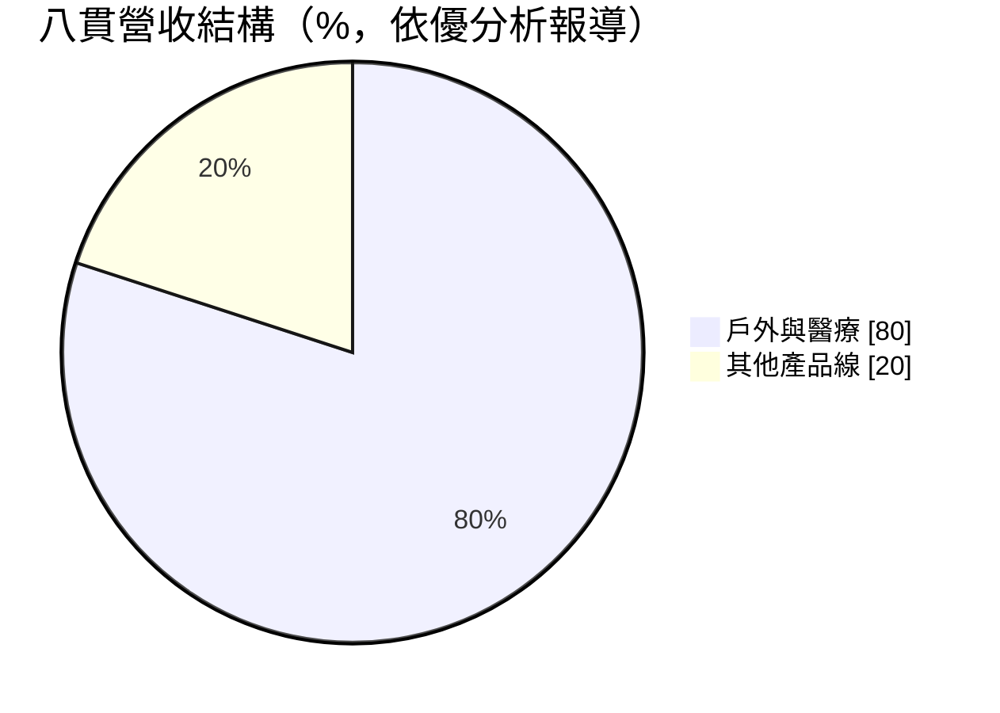
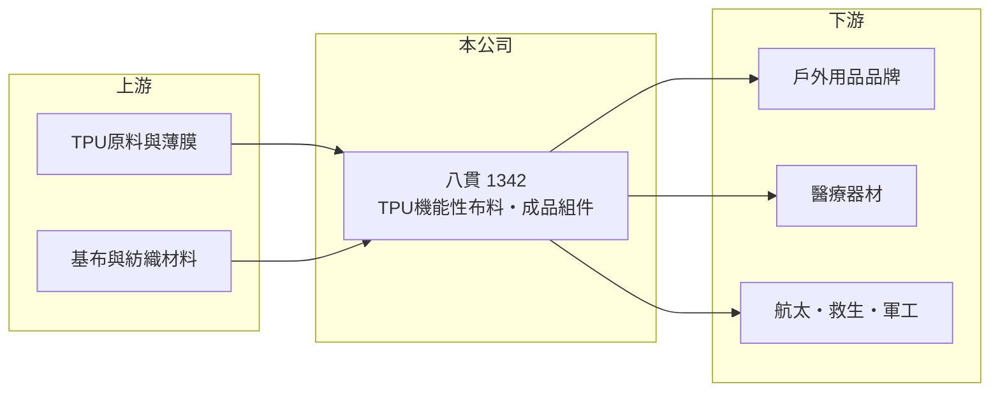

# 1342 八貫

> 上市｜[[產業索引-其他業|其他業]]｜上市（櫃）日期 2020/11/24

# 第一章：企業模式與商業藍圖

> [!info] 撰寫說明
> 精簡版，由 Claude 依公開資料整理，架構比照 [[2330台積電]]，資料截至 2026-10-07。來源：優分析 2026 年第一季與第二季財報報導、經濟日報營收報導（搜尋結果標題）。毛利率、營運據點與主要客戶未查到。#待校對

八貫是 TPU 機能性布料與成品組件廠，2026 年上半年營收與獲利都創同期新高。

- **核心業務：** 八貫有兩大事業群：[[TPU布料]]（機能性布料）與成品組件，終端應用包括高端醫療、航太、救生與戶外用品。
- **營收結構：** 公司分為四大產品線，其中戶外與醫療是主要成長引擎，合計約占營收八成。

- **營運據點：** 生產與營運據點本次未查到；第一季報導提到產能稼動率滿載，訂單能見度已到第三季。
- **長期方向：** 除戶外與醫療外，公司也受惠航太航海與軍工產品需求，產品朝高單價、高規格應用延伸。

# 第二章：護城河深度與競爭優勢

八貫的優勢在於 TPU 貼合與加工技術，以及打入醫療、航太等高門檻應用。

- **競爭優勢：** 醫療、救生與航太用品對材料安全性與耐用度要求高，需經客戶長期驗證，一旦打入供應鏈，轉換成本高（推估）。
- **主要對手：** 國內外機能性布料與 TPU 加工廠，具體對手本次未查到。
- **觀察重點：** 產能能否跟上訂單、軍工與航太訂單的延續性，以及匯兌對獲利的影響。

# 第三章：財務體質與盈利規模

資料日期：2026-10-07，以下數字是撰寫當時的快照；最新月營收、毛利率、累計 EPS 由自動排程寫在本筆記的屬性欄位（月營收、毛利率、累計EPS 等）。#待校對

八貫 2026 年上半年營收年增近三成，稅後淨利年增超過五成。

- **營收規模：** 2026 年第二季營收 9.94 億元，季增 8.33%、年增 40.7%；上半年營收 19.11 億元，年增 28.7%；1 月營收 3.01 億元，年增 18.22%。
- **獲利：** 第一季 EPS 2.08 元；第二季營業利益 1.63 億元、稅後淨利 1.57 億元（年增 125%），EPS 2.01 元；上半年稅後淨利 3.19 億元，EPS 4.1 元，已超過 2025 年前三季。[[毛利率]]本次未查到。
- **財務特色：** 上半年營業利益 3.5 億元、年增 22.3%，稅後淨利成長幅度更大，部分來自匯兌收益較去年同期大幅回正。

# 第四章：總體風險與地緣政治

八貫的風險在於產能限制、匯率與特定應用需求的波動。

- **產業週期：** 戶外用品需求受消費景氣與季節影響，醫療與軍工訂單則與政府預算、醫療支出連動。
- **營運風險：** 產能已滿載，若擴產不及可能錯失訂單；擴產後若需求轉弱，則有[[營運槓桿]]反向的風險。
- **其他風險：** 外銷比重高時匯率影響大（推估），2026 年上半年獲利就明顯受匯兌影響；另有 TPU 原料價格與國際政治對軍工需求的影響。

# 專有名詞解析

## 應用

- **[[軍工]]**：軍事與國防用品產業，產品需符合軍規標準，訂單受各國國防預算影響。

## 金融

- **[[營運槓桿]]**：固定成本占比高時，營收小幅變動就會讓獲利大幅增減；營收萎縮時虧損也會被放大。
- **[[毛利率]]**：營業毛利占營收的比率，反映產品售價扣除直接成本後的獲利空間。

## 產業

- **[[TPU布料]]**：以熱塑性聚氨酯（TPU）薄膜與布料貼合的機能性材料，具防水、耐磨、可熱封焊接等特性，用於充氣、防護與醫療用品。

# 核心供應鏈

- 上游：TPU原料與薄膜、基布與紡織材料供應商（推估）
- 下游／客戶：戶外用品品牌、醫療器材廠、航太航海、救生與軍工客戶，名稱未揭露
- 同業：國內外機能性布料與 TPU 加工廠，名稱未查到

## 最新新聞
<!-- news:start -->
<!-- news:end -->

## 相關連結
- [公開資訊觀測站](https://mopsov.twse.com.tw/mops/web/t05st03?step=1&firstin=1&co_id=1342)
- [Goodinfo](https://goodinfo.tw/tw/StockDetail.asp?STOCK_ID=1342)
- [Yahoo 股市](https://tw.stock.yahoo.com/quote/1342)
- [鉅亨網新聞](https://www.cnyes.com/twstock/1342/news)
