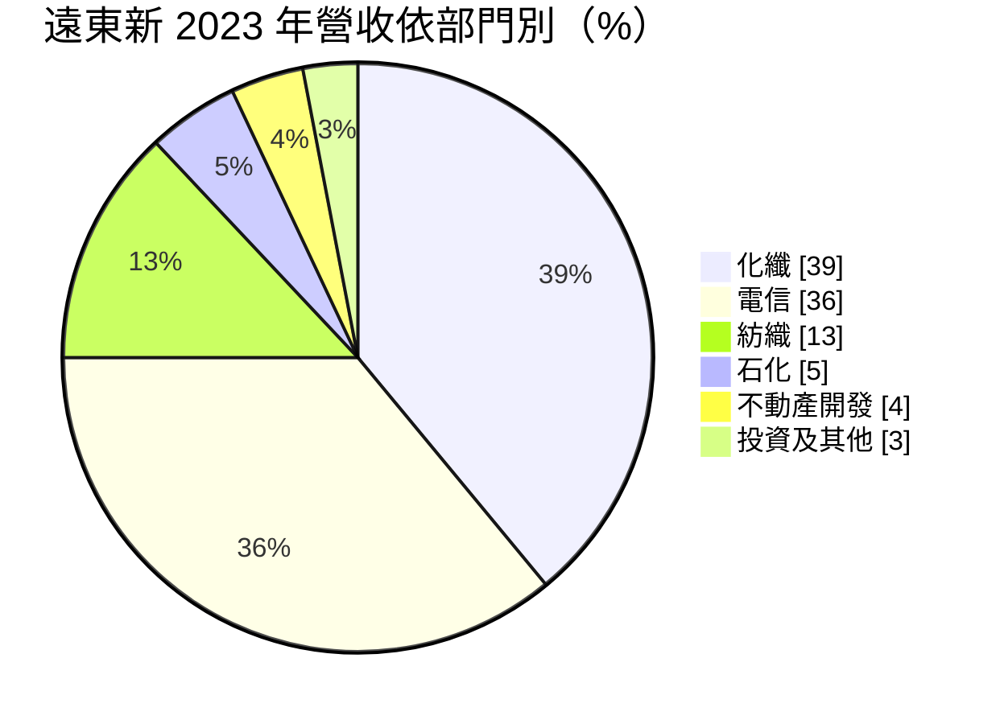
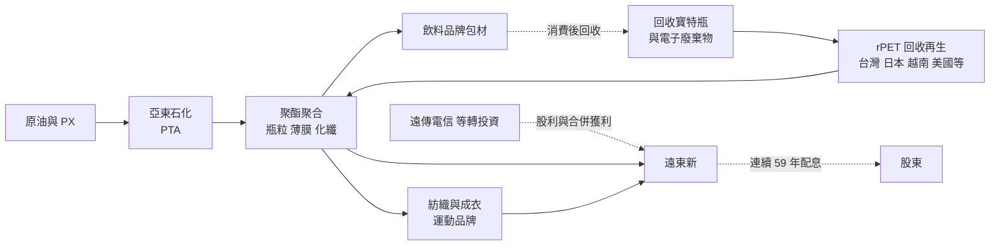
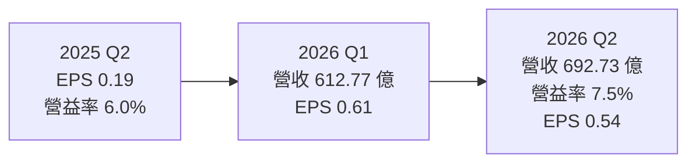
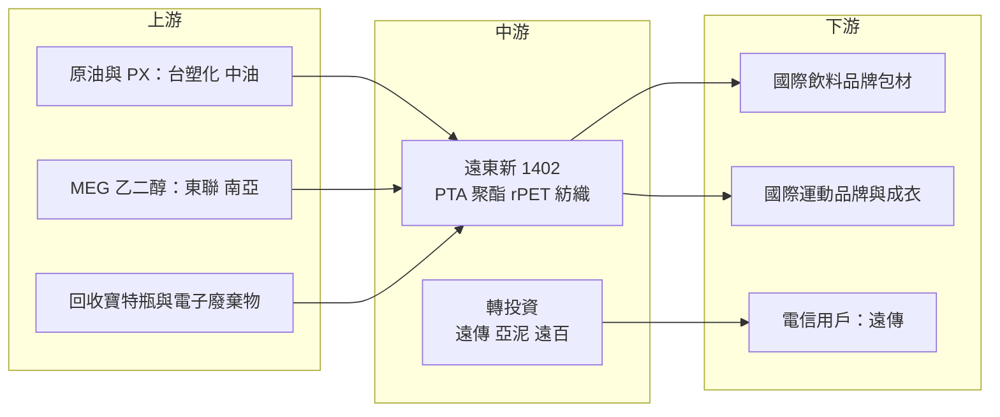

# 1402 遠東新

> 上市｜[[產業索引-紡織纖維|紡織纖維]]｜上市（櫃）日期 1967/04/14

# 第一章：企業模式與商業藍圖

> [!info] 撰寫說明
> 本文由 Claude 依公開資料整理，架構比照 [[2330台積電]] 的四章研究，資料截至 2026-10-07。財務數字來源：聯合新聞網（2026 年遠東新股東會報導）、工商時報（2026 年 6 月股東會與綠色產品報導）、理財周刊（2026 年上半年財報整理）、優分析（遠東新部門營收結構）、Poorstock（法說會整理）、nStock 公司簡介；產業描述為整理性內容，尚未逐條比對原始文件。#待校對

在評估單一個股的長期投資價值時，首要步驟是拆解企業的底層獲利邏輯。本章針對遠東新世紀（股票代號：1402，以下簡稱遠東新）的商業模式進行定性分析，說明這家遠東集團的核心企業如何從傳統紡織轉型為聚酯化纖與循環材料廠，同時透過遠傳電信等轉投資取得穩定現金流。

## 一、核心定位：聚酯產業鏈加上穩定現金流的控股型企業

遠東新成立於 1954 年，前身為遠東紡織，是遠東集團的母公司之一。目前業務分成兩大塊：

* **生產事業：** 從上游石化原料 PTA、中游聚酯瓶粒與化纖，到下游紡織與成衣，形成垂直整合的聚酯產業鏈。遠東新是全球前五大聚酯化纖廠，也是全球主要的回收聚酯（[[rPET]]）製造商。
* **電信與投資：** 持有 [[4904遠傳]] 約 38% 股權並具控制權而合併其營收，另轉投資 [[1102亞泥]]、[[2903遠百]] 等。依 2026 年 9 月報導，遠傳、亞泥等 6 家上市轉投資合計市值約 1,654.6 億元。

這個雙引擎結構讓遠東新與一般化纖廠不同：當石化與化纖景氣低迷時，電信事業仍提供穩定獲利與股利，這也是公司能連續 59 年配息的基礎。

## 二、終端應用與產品板塊：化纖與電信各占三成以上

以下為優分析整理的 2023 年部門營收比重，最新年度比重未查得：

* **化纖（聚酯）：** 聚酯瓶粒、[[PET]] 薄膜、工業用絲與彈性纖維。瓶粒客戶為全球飲料品牌，是 rPET 最主要的應用。
* **電信：** 合併遠傳電信的營收。遠傳在 2023 年與亞太電信合併後，2025 年營收、獲利與 EPS 創新高。
* **紡織：** 聚酯長纖、布料與成衣，替國際運動品牌生產機能布料。2026 年世界盃足球賽有 12 支國家隊穿著遠東新的科技布料。
* **石化：** 子公司亞東石化生產 [[PTA]]，因中國產能過剩，已減產並優先供應自家化纖部門。
* **不動產：** 持有約 57 萬坪土地，開發「遠洋之森」等案；2026 年上半年處分桃園非核心不動產，認列約 19 億元利益。

## 三、資本轉化邏輯：從石油到瓶子，再從瓶子回到瓶子

* **垂直整合：** 從 PTA 到瓶粒、纖維、布料與成衣，遠東新能掌握每一段的品質與成本，並向品牌客戶提供可追溯的材料來源，這在綠色材料認證上特別重要。
* **循環經濟：** 回收寶特瓶經清洗、分選、再聚合成 rPET 瓶粒或纖維，重新賣回飲料與運動品牌。公司也把電子廢棄物轉為再生酯粒、薄膜與纖維，年處理量約 3,000 噸。綠色產品約占生產事業營收 33%，毛利率高於一般產品。
* **電信現金流：** 遠傳的獲利依持股比例認列，並提供穩定股利，在化纖景氣低迷時撐住遠東新的獲利與配息。

## 四、企業長期藍圖：綠色材料過半

* **2030 年目標：** 綠色產品與綠色材料比重各達 50%，碳排放減少 50%。過去規劃 2030 年 rPET 年產能達 150 萬噸，成為全球第二大 rPET 製造商。
* **海外擴產：** 越南年產 6 萬噸的回收聚酯廠已於 2025 年完工，馬來西亞回收廠預計 2026 年下半年投產。股東會揭露相關資本支出超過百億元，並獲准發行最高 100 億元無擔保公司債，用於擴產與綠色投資。
* **新材料：** 推出碳固定與再利用的 PU 材料，以及由廢棄寶特瓶製成的鞋材中底與彈性纖維，往高附加價值的機能材料延伸。
* **美國布局：** 透過子公司轉投資美國德州的 Corpus Christi Polymers，參與北美聚酯產能。

# 第二章：護城河深度與競爭優勢

在長期價值投資中，「護城河」指企業抵禦競爭、維持超額利潤的保護機制。本章分析遠東新的護城河構成、全球主要聚酯對手，以及在中國產能過剩下，這些優勢能守住多少。

## 一、遠東新護城河的核心組成要素

聚酯是高度標準化的大宗商品，一般聚酯幾乎沒有護城河。遠東新的護城河屬於「窄護城河」，主要來自三個要素：

* **1. rPET 的品牌認證與回收料源：** 國際飲料與運動品牌對再生材料有嚴格的[[食品級認證]]與可追溯要求，取得認證與穩定的回收寶特瓶料源需要多年經營。遠東新在台灣、日本、越南等地布局回收廠，是少數能大量供應食品級 rPET 的廠商。
* **2. 垂直整合與品牌關係：** 從原料到成衣一條龍，能和運動品牌共同開發機能布料，並提供碳足跡與可追溯資料。
* **3. 電信與資產的現金流緩衝：** 遠傳與亞泥等轉投資提供穩定股利，加上大量土地資產，讓公司在化纖景氣循環中仍有能力投資與配息。

## 二、全球主要競爭對手格局

| 對手 | 定位 | 對遠東新的威脅 |
|---|---|---|
| Indorama Ventures（泰國） | 全球最大聚酯與 rPET 廠 | 規模最大，在全球瓶粒與 rPET 市場直接競爭 |
| 恆力、榮盛、桐昆等中國廠 | PTA 到聚酯一條龍，大量擴產 | 壓低 PTA、聚酯纖維與瓶粒價格 |
| [[1301台塑]]、[[1326台化]] | 台灣石化與化纖 | 在 PTA 與聚酯部分產品重疊 |
| [[1409新纖]]、[[1444力麗]] | 台灣聚酯化纖同業 | 在聚酯纖維與紡織競爭 |
| [[1476儒鴻]]、[[1477聚陽]] | 台灣機能布與成衣廠 | 在運動品牌機能布料競爭 |

## 三、優勢轉化：哪些市場守得住、哪些守不住

* **守得住：** 食品級 rPET 瓶粒與運動品牌的再生機能布料。這些產品有認證門檻與品牌綁定，毛利率高於一般產品。
* **守不住：** PTA 與一般聚酯纖維。中國產能過剩使 PTA 價格長期低迷，亞東石化已減產；2025 年生產事業本業曾出現虧損，2026 年才轉虧為盈。
* **觀察重點：** 綠色產品比重能否從 33% 往 50% 推進、馬來西亞與越南新廠的利用率、歐盟對包材再生料比例的法規實施進度，以及電信獲利是否持續成長。

# 第三章：財務體質與盈利規模

資料日期：2026-10-07。數字取自股東會報導、財經媒體與財經資料網站，表格是撰寫當時的快照；最新月營收、毛利率、累計 EPS 由自動排程寫在本筆記的屬性欄位（月營收、毛利率、累計EPS 等）。#待校對

財務報表是檢驗護城河是否真實存在的最終標準。本章用三率、ROE、現金流與資本報酬，檢視遠東新在聚酯景氣低谷與綠色轉型期間的獲利品質。

## 一、獲利能力的基石：三率

| 項目 | 2025 全年 | 2025 上半年 | 2026 上半年 | 2026 Q1 | 2026 Q2 |
|---|---|---|---|---|---|
| 營收（新台幣） | 2,541 億 | 約 1,238 億（推算） | 1,305.65 億 | 612.77 億 | 692.73 億 |
| [[毛利率]] | 未查得 | 21.6% | 20.8% | 未查得 | 未查得 |
| [[營業利益率]] | 未查得 | 8.0% | 7.8% | 未查得 | 7.5% |
| 稅後淨利 | 78.3 億 | 未查得 | 歸母 58.25 億 | 30.93 億 | 未查得 |
| EPS（元） | 1.55 | 0.66 | 1.15 | 0.61 | 0.54 |

* **[[毛利率]]：** 2026 年上半年 20.8%，略低於前一年同期的 21.6%。合併報表的毛利率受電信事業比重影響較大，化纖景氣的變化要拆部門才看得清楚。
* **[[營業利益率]]：** 2026 年第二季 7.5%，比前一年同期的 6.0% 提升，顯示生產事業在庫存回補下好轉。
* **[[淨利率]]與業外：** 2026 年上半年歸母淨利年增約 76%，其中包含處分桃園不動產認列的約 19 億元一次性利益，評估本業時應扣除。

## 二、[[ROE]]：資本效率

依 2026 年 9 月報導，遠東新每股淨值約 43.5 元，以 2025 年 EPS 1.55 元計算，ROE 約 3.6%（推算）。資本效率偏低，原因是帳上有大量轉投資與土地資產，這些資產的價值主要反映在股利與潛在增值，而非每年的損益。股價淨值比約 0.67 倍，市場對這種控股結構給予折價。

## 三、資本支出與自由現金流

* **[[CapEx]]：** 2026 年股東會揭露資本支出超過百億元，用於越南、馬來西亞回收廠與綠色材料擴產。另有遠傳電信的網路投資併入合併報表。
* **[[自由現金流]]：** 合併現金流包含遠傳的電信現金流，相對穩定；生產事業的現金流則受化纖景氣與擴產支出影響，具體金額未查得。
* **股利政策：** 2024 年度現金股利 1.6 元（配發率約 80%），2025 年度 1.25 元（配發率約 81%），近五年平均約 1.41 元，連續 59 年配息。

## 四、[[ROIC]] 與 [[WACC]]：價值創造利差

以 ROE 約 3.6% 推估，遠東新整體 ROIC 應低於資金成本，近年並未創造超額報酬（推估，具體數值未查得）。改善關鍵在於兩點：生產事業本業轉虧為盈並靠綠色產品提高毛利率，以及土地與非核心資產的活化。

# 第四章：總體風險與地緣政治

任何企業都無法脫離宏觀環境獨立存在。本章分析遠東新未來必須面對的地緣政治、產業週期與營運風險。

## 一、地緣政治風險

* **中國產能與傾銷：** 中國聚酯產業鏈大幅擴產，透過低價出口影響全球價格。遠東新在中國也有生產據點，同時面對中國市場的競爭與政策風險。
* **美國關稅：** 紡織與成衣出口受美國對越南等生產國關稅政策影響；公司表示綠色產品有助降低關稅戰的衝擊，因為品牌對再生材料的需求較不受價格左右。
* **多國布局：** 越南、馬來西亞、美國等據點分散風險，但也增加管理複雜度。

## 二、產業週期與市場結構風險

* **石化週期：** PTA 與聚酯價格跟隨原油與中國供需波動，景氣低迷時可能出現虧損。2025 年生產事業本業虧損，就是典型的週期低谷。
* **紡織庫存週期：** 運動品牌在疫情後經歷庫存調整，紡織訂單隨之波動，具有明顯的[[長鞭效應]]。
* **電信市場成熟：** 台灣電信市場已高度飽和，遠傳的成長來自 5G 資費升級、企業資通訊與合併綜效，長期成長空間有限。

## 三、營運環境的隱性風險

* **工安與資產減損：** 2025 年新竹廠區發生事件並造成資產減損，工安與停工風險需持續觀察。
* **控股折價：** 大量轉投資與土地資產使股價長期低於淨值，若資產未能活化，折價可能持續。
* **再生料源競爭：** 全球品牌都在搶回收寶特瓶，回收料價格上漲可能壓縮 rPET 毛利率。

## 四、科技或法規演進

* **歐盟包裝法規：** 歐盟[[PPWR]]（包裝與包裝廢棄物法規）要求塑膠瓶逐步提高再生料比例，對 rPET 需求是長期利多。
* **碳邊境調整：** 歐盟[[CBAM]]目前未涵蓋紡織與塑膠，但品牌商自主的碳足跡要求日趨嚴格，低碳材料與可追溯資料會成為接單條件。
* **化學回收：** 若化學回收技術成熟，能處理物理回收難以處理的混紡衣物與有色瓶，可能改變 rPET 的競爭格局。

# 專有名詞解析

## 金融

- **[[毛利率]]**：毛利除以營收，反映產品售價扣除直接生產成本後的獲利空間。
- **[[ROE]]**：股東權益報酬率，稅後淨利除以股東權益，衡量公司運用股東資本賺錢的效率。
- **[[自由現金流]]**：營業活動現金流減去資本支出，代表企業可自由用於配息、還債或併購的現金。

## 產業

- **[[PTA]]**：純對苯二甲酸，由 PX 製成，是生產聚酯的主要原料。
- **[[PET]]**：聚對苯二甲酸乙二酯，即聚酯，用來製作寶特瓶、薄膜與化纖。
- **[[rPET]]**：回收再生聚酯，由回收寶特瓶經清洗與再聚合製成，可再做成瓶子或纖維。
- **[[食品級認證]]**：再生塑膠要用於食品與飲料包裝，須通過美國 FDA、歐盟 EFSA 等機構的安全認證。
- **[[PPWR]]**：歐盟包裝與包裝廢棄物法規，規定塑膠包裝的再生料比例與可回收設計要求。
- **[[CBAM]]**：歐盟碳邊境調整機制，對進口的高碳排產品課徵碳成本，首波涵蓋鋼鐵、水泥、鋁等。
- **[[長鞭效應]]**：終端需求的小幅變動沿供應鏈往上游傳遞時被逐級放大，造成上游庫存與訂單劇烈波動。

# 核心供應鏈

## 1. 上游：石化原料與回收料源
- PX 與石化原料：[[6505台塑化]]
- 乙二醇：[[1710東聯]]、[[1303南亞]]
- 回收寶特瓶：各國回收體系與回收商

## 2. 中游：遠東新與集團轉投資
- 遠東新：亞東石化 PTA、聚酯瓶粒與化纖、rPET、紡織成衣
- 電信：[[4904遠傳]]
- 水泥與零售：[[1102亞泥]]、[[2903遠百]]

## 3. 下游：品牌客戶
- 國際飲料品牌（瓶粒與 rPET）
- 國際運動品牌（機能布料、鞋材）

## 4. 同業
- [[1301台塑]]、[[1326台化]]、[[1409新纖]]、[[1444力麗]]
- 國外：Indorama Ventures、中國恆力、榮盛

## 最新新聞
<!-- news:start -->
<!-- news:end -->

## 相關連結
- [公開資訊觀測站](https://mopsov.twse.com.tw/mops/web/t05st03?step=1&firstin=1&co_id=1402)
- [Goodinfo](https://goodinfo.tw/tw/StockDetail.asp?STOCK_ID=1402)
- [Yahoo 股市](https://tw.stock.yahoo.com/quote/1402)
- [鉅亨網新聞](https://www.cnyes.com/twstock/1402/news)
