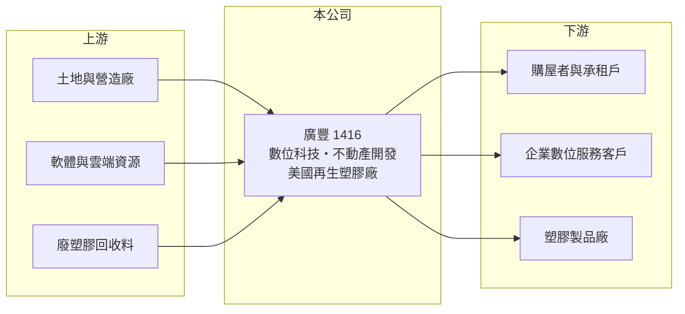

# 1416 廣豐

> 上市｜[[產業索引-其他業|其他業]]｜上市（櫃）日期 1976/04/20

# 第一章：企業模式與商業藍圖

> [!info] 撰寫說明
> 精簡版，由 Claude 依公開資料整理，架構比照 [[2330台積電]]，資料截至 2026-10-07。來源：富果研究 2026 年 9 月廣豐法說會整理、winvest.tw 營收快訊。公開資料有限，兩大業務的營收比重未查到；法說整理的第二季營收與月營收加總不一致，期間待校對。#待校對

廣豐已從傳統產業轉型為「數位科技加不動產開發」的控股型公司，2026 年營收與獲利明顯成長。

- **核心業務：** 廣豐兩大核心為數位科技與不動產開發，透過持股 51% 的百商數位科技、星系數位經營數位科技與軟體服務，並以 100% 持股的寶豐資產管理從事不動產開發。
- **營收結構：** 本次未查到數位科技與不動產的比重；2025 年全年營業收入 3.60 億元。
- **營運據點：** 台北市八德路的[[危老重建]]案已於 2026 年 9 月 15 日動土；美國印第安那州的[[再生塑膠]]廠預計 2026 年底投產，由廣豐海外開發負責海外投資。
- **長期方向：** 公司列出投資、營建、綠色環保、數位科技與公司治理 ESG 五大策略，以[[資產活化]]與新事業並進。

# 第二章：護城河深度與競爭優勢

廣豐的優勢主要來自既有土地資產與轉投資組合，而非單一產品的技術門檻。

- **競爭優勢：** 自有土地可透過危老重建取得開發利益，數位科技子公司則提供較穩定的服務收入（推估）。
- **主要對手：** 數位科技服務與不動產開發各自面對眾多同業，具體對手本次未查到。
- **觀察重點：** 八德路危老案的銷售與認列時點、美國再生塑膠廠投產進度，以及數位科技營收的成長性。

# 第三章：財務體質與盈利規模

資料日期：2026-10-07，以下數字是撰寫當時的快照；最新月營收、毛利率、累計 EPS 由自動排程寫在本筆記的屬性欄位（月營收、毛利率、累計EPS 等）。#待校對

廣豐規模小，但 2026 年營收與獲利年增幅度大。

- **營收規模：** 2026 年 5 月營收 4,052.2 萬元、年增 61.12%；6 月 4,873.4 萬元、年增 68.33%；7 月 4,458.3 萬元、年增 74.25%。2025 年全年營業收入 3.60 億元、年增 8%。
- **獲利：** 2025 年 EPS 0.81 元；法說整理顯示 2026 年第二季營業收入 2.27 億元、營業毛利 0.91 億元、淨利 1.15 億元，EPS 0.62 元（年增 148%），[[毛利率]]約 40%（期間待校對，可能為上半年累計）。
- **財務特色：** 2025 年現金股利 0.57 元，殖利率約 4.89%；不動產開發案的認列集中在完工交屋時點，未來獲利可能呈跳躍式變化（推估）。

# 第四章：總體風險與地緣政治

廣豐的風險在於轉型事業的執行與不動產開發的時程。

- **產業週期：** 不動產開發受房市景氣、利率與信用管制影響，數位科技服務則與企業 IT 支出連動。
- **營運風險：** 危老重建工期長，營建成本與銷售價格變動都會影響獲利；美國新廠為全新事業，投產與良率有不確定性。
- **其他風險：** 美國廠涉及美元匯率與當地法規，再生塑膠需求也受環保政策影響。

# 專有名詞解析

## 金融

- **[[毛利率]]**：營業毛利占營收的比率，反映產品售價扣除直接成本後的獲利空間。

## 產業

- **[[危老重建]]**：依都市危險及老舊建築物加速重建條例，以容積獎勵與簡化程序推動老舊建物重建。
- **[[資產活化]]**：把閒置土地或廠房拿來開發、出租或出售，以取得本業以外的收益。
- **[[再生塑膠]]**：回收廢塑膠經清洗、破碎與造粒後再製成的塑膠原料，可降低碳排放。

# 核心供應鏈

- 上游：土地與營造廠、軟體與雲端資源、廢塑膠回收料（推估）
- 下游／客戶：購屋者與承租戶、企業數位服務客戶、塑膠製品廠（推估）
- 同業：數位服務與不動產開發同業，名稱未查到

## 最新新聞
<!-- news:start（自動產生，請勿手動編輯此範圍） -->
- 2026-10-08 📰 媒體 21:20｜營收速報 - 廣豐(1416)9月營收5,106萬元年增率高達70.45％｜[鉅亨網](https://news.cnyes.com/news/id/6626009)

完整紀錄：[[1416廣豐 新聞]]
<!-- news:end -->

## 相關連結
- [公開資訊觀測站](https://mopsov.twse.com.tw/mops/web/t05st03?step=1&firstin=1&co_id=1416)
- [Goodinfo](https://goodinfo.tw/tw/StockDetail.asp?STOCK_ID=1416)
- [Yahoo 股市](https://tw.stock.yahoo.com/quote/1416)
- [鉅亨網新聞](https://www.cnyes.com/twstock/1416/news)
