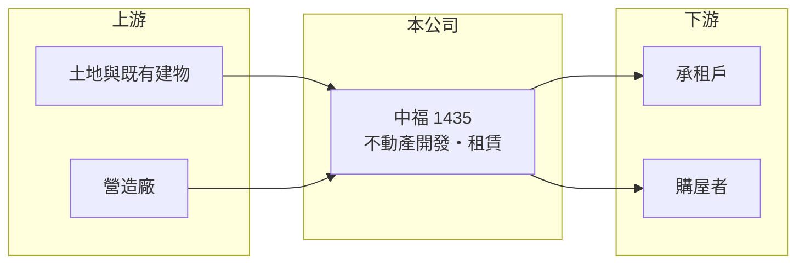

# 1435 中福

> 上市｜[[產業索引-其他業|其他業]]｜上市（櫃）日期 1987/12/28

# 第一章：企業模式與商業藍圖

> [!info] 撰寫說明
> 精簡版，由 Claude 依公開資料整理，架構比照 [[2330台積電]]，資料截至 2026-10-07。來源：nStock 中福公司簡介、winvest 營收快訊。公開資料有限。#待校對

中福是營收規模極小的資產型公司，目前主要收入來自零星租賃，本業尚在等待開發案啟動。

- **核心業務：** 公司登記的三大業務為住宅及大樓開發租售、菸酒零售與倉儲；以近期營收規模判斷，目前實際收入以[[不動產出租]]為主（推估）。
- **營收結構：** 2026 年月營收約 49.9 萬元，本次未查到產品別營收比重。
- **營運據點：** 本次未查到開發案與資產所在地的明細。
- **長期方向：** 公司價值取決於持有土地或資產能否進入開發或處分，屬於[[資產股]]性質（推估）。

# 第二章：護城河深度與競爭優勢

中福的護城河主要來自持有的資產，而不是營運能力。

- **競爭優勢：** 資本額 13.98 億元，市值約 29.42 億元，帳上資產可能是主要價值來源（推估）。
- **主要對手：** 中小型建設與資產開發公司，本次未查到具體競爭名單。
- **觀察重點：** 留意是否有開發案、合建或資產處分的公告，這會是營收結構改變的關鍵。

# 第三章：財務體質與盈利規模

資料日期：2026-10-07，以下數字是撰寫當時的快照；最新月營收、毛利率、累計 EPS 由自動排程寫在本筆記的屬性欄位（月營收、毛利率、累計EPS 等）。#待校對

中福營收微小、費用相對大，因此財務數字呈現虧損。

- **營收規模：** 2026 年 1 至 9 月累計營收約 0.04 億元，2025 年全年營收約 0.06 億元。
- **獲利：** 2026 年第二季 EPS -0.46 元，[[毛利率]] 64.17%，但[[營業利益率]]為 -4,223.46%，代表費用遠高於營收。
- **財務特色：** 2026 年第二季 [[ROE]] -6.67%，近五年沒有配息紀錄。

# 第四章：總體風險與地緣政治

中福的風險在於本業收入不足以支撐營運費用。

- **產業週期：** 若轉向開發，營收會跟著房市與建案完工時點大幅波動。
- **營運風險：** 收入來源單一且規模小，若沒有新案或資產活化，虧損可能延續。
- **其他風險：** [[信用管制]]等房市政策會影響開發與處分資產的時機。

# 專有名詞解析

## 金融

- **[[資產股]]**：市值主要由帳上土地或資產價值支撐，而非本業獲利的股票。
- **[[信用管制]]**：央行限制購屋與建商貸款成數的政策，會影響房市成交與建商資金。

## 產業

- **[[不動產出租]]**：將自有土地或建物出租收取租金，收入穩定但規模受資產多寡限制。

# 核心供應鏈

- 上游：自有土地與建物、營造廠（推估）
- 下游／客戶：承租戶與未來開發案的購屋者（推估）
- 同業：中小型資產開發與租賃公司（本次未查到具體名單）

## 最新新聞
<!-- news:start -->
<!-- news:end -->

## 相關連結
- [公開資訊觀測站](https://mopsov.twse.com.tw/mops/web/t05st03?step=1&firstin=1&co_id=1435)
- [Goodinfo](https://goodinfo.tw/tw/StockDetail.asp?STOCK_ID=1435)
- [Yahoo 股市](https://tw.stock.yahoo.com/quote/1435)
- [鉅亨網新聞](https://www.cnyes.com/twstock/1435/news)
