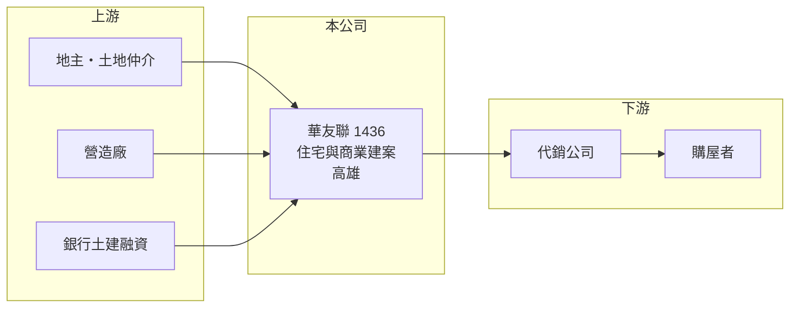

# 1436 華友聯

> 上市｜[[產業索引-建材營造業|建材營造業]]｜上市（櫃）日期 1988/04/11

# 第一章：企業模式與商業藍圖

> [!info] 撰寫說明
> 精簡版，由 Claude 依公開資料整理，架構比照 [[2330台積電]]，資料截至 2026-10-08。來源：MoneyDJ 理財網財務比率年表（2021 至 2025 年）與個股基本資料（2025 年營收比重、歷年股利）、工商時報與 Yahoo 股市報導標題。公開資料有限，個別建案名稱、銷售金額與土地庫存未查得；2025 年每股淨值明顯下降，可能有盈餘轉增資，跨年 EPS 的比較基礎待校對。#待校對

華友聯開發成立於 1967 年，是以高雄為主要市場的建設公司，營收幾乎全部來自銷售建案，獲利隨建案交屋時點大幅起伏，但近五年平均報酬在建設股中屬於前段。

- **核心業務：** 華友聯購買土地、規劃興建住宅與商業大樓並對外銷售，依 MoneyDJ 的分類，2025 年營建占 99.23%、租金收入占 0.77%。建設公司的收入來自一個個建案，每個建案從買地到交屋常需 3 至 5 年，屬於「專案型」生意。
- **營收認列：** 台灣建設公司以[[預售屋]]方式先銷售，但要等完工交屋才把營收與獲利入帳，也就是[[完工認列]]。因此華友聯的營收在交屋年度暴增、空窗年度驟減，2023 年減少 59%、2024 年又成長 327%，就是這個原因。
- **營運據點：** 公司登記於高雄鳳山，推案以高雄為主（推估，依公司地址與媒體報導），具體建案名單本次未查得。
- **長期方向：** 2021 至 2025 年[[毛利率]]在 32% 至 84% 之間，近幾年維持在 50% 上下，代表公司取得土地的成本相對低、產品定價力不錯。未來能否持續補充土地庫存，決定獲利能否延續。

# 第二章：護城河深度與競爭優勢

建設公司的護城河通常很淺，華友聯的優勢主要來自在地經驗、土地取得的時機與成本控制。

- **競爭優勢：** 長期深耕同一區域的建商，熟悉在地地段、地主關係與買方偏好，較容易在土地取得與產品規劃上搶得先機。華友聯近年毛利率維持在 50% 左右，明顯高於一般建商常見的 25% 至 35%，顯示土地成本或產品定位有優勢。
- **主要對手：** 高雄與南部的建商眾多，上市櫃同業包括 [[1438三地開發]] 等，以及大量未上市的地方建商（推估名單）。
- **觀察重點：** 觀察[[合約負債]]（預售屋已收的訂金）與未完工建案的規模，可以預估未來兩三年的入帳量；另外要看高雄房市在產業投資帶動後的熱度能否延續，以及信用管制對買方的影響。

# 第三章：財務體質與盈利規模

資料日期：2026-10-08，表格是撰寫當時的快照；最新月營收、毛利率、累計 EPS 由自動排程寫在本筆記的屬性欄位（月營收、毛利率、累計EPS 等）。#待校對

華友聯的營收與 EPS 隨交屋時點劇烈波動，但五年來每年都有獲利，2024 年交屋大年 EPS 接近 20 元。

| 年度 | 營收（年增率） | [[毛利率]] | [[營業利益率]] | EPS（元） | [[ROE]] |
|---|---|---|---|---|---|
| 2021 | 未查得（+58.1%） | 33.18% | 20.82% | 5.08 | 16.98% |
| 2022 | 未查得（+52.8%） | 32.07% | 21.90% | 6.54 | 20.02% |
| 2023 | 未查得（-58.7%） | 83.85% | 67.19% | 9.69 | 26.06% |
| 2024 | 未查得（+327.1%） | 51.52% | 41.74% | 19.93 | 45.36% |
| 2025 | 未查得（-44.1%） | 50.21% | 37.00% | 5.39 | 14.57% |

- **長期指標：** 近 5 年平均 ROE 約 24.6%（推算），在建設股中相當高。2022 至 2025 年度現金股利依序為 5.14、5.63、9.8、5.05 元，[[配息率]]約 50% 至 95%，每年都有配發。營收年複合成長率因交屋時點不同，不具參考性。
- **[[ROIC]] 與 [[WACC]]：** 以每股計算：2025 年每股營收約 21.7 元（EPS 5.39 ÷ 稅後淨利率 24.83%），每股營業利益約 8.03 元，稅後約 6.43 元；投入資本以每股淨值 33.48 元加上每股有息負債約 35.5 元（負債比率 67.98% 換算的總負債一半，建商的負債多為土建融資與預收款）計，約 69.0 元，ROIC 約 9.3%（推算）。WACC 約 5.0%（推算：無風險利率 1.75%、市場風險溢酬 6%、β 取建設股常見值 1.0，股東權益成本約 7.75%；稅前負債成本 3%、稅率 20%；權益比重約 49%）。即使在交屋較少的 2025 年，ROIC 仍高於 WACC，2023 至 2024 年的利差更大，代表公司長期在創造價值。
- **財務特色：** 負債比率 67% 至 78%，是建設業常見的高槓桿結構，主要來自土地與建築融資及預售款。

# 第四章：總體風險與地緣政治

華友聯的風險與所有建設公司相同：房市景氣、政策與單一區域集中。

- **產業週期：** 房地產週期長、反轉時下跌時間也長；建案從推出到交屋需數年，推案時的房價與交屋時的市場可能完全不同。
- **營運風險：** 推案集中在高雄（推估），區域房市降溫時缺乏分散；土地庫存不足時會出現營收空窗。營造成本與工期延誤也會壓縮毛利。
- **其他風險：** 央行選擇性信用管制、囤房稅與預售屋轉售限制等政策，會直接影響買方需求；利率上升會同時提高建商的融資成本與買方的房貸負擔。

# 專有名詞解析

## 金融

- **[[完工認列]]**：建案完工並交屋後才一次認列營收與獲利，使獲利集中在交屋期間。
- **[[合約負債]]**：已向客戶收取但尚未交付產品的款項，建商的預售屋訂金即屬此類，可作為未來營收的領先指標。
- **[[配息率]]**：現金股利占每股盈餘的比率，用來衡量公司把多少獲利發給股東。
- **[[ROIC]]**：投入資本報酬率，稅後營業利益除以股東權益加有息負債，衡量本業運用資本的效率。
- **[[WACC]]**：加權平均資金成本，股東與債權人要求報酬率的加權平均，是 ROIC 要超越的門檻。

## 產業

- **[[預售屋]]**：房屋在興建完成前就先銷售，買方分期繳款，建商可藉此降低資金與銷售風險。

# 核心供應鏈

- 上游：地主與土地仲介、營造廠、建材供應商與提供土建融資的銀行（名稱未查得）。
- 下游／客戶：代銷公司與購屋者。
- 同業：南部建商如 [[1438三地開發]]（推估名單）。

## 最新新聞
<!-- news:start（自動產生，請勿手動編輯此範圍） -->
- 2026-10-05 📰 媒體 18:50｜營收速報 - 華友聯(1436)9月營收1.68億元年增率高達43.37％｜[鉅亨網](https://news.cnyes.com/news/id/6621901)

完整紀錄：[[1436華友聯 新聞]]
<!-- news:end -->

## 相關連結
- [公開資訊觀測站](https://mopsov.twse.com.tw/mops/web/t05st03?step=1&firstin=1&co_id=1436)
- [Goodinfo](https://goodinfo.tw/tw/StockDetail.asp?STOCK_ID=1436)
- [Yahoo 股市](https://tw.stock.yahoo.com/quote/1436)
- [鉅亨網新聞](https://www.cnyes.com/twstock/1436/news)
