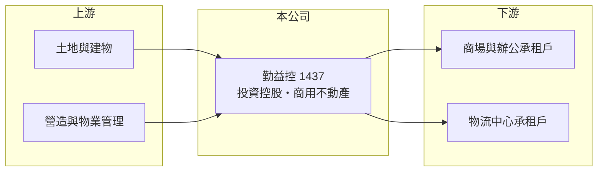

# 1437 勤益控

> 上市｜[[產業索引-其他業|其他業]]｜上市（櫃）日期 1988/11/10

# 第一章：企業模式與商業藍圖

> [!info] 撰寫說明
> 精簡版，由 Claude 依公開資料整理，架構比照 [[2330台積電]]，資料截至 2026-10-07。來源：nStock 勤益控公司簡介、winvest 營收快訊。#待校對

勤益控由紡織廠轉型為投資控股公司，收入以子公司的不動產租賃與事業為主。

- **核心業務：** 2014 年分割後成為[[控股公司]]，主要業務為一般投資；原本經營紡織品、針織品、羊毛被、西服成衣製造，以及辦公大樓、商場與物流中心的開發與租賃。
- **營收結構：** 本次未查到各事業營收比重，推估以商場、辦公大樓與物流中心的租賃收入為主。
- **營運據點：** 本次未查到資產所在地明細。
- **長期方向：** 透過子公司持有並出租商用不動產，追求穩定租金收入（推估）。

# 第二章：護城河深度與競爭優勢

勤益控的優勢在於持有可長期出租的商用資產，收入相對穩定。

- **競爭優勢：** 2026 年第二季[[毛利率]] 67.94%、[[營業利益率]] 52.73%，反映租賃型收入的高利潤特性。
- **主要對手：** 其他持有商場、辦公大樓與物流中心的資產開發公司。
- **觀察重點：** 8 月營收 8,018.6 萬元，年增 15.72%，觀察租金成長能否延續。

# 第三章：財務體質與盈利規模

資料日期：2026-10-07，以下數字是撰寫當時的快照；最新月營收、毛利率、累計 EPS 由自動排程寫在本筆記的屬性欄位（月營收、毛利率、累計EPS 等）。#待校對

勤益控獲利穩定，並有[[業外收益]]挹注。

- **營收規模：** 2026 年 1 至 8 月累計營收 5.98 億元，2025 年全年營收 9.27 億元。
- **獲利：** 2026 年第二季 EPS 1.37 元，淨利率 117.11%，高於營業利益率，代表有業外或投資收益貢獻。
- **財務特色：** 資本額 20.19 億元，2025 年全年現金股利 0.96 元，2026 年第二季配發 0.62 元，近五年平均現金[[殖利率]] 3.33%。

# 第四章：總體風險與地緣政治

勤益控的風險在於租賃需求與投資收益的波動。

- **產業週期：** 商用不動產的出租率與租金會隨景氣與零售消費變化。
- **營運風險：** 獲利部分依賴業外與投資收益，波動可能比本業大。
- **其他風險：** 利率上升會提高資金成本，並影響不動產評價。

# 專有名詞解析

## 金融

- **[[業外收益]]**：本業以外的收入，例如投資收益、處分利益或匯兌利益，通常較不穩定。
- **[[殖利率]]**：每年現金股利除以股價，用來衡量配息報酬。

## 產業

- **[[控股公司]]**：本身不直接經營，而是持有子公司股權並收取其獲利的公司型態。

# 核心供應鏈

- 上游：土地、營造廠與物業管理服務（推估）
- 下游／客戶：商場、辦公大樓與物流中心的承租企業（推估）
- 同業：持有商用不動產的資產開發公司（本次未查到具體名單）

## 最新新聞
<!-- news:start -->
<!-- news:end -->

## 相關連結
- [公開資訊觀測站](https://mopsov.twse.com.tw/mops/web/t05st03?step=1&firstin=1&co_id=1437)
- [Goodinfo](https://goodinfo.tw/tw/StockDetail.asp?STOCK_ID=1437)
- [Yahoo 股市](https://tw.stock.yahoo.com/quote/1437)
- [鉅亨網新聞](https://www.cnyes.com/twstock/1437/news)
