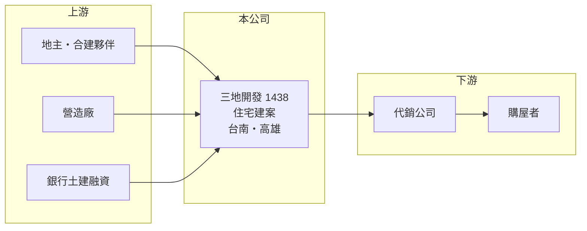

# 1438 三地開發

> 上市｜[[產業索引-建材營造業|建材營造業]]｜上市（櫃）日期 1988/12/15

# 第一章：企業模式與商業藍圖

> [!info] 撰寫說明
> 精簡版，由 Claude 依公開資料整理，架構比照 [[2330台積電]]，資料截至 2026-10-08。來源：MoneyDJ 理財網財務比率年表（2021 至 2025 年）與個股基本資料（2025 年營收比重、歷年股利）、CMoney 投資快訊與 Yahoo 新聞標題（台南、高雄建案與亞灣合建案）。公開資料有限，建案金額、土地庫存與營收金額未查得。#待校對

三地開發成立於 1955 年，原本是傳統產業公司，現在轉型為以台南與高雄為主要市場的建設公司，營收幾乎全部來自房地產銷售，獲利隨建案完工時點大起大落。

- **核心業務：** 三地開發規劃、興建並銷售住宅建案，依 MoneyDJ 的分類，2025 年房地產占 99.58%、其他 0.42%。依 CMoney 的報導，公司主打台南及高雄的營建案，並與清景麟集團合作推出高雄亞洲新灣區的大型建案。
- **營收認列：** 建案採[[預售屋]]銷售、完工交屋才入帳的[[完工認列]]方式，因此營收在不同年度可以相差數十倍：2021 年營收衰退 88%、2022 年成長超過 47 倍、2024 年又成長 269%。
- **營運據點：** 公司登記於高雄苓雅區，推案集中在台南與高雄。與其他集團合作開發，可以分攤土地與資金壓力，但利潤也要與夥伴分享。
- **長期方向：** 南台灣近年因半導體投資帶動人口與就業移入，住宅需求增加，是三地開發推案的背景（推估）。公司能否持續取得好地段、穩定推案，決定它能否擺脫「有建案才有獲利」的不連續狀態。

# 第二章：護城河深度與競爭優勢

三地開發的競爭力在於區域經驗與合作開發，但規模小、財務槓桿高，護城河有限。

- **競爭優勢：** 深耕台南、高雄的建商較熟悉在地土地與買方需求；以合建或共同開發的方式參與大型案，能用較小的資本參與較大的開發量。
- **主要對手：** 南部建商眾多，上市櫃同業如 [[1436華友聯]]，以及大量全國性與地方建商（推估名單）。建設業的產品同質性高，競爭主要比地段、價格與品牌口碑。
- **觀察重點：** [[合約負債]]（預售訂金）的變化可預估未來入帳；另外要看亞灣等大型合建案的銷售與完工進度，以及負債比率能否下降。

# 第三章：財務體質與盈利規模

資料日期：2026-10-08，表格是撰寫當時的快照；最新月營收、毛利率、累計 EPS 由自動排程寫在本筆記的屬性欄位（月營收、毛利率、累計EPS 等）。#待校對

三地開發五年中有兩年虧損，獲利集中在少數交屋年度，2022 年 EPS 達 5.17 元，其他年度多在 2 元以下。

| 年度 | 營收（年增率） | [[毛利率]] | [[營業利益率]] | EPS（元） | [[ROE]] |
|---|---|---|---|---|---|
| 2021 | 未查得（-87.5%） | 53.97% | -77.83% | 0.57 | 3.60% |
| 2022 | 未查得（+4,741%） | 75.28% | 69.99% | 5.17 | 23.91% |
| 2023 | 未查得（-46.9%） | 19.07% | 7.84% | -0.71 | -3.36% |
| 2024 | 未查得（+269.1%） | 0.02% | -2.48% | -1.54 | -5.86% |
| 2025 | 未查得（+7.9%） | 30.02% | 23.89% | 1.74 | 6.37% |

註：2021 年本業虧損但稅後淨利率達 244.71%，獲利主要來自業外（推估為資產處分或投資收益）。

- **長期指標：** 近 5 年平均 ROE 約 4.9%（推算）。2022 年度配發現金股利 1 元，2023 與 2024 年度未配發，2025 年度 0.2 元，配息穩定度低。營收年複合成長率因交屋時點不同，不具參考性。
- **[[ROIC]] 與 [[WACC]]：** 以每股計算：2025 年每股營收約 11.3 元（EPS 1.74 ÷ 稅後淨利率 15.41%），每股營業利益約 2.70 元，稅後約 2.16 元；投入資本以每股淨值 28.24 元加上每股有息負債約 50.8 元（負債比率 78.24% 換算的總負債一半）計，約 79.0 元，ROIC 約 2.7%（推算）。WACC 約 4.3%（推算：無風險利率 1.75%、市場風險溢酬 6%、β 取建設股常見值 1.0，股東權益成本約 7.75%；稅前負債成本 3%、稅率 20%；權益比重約 36%）。除了 2022 年的交屋大年，ROIC 多數年度低於 WACC，代表以五年平均來看公司尚未穩定創造價值。
- **財務特色：** 負債比率長期在 76% 至 83%，在建設股中偏高，資金壓力主要來自土地與在建工程的融資。每股淨值由 2021 年的 15.6 元升到 2025 年的 28.2 元，股本約 12 億元。

# 第四章：總體風險與地緣政治

三地開發的風險在於高槓桿、區域集中與建案節奏。

- **產業週期：** 房地產週期長，推案時的市場熱度與數年後交屋時可能完全不同；景氣反轉時，高負債建商的壓力最大。
- **營運風險：** 推案集中在台南、高雄，區域需求若降溫缺乏分散；合建案的利潤分配與進度受合作夥伴影響。2024 年毛利率幾乎為零，顯示個別建案的成本控制風險不小。
- **其他風險：** 央行選擇性信用管制、囤房稅、預售屋轉售限制等政策會壓抑需求；利率上升會增加融資成本；颱風與天災可能影響施工與交屋進度。

# 專有名詞解析

## 金融

- **[[完工認列]]**：建案完工並交屋後才一次認列營收與獲利，使獲利集中在交屋期間。
- **[[合約負債]]**：已向客戶收取但尚未交付產品的款項，建商的預售屋訂金即屬此類，可作為未來營收的領先指標。
- **[[ROIC]]**：投入資本報酬率，稅後營業利益除以股東權益加有息負債，衡量本業運用資本的效率。
- **[[WACC]]**：加權平均資金成本，股東與債權人要求報酬率的加權平均，是 ROIC 要超越的門檻。

## 產業

- **[[預售屋]]**：房屋在興建完成前就先銷售，買方分期繳款，建商可藉此降低資金與銷售風險。

# 核心供應鏈

- 上游：地主、合建夥伴（如清景麟集團）、營造廠與提供土建融資的銀行。
- 下游／客戶：代銷公司與台南、高雄的購屋者。
- 同業：南部建商如 [[1436華友聯]]（推估名單）。

## 最新新聞
<!-- news:start（自動產生，請勿手動編輯此範圍） -->
- 2026-10-08 📰 媒體 19:50｜營收速報 - 三地開發(1438)9月營收3.23億元年增率高達1566.05％｜[鉅亨網](https://news.cnyes.com/news/id/6625855)

完整紀錄：[[1438三地開發 新聞]]
<!-- news:end -->

## 相關連結
- [公開資訊觀測站](https://mopsov.twse.com.tw/mops/web/t05st03?step=1&firstin=1&co_id=1438)
- [Goodinfo](https://goodinfo.tw/tw/StockDetail.asp?STOCK_ID=1438)
- [Yahoo 股市](https://tw.stock.yahoo.com/quote/1438)
- [鉅亨網新聞](https://www.cnyes.com/twstock/1438/news)
