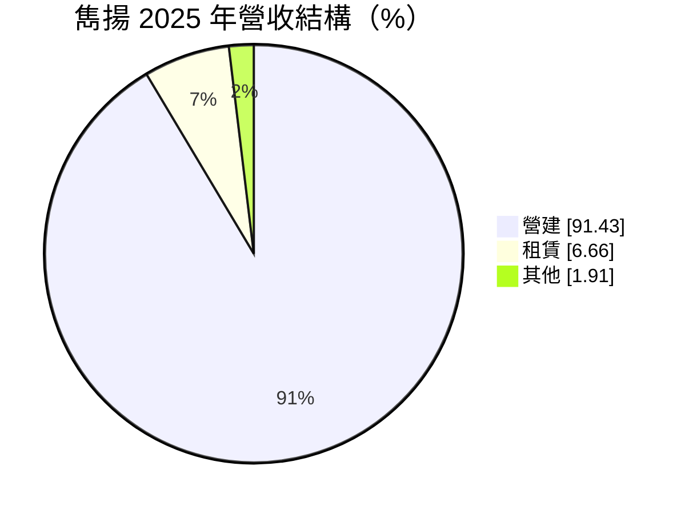
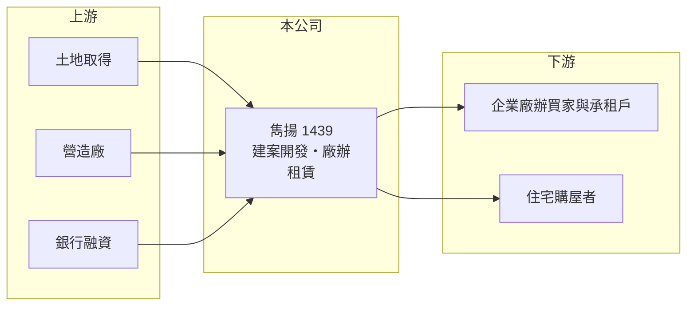

# 1439 雋揚

> 上市｜[[產業索引-建材營造業|建材營造業]]｜上市（櫃）日期 1989/05/22

# 第一章：企業模式與商業藍圖

> [!info] 撰寫說明
> 精簡版，由 Claude 依公開資料整理，架構比照 [[2330台積電]]，資料截至 2026-10-08。來源：MoneyDJ 理財網財務比率年表（2021 至 2025 年）與個股基本資料（2025 年營收比重、歷年股利）、自由時報報導標題（轉型不動產開發、新購土地將建廠辦）、富果法說會整理頁標題。公開資料有限，建案名稱、土地位置、業外收益來源與營收金額未查得；公司原本經營的紡織本業屬推估，待校對。#待校對

雋揚國際成立於 1964 年，原屬紡織類股（推估），近年轉型為不動產開發與租賃公司，營收以營建為主；它的獲利有相當比例來自業外，本業規模仍小。

- **核心業務：** 依 MoneyDJ 的分類，2025 年營建占 91.43%、租賃占 6.66%、其他占 1.91%。依自由時報的報導，公司轉型不動產開發後新購土地，規劃興建廠辦大樓，屬於「開發後出售或出租」的模式。
- **營收結構：** 營建收入依建案完工交屋時點入帳，波動很大；租賃收入金額較小，但能提供穩定的現金流。

- **營運據點：** 公司登記於台北市南港區經貿一路，具體開發案位置本次未查得。
- **長期方向：** 從傳統產業轉向不動產，是台股許多老牌紡織、化工公司常見的[[資產活化]]路線：把既有土地或資金投入開發，換取較高的報酬。雋揚能否建立穩定的推案節奏，以及廠辦能否以租售兼營創造長期租金收入，是轉型成敗的關鍵。

# 第二章：護城河深度與競爭優勢

雋揚剛從傳統產業轉型為開發商，還沒有建立明顯的護城河；它的優勢在於財務結構相對保守。

- **競爭優勢：** 負債比率約 32% 至 45%，在建設股中偏低，代表公司推案主要靠自有資金，而不是高度舉債，抗景氣循環的能力較好。廠辦產品鎖定企業客戶，需求受產業投資影響，與一般住宅的買方結構不同。
- **主要對手：** 北部的廠辦與住宅開發商眾多，具體對手本次未查得。廠辦市場比的是地段、交通與產業聚落。
- **觀察重點：** 本業的營業利益率能否穩定為正（2023 與 2024 年為負）；新購土地的開發時程；以及業外收益的來源與可持續性，因為近五年稅後淨利率大多遠高於營業利益率。

# 第三章：財務體質與盈利規模

資料日期：2026-10-08，表格是撰寫當時的快照；最新月營收、毛利率、累計 EPS 由自動排程寫在本筆記的屬性欄位（月營收、毛利率、累計EPS 等）。#待校對

雋揚的 EPS 由 2021 年的 1.39 元逐步提高到 2025 年的 3.21 元，但其中相當部分來自[[業外收益]]，本業的營業利益率起伏很大。

| 年度 | 營收（年增率） | [[毛利率]] | [[營業利益率]] | EPS（元） | [[ROE]] |
|---|---|---|---|---|---|
| 2021 | 未查得（+444.2%） | 17.91% | 5.49% | 1.39 | 6.03% |
| 2022 | 未查得（-7.4%） | 21.77% | 7.16% | 1.00 | 4.68% |
| 2023 | 未查得（-65.1%） | 27.70% | -6.57% | 2.00 | 6.58% |
| 2024 | 未查得（-50.7%） | 43.11% | -26.26% | 1.74 | 5.16% |
| 2025 | 未查得（+728.6%） | 26.72% | 14.98% | 3.21 | 10.29% |

註：2023、2024 年本業虧損但稅後淨利率達 98% 與 166%，獲利主要來自業外（來源未查得）。

- **長期指標：** 近 5 年平均 ROE 約 6.5%（推算）。2022 至 2025 年度現金股利依序為 0.3、0.3、0.3、0.5 元，[[配息率]]約 15% 至 30%，金額穩定但比例偏低，公司把多數盈餘留作開發資金。每股淨值由 24.6 元穩定升到 32.2 元。
- **[[ROIC]] 與 [[WACC]]：** 以每股計算：2025 年每股營收約 7.65 元（EPS 3.21 ÷ 稅後淨利率 41.94%），每股營業利益約 1.15 元，稅後約 0.92 元；投入資本以每股淨值 32.16 元加上每股有息負債約 11.4 元（負債比率 41.53% 換算的總負債一半）計，約 43.6 元，本業 ROIC 約 2.1%（推算）。WACC 約 6.3%（推算：無風險利率 1.75%、市場風險溢酬 6%、β 取建設股常見值 1.0，股東權益成本約 7.75%；稅前負債成本 3%、稅率 20%；權益比重約 74%）。本業 ROIC 長期低於 WACC；把業外收益算進去的 ROE 只有 2025 年超過股東權益成本，代表轉型尚未讓本業創造價值。
- **財務特色：** 負債比率中等、每股淨值穩定成長、配息保守，是典型處於轉型期的資產型公司。

# 第四章：總體風險與地緣政治

雋揚的風險在於轉型的執行，以及獲利對業外的依賴。

- **產業週期：** 不動產週期長，廠辦需求跟著企業擴產與景氣循環；住宅與廠辦都受利率與信用管制影響。
- **營運風險：** 推案數少，營收在不同年度可差到數倍；若業外收益減少，現有的本業規模不足以支撐目前的獲利水準。新購土地的開發若延誤，資金會被長期占用。
- **其他風險：** 央行信用管制、工業區與廠辦的使用規定、營造成本上漲與工期延誤，都會影響開發報酬。

# 專有名詞解析

## 金融

- **[[業外收益]]**：非本業營運產生的收益，例如投資收益、股利收入、利息收入與資產處分利益。
- **[[配息率]]**：現金股利占每股盈餘的比率，用來衡量公司把多少獲利發給股東。
- **[[ROIC]]**：投入資本報酬率，稅後營業利益除以股東權益加有息負債，衡量本業運用資本的效率。
- **[[WACC]]**：加權平均資金成本，股東與債權人要求報酬率的加權平均，是 ROIC 要超越的門檻。

## 產業

- **[[資產活化]]**：把閒置土地、廠房或資產重新開發、出租或出售，提高資產的報酬。

# 核心供應鏈

- 上游：土地賣方、營造廠、建材供應商與銀行（名稱未查得）。
- 下游／客戶：廠辦買家與承租企業、住宅購屋者（名稱未查得）。
- 同業：北部廠辦與住宅開發商（名稱未查得）。

## 最新新聞
<!-- news:start -->
<!-- news:end -->

## 相關連結
- [公開資訊觀測站](https://mopsov.twse.com.tw/mops/web/t05st03?step=1&firstin=1&co_id=1439)
- [Goodinfo](https://goodinfo.tw/tw/StockDetail.asp?STOCK_ID=1439)
- [Yahoo 股市](https://tw.stock.yahoo.com/quote/1439)
- [鉅亨網新聞](https://www.cnyes.com/twstock/1439/news)
