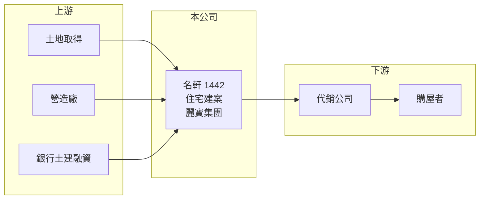

# 1442 名軒

> 上市｜[[產業索引-建材營造業|建材營造業]]｜上市（櫃）日期 1989/11/16

# 第一章：企業模式與商業藍圖

> [!info] 撰寫說明
> 精簡版，由 Claude 依公開資料整理，架構比照 [[2330台積電]]，資料截至 2026-10-08。來源：MoneyDJ 理財網財務比率年表（2021 至 2025 年）與個股基本資料（2025 年營收比重、歷年股利）、理財周刊（2024 年合併營收 88.02 億元、EPS 7.17 元）、自由時報報導標題（名軒富麗建案）。公開資料有限，建案區域、土地庫存與集團內交易未查得；2022 年財務比率為個別財報數字。#待校對

名軒開發成立於 1974 年，是麗寶集團旗下的建設公司，營收幾乎全部來自建案銷售；近五年獲利能力在建設股中屬於前段，但仍隨交屋時點大幅波動。

- **核心業務：** 名軒規劃、興建並銷售住宅建案，依 MoneyDJ 的分類，2025 年建設業務占 99.52%、其他 0.48%。建設公司以[[預售屋]]方式銷售，完工交屋後才把營收與獲利入帳（[[完工認列]]），因此營收在不同年度差距很大。
- **集團背景：** 名軒屬於麗寶集團，集團旗下還有遊樂園、飯店與其他建設事業（推估，依理財周刊的描述）。集團支援可以帶來土地、品牌與資金調度上的便利，但也可能出現集團內交易與利益分配的問題。
- **營運據點：** 公司登記於新北市新莊區，推案區域本次未查得。
- **長期方向：** 2023 至 2025 年[[毛利率]]維持在 41% 至 49%，高於一般建商，顯示土地成本與產品定價有優勢。2024 年是交屋大年，營收 88.02 億元、EPS 7.17 元；2025 年交屋減少，營收約回到 33 億元。

# 第二章：護城河深度與競爭優勢

名軒的競爭力來自集團資源與較高的毛利，但建設業本身護城河淺，長期表現取決於土地取得與推案節奏。

- **競爭優勢：** 依附麗寶集團，名軒在土地開發、品牌知名度與融資上有集團資源可用；近年毛利率在 40% 以上，代表推出的建案具備相對好的地段或成本條件。
- **主要對手：** 北部與中部的上市櫃建商眾多，例如 [[2542興富發]]、[[2548華固]]、[[2520冠德]] 等（推估名單），以及同屬麗寶集團的 [[9946三發地產]]（推估，待校對）。
- **觀察重點：** [[合約負債]]（預售訂金）與在建工程規模可以預估未來入帳；另外要留意自由時報報導的「名軒富麗」建案遭裁罰案件，公司表示已依法提出抗告，後續法律結果與對品牌的影響值得追蹤。

# 第三章：財務體質與盈利規模

資料日期：2026-10-08，表格是撰寫當時的快照；最新月營收、毛利率、累計 EPS 由自動排程寫在本筆記的屬性欄位（月營收、毛利率、累計EPS 等）。#待校對

名軒五年都有獲利，2023 與 2024 年 ROE 超過 25%，2025 年交屋減少後回落到 13%。

| 年度 | 營收（億元） | [[毛利率]] | [[營業利益率]] | EPS（元） | [[ROE]] |
|---|---|---|---|---|---|
| 2021 | 約 34.5（推算） | 23.66% | 14.80% | 1.41 | 9.07% |
| 2022 | 約 20.0（推算） | 36.89% | 26.39% | 1.76 | 10.84% |
| 2023 | 約 52.4（推算） | 44.89% | 37.77% | 4.71 | 26.04% |
| 2024 | 88.02 | 40.94% | 34.26% | 7.17 | 33.40% |
| 2025 | 約 33.3（推算） | 48.93% | 38.75% | 3.03 | 13.39% |

註：2024 年營收取自理財周刊，其他年度依 MoneyDJ 營收成長率推算；2025 年以 EPS ÷ 稅後淨利率 × 股本 3.662 億股驗算約 33.4 億元，兩者一致。

- **長期指標：** 2021 至 2025 年營收年複合成長率約 -1%（推算），但期間經歷 20 億至 88 億元的大幅起伏。近 5 年平均 ROE 約 18.5%（推算）。2022 至 2025 年度現金股利依序為 1.6、3.5、4.5、2.4 元，[[配息率]]約 63% 至 91%，每年都有配發。
- **[[ROIC]] 與 [[WACC]]：** 以每股計算：2025 年每股營收約 9.11 元，每股營業利益約 3.53 元，稅後約 2.82 元；投入資本以每股淨值 21.86 元加上每股有息負債約 8.6 元（負債比率 44.01% 換算的總負債一半）計，約 30.5 元，ROIC 約 9.3%（推算）。WACC 約 6.2%（推算：無風險利率 1.75%、市場風險溢酬 6%、β 取建設股常見值 1.0，股東權益成本約 7.75%；稅前負債成本 3%、稅率 20%；權益比重約 72%）。即使在交屋較少的 2025 年，ROIC 仍高於 WACC，2023 至 2024 年利差更大，代表公司長期在創造價值。
- **財務特色：** 負債比率由 2022 年的 63% 降到 2025 年的 44%，在建設股中偏低，財務體質逐年改善。

# 第四章：總體風險與地緣政治

名軒的風險是建設業共通的房市與政策風險，加上集團關係與個案法律風險。

- **產業週期：** 房地產週期長，推案到交屋需數年；景氣反轉時，高價推案的去化速度會明顯變慢。
- **營運風險：** 營收高度依賴少數建案的交屋時點，空窗年度的獲利會大幅下降；個別建案的裁罰或消費糾紛會影響品牌信譽。
- **其他風險：** 央行選擇性信用管制、囤房稅、預售屋轉售限制等政策；利率上升；與麗寶集團其他公司的關係人交易是否公允，也是小股東需要注意的公司治理議題。

# 專有名詞解析

## 金融

- **[[完工認列]]**：建案完工並交屋後才一次認列營收與獲利，使獲利集中在交屋期間。
- **[[合約負債]]**：已向客戶收取但尚未交付產品的款項，建商的預售屋訂金即屬此類，可作為未來營收的領先指標。
- **[[配息率]]**：現金股利占每股盈餘的比率，用來衡量公司把多少獲利發給股東。
- **[[ROIC]]**：投入資本報酬率，稅後營業利益除以股東權益加有息負債，衡量本業運用資本的效率。
- **[[WACC]]**：加權平均資金成本，股東與債權人要求報酬率的加權平均，是 ROIC 要超越的門檻。

## 產業

- **[[預售屋]]**：房屋在興建完成前就先銷售，買方分期繳款，建商可藉此降低資金與銷售風險。

# 核心供應鏈

- 上游：土地賣方、營造廠、建材供應商與提供土建融資的銀行（名稱未查得）。
- 下游／客戶：代銷公司與購屋者。
- 同業：[[2542興富發]]、[[2548華固]]、[[2520冠德]]，同集團的 [[9946三發地產]]（推估名單，待校對）。

## 最新新聞
<!-- news:start（自動產生，請勿手動編輯此範圍） -->
- 2026-10-08 📰 媒體 19:50｜營收速報 - 名軒(1442)9月營收2.21億元年增率高達45.26％｜[鉅亨網](https://news.cnyes.com/news/id/6625856)

完整紀錄：[[1442名軒 新聞]]
<!-- news:end -->

## 相關連結
- [公開資訊觀測站](https://mopsov.twse.com.tw/mops/web/t05st03?step=1&firstin=1&co_id=1442)
- [Goodinfo](https://goodinfo.tw/tw/StockDetail.asp?STOCK_ID=1442)
- [Yahoo 股市](https://tw.stock.yahoo.com/quote/1442)
- [鉅亨網新聞](https://www.cnyes.com/twstock/1442/news)
