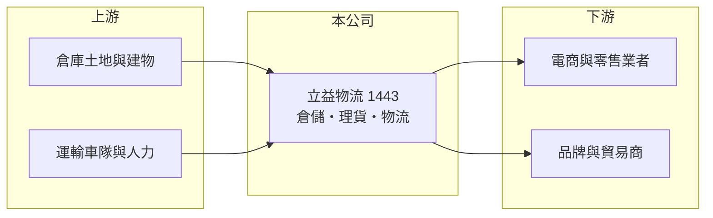

# 1443 立益物流

> 上市｜[[產業索引-其他業|其他業]]｜上市（櫃）日期 1990/04/21

# 第一章：企業模式與商業藍圖

> [!info] 撰寫說明
> 精簡版，由 Claude 依公開資料整理，架構比照 [[2330台積電]]，資料截至 2026-10-07。來源：winvest 立益物流營收快訊。#待校對

立益物流由紡織業轉型為倉儲物流服務商，同時保有不動產與貿易業務。

- **核心業務：** 營業項目包括倉儲、物流、[[理貨加工]]、[[電子商務]]、棉紡、貿易，以及委託營造廠興建商業大樓與住宅出租出售。
- **營收結構：** 本次未查到各業務營收比重，推估以倉儲物流服務為主。
- **營運據點：** 公司 1972 年成立、1990 年上市，據點明細本次未查到。
- **長期方向：** 受惠電子商務發展，倉儲與物流配送需求是主要成長來源（推估）。

# 第二章：護城河深度與競爭優勢

立益物流的優勢在於自有倉儲資產與物流服務的結合。

- **競爭優勢：** 自有倉庫可降低租金成本，並提供倉儲、理貨到配送的一條龍服務（推估）。
- **主要對手：** 國內[[第三方物流]]與倉儲業者，本次未查到具體名單。
- **觀察重點：** 8 月營收 8,212.1 萬元，年增 3.87%，已結束 6、7 月的年減，觀察能否持續回升。

# 第三章：財務體質與盈利規模

資料日期：2026-10-07，以下數字是撰寫當時的快照；最新月營收、毛利率、累計 EPS 由自動排程寫在本筆記的屬性欄位（月營收、毛利率、累計EPS 等）。#待校對

立益物流營收規模穩定，2026 年上半年獲利明顯優於去年同期。

- **營收規模：** 2026 年 1 至 8 月累計營收 6.28 億元，年減 6.08%；月營收約在 7,900 萬至 8,200 萬元之間。
- **獲利：** 2026 年第二季 EPS 0.45 元，上半年累計 EPS 0.97 元；2025 年全年 EPS 1.13 元。
- **財務特色：** 資本額 13.53 億元，市值約 32.28 億元；本次未查到[[毛利率]]與股利資料。

# 第四章：總體風險與地緣政治

立益物流的風險在於物流需求與同業價格競爭。

- **產業週期：** 倉儲物流需求與零售、電商消費景氣連動。
- **營運風險：** 物流業人力與運輸成本上升，可能壓縮利潤。
- **其他風險：** 不動產業務的獲利認列時點不固定，可能使單季 EPS 波動。

# 專有名詞解析

## 應用

- **[[電子商務]]**：透過網路平台銷售商品，帶動小量多樣的倉儲與宅配需求。

## 產業

- **[[理貨加工]]**：在倉庫內進行分揀、包裝、貼標等加值作業，再出貨給零售通路或消費者。
- **[[第三方物流]]**：由專業物流業者代替貨主處理倉儲與配送的外包服務。

# 核心供應鏈

- 上游：倉庫土地與建物、運輸車隊與人力（推估）
- 下游／客戶：電子商務、零售通路與品牌商（推估）
- 同業：國內第三方物流與倉儲業者（本次未查到具體名單）

## 最新新聞
<!-- news:start -->
<!-- news:end -->

## 相關連結
- [公開資訊觀測站](https://mopsov.twse.com.tw/mops/web/t05st03?step=1&firstin=1&co_id=1443)
- [Goodinfo](https://goodinfo.tw/tw/StockDetail.asp?STOCK_ID=1443)
- [Yahoo 股市](https://tw.stock.yahoo.com/quote/1443)
- [鉅亨網新聞](https://www.cnyes.com/twstock/1443/news)
