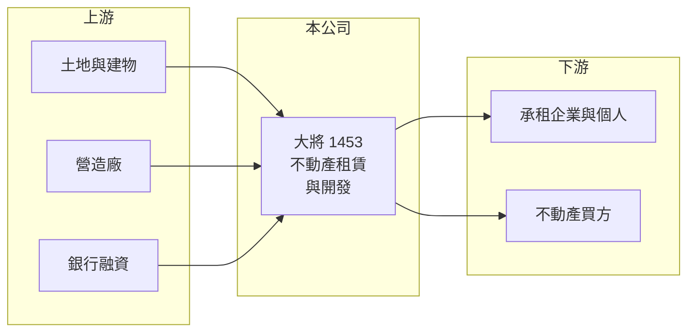

# 1453 大將

> 上市｜[[產業索引-建材營造業|建材營造業]]｜上市（櫃）日期 1993/04/19

# 第一章：企業模式與商業藍圖

> [!info] 撰寫說明
> 精簡版，由 Claude 依公開資料整理，架構比照 [[2330台積電]]，資料截至 2026-10-08。來源：MoneyDJ 理財網財務比率年表（2021 至 2025 年）與個股基本資料（2025 年營收比重、歷年股利）、科技新報公司資料頁標題。公開資料有限，持有的不動產位置、租約內容、在建工程與業外收益來源都未查得；公司早年本業屬推估，待校對。#待校對

大將開發成立於 1978 年，原屬紡織類股（推估），現在營收全部來自租賃，本業規模非常小；公司的價值主要在持有的不動產與其開發計畫，而不是營運現金流。

- **核心業務：** 依 MoneyDJ 的分類，2025 年營收 100% 來自租賃。2024 年營收比前一年減少 99%，之後營業利益率出現 -2,000% 以上的數字，代表租金收入極少、而管理費用相對固定，本業處於虧損狀態。
- **營收結構：** 單一租賃收入，沒有其他營業項目。這種公司在台股常被歸類為「[[資產股]]」：股價與價值主要看土地與建物的市價，而不是每年的營收。
- **營運據點：** 公司登記於台北市大安區敦化南路，具體持有的不動產位置本次未查得。
- **長期方向：** 2021 至 2025 年負債比率由 26% 升到 50%，同時每股淨值小幅下降，可能代表公司正在借款投入開發或興建（推估）。未來是否把資產開發成可穩定收租或出售的物件，是長期價值能否釋放的關鍵。

# 第二章：護城河深度與競爭優勢

大將沒有傳統意義上的護城河，它的競爭力完全取決於持有資產的地段與開發能力。

- **競爭優勢：** 若持有的土地或建物位於都會精華區，長期增值與出租潛力就是公司最主要的價值來源；這類資產無法被競爭者複製（推估，資產內容未查得）。
- **主要對手：** 以租賃為主的公司，面對的是同區域的其他出租物件與開發商，具體對手本次未查得。
- **觀察重點：** 第一是負債增加的用途，是否對應到具體的開發或興建計畫；第二是開發完成後能否帶來穩定租金或出售收入；第三是公司何時恢復配發股利，2022 至 2025 年度都未配息。

# 第三章：財務體質與盈利規模

資料日期：2026-10-08，表格是撰寫當時的快照；最新月營收、毛利率、累計 EPS 由自動排程寫在本筆記的屬性欄位（月營收、毛利率、累計EPS 等）。#待校對

大將近五年本業幾乎沒有獲利，EPS 主要來自業外，2023 年後每股盈餘只有幾分錢。

| 年度 | 營收（年增率） | [[毛利率]] | [[營業利益率]] | EPS（元） | [[ROE]] |
|---|---|---|---|---|---|
| 2021 | 未查得（-79.8%） | 58.50% | -21.74% | 1.05 | 7.88% |
| 2022 | 未查得（+461.3%） | 6.67% | -14.27% | -0.12 | -0.88% |
| 2023 | 未查得（-18.0%） | 31.84% | 8.66% | 0.57 | 4.29% |
| 2024 | 未查得（-99.3%） | 393.24% | -2,564.22% | 0.02 | 0.13% |
| 2025 | 未查得（+7.3%） | 284.81% | -2,403.59% | 0.04 | 0.32% |

註：2024、2025 年營收極小，毛利率超過 100% 與營業利益率大幅為負都是分母過小造成，不具經營意義。

- **長期指標：** 近 5 年平均 ROE 約 2.3%（推算）。2022 至 2025 年度均未配發現金股利。每股淨值由 13.78 元緩降到 12.72 元。
- **[[ROIC]] 與 [[WACC]]：** 本業連年營業虧損，ROIC 為負（推算，營收金額未查得，無法算出精確數字）。WACC 約 5.2%（推算：無風險利率 1.75%、市場風險溢酬 6%、β 取資產型公司常見值 0.8，股東權益成本約 6.55%；稅前負債成本 3%、稅率 20%；權益比重約 66%，以負債比率 50.38% 換算總負債、取一半為有息負債）。ROIC 與 ROE 都遠低於 WACC，代表目前的資產並沒有產生足夠的報酬，價值要靠未來開發或資產重估才能實現。
- **財務特色：** 每股淨值約 13 元、股本約 11.66 億元；負債比率五年內倍增，是近期最值得注意的財務變化。

# 第四章：總體風險與地緣政治

大將的風險在於資產能否轉化為現金流，以及資訊透明度。

- **產業週期：** 不動產價格與租金受利率、景氣與政策影響；開發案若碰上房市降溫，去化或招租都會變慢。
- **營運風險：** 本業收入極少，固定管理費用與利息支出需要靠業外或處分資產支應；負債上升後，利率變動對獲利的影響會放大。
- **其他風險：** 公開資料有限，投資人不易判斷資產價值；土地使用分區、都市計畫與開發許可等法規變動，可能影響開發時程。

# 專有名詞解析

## 金融

- **[[資產股]]**：公司價值主要來自持有的土地、建物或投資，而不是本業的營運獲利。
- **[[業外收益]]**：非本業營運產生的收益，例如投資收益、股利收入、利息收入與資產處分利益。
- **[[ROIC]]**：投入資本報酬率，稅後營業利益除以股東權益加有息負債，衡量本業運用資本的效率。
- **[[WACC]]**：加權平均資金成本，股東與債權人要求報酬率的加權平均，是 ROIC 要超越的門檻。

# 核心供應鏈

- 上游：持有的土地與建物、營造廠與融資銀行（名稱未查得）。
- 下游／客戶：承租的企業與個人、潛在的不動產買方（名稱未查得）。
- 同業：以租賃與資產開發為主的老牌轉型公司（名稱未查得）。

## 最新新聞
<!-- news:start -->
<!-- news:end -->

## 相關連結
- [公開資訊觀測站](https://mopsov.twse.com.tw/mops/web/t05st03?step=1&firstin=1&co_id=1453)
- [Goodinfo](https://goodinfo.tw/tw/StockDetail.asp?STOCK_ID=1453)
- [Yahoo 股市](https://tw.stock.yahoo.com/quote/1453)
- [鉅亨網新聞](https://www.cnyes.com/twstock/1453/news)
