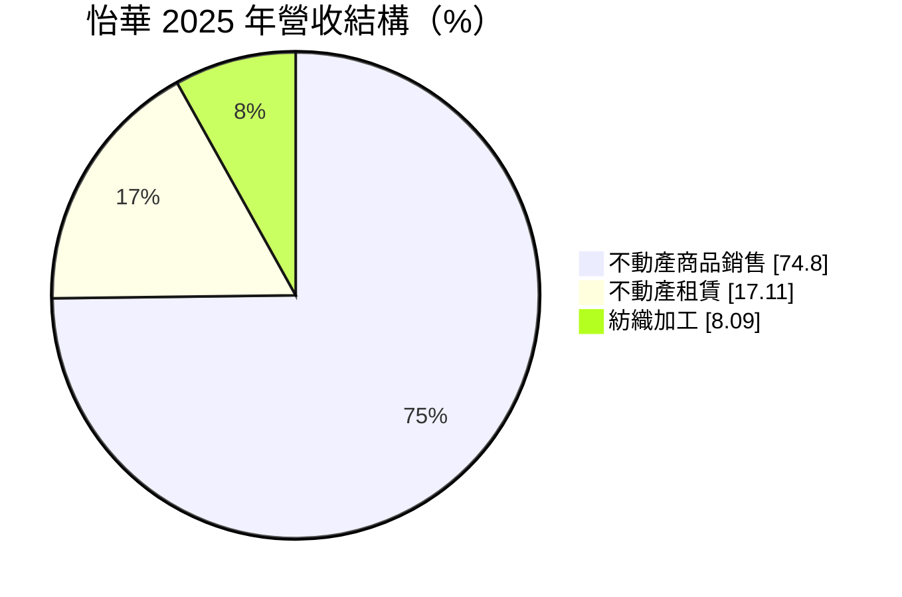
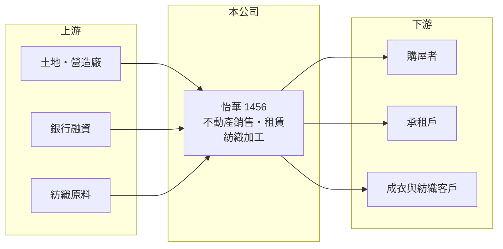

# 1456 怡華

> 上市｜[[產業索引-建材營造業|建材營造業]]｜上市（櫃）日期 1993/12/09

# 第一章：企業模式與商業藍圖

> [!info] 撰寫說明
> 精簡版，由 Claude 依公開資料整理，架構比照 [[2330台積電]]，資料截至 2026-10-08。來源：MoneyDJ 理財網財務比率年表（2021 至 2025 年）與個股基本資料（2025 年營收比重、歷年股利）、科技新報公司資料頁標題。公開資料有限，建案與出租物件位置、紡織加工的產品內容、營收金額都未查得；營業利益率高於毛利率的原因屬推估。#待校對

怡華實業成立於 1968 年，原是紡織公司，現在營收以不動產銷售與租賃為主、紡織加工為輔；它的獲利隨建案入帳大起大落，負債比率在同業中偏高。

- **核心業務：** 依 MoneyDJ 的分類，2025 年不動產商品銷售占 74.80%、不動產租賃占 17.11%、紡織加工占 8.09%。這是典型的「紡織轉不動產」公司：保留少量紡織本業，把資源轉向開發與出租。
- **營收結構：** 不動產銷售依建案交屋入帳，波動大；租賃收入較穩定，可支應部分固定費用；紡織加工規模小，對獲利影響有限。

- **營運據點：** 公司登記於台北市內湖區，建案與出租物件位置本次未查得。
- **長期方向：** 公司走的是[[資產活化]]路線，把土地或資金轉為建案與出租物件。2024、2025 年營業利益率高於毛利率，代表營業收益中有毛利以外的項目，例如投資性不動產的評價或處分利益（推估），這類收益不一定每年都有。

# 第二章：護城河深度與競爭優勢

怡華的競爭力不在紡織，而在不動產資產與開發；但規模小、槓桿高，護城河有限。

- **競爭優勢：** 同時經營銷售與租賃，可以在房市好時賣、房市差時租，靈活度比單純的建商高；租賃收入也讓公司在建案空窗期仍有基本的現金流。
- **主要對手：** 北部的中小型建商與出租業者眾多，具體對手本次未查得；紡織加工則面對大量中小型加工廠。
- **觀察重點：** 負債比率長期在 85% 以上，觀察重點是建案完工交屋後能否降低負債；另外要看租賃收入的成長，以及營業利益中非經常性項目的比重。

# 第三章：財務體質與盈利規模

資料日期：2026-10-08，表格是撰寫當時的快照；最新月營收、毛利率、累計 EPS 由自動排程寫在本筆記的屬性欄位（月營收、毛利率、累計EPS 等）。#待校對

怡華的 EPS 在 -0.81 元到 4.85 元之間跳動，2021 與 2025 年是獲利較好的年度，中間三年獲利微薄。

| 年度 | 營收（年增率） | [[毛利率]] | [[營業利益率]] | EPS（元） | [[ROE]] |
|---|---|---|---|---|---|
| 2021 | 未查得（+229.9%） | 27.59% | 24.73% | 4.85 | 29.99% |
| 2022 | 未查得（-73.9%） | 28.25% | 19.09% | -0.81 | -4.62% |
| 2023 | 未查得（+173.0%） | 33.40% | 23.60% | 0.05 | 0.33% |
| 2024 | 未查得（-38.1%） | 33.90% | 46.36% | 1.11 | 6.58% |
| 2025 | 未查得（-20.5%） | 38.95% | 78.23% | 3.41 | 17.97% |

- **長期指標：** 近 5 年平均 ROE 約 10.0%（推算），但年度差異極大。2022 至 2025 年度只有 2023 年度配發 0.2 元現金股利，配息穩定度低。營收年複合成長率因交屋時點不同，不具參考性。
- **[[ROIC]] 與 [[WACC]]：** 以每股計算：2025 年每股營收約 8.85 元（EPS 3.41 ÷ 稅後淨利率 38.53%），每股營業利益約 6.92 元，稅後約 5.54 元；投入資本以每股淨值 20.66 元加上每股有息負債約 60.5 元（負債比率 85.42% 換算的總負債一半）計，約 81.2 元，ROIC 約 6.8%（推算）。WACC 約 3.8%（推算：無風險利率 1.75%、市場風險溢酬 6%、β 取建設股常見值 1.0，股東權益成本約 7.75%；稅前負債成本 3%、稅率 20%；權益比重約 25%）。2025 年 ROIC 高於 WACC，但其中營業利益可能包含非經常性收益，且 2022 至 2024 年的報酬明顯偏低；高負債也讓 WACC 被壓低，實際風險高於這個數字所顯示的程度。
- **財務特色：** 負債比率 76% 至 87%，屬於高槓桿結構；每股淨值約 16 至 21 元，股本約 9.37 億元。

# 第四章：總體風險與地緣政治

怡華的風險在於高槓桿、獲利來源不穩定與房市週期。

- **產業週期：** 不動產銷售受房市景氣與信用管制影響，交屋年度與空窗年度的獲利差距大；紡織加工則跟著成衣需求與庫存循環。
- **營運風險：** 負債比率超過 85%，利率上升或銀行緊縮土建融資時，資金壓力會明顯增加；營業利益若依賴評價或處分利益，未來年度可能無法重複。
- **其他風險：** 央行選擇性信用管制、囤房稅等政策；投資性不動產的公允價值會隨市場變動；紡織加工面臨工資與環保成本上升。

# 專有名詞解析

## 金融

- **[[投資性不動產]]**：為了賺取租金或增值而持有的土地與建物，可依公允價值或成本衡量。
- **[[ROIC]]**：投入資本報酬率，稅後營業利益除以股東權益加有息負債，衡量本業運用資本的效率。
- **[[WACC]]**：加權平均資金成本，股東與債權人要求報酬率的加權平均，是 ROIC 要超越的門檻。

## 產業

- **[[資產活化]]**：把閒置土地、廠房或資產重新開發、出租或出售，提高資產的報酬。

# 核心供應鏈

- 上游：土地賣方、營造廠、融資銀行與紡織原料供應商（名稱未查得）。
- 下游／客戶：購屋者、承租戶與紡織加工客戶（名稱未查得）。
- 同業：北部中小型建商與出租業者、紡織加工廠（名稱未查得）。

## 最新新聞
<!-- news:start -->
<!-- news:end -->

## 相關連結
- [公開資訊觀測站](https://mopsov.twse.com.tw/mops/web/t05st03?step=1&firstin=1&co_id=1456)
- [Goodinfo](https://goodinfo.tw/tw/StockDetail.asp?STOCK_ID=1456)
- [Yahoo 股市](https://tw.stock.yahoo.com/quote/1456)
- [鉅亨網新聞](https://www.cnyes.com/twstock/1456/news)
