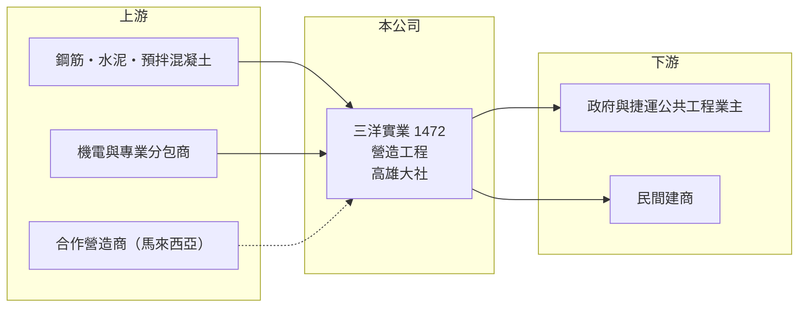

# 1472 三洋實業

> 上市｜[[產業索引-建材營造業|建材營造業]]｜上市（櫃）日期 2000/09/11

# 第一章：企業模式與商業藍圖

> [!info] 撰寫說明
> 精簡版，由 Claude 依公開資料整理，架構比照 [[2330台積電]]，資料截至 2026-10-08。來源：MoneyDJ 理財網財務比率年表（2021 至 2025 年）與個股基本資料（2025 年營收比重、歷年股利、每股營收）、自由時報報導標題（攜手馬來西亞廠商標得高雄捷運工程近 264 億元）、優分析報導標題。公開資料有限，承攬案件明細、[[在手訂單]]總額與 2021 至 2024 年營收金額未查得；2021 至 2022 年每股淨值大幅變動，應有股本調整，跨年比較待校對。#待校對

三洋實業成立於 1968 年，原屬紡織類股（推估，依股票代號分類），現在營收 100% 來自營造工程，近五年營收每年都成長，並開始承攬大型公共工程。

- **核心業務：** 依 MoneyDJ 的分類，2025 年營建工程占營收 100%。營造廠的角色是替業主（政府或建商）把建築或公共工程蓋出來，賺的是工程款與施工管理的利潤，不必像建商一樣承擔土地與銷售風險。
- **營收認列：** 營造工程通常依完工進度分期認列營收（[[完工百分比法]]），因此營收比建商平穩，主要取決於手上工程的規模與施工進度。
- **營運據點：** 公司登記於高雄大社區。依自由時報的報導，三洋實業與馬來西亞廠商合作，標得高雄捷運相關工程，金額近 264 億元，是公司擴展公共工程的重要案件。
- **長期方向：** 2021 至 2025 年營收年增率依序為 83%、94%、67%、20%、56%，同時營業利益率由負轉正並升到 10%，顯示公司正從小型營造廠成長為能承攬大型公共工程的業者。

# 第二章：護城河深度與競爭優勢

營造業的護城河通常來自施工實績、資格與成本控制；三洋實業正在用大型標案累積實績。

- **競爭優勢：** 公共工程投標需要過去的施工實績與資本額門檻，取得大型捷運工程後，三洋實業的實績等級會提升，有利於後續競標。與外商合作投標，也讓公司能參與單獨難以承接的大型案件。
- **主要對手：** 上市櫃營造同業如 [[2597潤弘]]、[[2535達欣工]]、[[2515中工]] 等（推估名單），以及大型公共工程常見的國內外營造集團。
- **觀察重點：** 在手訂單的總額與毛利率，是未來兩三年營收與獲利的領先指標；高雄捷運工程的施工進度、成本控制與合作夥伴的分工，是決定這個大案能否賺錢的關鍵。

# 第三章：財務體質與盈利規模

資料日期：2026-10-08，表格是撰寫當時的快照；最新月營收、毛利率、累計 EPS 由自動排程寫在本筆記的屬性欄位（月營收、毛利率、累計EPS 等）。#待校對

三洋實業的營收連年成長，獲利由 2021 年的虧損一路改善到 2025 年 EPS 6.4 元、ROE 15.5%。

| 年度 | 營收（億元） | [[毛利率]] | [[營業利益率]] | EPS（元） | [[ROE]] |
|---|---|---|---|---|---|
| 2021 | 未查得（+82.9%） | 20.80% | 1.71% | -1.09 | -1.08% |
| 2022 | 未查得（+94.2%） | 9.25% | -0.59% | 0.15 | 0.42% |
| 2023 | 未查得（+66.6%） | 12.98% | 6.64% | 4.27 | 12.91% |
| 2024 | 未查得（+19.9%） | 12.30% | 6.53% | 3.31 | 8.96% |
| 2025 | 約 36.4（推算） | 14.09% | 10.31% | 6.40 | 15.53% |

註：2025 年營收以每股營收約 69.4 元（EPS 6.4 ÷ 稅後淨利率 9.22%）乘以股本約 0.525 億股推算；2026 年第二季每股營收 18.98 元，換算單季約 10 億元，規模相符。早年股本曾變動，故不往回推算。

- **長期指標：** 依年增率連乘，2025 年營收約為 2021 年的 6 倍（推算）。近 5 年平均 ROE 約 7.3%（推算），但 2023 至 2025 年平均約 12.5%。2023 至 2025 年度現金股利依序為 2、3、6 元，[[配息率]]約 47% 至 94%，隨獲利提升。
- **[[ROIC]] 與 [[WACC]]：** 以每股計算：2025 年每股營業利益約 7.16 元，稅後約 5.73 元；投入資本以每股淨值 43.78 元加上每股有息負債約 29.8 元（負債比率 57.61% 換算的總負債一半）計，約 73.5 元，ROIC 約 7.8%（推算）。WACC 約 5.2%（推算：無風險利率 1.75%、市場風險溢酬 6%、β 取營造股常見值 0.9，股東權益成本約 7.15%；稅前負債成本 3%、稅率 20%；權益比重約 60%）。2023 年起 ROIC 已高於 WACC，代表公司成長後開始創造價值；能否維持，取決於大型工程的毛利。
- **財務特色：** 營造業的毛利率通常只有 10% 至 15%，三洋實業也在這個區間，獲利主要靠規模與管理效率。負債比率 47% 至 72%，多為工程相關的應付款與預收款（推估）。

# 第四章：總體風險與地緣政治

三洋實業的風險在於工程成本、單一大案的集中度與公共工程的履約風險。

- **產業週期：** 營造業的需求來自政府公共建設預算與建商的推案量，房市降溫時民間建案減少，公共工程則受政府預算與政策影響。
- **營運風險：** 大型捷運工程金額遠大於公司過去的年營收，施工延誤、設計變更或成本超支都可能吞掉利潤；與外商合作也有分工與責任歸屬的風險。缺工是營造業長期的結構問題。
- **其他風險：** 鋼筋、水泥等建材價格與工資上漲會壓縮毛利；公共工程的物價調整條款不一定能完全反映成本；工安事故會帶來罰款與停工風險。

# 專有名詞解析

## 金融

- **[[在手訂單]]**：已簽約但尚未完成交付的訂單金額，營造業用來預估未來數年的營收。
- **[[完工百分比法]]**：依工程完成進度分期認列營收與成本，營造業長期工程多採用此方法。
- **[[配息率]]**：現金股利占每股盈餘的比率，用來衡量公司把多少獲利發給股東。
- **[[ROIC]]**：投入資本報酬率，稅後營業利益除以股東權益加有息負債，衡量本業運用資本的效率。
- **[[WACC]]**：加權平均資金成本，股東與債權人要求報酬率的加權平均，是 ROIC 要超越的門檻。

# 核心供應鏈

- 上游：鋼筋、水泥、預拌混凝土等建材供應商，例如 [[2002中鋼]]、[[1101台泥]]（推估）；機電與專業分包商。
- 下游／客戶：高雄捷運等公共工程業主與民間建商。
- 同業：[[2597潤弘]]、[[2535達欣工]]、[[2515中工]]（推估名單）。

## 最新新聞
<!-- news:start -->
<!-- news:end -->

## 相關連結
- [公開資訊觀測站](https://mopsov.twse.com.tw/mops/web/t05st03?step=1&firstin=1&co_id=1472)
- [Goodinfo](https://goodinfo.tw/tw/StockDetail.asp?STOCK_ID=1472)
- [Yahoo 股市](https://tw.stock.yahoo.com/quote/1472)
- [鉅亨網新聞](https://www.cnyes.com/twstock/1472/news)
