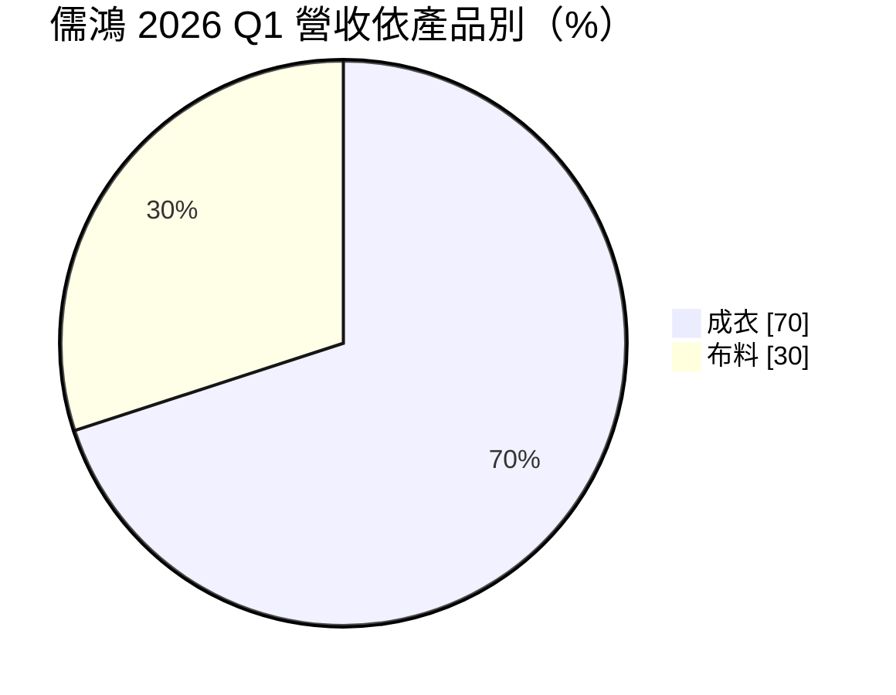
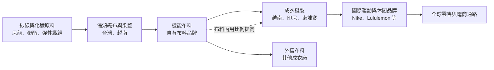
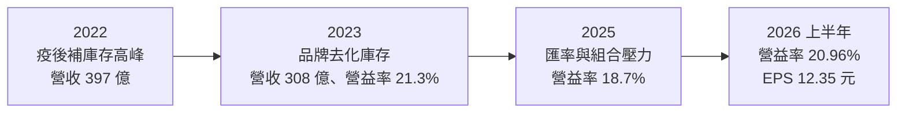
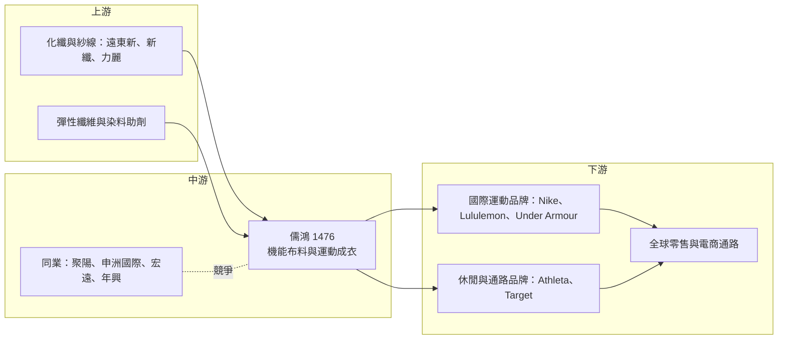

# 1476 儒鴻

> 上市｜[[產業索引-紡織纖維|紡織纖維]]｜上市（櫃）日期 2001/04/18

# 第一章：企業模式與商業藍圖

> [!info] 撰寫說明
> 本文由 Claude 依公開資料整理，架構比照 [[2330台積電]] 的四章研究，資料截至 2026-10-08。財務數字來源：Goodinfo 年度經營績效頁、證交所開放資料（基本資料、綜合損益、資產負債、營益分析、股利）、富果研究 2026 年第一季法說會整理、CMoney 研究筆記、股感（2018 年公司介紹）；產業描述為整理性內容，尚未逐條比對原始文件。#待校對

在評估一家紡織股的長期價值時，第一步是弄清楚它到底賺的是「加工費」還是「技術與服務的溢價」。本章針對儒鴻企業（股票代號：1476，以下簡稱儒鴻）的商業模式進行定性分析，說明它如何從一家彈性針織布廠，發展成國際運動品牌倚重的布料與成衣一條龍供應商，以及這個模式為何能讓它長期維持高於同業的獲利水準。

## 一、核心定位：從彈性布起家的垂直整合機能服供應商

儒鴻成立於 1977 年，創立時資本額僅 50 萬元、員工 4 人。1980 年代公司開始專攻彈性針織布，早期良率不到四成，經過多年製程改良才提升到九成以上；1989 年與杜邦合作開發彈性針織布，1993 年成為亞太地區第一家取得杜邦 Q-Mark 認證的企業（股感，2018 年公司介紹）。這段歷史說明儒鴻的根基不是成衣縫製，而是布料研發，這也是它後來能和一般成衣代工廠拉開距離的起點。

儒鴻今天的定位，是同時供應[[機能服]]布料與成衣的[[垂直整合]]製造商。它的工廠涵蓋織布、染整、定型到成衣縫製，品牌客戶可以把「選布、打樣、量產」整包交給儒鴻處理。公司在 2001 年於證交所上市，2026 年第二季底實收資本額約 27.4 億元（證交所基本資料）。

這個定位有兩層商業意義：

* **布料研發帶動成衣接單：** 品牌商在設計一件運動服時，最先決定的往往是布料的手感、彈性、排汗與耐洗等性能。儒鴻每年可提供超過 3,000 種新布料、每天推出超過 150 款新樣衣（股感，2018 年），等於在品牌商設計流程的最前端就參與決策，成衣訂單自然隨布料而來。
* **由代工轉向設計製造：** 儒鴻已從單純依圖生產的 [[OEM]]，轉為能提出布料與款式方案的 [[ODM]]。ODM 廠的議價能力較高，因為客戶換掉的不只是一條縫製產線，而是一整套開發夥伴。

## 二、終端應用／產品板塊：成衣為主、布料為輔

依富果研究整理的 2026 年第一季法說會內容，儒鴻營收約七成來自成衣、三成來自布料：

* **成衣：** 以運動休閒服為主，包括瑜珈服、跑步服、訓練服等貼身彈性服飾。2026 年第一季成衣營收年增約 5%，排除匯率因素後接近兩位數成長，是公司主要的成長來源。成衣比重從 2023 年的約 62% 持續上升（CMoney 研究筆記），反映公司刻意把更多自產布料留給自己的成衣線使用。
* **布料：** 以彈性針織布與機能布為主，除了供應外部成衣廠，也愈來愈多轉為內部使用。公司擁有 BodyCare、Aqua-Guide 等自有布料品牌（股感，2018 年），強調排汗、抗紫外線、環保回收等功能。
* **新產品與健康生活類別：** 公司表示新產品約占營收 15% 至 20%，內部估算與「健康生活（Wellness）」相關的產品約占三成（富果研究，2026 年第一季法說），顯示產品線正從純運動服延伸到日常穿著的休閒機能服。

客戶面，CMoney 研究筆記引用的前五大客戶比重為 Nike 約 15%、Lululemon 約 10%、Under Armour 約 8%、Athleta 約 6%、Target 約 5%，合計約 44%；銷售區域以美洲約 46% 最大，亞洲約 36%、歐洲約 12%。這組數字是 2023 年前後的結構，近年客戶排名可能已有變動，但「以國際運動與休閒品牌為主、前五大客戶占四成多」的大方向應仍成立（推估）。公司另有「小巨人計畫」培育新興品牌客戶，2026 年第一季這類客戶約占營收 10%。

## 三、資本轉化邏輯（營運模式）：布料技術帶動成衣訂單

儒鴻的獲利模式可以拆成三個環節：

* **研發端定價：** 新布料在開發初期具有獨特性，品牌商願意支付較高價格；當布料被同業模仿、變成大宗規格後，單價才會下滑。儒鴻持續推出新布料，讓產品組合中「高單價新品」的比例維持在一定水準，這是毛利率能長期維持在三成上下的主因。
* **製造端分工：** 台灣以研發、打樣與高階布料生產為主，越南負責布料與成衣，印尼與柬埔寨以成衣為主（CMoney 研究筆記）。印尼目前月產能約 200 萬至 250 萬件，公司規劃 2026 年下半年啟動擴建、2027 年下半年投產，先蓋成衣廠，布廠再視情況評估（富果研究，2026 年第一季法說）。
* **一條龍的效率：** 自產布料直接供應自家成衣廠，可以縮短交期、減少中間商利潤，也讓品牌商只需面對一個窗口。2025 年底起公司把應收帳款以承購方式處理，週轉天數降到約 43 天，存貨週轉天數約 85 天（富果研究），顯示營運資金管理相當紮實。

## 四、企業長期藍圖：複製越南模式、擴大客戶基礎

* **產能分散到東南亞多國：** 印尼新廠的目標是複製台灣與越南的營運模式。對品牌客戶來說，供應商在多個國家都有產能，可以分散關稅與地緣政治風險；對儒鴻來說，多國布局也降低了單一國家工資上漲或政策變動的衝擊。
* **擴大客戶廣度：** 透過小巨人計畫培養新興品牌，並往美國通路品牌與跨歐亞品牌延伸，目的是降低對少數大客戶的依賴。運動品牌的興衰週期往往只有數年，客戶組合愈分散，營收波動就愈小。
* **提高股東回饋：** 2025 年度盈餘配發率提高到約 75%（富果研究），每股現金股利 15 元（證交所股利資料），代表公司在擴產之外仍有充裕的現金可以回饋股東。

# 第二章：護城河深度與競爭優勢

在長期價值投資中，「護城河」指企業抵禦競爭、維持超額利潤的保護機制。成衣代工常被視為沒有門檻的勞力密集產業，但儒鴻長年維持 20% 以上的 [[ROE]]，代表它擁有一般代工廠沒有的優勢。本章分析這些優勢的來源、主要競爭對手，以及哪些部分守得住、哪些可能被侵蝕。

## 一、儒鴻護城河的核心組成要素

儒鴻的護城河屬於「中等寬度」，由以下四個要素構成：

* **1. 布料研發能力帶來的[[轉換成本]]：** 一件機能服的手感與性能主要由布料決定，品牌商一旦在某一季的主力款採用儒鴻的布料，後續追加訂單、改款與延伸系列多半會留在儒鴻。換供應商不只要重新打樣，還要重新測試洗滌、色牢度與彈性回復等規格，時間成本很高。
* **2. 垂直整合的速度與成本優勢：** 從織布到成衣都在自家體系內完成，交期可以比「布廠加成衣廠」分開合作的模式更短。運動品牌愈來愈重視快速補貨與小批量多款式，這種速度優勢會直接轉化為訂單。
* **3. 長期合作累積的信任：** 國際品牌對供應商的審核涵蓋品質、勞動條件、環保與化學品管理，新供應商要通過審核往往需要數年。儒鴻與 Nike、Lululemon 等品牌合作多年，這份合格供應商資格本身就是門檻。
* **4. 財務體質支撐擴產：** 2026 年第二季底儒鴻權益總計約 290 億元，負債總計約 92 億元，而且幾乎都是流動負債（證交所資產負債資料）。低負債讓公司在景氣低迷時仍能維持投資與配息，不會被迫削價搶單。

## 二、全球主要競爭對手格局

| 對手 | 定位 | 對儒鴻的威脅 |
|---|---|---|
| [[1477聚陽]] | 台灣最大成衣 ODM 之一，客戶以美系休閒與運動品牌為主 | 在成衣接單與東南亞產能上直接競爭，但聚陽布料多外購，垂直整合程度較低 |
| 申洲國際 | 中國針織成衣龍頭，同樣布料與成衣一條龍 | 規模更大、與 Nike 等品牌關係深厚，是最接近的國際對手 |
| [[1460宏遠]]、[[1451年興]]、[[1473台南]] | 台灣布料或成衣廠 | 在部分機能布或成衣品類競爭 |
| [[1402遠東新]]、[[1409新纖]]、[[1444力麗]] | 上游化纖與紡織廠 | 若往下游機能布延伸，可能分食布料訂單，但同時也是儒鴻的原料供應商 |

## 三、優勢轉化：哪些市場守得住、哪些守不住

* **守得住：** 高彈性、高機能的貼身運動服，以及需要快速開發新布料的品牌。這類產品技術門檻較高、單價也高，品牌商更重視開發能力而非單純報價，是儒鴻毛利率的主要支柱。
* **守不住：** 大宗、規格成熟的基本款布料與成衣。這類產品的競爭主要靠工資與規模，東南亞與中國廠商都能生產，價格壓力無法避免。2025 年毛利率從前一年的 30.9% 降到 28.6%（Goodinfo），部分反映匯率與產品組合變化，也提醒投資人儒鴻並非完全不受價格競爭影響。
* **觀察重點：** 第一，前五大客戶的訂單變化，特別是 Nike 與 Lululemon 等品牌自身的營運與庫存狀況；第二，印尼新廠能否如期在 2027 年下半年投產並達到越南廠的效率；第三，毛利率能否維持在公司設定的 28% 至 32% 區間內（富果研究，2026 年第一季法說）。這三點決定儒鴻的超額報酬能否延續。

# 第三章：財務體質與盈利規模

資料日期：2026-10-08。數字取自 Goodinfo 年度經營績效頁、證交所開放資料（綜合損益、資產負債、營益分析、股利）與富果研究法說會整理，表格是撰寫當時的快照；最新月營收、毛利率、累計 EPS 由自動排程寫在本筆記的屬性欄位（月營收、毛利率、累計EPS 等）。#待校對

財務報表是檢驗護城河是否真實存在的最終標準。本章用多年度的三率、ROE、現金流與資本報酬，檢視儒鴻在運動品牌庫存週期中的獲利品質。

## 一、獲利能力的基石：三率

| 年度 | 營收（新台幣） | [[毛利率]] | [[營業利益率]] | EPS（元） | [[ROE]] |
|---|---|---|---|---|---|
| 2019 | 281 億 | 28.9% | 19.5% | 15.67 | 24.5% |
| 2020 | 282 億 | 28.7% | 19.5% | 15.51 | 22.8% |
| 2021 | 359 億 | 26.4% | 17.8% | 18.77 | 25.5% |
| 2022 | 397 億 | 27.8% | 19.5% | 24.75 | 29.3% |
| 2023 | 308 億 | 31.4% | 21.3% | 18.87 | 20.4% |
| 2024 | 368 億 | 30.9% | 21.1% | 24.2 | 24.3% |
| 2025 | 380 億 | 28.6% | 18.7% | 20.1 | 18.8% |
| 2026 上半年 | 197.1 億 | 31.06% | 20.96% | 12.35 | 約 23%（年化） |

註：2019 至 2025 年取自 Goodinfo 年度經營績效；2026 上半年取自證交所營益分析與綜合損益開放資料，ROE 為 Goodinfo 年化數字。

* **[[毛利率]]：** 過去七年儒鴻的毛利率大致落在 26% 至 31% 之間，波動幅度相對小。值得注意的是 2023 年營收衰退 22%，毛利率反而升到 31.4%，原因是品牌去化庫存時先砍的是低價基本款，留下的訂單以高單價新品為主。這說明儒鴻的毛利率主要由產品組合決定，而不是單純由產量決定。
* **[[營業利益率]]：** 營業費用率約 9% 至 10%，營業利益率與毛利率的差距長期穩定在 10 個百分點左右，代表公司費用控制紀律良好。
* **營收趨勢：** 2019 至 2025 年營收從 281 億元增加到 380 億元，年複合成長率約 5.2%（推算）。成長並非直線，2022 年疫後補庫存與 2023 年庫存去化造成明顯的高低起伏，這是成衣供應鏈典型的[[長鞭效應]]。

## 二、[[ROE]]：資本效率

2021 至 2025 年的平均 ROE 約 23.7%（推算），即使在 2023 年營收大幅衰退的年份也有 20.4%。對一家製造業公司而言，能在低負債的情況下長期維持 20% 以上的 ROE，代表它的超額報酬來自本業的定價能力，而不是財務槓桿。2025 年 ROE 降到 18.8%，與毛利率下滑和匯率不利有關；2026 年上半年年化 ROE 回到 23% 左右（Goodinfo）。

## 三、資本支出、自由現金流與股利

儒鴻的資本支出主要用於東南亞新廠與設備更新，具體金額未查得。從結果來看，公司在擴產的同時仍能長期維持高配息，且 2026 年第二季底幾乎沒有長期負債（非流動負債僅約 1.6 億元，證交所資產負債資料），可以推估[[自由現金流]]長期為正（推估）。股利方面，2025 年度每股現金股利 15 元，以當年 EPS 20.1 元計算配發率約 75%（推算，與法說會說法一致）；公司章程規定盈餘分配原則上不低於當年度可分配盈餘的 50%。Goodinfo 統計儒鴻長期一般平均現金股利約 5.93 元，近年隨獲利成長明顯提高。

## 四、[[ROIC]] 與 [[WACC]]：價值創造利差

**ROIC 推算：** 2025 年營業利益約 71 億元（營收 380 億元 × 營業利益率 18.7%），扣除 20% 稅率後的稅後營業利益約 56.9 億元。2026 年第二季底權益總計約 290.2 億元；負債總計約 91.6 億元，其中多為應付帳款與應付股利，有息負債假設約 10 億元（推估）。投入資本約 300 億元，ROIC 約 19%（推算）。若以 2026 年上半年營業利益 41.3 億元年化計算，ROIC 約 22%（推算）。由於儒鴻帳上持有大量現金，若扣除超額現金，實際營運資產的報酬率會更高。

**WACC 推算：** 假設台灣 10 年期公債殖利率 1.75%、市場風險溢酬 6%、β 取紡織業常見值 0.8（假設值），股東權益成本約 6.55%。有息負債占資本比重很低（約 3%），負債成本假設 2%、稅後約 1.6%，WACC 約 6.4%（推算）。

**結論：** 儒鴻的 ROIC 長期約為 WACC 的三倍，利差超過 12 個百分點，屬於明確在創造股東價值的公司。這也是它能在高配息的同時仍有餘力擴產的根本原因。長期需要觀察的是，印尼擴產帶來的新增資本能否維持同樣的報酬率；若新廠效率不如預期，ROIC 可能逐步向 15% 附近收斂（推估）。

# 第四章：總體風險與地緣政治

任何企業都無法脫離宏觀環境獨立存在。本章分析儒鴻未來必須面對的關稅與地緣政治、產業週期、營運環境以及技術與法規演進。

## 一、地緣政治

* **美國關稅政策：** 儒鴻約一半營收來自美洲市場，產能集中在越南、印尼與柬埔寨，這些國家都曾成為美國[[對等關稅]]的對象。關稅提高時，品牌商往往要求供應商分攤部分成本，壓縮毛利。公司 2026 年第一季法說提到，美國已在 2026 年 4 月開始準備關稅退稅作業，但實際影響金額未揭露。長期來看，關稅是否落在「各國稅率差距不大」的狀態，比稅率高低更重要，因為品牌商主要比較的是不同國家供應商之間的相對成本。
* **[[中國加一]]的受益者：** 儒鴻的主要產能早已不在中國，在品牌商分散中國產能的趨勢下，屬於相對受益的一方。這也是印尼擴產的戰略意義之一。

## 二、產業週期與市場結構

* **品牌庫存週期：** 成衣供應鏈的需求波動主要來自品牌商的庫存調整，而不是消費者需求本身。2022 年品牌大量補庫存、2023 年轉為去化，儒鴻營收在一年內從 397 億元跌到 308 億元。這種週期約每 3 到 4 年出現一次（推估），投資人在高峰期應留意庫存反轉的風險。
* **客戶集中：** 前五大客戶合計約占四成以上營收，若單一大客戶營運轉差（例如設計失誤導致銷售下滑、更換執行長後調整供應鏈），對儒鴻的衝擊會很直接。2026 年法說會上，投資人就曾詢問 Nike 業績展望與 Lululemon 更換執行長的影響。
* **運動休閒風潮的持續性：** 儒鴻過去二十年的成長，部分受惠於「運動服日常化」的消費趨勢。如果這個趨勢放緩，高機能服飾的需求增速也會跟著放慢。

## 三、營運環境的隱性風險

* **匯率：** 營收以美元計價、部分成本以當地貨幣與新台幣支付，新台幣升值會直接壓低以台幣計算的營收與毛利率。2026 年第一季布料營收年減約 3%，公司表示匯率是主因。
* **東南亞工資與勞動力：** 越南與印尼的基本工資逐年上調，成衣縫製又是勞力密集作業，人力成本與招工難度會逐步墊高生產成本。
* **新廠執行風險：** 印尼擴建從動工到投產約需一年，期間若遭遇審批延誤、招工不足或效率爬坡緩慢，都會影響擴產效益。

## 四、科技或法規演進

* **永續與化學品法規：** 歐美品牌與監管機關對紡織品的回收料比例、碳足跡與有害化學物質（例如 [[PFAS]]）的要求愈來愈嚴格。符合規範需要投入染整製程改造與檢測，但也會淘汰體質較弱的同業，對有能力投資的大廠反而是長期利多。
* **自動化：** 成衣縫製的自動化程度仍低，若未來縫紉自動化技術突破，勞力成本優勢的重要性會下降，競爭重心會進一步轉向布料研發與設計能力，這對以研發為核心的儒鴻相對有利。

# 專有名詞解析

## 金融

- **[[ROE]]**：股東權益報酬率，稅後淨利除以股東權益，衡量公司運用股東資金賺錢的效率。
- **[[ROIC]]**：投入資本報酬率，稅後營業利益除以股東權益加有息負債，衡量本業運用全部資本的效率。
- **[[WACC]]**：加權平均資金成本，股東權益成本與負債成本依資本結構加權的平均值，是投資報酬的最低門檻。
- **[[自由現金流]]**：營業活動現金流減去資本支出，代表企業可自由用於配息、還債或併購的現金。
- **[[長鞭效應]]**：終端需求的小幅變動，沿供應鏈往上游傳遞時被逐級放大，造成上游庫存與訂單劇烈波動。

## 產業

- **[[機能服]]**：具備排汗、快乾、彈性、抗紫外線等功能的服飾，多用於運動與戶外，對布料技術要求高於一般成衣。
- **[[垂直整合]]**：同一家公司掌握上下游多個生產環節，例如從織布、染整到成衣縫製都自己做，可縮短交期並保留更多利潤。
- **[[OEM]]**：原廠委託製造，代工廠依客戶提供的設計與規格生產，不參與產品設計，議價能力較低。
- **[[ODM]]**：原廠委託設計製造，代工廠可提出設計方案並負責生產，與客戶綁定較深，議價能力較高。
- **[[轉換成本]]**：客戶更換供應商時需付出的時間、金錢與風險，轉換成本愈高，供應商的客戶黏著度愈高。
- **[[中國加一]]**：品牌商為分散風險，在中國以外再增加至少一個生產基地的供應鏈策略。
- **[[對等關稅]]**：美國依各國對美國商品的關稅與貿易障礙，對該國進口品課徵相對應稅率的政策。
- **[[PFAS]]**：全氟與多氟烷基物質，常用於防水防污塗層，因難以分解且可能危害健康，歐美正逐步限制使用。

# 核心供應鏈

## 1. 上游：化纖原料與紗線
- 聚酯與尼龍化纖、紗線：[[1402遠東新]]、[[1409新纖]]、[[1444力麗]]
- 彈性纖維與染整助劑：國際化工廠（未逐一查證供應關係）

## 2. 中游：儒鴻本身與主要同業
- 布料與成衣垂直整合：儒鴻（台灣、越南、印尼、柬埔寨廠）
- 成衣 ODM 同業：[[1477聚陽]]
- 布料與成衣同業：[[1460宏遠]]、[[1451年興]]、[[1473台南]]
- 國際同業：申洲國際

## 3. 下游：品牌客戶
- 運動品牌：Nike、Lululemon、Under Armour
- 休閒與通路品牌：Athleta、Target

## 最新新聞
<!-- news:start（自動產生，請勿手動編輯此範圍） -->
- 2026-10-06 📰 媒體 13:15｜〈台北紡織展〉儒鴻董座：Q4營運向上全年可望創高 明年首季展望樂觀｜[鉅亨網](https://news.cnyes.com/news/id/6622620)

完整紀錄：[[1476儒鴻 新聞]]
<!-- news:end -->

## 相關連結
- [公開資訊觀測站](https://mopsov.twse.com.tw/mops/web/t05st03?step=1&firstin=1&co_id=1476)
- [Goodinfo](https://goodinfo.tw/tw/StockDetail.asp?STOCK_ID=1476)
- [Yahoo 股市](https://tw.stock.yahoo.com/quote/1476)
- [鉅亨網新聞](https://www.cnyes.com/twstock/1476/news)
