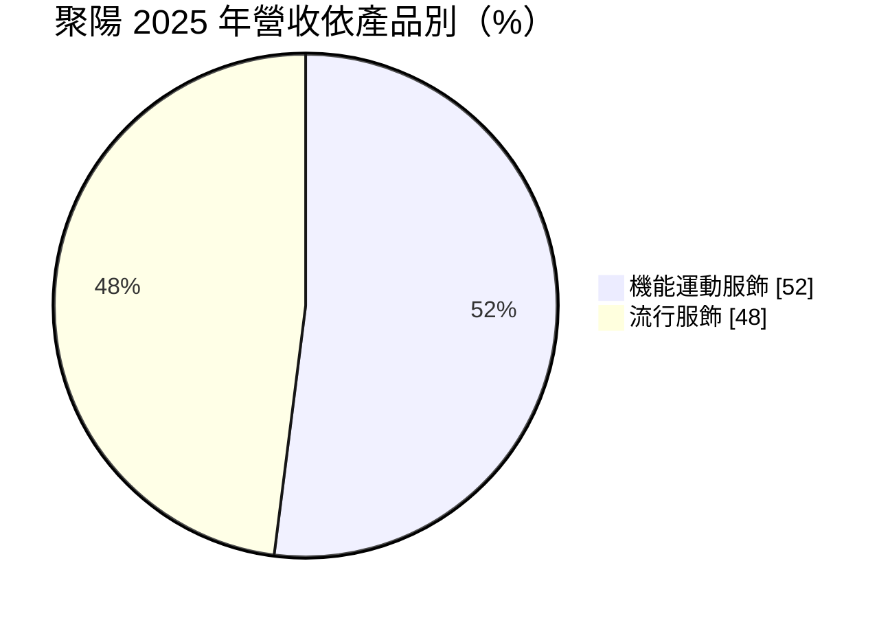
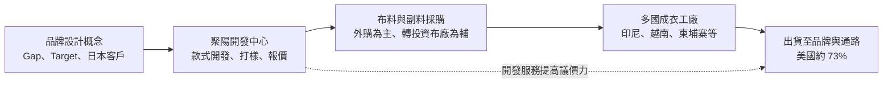
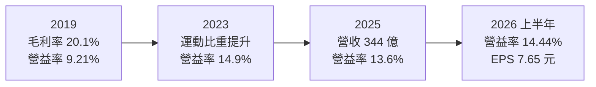
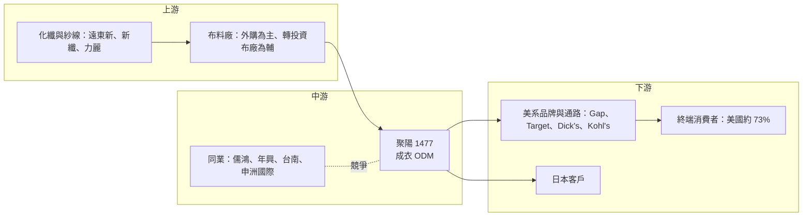

# 1477 聚陽

> 上市｜[[產業索引-紡織纖維|紡織纖維]]｜上市（櫃）日期 2003/01/21

# 第一章：企業模式與商業藍圖

> [!info] 撰寫說明
> 本文由 Claude 依公開資料整理，架構比照 [[2330台積電]] 的四章研究，資料截至 2026-10-08。財務數字來源：Goodinfo 年度經營績效頁、證交所開放資料（基本資料、綜合損益、資產負債、營益分析、股利）、富果研究 2026 年 4 月法說會整理；產業描述為整理性內容，尚未逐條比對原始文件。#待校對

成衣製造常被認為是「誰工資便宜誰就接單」的產業，但聚陽實業（股票代號：1477，以下簡稱聚陽）在這個產業裡長期維持超過 20% 的股東權益報酬率。本章針對聚陽的商業模式進行定性分析，說明它如何以設計開發能力與多國產能，成為美系服飾品牌不可或缺的成衣 [[ODM]] 夥伴。

## 一、核心定位：替國際品牌設計與生產成衣的 ODM 廠

聚陽成立於 1990 年，2003 年在證交所上市，2026 年第二季底實收資本額約 24.7 億元（證交所基本資料）。它不經營自有品牌，而是替國際服飾品牌與零售通路「從設計到出貨」一手包辦成衣。

和只依客戶圖稿生產的 [[OEM]] 代工廠相比，聚陽的差異在於前段的開發能力。品牌商的設計團隊通常只提出概念與方向，聚陽負責把概念轉成可量產的款式，挑選合適布料、打樣、估算成本，再安排到合適的工廠生產。對品牌商來說，聚陽等於是一個外部的產品開發部門加上一個跨國生產網絡。

這個定位帶來兩項商業意義：

* **以服務價值取代純加工費：** 聚陽賺的不只是縫製工錢，還包括開發、採購與供應鏈管理的服務價值，因此毛利率能從 2019 年的約 20% 提升到近年的約 25%（Goodinfo）。
* **輕資產的布料策略：** 和 [[1476儒鴻]] 自己織布染整不同，聚陽的布料主要向外採購，只透過轉投資布廠進行有限度的[[垂直整合]]（富果研究，2026 年法說）。這讓聚陽的固定資產較輕，資本可以集中投入成衣產能與開發人才。

## 二、終端應用／產品板塊：機能運動與流行服飾各半

依富果研究整理的 2026 年 4 月法說會內容，2025 年聚陽的產品結構如下：

* **機能運動服飾：** 包括瑜珈服、訓練服、戶外服等，2025 年占 52%，公司預估 2026 年運動類訂單占比會持續超過五成。這是聚陽過去十年刻意培養的成長引擎，因為運動服的技術門檻與單價都高於一般流行服飾。
* **流行服飾：** 以美國大型服飾品牌與量販通路的日常服裝為主，2025 年占 48%。這類訂單量大、款式多，考驗的是開發速度與成本控制。

客戶結構方面，2025 年 Gap Inc. 約占 36%、Target 約 18%、日本客戶約 18%、Dick's 約 9%、Kohl's 約 7%，以上五家合計約 88%；銷售地區以美國約 73% 為主，亞洲約 25%（富果研究，2026 年法說）。客戶高度集中在美國零售與品牌商，是聚陽商業模式最需要留意的特徵，第四章會再討論。

## 三、資本轉化邏輯（營運模式）：開發能力加上多國產能

* **產能分散在多個國家：** 依公司預估，2026 年印尼將成為最大產區，約占 45%，越南約 35%、柬埔寨約 15%，其餘分布在孟加拉、薩爾瓦多等地（富果研究，2026 年法說）。2025 年底公司結束了經營超過 30 年的菲律賓舊廠，2026 年擴產重點放在印尼、孟加拉與薩爾瓦多，全年產能預估成長中高個位數。
* **以周轉率取代資產規模：** 成衣 ODM 的固定資產主要是廠房與縫紉設備，單位投資不高，關鍵在於讓產線滿載與縮短開發週期。聚陽的獲利主要來自高周轉與費用控制，而非資本密集的規模經濟。
* **薩爾瓦多布局的意義：** 中美洲產能距離美國市場近、交期短，並可能適用美洲區域貿易協定的優惠（推估）。這讓聚陽可以提供品牌商「亞洲大量生產、美洲快速補單」的組合。

## 四、企業長期藍圖：提高運動比重、分散客戶與產地

* **持續提高機能運動服比重：** 運動服技術門檻高、品牌忠誠度強，可以穩定毛利率。聚陽透過創新研發中心與轉投資布廠，強化布料與功能設計能力。
* **擴大日系與新客戶：** 公司表示以美系客戶為主、並重點發展日系客戶（富果研究）。日本客戶已占約 18%，未來若能再拓展歐洲或新興品牌，可降低對 Gap 的依賴。
* **產地多元化：** 在品牌商推動[[中國加一]]與分散關稅風險的趨勢下，聚陽以印尼、越南、柬埔寨、孟加拉與中美洲的多點布局，提供客戶選擇不同國家生產的彈性。
* **高配息政策：** 公司每半年分派一次股利，配發率約 70% 至 90%（富果研究），2026 年上半年配發每股現金股利 6 元（證交所股利資料）。

# 第二章：護城河深度與競爭優勢

在長期價值投資中，「護城河」指企業抵禦競爭、維持超額利潤的保護機制。本章分析聚陽在勞力密集的成衣業中，如何建立難以複製的優勢，主要競爭對手是誰，以及這些優勢的邊界在哪裡。

## 一、聚陽護城河的核心組成要素

聚陽的護城河屬於「中等寬度」，主要建立在服務能力與客戶關係上，而非專利或資本門檻：

* **1. 開發能力帶來的[[轉換成本]]：** 大型服飾品牌每季要推出數百到上千款新品，需要供應商快速把設計轉成可量產的樣衣並報出準確成本。聚陽長期累積的版型資料庫與開發團隊，讓品牌商很難在短期內找到同樣效率的替代者。
* **2. 多國產能的配置彈性：** 聚陽在多個國家設有工廠，可以依關稅、交期與成本，替客戶把訂單分配到最合適的產地。對品牌商而言，與一家擁有多國產能的大型 ODM 合作，比管理多家單一國家的小廠更省事。
* **3. 規模帶來的採購與管理優勢：** 2025 年營收約 344 億元（Goodinfo），規模讓聚陽在布料與副料採購上有議價力，也能負擔合規稽核、資訊系統與研發中心等固定成本。
* **4. 與大客戶的深度綁定：** 與 Gap、Target 等客戶長年合作，參與它們的產品規劃，這種關係本身就是新進者難以跨越的門檻。不過這也是雙面刃，詳見下文。

## 二、全球主要競爭對手格局

| 對手 | 定位 | 對聚陽的威脅 |
|---|---|---|
| [[1476儒鴻]] | 布料與成衣垂直整合，以高機能運動服為主 | 在機能運動服領域直接競爭，布料自製讓它在高階品項更具優勢 |
| [[1451年興]]、[[1473台南]] | 台灣成衣與牛仔、針織成衣廠 | 在部分休閒服與通路品牌訂單上競爭 |
| 申洲國際 | 中國針織成衣龍頭，布料成衣一條龍 | 規模大、運動品牌客戶深，是機能服的強力對手 |
| 東南亞與南亞本土成衣廠 | 越南、孟加拉、印尼的大型成衣集團 | 在基本款以低工資競價，壓低流行服飾報價 |

## 三、優勢轉化：哪些市場守得住、哪些守不住

* **守得住：** 需要大量開發、款式變化快的品牌訂單，以及機能運動服。這類訂單看重開發速度、品質穩定與多國產能，報價不是唯一考量，聚陽的毛利率因此能從 2019 年的 20.1% 提升到 2023 年的 25.8% 並維持在 25% 上下（Goodinfo）。
* **守不住：** 規格簡單的基本款流行服飾。這類產品任何大型成衣廠都能做，客戶議價時會直接比較工資與報價，聚陽在這部分只能賺取有限的加工利潤。
* **觀察重點：** 第一，Gap 占比是否持續下降、日本與運動品牌客戶是否穩定成長；第二，印尼成為最大產區後的效率與品質是否穩定；第三，運動類訂單占比能否維持五成以上。這三點決定聚陽能否把目前約 25% 的 ROE 延續下去。

# 第三章：財務體質與盈利規模

資料日期：2026-10-08。數字取自 Goodinfo 年度經營績效頁、證交所開放資料（綜合損益、資產負債、營益分析、股利）與富果研究法說會整理，表格是撰寫當時的快照；最新月營收、毛利率、累計 EPS 由自動排程寫在本筆記的屬性欄位（月營收、毛利率、累計EPS 等）。#待校對

財務報表是檢驗護城河是否真實存在的最終標準。本章用多年度的三率、ROE、現金流與資本報酬，檢視聚陽的 ODM 模式能否穩定創造超額報酬。

## 一、獲利能力的基石：三率

| 年度 | 營收（新台幣） | [[毛利率]] | [[營業利益率]] | EPS（元） | [[ROE]] |
|---|---|---|---|---|---|
| 2019 | 270 億 | 20.1% | 9.21% | 8.66 | 21.3% |
| 2020 | 249 億 | 22.4% | 10.7% | 9.35 | 21.5% |
| 2021 | 289 億 | 22.6% | 11.7% | 11.2 | 22.4% |
| 2022 | 321 億 | 25.7% | 13.8% | 14.53 | 24.2% |
| 2023 | 325 億 | 25.8% | 14.9% | 16.5 | 25.7% |
| 2024 | 355 億 | 25.3% | 14.9% | 16.68 | 27.2% |
| 2025 | 344 億 | 24.9% | 13.6% | 14.65 | 25.4% |
| 2026 上半年 | 170.6 億 | 25.29% | 14.44% | 7.65 | 約 27%（年化） |

註：2019 至 2025 年取自 Goodinfo 年度經營績效；2026 上半年取自證交所營益分析與綜合損益開放資料，ROE 為 Goodinfo 年化數字。

* **[[毛利率]]：** 2019 到 2023 年毛利率從 20.1% 一路提升到 25.8%，主因是運動服比重增加與產能配置優化。這段期間的改善不是靠景氣，而是產品組合的結構性轉變，因此在 2024、2025 年景氣轉弱時仍守在 25% 附近。
* **[[營業利益率]]：** 營業利益率從 9.21% 提升到 14% 至 15%，提升幅度大於毛利率，代表營收成長的同時費用沒有等比例增加，呈現明顯的[[營業槓桿]]。
* **營收趨勢：** 2019 至 2025 年營收從 270 億元成長到 344 億元，年複合成長率約 4.1%（推算）。營收成長平穩，但 EPS 從 8.66 元成長到 14.65 元，增幅遠大於營收，說明聚陽的價值成長主要來自獲利率提升。

## 二、[[ROE]]：資本效率

2021 至 2025 年的平均 ROE 約 25.0%（推算），而且逐年穩定在 22% 至 27% 之間。高 ROE 來自兩個因素：一是 ODM 模式的輕資產特性，布料外購讓廠房設備投資較少；二是高配息政策讓股東權益不會無限累積，資本維持在有效運用的規模。

## 三、資本支出、自由現金流與股利

聚陽的資本支出相對營收很小，富果研究整理的法說資料顯示 2025 年資本支出預計約 7.18 億元，約為營收的 2%，主要用於產能擴充與效率提升。在這樣的資本密集度下，營業現金流大部分可轉為[[自由現金流]]，推估長期為正（推估，具體金額未查得）。股利方面，公司每半年分派一次，2025 年下半年每股配發現金股利 9 元、2026 年上半年配發 6 元（證交所股利資料），配發率約 70% 至 90%。以 2026 年上半年 EPS 7.65 元計算，6 元的現金股利配發率約 78%（推算）。

## 四、[[ROIC]] 與 [[WACC]]：價值創造利差

**ROIC 推算：** 2025 年營業利益約 46.8 億元（營收 344.28 億元 × 營業利益率 13.6%），扣除 20% 稅率後約 37.5 億元。2026 年第二季底權益總計約 138.9 億元，負債總計約 100.8 億元，其中大部分是應付帳款等營運負債，有息負債假設約 20 億元（推估）。投入資本約 159 億元，ROIC 約 24%（推算）。以 2026 年上半年營業利益 24.6 億元年化計算，ROIC 約 25%（推算）。

**WACC 推算：** 假設台灣 10 年期公債殖利率 1.75%、市場風險溢酬 6%、β 取紡織成衣業常見值 0.8（假設值），股東權益成本約 6.55%。負債成本假設 2.5%、稅後約 2.0%；有息負債約占投入資本 13%，WACC 約 6.0%（推算）。

**結論：** 聚陽的 ROIC 長期約為 WACC 的四倍，是典型「輕資產、高周轉、高報酬」的價值創造型公司。這也代表它不需要大量再投資就能維持成長，因此可以把大部分盈餘發給股東。長期風險在於高報酬是否會吸引競爭者，以及客戶集中度帶來的議價壓力，若主要客戶要求降價，ROIC 會首先受到衝擊。

# 第四章：總體風險與地緣政治

任何企業都無法脫離宏觀環境獨立存在。本章分析聚陽未來必須面對的關稅與地緣政治、產業週期、營運環境以及技術與法規演進。

## 一、地緣政治

* **美國貿易政策：** 聚陽約 73% 營收來自美國市場，主要產地在印尼、越南與柬埔寨，美國對東南亞國家的[[對等關稅]]會直接影響品牌商的採購成本。關稅提高時，品牌商通常會把部分成本轉嫁給供應商，或調整各國下單比例。聚陽的多國產能讓它能隨政策移動訂單，但無法完全避免價格壓力。
* **產地政治與勞工議題：** 柬埔寨、孟加拉等國的政治穩定度與勞工運動，可能造成停工或交期延誤。品牌商對供應鏈勞動條件的稽核也愈來愈嚴格，任何違規事件都可能導致訂單流失。

## 二、產業週期與市場結構

* **客戶高度集中：** 前五大客戶合計約 88%，其中 Gap 一家就占 36%（富果研究，2026 年法說）。如果 Gap 的營運轉差或調整供應商策略，聚陽營收會受到明顯衝擊。這是聚陽最主要的結構性風險。
* **品牌庫存週期與[[長鞭效應]]：** 美國零售商的庫存調整會沿供應鏈放大，2020 年疫情期間聚陽營收從 270 億元降到 249 億元（Goodinfo），就是品牌急踩煞車的結果。
* **美國零售業結構變化：** Kohl's、Target 等量販與百貨通路面臨電商競爭，若這些客戶的銷售萎縮，聚陽必須找到新的成長客戶來替補。

## 三、營運環境的隱性風險

* **匯率：** 以美元報價為主，新台幣升值會壓低以台幣計算的營收與利潤。
* **原物料與運費：** 公司表示若油價超過每桶 140 美元，客戶可能啟動緊急應變機制，對訂單影響較大（富果研究，2026 年法說）。油價上漲同時推升化纖布料成本與海運費。
* **新產地爬坡：** 印尼、孟加拉與薩爾瓦多的新產能需要時間培訓工人與建立管理制度，初期效率與品質可能不如成熟工廠。

## 四、科技或法規演進

* **永續法規：** 歐美陸續推動紡織品回收料比例、碳揭露與化學品限制（例如 [[PFAS]]），聚陽需要與布料供應商共同調整製程。能夠協助品牌商達成永續目標的 ODM 廠，未來在接單上會更有優勢。
* **數位開發與自動化：** 3D 打樣、數位版型與 AI 輔助設計正逐步改變成衣開發流程，可以縮短開發週期並減少實體樣衣。聚陽若能領先導入，可以進一步拉大與小型代工廠的差距；反之，若品牌商自行掌握數位開發能力，ODM 廠的開發價值可能被削弱。

# 專有名詞解析

## 金融

- **[[營業槓桿]]**：固定成本占比較高時，營收增加會使營業利益以更快的速度成長，反之亦然。
- **[[ROE]]**：股東權益報酬率，稅後淨利除以股東權益，衡量公司運用股東資金賺錢的效率。
- **[[ROIC]]**：投入資本報酬率，稅後營業利益除以股東權益加有息負債，衡量本業運用全部資本的效率。
- **[[WACC]]**：加權平均資金成本，股東權益成本與負債成本依資本結構加權的平均值，是投資報酬的最低門檻。
- **[[自由現金流]]**：營業活動現金流減去資本支出，代表企業可自由用於配息、還債或併購的現金。
- **[[長鞭效應]]**：終端需求的小幅變動，沿供應鏈往上游傳遞時被逐級放大，造成上游庫存與訂單劇烈波動。

## 產業

- **[[ODM]]**：原廠委託設計製造，代工廠可提出設計方案並負責生產，與客戶綁定較深，議價能力較高。
- **[[OEM]]**：原廠委託製造，代工廠依客戶提供的設計與規格生產，不參與產品設計，議價能力較低。
- **[[垂直整合]]**：同一家公司掌握上下游多個生產環節，例如從織布、染整到成衣縫製都自己做，可縮短交期並保留更多利潤。
- **[[轉換成本]]**：客戶更換供應商時需付出的時間、金錢與風險，轉換成本愈高，供應商的客戶黏著度愈高。
- **[[中國加一]]**：品牌商為分散風險，在中國以外再增加至少一個生產基地的供應鏈策略。
- **[[對等關稅]]**：美國依各國對美國商品的關稅與貿易障礙，對該國進口品課徵相對應稅率的政策。
- **[[PFAS]]**：全氟與多氟烷基物質，常用於防水防污塗層，因難以分解且可能危害健康，歐美正逐步限制使用。

# 核心供應鏈

## 1. 上游：化纖原料與布料
- 化纖與紗線：[[1402遠東新]]、[[1409新纖]]、[[1444力麗]]
- 布料：向外部布廠採購為主，另有轉投資布廠（標的未查得）

## 2. 中游：聚陽本身與主要同業
- 成衣 ODM：聚陽（印尼、越南、柬埔寨、孟加拉、薩爾瓦多等廠）
- 台灣同業：[[1476儒鴻]]、[[1451年興]]、[[1473台南]]
- 國際同業：申洲國際

## 3. 下游：品牌與通路客戶
- 美系服飾品牌與通路：Gap Inc.、Target、Dick's Sporting Goods、Kohl's
- 日本服飾客戶（名稱未揭露）

## 最新新聞
<!-- news:start -->
<!-- news:end -->

## 相關連結
- [公開資訊觀測站](https://mopsov.twse.com.tw/mops/web/t05st03?step=1&firstin=1&co_id=1477)
- [Goodinfo](https://goodinfo.tw/tw/StockDetail.asp?STOCK_ID=1477)
- [Yahoo 股市](https://tw.stock.yahoo.com/quote/1477)
- [鉅亨網新聞](https://www.cnyes.com/twstock/1477/news)
