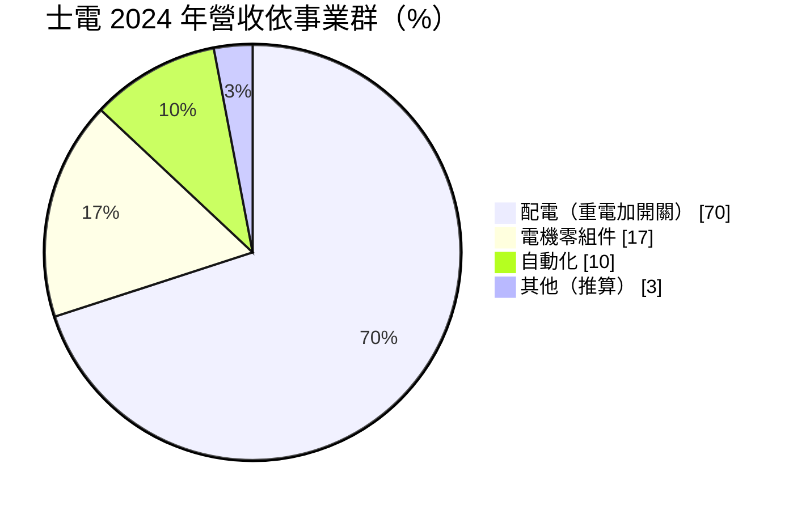
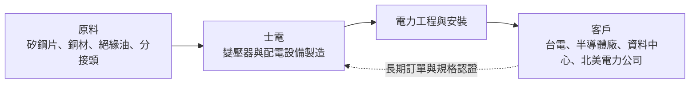
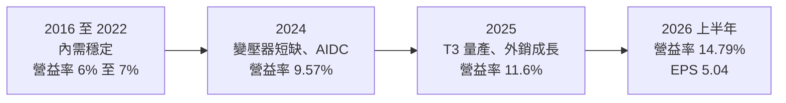
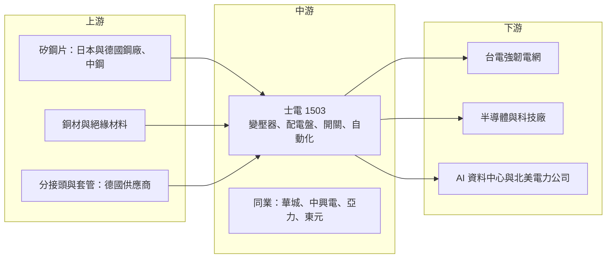

# 1503 士電

> 上市｜[[產業索引-電機機械|電機機械]]｜上市（櫃）日期 1969/12/15

# 第一章：企業模式與商業藍圖

> [!info] 撰寫說明
> 本文由 Claude 依公開資料整理，架構比照 [[2330台積電]] 的四章研究，資料截至 2026-10-08。財務數字來源：Goodinfo 年度經營績效頁、證交所開放資料（基本資料、綜合損益、資產負債、營益分析、股利、本益比殖利率）、富果研究 2025 年 8 月法說會整理、優分析 2026 年 8 月與 9 月法說報導；產業描述為整理性內容，尚未逐條比對原始文件。#待校對

在評估重電股的長期價值時，首先要理解它在電力系統中的位置，以及訂單是怎麼來、怎麼轉成獲利。本章針對士林電機廠（股票代號：1503，以下簡稱士電）的商業模式進行定性分析，說明它如何從綜合電機廠，轉變為以變壓器與配電設備為核心的重電公司。

## 一、核心定位：台灣高科技廠房的配電設備龍頭

士電成立於 1955 年，1969 年上市，是台灣歷史最悠久的電機製造商之一。公司分為四大事業群：重電（[[電力變壓器]]、[[配電盤]]與電力工程）、開關（低壓斷路器、智慧與直流開關）、電機零組件（汽車零件、電動車馬達與控制器、充電樁）以及自動化（變頻器、伺服馬達、PLC、儲能與太陽能逆變器）。

依富果研究整理的 2025 年 8 月法說會資料，重電與開關合計的配電事業約占 2024 年合併營收 70%，2025 年上半年升至 72%，是士電最主要的獲利來源。士電在法說會表示，它在台灣高科技與半導體廠的變壓器市占率超過七成。這個定位說明了士電的客戶結構：台灣的半導體與電子大廠每蓋一座新廠，就需要大量的變壓器、配電盤與開關設備，而士電正是這些設備的主要供應商。

這個定位帶來兩個重要的商業意義：

* **跟著台灣科技業擴廠成長：** 半導體廠、面板廠與資料中心的電力需求極大，且對供電穩定度要求嚴格。士電長期服務這些客戶，熟悉其規格與工期，因此每一輪科技業擴廠都能帶動士電的訂單。
* **從內需走向國際：** 2023 年以後，美國電網汰換與 AI 資料中心建設造成全球變壓器嚴重短缺，國際大廠交期長達三到四年。士電趁此機會把變壓器外銷到北美，並在 2026 年把日本納入外銷市場，讓公司的成長不再只依賴台灣內需。

## 二、終端應用板塊：配電為主，零組件與自動化為輔

依 2024 年合併營收的事業群比重如下：

註：其他 3% 為 100% 減去法說會揭露三項的推算值。

* **重電：** 包括變壓器、配電盤與電力工程統包。客戶涵蓋台電、半導體與科技廠、資料中心與海外電力公司。2026 年 9 月法說會指出，國內營收中科技與半導體相關約占 25%，台電[[強韌電網計畫]]約占 25%；外銷約占重電營收的 15% 至 20%，市場包括東南亞、美國與加拿大。
* **開關：** 低壓斷路器、電磁開關等配電元件，是工廠與建築配電盤的基本零件。這部分受中國市場景氣影響，2025 年上半年營收持平。
* **電機零組件：** 汽車發電機、起動馬達等傳統車用零件，以及電動車馬達與控制器、充電樁。這是士電分散營收來源的一塊，但成長性與毛利都不如重電。
* **自動化：** 變頻器、伺服馬達、PLC，以及[[儲能]]系統用的電力轉換器（[[PCS]]）。法說會提到士電的伺服馬達與變頻器用於 [[CoWoS]] 相關設備，控制器與驅動器也用於液冷系統。

## 三、資本轉化邏輯：在手訂單、交期與產能

重電業的獲利邏輯和電子業非常不同，可以從三個面向理解：

* **[[在手訂單]]決定未來兩到四年的營收：** 變壓器是客製化產品，從接單、設計、製造到交貨往往需要一年以上。2026 年 9 月法說會指出，士電在手訂單超過 600 億元，主要在 2027 至 2028 年出貨，並已開始承接 2029 至 2030 年的訂單；其中超過七成是重電設備。在手訂單約為 2025 年營收 372 億元的 1.6 倍，代表未來幾年的營收能見度很高。
* **產能是成長的上限：** 重電設備的產能取決於廠房面積、繞線與乾燥設備，以及熟練技工，擴產需要兩年以上。士電的 T3 廠在 2025 年 9 月量產，增加約三成產能並可生產 500kV 等級變壓器；T4 廠預計 2027 年 9 月投產，廠房面積是 T3 的兩倍、可生產 345kV 等級，預計再增加約三成產能。法說會指出 T3 廠利用率約九成，已有客戶預訂 T4 產能。
* **交期就是定價權：** 法說會表示士電的變壓器交期約 80 週，相較於國際大廠的三到四年短得多，這是士電能拿到北美訂單的重要原因。在全球短缺期間，交期較短的供應商可以取得較好的價格。

## 四、企業長期藍圖：多元客戶加上擴產與儲能

士電的長期策略可以歸納為三條主線。第一是分散客戶結構，從國內電力公司、半導體與 AI 供應鏈，擴展到海外電力公司、基礎建設與 AI 資料中心。第二是擴充產能，以 T3、T4 兩座新廠支撐未來五年的訂單，並推出數位化的變壓器健康監測產品。第三是發展[[表後儲能]]，也就是設置在企業用戶端的儲能系統，2026 年目標取得 300MW 訂單，下一階段目標 500MW。

從經營團隊來看，士電的股利政策穩定，長期配發率約八成，資本支出以自有資金為主。這種保守、穩健的資本配置風格，是老牌重電廠的典型特色。

# 第二章：護城河深度與競爭優勢

護城河分析的核心問題是：這家公司的優勢能否在十年後依然存在？本章針對士電的競爭優勢進行拆解，並與國內外重電同業比較，評估它在全球變壓器短缺周期之後的位置。

## 一、護城河的核心組成要素

* **高科技客戶的長期信任：** 半導體廠停電的損失極大，因此廠務部門選擇配電設備時，優先考慮過去的可靠度紀錄，而不是價格。士電長期服務台灣科技大廠，在高科技與半導體變壓器市場的市占率超過七成，這種信任是數十年累積的結果，新進者很難在短時間內取代。
* **完整產品線與一站式服務：** 士電從高壓變壓器、配電盤、低壓開關到工程安裝都能提供，客戶可以一次採購整個廠房的配電系統。這降低了客戶的協調成本，也提高了士電在每個專案中的份額。
* **認證與產能門檻：** 高壓變壓器需要通過台電與國際電力公司的型式試驗與認證，廠房、試驗設備與熟練技工都需要長期投資。全球變壓器短缺正是因為這些門檻讓產能無法快速增加，這也保護了既有廠商的地位。
* **上游關鍵零件的長期合作：** 法說會提到士電與日本、德國主要矽鋼片供應商及德國分接頭製造商維持長期合作，在原料短缺時能優先取得供應。

## 二、全球主要競爭對手格局

| 公司 | 所在地 | 定位與強項 | 與士電的關係 |
|---|---|---|---|
| [[1519華城]] | 台灣 | 電力變壓器專業廠，外銷美國比重高 | 變壓器外銷與台電標案的主要競爭者 |
| [[1513中興電]] | 台灣 | 台電 GIS 主要供應商 | 在台電與統包工程有重疊 |
| [[1504東元]] | 台灣 | 馬達與機電整合，布局資料中心電力 | 配電盤與資料中心工程的競爭者 |
| [[1514亞力]] | 台灣 | 配電盤、變壓器與電力電子 | 半導體廠配電設備的競爭者 |
| Hitachi Energy、Siemens Energy、GE Vernova | 歐美日 | 全球輸變電龍頭，超高壓與 HVDC 技術領先 | 北美市場的主要供應商，交期長達三到四年 |
| HD 現代電氣、曉星重工、LS Electric | 韓國 | 積極搶攻美國變壓器市場 | 北美外銷市場的直接競爭者 |
| 三菱電機 | 日本 | 重電與低壓開關、自動化 | 開關與自動化產品的國際對手 |

從格局來看，士電在台灣高科技配電市場的地位穩固，但在北美市場，它與韓國廠商一樣，屬於趁國際大廠產能不足而切入的「第二梯隊供應商」。

## 三、優勢轉化：守得住、守不住與觀察重點

* **守得住：** 台灣高科技與半導體廠的配電設備份額。這個市場重視可靠度與服務，士電的地位短期內很難被撼動，而台灣半導體廠持續擴建，也為士電提供長期需求。
* **守不住：** 北美市場的超額利潤。全球變壓器短缺帶來的高價與長交期，終究會隨國際大廠與韓國廠擴產而緩解。當交期從三到四年縮短到一年左右，士電在北美的價格優勢可能縮小。
* **觀察重點：** 第一，T4 廠能否在 2027 年如期投產並滿載；第二，北美訂單在關稅與匯率變動下的毛利率變化；第三，表後儲能與自動化能否成長為重電之外的穩定事業，降低對重電景氣的依賴。

# 第三章：財務體質與盈利規模

資料日期：2026-10-08。數字取自 Goodinfo 年度經營績效頁與證交所開放資料，表格是撰寫當時的快照；最新月營收、毛利率、累計 EPS 由自動排程寫在本筆記的屬性欄位（月營收、毛利率、累計EPS 等）。#待校對

財務報表是檢驗護城河是否真實存在的最終標準。本章用多年度的三率、ROE 與資本報酬，檢視士電在重電景氣上升期的獲利品質。

## 一、獲利能力的基石：三率

| 年度 | 營收（新台幣） | [[毛利率]] | [[營業利益率]] | EPS（元） | [[ROE]] |
|---|---|---|---|---|---|
| 2016 | 214 億 | 19.9% | 6.67% | 2.39 | 5.97% |
| 2017 | 222 億 | 19.2% | 6.26% | 2.55 | 6.26% |
| 2018 | 250 億 | 18.4% | 6.55% | 2.72 | 6.40% |
| 2019 | 260 億 | 18.7% | 7.15% | 3.21 | 7.21% |
| 2020 | 257 億 | 18.4% | 7.61% | 2.93 | 6.34% |
| 2021 | 277 億 | 18.0% | 7.22% | 3.46 | 7.24% |
| 2022 | 308 億 | 17.0% | 7.33% | 3.86 | 7.62% |
| 2023 | 318 億 | 17.8% | 7.75% | 4.51 | 7.96% |
| 2024 | 351 億 | 19.4% | 9.57% | 5.81 | 8.79% |
| 2025 | 372 億 | 20.9% | 11.6% | 6.27 | 8.95% |
| 2026 上半年 | 211.2 億 | 23.05% | 14.79% | 5.04 | 未查得 |

註：2016 至 2025 年取自 Goodinfo；2026 上半年取自證交所綜合損益與營益分析開放資料。

* **[[毛利率]]：** 2016 至 2023 年，士電毛利率長期在 17% 至 20% 之間，屬於穩定但不高的製造業水準。2024 年起隨變壓器短缺與北美外銷增加，毛利率逐步升到 2026 年上半年的 23%。法說會提到北美外銷的毛利率每年提升超過 5 個百分點，是毛利結構改善的主因。
* **[[營業利益率]]：** 從 2022 年的 7.33% 一路升到 2026 年上半年的 14.79%，營業利益率倍增，說明營收成長時費用被有效攤薄。
* **營收趨勢：** 2020 年至 2025 年營收從 257 億元成長到 372 億元，年複合成長率約 7.7%（推算），成長穩健但不爆發，反映重電業務受產能限制、需逐年消化訂單的特性。

## 二、[[ROE]]：資本效率

士電的 ROE 長期偏低，2021 至 2025 年平均約 8.1%（推算），即使 2025 年 EPS 創新高，ROE 也只有 8.95%。主要原因是權益基礎龐大：2026 年第二季底歸屬母公司權益約 387 億元，每股淨值 74.28 元（證交所資料），其中其他權益約 76.8 億元，代表公司持有相當規模的金融資產或轉投資，這些資產的報酬不直接反映在營業利益上。若只看本業，資本效率比 ROE 所顯示的更好。

## 三、資本支出、自由現金流與股利

士電的資本支出集中在 T3、T4 等新廠房與設備，具體金額未查得。重電業的特性是客戶通常會支付預收款，在手訂單增加時合約負債也增加，對營運資金有一定支撐，這使得擴產期間的現金流壓力較小（推估）。

股利方面，2025 年度配發現金股利 5 元，以 EPS 6.27 元計算配發率約 80%（推算）；富果整理的法說資料指出 2024 年現金股利 4.5 元、配發率 78%。公司章程規定每年至少提撥可分配盈餘的 5% 分派，現金股利不低於股利總額的 20%，但實際配發率長期在八成左右，顯示管理層傾向以高配息回饋股東。

## 四、[[ROIC]] 與 [[WACC]]：價值創造利差

**ROIC 推算：** 2025 年營收 372 億元乘以營業利益率 11.6%，營業利益約 43.2 億元，扣除 20% 稅率後約 34.5 億元。2026 年第二季底權益總計約 396 億元，總負債約 244 億元，其中有相當部分是應付帳款與合約負債，假設有息負債約占四分之一（推估，約 61 億元），投入資本約 457 億元，ROIC 約 7.6%（推算）。若扣除其他權益中約 77 億元的非營運資產，ROIC 約 9.1%（推算）。以 2026 年上半年營業利益 31.2 億元年化計算，ROIC 約 11% 至 13%（推算）。

**WACC 推算：** 假設台灣 10 年期公債殖利率 1.75%、市場風險溢酬 6%、β 取重電股常見值 0.9，股東權益成本約 7.15%。負債成本假設 2.5%，稅後約 2.0%。以帳面價值計，權益約占 87%、負債約占 13%，WACC 約 6.5%（推算）。

**結論：** 2016 至 2022 年，士電的 ROIC 大致與資金成本相當，處於「穩定經營但沒有明顯創造價值」的狀態。2024 年起變壓器短缺帶來的價格與外銷成長，讓 ROIC 明顯超過 WACC。這段價值創造期能持續多久，取決於全球變壓器短缺何時緩解，以及士電能否在短缺結束後保住北美客戶與較高的毛利結構。

# 第四章：總體風險與地緣政治

任何企業都無法脫離宏觀環境獨立存在。本章分析士電未來必須面對的地緣政治、產業週期、營運與技術風險。

## 一、地緣政治

* **美國關稅：** 美國對進口變壓器的關稅是士電外銷的主要變數。2025 年法說會指出，2025 年下半年出貨的關稅由客戶全額吸收，2026 年起許多客戶同意與士電各負擔一半。由於報價以 FOB 為基礎，關稅目前尚未直接衝擊損益，但若稅率進一步提高，成本分攤的壓力會增加。
* **中國市場：** 開關事業受中國市場景氣影響，中國經濟放緩或兩岸關係變化都可能影響這部分營收。
* **台灣能源政策：** 台電的電網投資計畫受政府能源政策與預算左右，強韌電網計畫的執行進度會直接影響士電的國內訂單。

## 二、產業週期與市場結構

* **變壓器短缺終將緩解：** 2023 年以後的全球變壓器短缺，是美國電網汰換、再生能源併網與 AI 資料中心建設同時發生的結果。國際大廠與韓國廠商都在擴產，若未來幾年產能大量開出，價格與交期都可能回到正常水準，士電目前的高毛利不一定能持續。
* **台灣科技業的資本支出週期：** 士電國內營收有相當比重來自半導體與科技廠，若半導體擴廠放緩，國內訂單會跟著減少。
* **AI 資料中心投資的持續性：** 北美外銷訂單中約三成與 AI 資料中心相關，AI 投資的節奏改變會影響士電的外銷成長。

## 三、營運環境的隱性風險

* **原物料與零件短缺：** 2026 年法說會提到公司正在標準化產品並提前備料，以因應零件短缺。矽鋼片、銅材與分接頭等關鍵零件的供應若持續吃緊，可能影響交期與成本。
* **固定價格合約的成本風險：** 在手訂單多為兩到四年後交貨，若簽約時未充分反映原物料上漲，交貨時可能面臨毛利壓縮。
* **人才與工安：** 重電製造仰賴熟練技工，擴產時需要大量招募與培訓，人力短缺可能限制產能爬坡速度。

## 四、科技演進風險

電力系統正在經歷數位化與直流化。資料中心逐步採用 [[HVDC]] 供電架構，未來可能出現[[固態變壓器]]等以電力電子取代傳統鐵芯與線圈的新技術。若這些技術在十年內成熟，傳統變壓器在部分應用中的需求可能被取代。士電已在自動化事業發展電力電子產品，並推出數位化監測方案，能否把這些能力整合到新一代電力設備中，是長期觀察的重點。

# 專有名詞解析

## 金融

- **[[ROIC]]**：投入資本報酬率，衡量公司每投入一元營運資本能賺回多少稅後營業利益。
- **[[WACC]]**：加權平均資金成本，股東與債權人要求報酬的加權平均，ROIC 高於 WACC 才代表創造價值。

## 產業

- **[[電力變壓器]]**：把電壓升高或降低的設備，發電廠升壓傳輸、變電所與工廠降壓使用都需要它，是電網最關鍵的設備之一。
- **[[配電盤]]**：把電力分配到各個用電迴路並提供保護的設備櫃，工廠、大樓與資料中心都需要。
- **[[在手訂單]]**：已簽約但尚未交貨認列營收的訂單金額，是重電業判斷未來營收能見度的指標。
- **[[強韌電網計畫]]**：台電在 2022 年大停電後提出的十年電網強化計畫，投入大量預算更新輸變電設備。
- **[[AIDC]]**：AI 資料中心，耗電量遠高於傳統資料中心，帶動變壓器、配電與備援電力設備需求。
- **[[儲能]]**：以電池等設備儲存電力，在用電尖峰或停電時放電，用於電網調度與企業備援。
- **[[表後儲能]]**：設置在用電戶電表之後的儲能系統，企業用來削減尖峰用電、降低電費或作為備援。
- **[[PCS]]**：電力轉換系統，負責儲能電池與電網之間的直流與交流轉換。
- **[[統包工程]]**：由單一廠商負責設計、採購、施工到完工的工程發包模式，承包商承擔較多風險。
- **[[HVDC]]**：高壓直流供電或輸電，在資料中心用於提高供電效率，在電網用於長距離輸電。
- **[[固態變壓器]]**：以電力電子元件取代傳統鐵芯與線圈的變壓器，體積小、可控性高，仍在發展階段。

# 核心供應鏈

## 1. 上游：原物料與關鍵零件
- 矽鋼片：日本與德國主要鋼廠、[[2002中鋼]]（是否為主要供應商待校對）
- 銅材：[[1605華新]]、[[2009第一銅]]（推估，未查得實際供應關係）
- 分接頭：德國分接頭製造商（法說會未具名）

## 2. 中游：士電本身與重電同業
- 國內同業：[[1519華城]]、[[1513中興電]]、[[1514亞力]]、[[1504東元]]
- 國際同業：Hitachi Energy、Siemens Energy、GE Vernova、HD 現代電氣、三菱電機

## 3. 下游：電力公司與高科技客戶
- 電力公司：台灣電力公司、北美電力公司
- 半導體與科技廠：[[2330台積電]]、[[2303聯電]]（推估，依高科技變壓器市占推論，待校對）

## 4. 下游：AI 資料中心
- 雲端業者在台資料中心：[[GOOGL谷歌]]、[[AMZN亞馬遜]]（法說會提及為主要電力設備供應商）
- 液冷系統終端：[[NVDA輝達]]（透過系統整合商）

延伸閱讀：[[台積電供應鏈]]

## 最新新聞
<!-- news:start -->
<!-- news:end -->

## 相關連結
- [公開資訊觀測站](https://mopsov.twse.com.tw/mops/web/t05st03?step=1&firstin=1&co_id=1503)
- [Goodinfo](https://goodinfo.tw/tw/StockDetail.asp?STOCK_ID=1503)
- [Yahoo 股市](https://tw.stock.yahoo.com/quote/1503)
- [鉅亨網新聞](https://www.cnyes.com/twstock/1503/news)
